<div align="center">


Universidad Peruana de Ciencias Aplicadas

Carrera: Ingeniería de Software

Ciclo: 2025-20

Curso: Diseño de Experimentos de Ingeniería de Software

Sección: 7508

Profesor: Julio Manuel Noriega Melendez

Informe del Trabajo Parcial - TP

Startup: Los Tralaleros Web

Producto: AidManager

### Team Members:

| Member                          | Code       |
| ------------------------------- | ---------- |
| Barrutia Vaez, Ricardo Andree   | U201714765 |
| Espinoza Inoñan, Fabiola Ximena | U202214784 |
| Periche Quiroga, Piero Fernando | U202210192 |
| Portales Ortiz, Diego Alejandro | U202123501 |
| Sinuiri Mozombite, Giancarlo    | U201619022 |

**Septiembre del 2025**

</div>
  
---  
# Registro de Versiones del Informe

| Versión | Fecha      | Autor                                                                                                                                           | Descripción de modificaciones                                                                       |
| ------- | ---------- | ----------------------------------------------------------------------------------------------------------------------------------------------- | --------------------------------------------------------------------------------------------------- |
| 1.0     | 14/09/2025 | Barrutia Vaez, Ricardo Andree <br/> Espinoza Inoñan, Fabiola Ximena <br/> Periche Quiroga, Piero Fernando <br/> Portales Ortiz, Diego Alejandro | Capitulo 1 <br/> Capitulo 2 <br/> Capitulo 3 <br/> Capitulo 4 <br/> Capitulo 5<br/> Mejora continua |


| Versión | Fecha      | Autor                                                                                                                                             | Descripción de modificaciones                                                                       |
| ------- | ---------- | ------------------------------------------------------------------------------------------------------------------------------------------------- | --------------------------------------------------------------------------------------------------- |
| 1.0     | 14/09/2025 | Barrutia Vaez, Ricardo Andree   <br/> Espinoza Inoñan, Fabiola Ximena <br/> Periche Quiroga, Piero Fernando <br/> Portales Ortiz, Diego Alejandro | Capitulo 1 <br/> Capitulo 2 <br/> Capitulo 3 <br/> Capitulo 4 <br/> Capitulo 5<br/> Mejora continua |


# Project Report Collaboration Insights

---
Este apartado tiene como objetivo describir la colaboración del equipo a lo largo del proyecto, resaltando cómo se distribuyeron y gestionaron las tareas durante las distintas fases del desarrollo. A continuación, se proporcionan capturas de pantalla de las interacciones y aportaciones realizadas en el repositorio de GitHub para cada una de las entregas clave, así como el enlace directo al repositorio.

#### Repositorio de GitHub

El repositorio utilizado para gestionar las versiones del código y realizar los reportes de cada entrega es accesible en el siguiente enlace: https://github.com/AidManager/upc-pre-202502-1ASI0732-7508-TaskFlow-Report.git

En el **entregable inicial (TB1)** se sentaron las bases del proyecto mediante una introducción a la startup y a sus integrantes, detallando su perfil, misión, visión y las competencias de cada miembro. Asimismo, se efectuó un análisis de antecedentes y de la problemática a resolver aplicando Lean UX, lo cual permitió detectar problemas, establecer supuestos y formular hipótesis que orientaran el diseño del producto. Se construyó un **Lean UX Canvas** para organizar los objetivos, los segmentos de usuarios y las métricas de éxito. Finalmente, se llevó a cabo un estudio del mercado y de los competidores, identificando oportunidades para diferenciar la propuesta de solución.

A continuación, se presenta el flujo de trabajo:

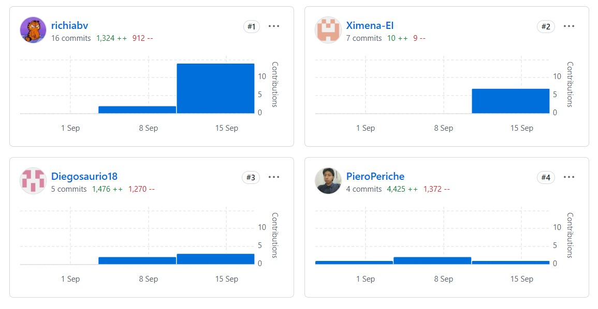

---  

# Student Outcome

El curso contribuye al cumplimiento del Student Outcome ABET: **ABET – EAC - Student Outcome 4** <br> Criterio: _La capacidad de reconocer responsabilidades éticas y profesionales en situaciones de ingeniería y hacer juicios informados, que deben considerar el impacto de las soluciones de ingeniería en contextos globales, económicos, ambientales y sociales._

En el siguiente cuadro se describe las acciones realizadas y enunciados de conclusiones por parte del grupo, que permiten sustentar el haber alcanzado el logro del ABET – EAC - Student Outcome 4.

| Criterio específico                                                                                                                                    | Acciones realizadas                                                                                                                                                                                                                                                                                                                                                                                                                                                                                                                                                                                                                                                                                                                                                                                                                                                                                                                                                                                                                                                  | Conclusiones                                                                                                                                                                                                                                                         |
| ------------------------------------------------------------------------------------------------------------------------------------------------------ | -------------------------------------------------------------------------------------------------------------------------------------------------------------------------------------------------------------------------------------------------------------------------------------------------------------------------------------------------------------------------------------------------------------------------------------------------------------------------------------------------------------------------------------------------------------------------------------------------------------------------------------------------------------------------------------------------------------------------------------------------------------------------------------------------------------------------------------------------------------------------------------------------------------------------------------------------------------------------------------------------------------------------------------------------------------------- | -------------------------------------------------------------------------------------------------------------------------------------------------------------------------------------------------------------------------------------------------------------------- |
| Reconoce responsabilidad ética y profesional en situaciones de ingeniería de software                                                                  | TB1:<br/> **Barrutia Vaez, Ricardo Andree:** <br/> Durante el proyecto asumí mi responsabilidad ética al cumplir con mis tareas de manera honesta y comprometida, respetando los aportes de mis compañeros y asegurando que el trabajo reflejara transparencia y profesionalismo. <br/>**Espinoza Iñoñan, Fabiola Ximena:** <br/> Me comprometí a trabajar con responsabilidad y ética, cuidando que mis entregas fueran claras y confiables, y respetando siempre la labor de mis compañeros dentro del proyecto. <br/>**Periche Quiroga, Piero Fernando:** <br/>Asumí un rol responsable dentro del equipo, cumpliendo con mis obligaciones de manera ética y colaborativa, velando porque las decisiones tomadas beneficiaran al grupo y mantuvieran la integridad del proyecto. <br/>**Portales Ortiz, Diego Alejandro** <br/>Fui consciente de la importancia de actuar con ética y profesionalismo en cada actividad, cumpliendo con mis tareas asignadas de manera responsable y garantizando que mi aporte se realizara con compromiso y transparencia <br/> | Como equipo demostramos responsabilidad ética y profesional en cada fase del proyecto, cumpliendo con nuestras tareas de manera transparente y respetando el trabajo de los demás. Mantuvimos un compromiso constante con la calidad y la integridad del entregable. |
| Emite juicios informados considerando el impacto de las soluciones de ingeniería de software en contextos globales, económicos, ambientales y sociales | TB1:<br/> **Barrutia Vaez, Ricardo Andree:** <br/>Al analizar las decisiones del proyecto reflexioné sobre cómo nuestra solución podía impactar en distintos contextos, considerando la viabilidad económica y la utilidad social de lo desarrollado. <br/> **Espinoza Iñoñan, Fabiola Ximena** <br/> Reconocí que nuestras decisiones debían tomar en cuenta no solo lo técnico, sino también los posibles efectos en los usuarios y en el entorno social, buscando siempre un equilibrio responsable. <br/> **Periche Quiroga, Piero Fernando** <br/>Tuve en cuenta que la solución debía ser útil en diferentes contextos y que factores como lo económico y lo social podían influir en cómo la usarían las personas. <br/> **Portales Ortiz, Diego Alejandro** <br/> Al participar en el proyecto tuve en cuenta que toda solución de software tiene un impacto que va más allá de lo tecnológico, por lo que procuré analizar también las implicancias sociales y económicas de lo que estábamos desarrollando. <br/>                                          | El grupo tuvo en cuenta que la solución no solo debía cumplir con lo técnico, sino también considerar su impacto en lo económico, social y ambiental. Esto nos ayudó a tomar mejores decisiones y hacer que la propuesta sea más útil en distintos contextos.        |

---

# Contenido

## Tabla de contenidos

### [Capítulo I: Introducción](https://github.com/G2-UPC-PRE-202402-SI730-WX53-DevDynasty/GastroGo-Report#cap%C3%ADtulo-i-introducci%C3%B3n-1)

- [1.1. Startup Profile](https://github.com/G2-UPC-PRE-202402-SI730-WX53-DevDynasty/GastroGo-Report#11-startup-profile)
  - [1.1.1 Descripción de la Startup](https://github.com/G2-UPC-PRE-202402-SI730-WX53-DevDynasty/GastroGo-Report#111-descripci%C3%B3n-de-la-startup)
  - [1.1.2 Perfiles de integrantes del equipo](https://github.com/G2-UPC-PRE-202402-SI730-WX53-DevDynasty/GastroGo-Report#112-perfiles-de-integrantes-del-equipo)
- [1.2 Solution Profile](https://github.com/G2-UPC-PRE-202402-SI730-WX53-DevDynasty/GastroGo-Report#12-solution-profile)
  - [1.2.1 Antecedentes y problemática](https://github.com/G2-UPC-PRE-202402-SI730-WX53-DevDynasty/GastroGo-Report#121-antecedentes-y-problem%C3%A1tica)
  - [1.2.2 Lean UX Process](https://github.com/G2-UPC-PRE-202402-SI730-WX53-DevDynasty/GastroGo-Report#122-lean-ux-process)
    - [1.2.2.1. Lean UX Problem Statements](https://github.com/G2-UPC-PRE-202402-SI730-WX53-DevDynasty/GastroGo-Report#1221-lean-ux-problem-statements)
    - [1.2.2.2. Lean UX Assumptions](https://github.com/G2-UPC-PRE-202402-SI730-WX53-DevDynasty/GastroGo-Report#1222-lean-ux-assumptions)
    - [1.2.2.3. Lean UX Hypothesis Statements](https://github.com/G2-UPC-PRE-202402-SI730-WX53-DevDynasty/GastroGo-Report#1223-lean-ux-hypothesis-statements)
    - [1.2.2.4. Lean UX Canvas](https://github.com/G2-UPC-PRE-202402-SI730-WX53-DevDynasty/GastroGo-Report#1224-lean-ux-canvas)
- [1.3. Segmentos objetivo](https://github.com/G2-UPC-PRE-202402-SI730-WX53-DevDynasty/GastroGo-Report#13-segmentos-objetivo)

### [Capítulo II: Requirements Elicitation & Analysis]()

- [2.1. Competidores]()
  - [2.1.1. Análisis competitivo]()
  - [2.1.2. Estrategias y tácticas frente a competidores]()
- [2.2. Entrevistas]()
  - [2.2.1. Diseño de entrevistas]()
  - [2.2.2. Registro de entrevistas]()
  - [2.2.3. Análisis de entrevistas]()
- [2.3. Needfinding]()
  - [2.3.1. User Personas]()
  - [2.3.2. User Task Matrix]()
  - [2.3.3. User Journey Mapping]()
  - [2.3.4. Empathy Mapping]()
  - [2.3.5. As-is Scenario Mapping]()
- [2.4. Ubiquitous Language]()

### [Capítulo III: Requirements Specification]()

- [3.1. To-Be Scenario Mapping]()
- [3.2. User Stories]()
- [3.3. Impact Mapping]()
- [3.4. Product Backlog]()

### [Capítulo IV: Product Design]()

- [4.1. Style Guidelines]()
  - [4.1.1. General Style Guidelines]()
  - [4.1.2. Web Style Guidelines]()
  - [4.1.3. Mobile Style Guidelines]()
    - [4.1.3.1. iOS Mobile Style Guidelines]()
    - [4.1.3.2. Android Mobile Style Guidelines]()
- [4.2. Information Architecture]()
  - [4.2.1. Organization Systems]()
  - [4.2.2. Labeling Systems]()
  - [4.2.3. SEO Tags and Meta Tags]()
  - [4.2.4. Searching Systems]()
  - [4.2.5. Navigation Systems]()
- [4.3. Landing Page UI Design]()
  - [4.3.1. Landing Page Wireframe]()
  - [4.3.2. Landing Page Mock-up]()
- [4.4. Mobile Applications UX/UI Design]()
  - [4.4.1. Mobile Applications Wireframes]()
  - [4.4.2. Mobile Applications Wireflow Diagrams]()
  - [4.4.3. Mobile Applications Mock-ups]()
  - [4.4.4. Mobile Applications User Flow Diagrams]()
- [4.5. Mobile Applications Prototyping]()
  - [4.5.1. Android Mobile Applications Prototyping]()
  - [4.5.2. iOS Mobile Applications Prototyping]()
- [4.6. Web Applications UX/UI Design]()
  - [4.6.1. Web Applications Wireframes]()
  - [4.6.2. Web Applications Wireflow Diagrams]()
  - [4.6.3. Web Applications Mock-ups]()
  - [4.6.4. Web Applications User Flow Diagrams]()
- [4.7. Web Applications Prototyping]()
- [4.8. Domain-Driven Software Architecture]()
  - [4.8.1. Software Architecture Context Diagram]()
  - [4.8.2. Software Architecture Container Diagrams]()
  - [4.8.3. Software Architecture Components Diagrams]()
- [4.9. Software Object-Oriented Design]()
  - [4.9.1. Class Diagrams]()
  - [4.9.2. Class Dictionary]()
- [4.10. Database Design]()
  - [4.10.1. Relational/Non-Relational Database Diagram]()

### [Capítulo V: Product Implementation, Validation & Deployment]()

- [5.1. Software Configuration Management]()
  - [5.1.1. Software Development Environment Configuration]()
  - [5.1.2. Source Code Management]()
  - [5.1.3. Source Code Style Guide & Conventions]()
  - [5.1.4. Software Deployment Configuration]()
- [5.2. Landing Page, Services & Applications Implementation]()
  - [5.2.1. Sprint 1]()
    - [5.2.1.1. Sprint Planning 1]()
    - [5.2.1.2. Sprint Backlog 1]()
    - [5.2.1.3. Development Evidence for Sprint Review]()
    - [5.2.1.4. Testing Suite Evidence for Sprint Review]()
    - [5.2.1.5. Execution Evidence for Sprint Review]()
    - [5.2.1.6. Services Documentation Evidence for Sprint Review]()
    - [5.2.1.7. Software Deployment Evidence for Sprint Review]()
    - [5.2.1.8. Team Collaboration Insights during Sprint]()
  - [5.2.2. Sprint 2]()
    - [5.2.2.1. Sprint Planning 2]()
    - [5.2.2.2. Sprint Backlog 2]()
    - [5.2.2.3. Development Evidence for Sprint Review]()
    - [5.2.2.4. Testing Suite Evidence for Sprint Review]()
    - [5.2.2.5. Execution Evidence for Sprint Review]()
    - [5.2.2.6. Services Documentation Evidence for Sprint Review]()
    - [5.2.2.7. Software Deployment Evidence for Sprint Review]()
    - [5.2.2.8. Team Collaboration Insights during Sprint]()
  - [5.2.3. Sprint 3]()
    - [5.2.3.1. Sprint Planning 3]()
    - [5.2.3.2. Sprint Backlog 3]()
    - [5.2.3.3. Development Evidence for Sprint Review]()
    - [5.2.3.4. Testing Suite Evidence for Sprint Review]()
    - [5.2.3.5. Execution Evidence for Sprint Review]()
    - [5.2.3.6. Services Documentation Evidence for Sprint Review]()
    - [5.2.3.7. Software Deployment Evidence for Sprint Review]()
    - [5.2.3.8. Team Collaboration Insights during Sprint]()
  - [5.2.4. Sprint 4]()
    - [5.2.4.1. Sprint Planning 4]()
    - [5.2.4.2. Sprint Backlog 4]()
    - [5.2.4.3. Development Evidence for Sprint Review]()
    - [5.2.4.4. Testing Suite Evidence for Sprint Review]()
    - [5.2.4.5. Execution Evidence for Sprint Review]()
    - [5.2.4.6. Services Documentation Evidence for Sprint Review]()
    - [5.2.4.7. Software Deployment Evidence for Sprint Review]()
    - [5.2.4.8. Team Collaboration Insights during Sprint]()
- [5.3. Validation Interviews]()
  - [5.3.1. Diseño de Entrevistas]()
  - [5.3.2. Registro de Entrevistas]()
  - [5.3.3. Evaluaciones según heurísticas]()
- [5.4. Video About-the-Product]()

### [Capítulo VI: Product Verification & Validation]()

- [6.1. Testing Suites & Validation]()
  - [6.1.1. Core Entities Unit Tests]()
  - [6.1.2. Core Integration Tests]()
  - [6.1.3. Core Behavior-Driven Development]()
  - [6.1.4. Core System Tests]()
- [6.2. Static Testing & Verification]()
  - [6.2.1. Static Code Analysis]()
    - [6.2.1.1. Coding standard & Code conventions]()
    - [6.2.1.2. Code Quality & Code Security]()
  - [6.2.2. Reviews]()
- [6.3. Validation Interviews]()
  - [6.3.1. Diseño de Entrevistas]()
  - [6.3.2. Registro de Entrevistas]()
  - [6.3.3. Evaluaciones según heurísticas]()
- [6.4. Auditoría de Experiencias de Usuario]()
  - [6.4.1. Auditoría realizada]()
    - [6.4.1.1. Información del grupo auditado]()
    - [6.4.1.2. Cronograma de auditoría realizada]()
    - [6.4.1.3. Contenido de auditoría realizada]()
  - [6.4.2. Auditoría recibida]()
    - [6.4.2.1. Información del grupo auditor]()
    - [6.4.2.2. Cronograma de auditoría recibida]()
    - [6.4.2.3. Contenido de auditoría recibida]()
    - [6.4.2.4. Resumen de modificaciones para subsanar hallazgos]()

### [Capítulo VII: DevOps Practices]()

- [7.1. Continuous Integration]()
  - [7.1.1. Tools and Practices]()
  - [7.1.2. Build & Test Suite Pipeline Components]()
- [7.2. Continuous Delivery]()
  - [7.2.1. Tools and Practices]()
  - [7.2.2. Stages Deployment Pipeline Components]()
- [7.3. Continuous Deployment]()
  - [7.3.1. Tools and Practices]()
  - [7.3.2. Production Deployment Pipeline Components]()
- [7.4. Continuous Monitoring]()
  - [7.4.1. Tools and Practices]()
  - [7.4.2. Monitoring Pipeline Components]()
  - [7.4.3. Alerting Pipeline Components]()
  - [7.4.4. Notification Pipeline Components]()

### [Capítulo VIII: Experiment-Driven Development]()

- [8.1. Experiment Planning]()
  - [8.1.1. As-Is Summary]()
  - [8.1.2. Raw Material: Assumptions, Knowledge Gaps, Ideas, Claims]()
  - [8.1.3. Experiment-Ready Questions]()
  - [8.1.4. Question Backlog]()
  - [8.1.5. Experiment Cards]()
- [8.2. Experiment Design]()
  - [8.2.1. Hypotheses]()
  - [8.2.2. Domain Business Metrics]()
  - [8.2.3. Measures]()
  - [8.2.4. Conditions]()
  - [8.2.5. Scale Calculations and Decisions]()
  - [8.2.6. Methods Selection]()
  - [8.2.7. Data Analytics: Goals, KPIs and Metrics Selection]()
  - [8.2.8. Web and Mobile Tracking Plan]()
- [8.3. Experimentation]()
  - [8.3.1. To-Be User Stories]()
  - [8.3.2. To-Be Product Backlog]()
  - [8.3.3. Pipeline-supported Experiment-Driven To-Be Software Platform Lifecycle]()
    - [8.3.3.1. To-Be Sprint Backlogs]()
    - [8.3.3.2. Implemented To-Be Landing Page Evidence]()
    - [8.3.3.3. Implemented To-Be Frontend-Web Application Evidence]()
    - [8.3.3.4. Implemented To-Be Native-Mobile Application Evidence]()
    - [8.3.3.5. Implemented To-Be RESTful API and/or Serverless Backend Evidence]()
    - [8.3.3.6. Team Collaboration Insights]()
  - [8.3.4. To-Be Validation Interviews]()
    - [8.3.4.1. Diseño de Entrevistas]()
    - [8.3.4.2. Registro de Entrevistas]()
- [8.4. Experiment Aftermath & Analysis]()
  - [8.4.1. Analysis and Interpretation of Results]()
  - [8.4.2. Re-scored and Re-prioritized Question Backlog]()
- [8.5. Continuous Learning]()
  - [8.5.1. Shareback Session Artifacts: Learning Workflow]()
- [8.6. To-Be Software Platform Pre-launch]()
  - [8.6.1. About-the-Product Intro Video]()

---

# Capítulo I: Introducción

## 1.1. Startup Profile

Esta sección introduce a nuestro equipo y presenta la esencia de nuestra startup.

### 1.1.1. Descripción de la Startup

**AidRecruits** es una startup comprometida con transformar la forma en que las **ONG** gestionan y amplifican su impacto social en el Perú. Nuestro objetivo es potenciar la **calidad de la ayuda social**, desarrollando soluciones tecnológicas innovadoras que optimicen los procesos administrativos y operativos de estas organizaciones.

Buscamos brindar herramientas accesibles y efectivas que permitan a las ONG enfocarse en lo que realmente importa: **ayudar a las comunidades que más lo necesitan**. En un entorno donde los recursos son limitados y los desafíos constantes, creemos que la tecnología puede ser el catalizador para un cambio duradero.

Con una visión centrada en la **solidaridad nacional** y la proyección hacia un futuro **internacional**, fortalecemos la capacidad de las ONG para generar un cambio real y sostenible en la sociedad. A través de plataformas diseñadas específicamente para sus necesidades, facilitamos la organización, la transparencia y la colaboración.

Creemos firmemente que, mediante el uso eficiente de la tecnología, es posible construir un entorno más justo, inclusivo y eficiente, donde cada proyecto social logre alcanzar su máximo potencial y donde las barreras administrativas ya no limiten el deseo de ayudar.

---


### 1.1.2 Perfiles de integrantes del equipo


| Información                                                                                                                                                                                                                                                                                                                                                                                                                                                                                                                                        | Foto                                                         |
| :------------------------------------------------------------------------------------------------------------------------------------------------------------------------------------------------------------------------------------------------------------------------------------------------------------------------------------------------------------------------------------------------------------------------------------------------------------------------------------------------------------------------------------------------- | :----------------------------------------------------------- |
| **Ricardo Andree Barrutia**<br><br>Código: U201714765<br><br>Conocimientos y Habilidades: <br> <br>Como estudiante de ingeniería de software he adquirido conocimientos de C++, Java y de Ionic. Con respecto a las habilidades más destacables de mi persona, considero que el trabajo en equipo es una de ellas. Además de la capacidad resolutiva a la par que adaptativa ante diversas situaciones.<br>                                                                                                                                        |  |
| **Diego Alejandro Portales Ortiz**<br><br>Código: U202210192<br><br>Conocimientos y Habilidades: Estudiante del octavo ciclo de la carrera de Ingeniería de Software. Tengo experiencia en varios lenguajes de programación, incluyendo Python, C++, C# y JavaScript. Me destaco por mi capacidad para trabajar en equipo y contribuir activamente en los proyectos en los que participo. Estoy comprometido a aportar de manera eficiente e innovadora no sólo a mi equipo, si no también a la misma rama de estudio a la que pertenezco.<br><br> |              |
| **Fabiola Ximena Espinoza Inoñan**<br><br>Código: u202214784<br><br>Conocimientos y Habilidades: <br><br>Mi nombre es Fabiola Espinoza, tengo 21 años y estudio Ingeniería de Software en la Universidad Peruana de Ciencias Aplicadas. Me considero una persona responsable, creativa y empática, con habilidades destacadas en el trabajo en equipo y la convivencia con otras personas. He participado en el programa Coder Bloom, 28h y más. Y actualmente soy coordinadora de ACM Women UPC.                                                  |  |
| **Piero Fernando, Periche Quiroga**<br><br>Código: U202210192<br><br>Conocimientos y Habilidades: <br><br> Mi nombre es Piero Periche Quiroga, estudiante de la carrera de Ingenieria de Software, 6to semestre en la Universidad Peruana de Ciencias Aplicadas. Tengo buen desempeño trabajando en equipo, aportando con ideas y tareas de manera asertiva. Tengo conocimientos en lenguajes como HTML y C++. Me considero responsable y puntual.                                                                                                 |              |
| **Giancarlo Sinuiri Mozombite**<br><br>Código: U201619022<br><br>Conocimientos y Habilidades: <br><br> Mi nombre es Giancarlo Sinuiri Mozombite, estudiante de la carrera de Ingenieria de Software, 7mo ciclo en la Universidad Peruana de Ciencias Aplicadas. Tengo conocimientos en lenguajes como C#, Javascript, Java y Python. Me considero responsable.                                                                                                                                                                                     |      |


## 1.2. Solution Profile

Nuestro perfil de solución se divide en 2 partes los “Antecedes y Problemática” y el proceso UX.

### 1.2.1. Antecedentes y problemática

**Antecedentes:**

Actualmente, las organizaciones no gubernamentales (ONGs) desempeñan un
papel fundamental en la atención de necesidades humanitarias y en el
desarrollo de comunidades en todo el mundo. Según la Oficina de Naciones
Unidas para la Coordinación de Asuntos Humanitarios (OCHA) en 2023 se
reportaron 801,425 personas en necesidades de alimentación, servicios de
agua, saneamiento e higiene. En el Perú existen 978 Organizaciones
privadas sin fines de lucro de las cuales principalmente 428 se han
categorizado como de salud, 19 de educación y 35 de vivienda (SIGCTI,
2024), esto nos demuestra que existe una gran cantidad de organizaciones
privadas sin fines de lucro. No obstante, cuando buscamos organizaciones
ONDG (Organizaciones No Gubernamentales de Desarrollo) encontramos un
total de 1835 (SIGCTI, 2024).

**Problemática:**

A pesar de la presencia significativa de estas organizaciones, el
alcance de su impacto aún es limitado, según Equilibrium CenDE en 2023,
encontró que, aunque el 80% de casi 1,200 encuestados reconoce lo que es
una ONG un 71% no estaba informado o no conocía las iniciativas
realizadas por las ONGs en ese año. Además, sólo un 7% de los
encuestados no mostró interés en participar en la solución de problemas
públicos o sociales, lo que sugiere que existe una gran disposición por
parte de la población para apoyar estas iniciativas (Equilibrium CenDE,
2023).

Si bien hay muchas variables que influyen a la hora de hacer un análisis
para identificar cuáles pueden ser las razones para que el impacto,
alcance o el objetivo de la ONG sean afectados, siempre se pueden
minimizar o mitigar por medio de un plan de acción organizado y una
gestión efectiva. Según María Gabriela Moya en su post respecto al
desafío de las ONG en la gestión organizacional y de proyectos.
(LinkedIn, 2023) la mayoría de los sistemas de gestión en las ONG son
obsoletos y orientados más en la cantidad que la calidad de sus
proyectos. Adicionalmente, también menciona de como los sectores que
influyen a mayor medida son la gestión de fondos, la capacitación, la
comunicación y finalmente la supervisión como los pilares en lo que
vendría siendo un proyecto mejor gestionado e innovador en el mercado.

Tomando en cuenta que aún existen ONG que reciben grandes cantidades de
datos solo son para obtener una cifra que represente los asistentes a
algún evento o cuanto se logró de un objetivo de donación omitiendo lo
enriquecedor de esta data recolectada, como se menciona en el artículo
"Data Analytics for Nonprofits" (DigitalForNonprofits, 2023), en el
mundo de hoy para realizar acciones estratégicas y maximizar recursos
distintas empresas utilizan lo llamado análisis de datos, esta práctica
se puede aplicar a un modelo de negocios sin fines de lucro como las ONG
donde se consiguen los mismos beneficios que brindan los análisis de
datos.

Finalmente, muchas ONG carecen o conocen de herramientas adecuadas para
gestionar sus equipos y proyectos de manera ágil y colaborativa. En un
entorno donde los recursos pueden llegar a ser mal implementados y la
eficiencia es crucial, la falta de una plataforma que permita una
gestión integral de proyectos y una comunicación fluida entre los
miembros del equipo puede resultar en una pérdida de tiempo y mal uso de
las colaboraciones recibidas.

**Solución:**

Las ONGs necesitan sistemas que no solo les permitan organizar sus
tareas y gestionar su presupuesto, sino también analizar su impacto en
tiempo real, facilitar la toma de decisiones basadas en datos y fomentar
una comunicación abierta y efectiva entre todos los miembros del equipo.<br>

**5W’s y 2H’s**

**What (¿Que se está haciendo?):** Un sistema de gestión móvil y fácil de usar el cual cubra la comunicación, seguimiento, supervisión y el planeamiento de proyectos.<br>

**Why (¿Por qué se está haciendo?):** Las ONG actualmente no son muy conscientes de como una herramienta de gestión puede impulsar su crecimiento y mejorar el impacto positivo que pueden generar.<br>

**When (¿Cuándo se usa?):** Se usa cuando se quiere realizar un plan de acción para un proyecto de ayuda social, cuando se busque realizar un seguimiento financiero o incluso cuando se requiere saber de la eficiencia de los proyectos y cuando un gestor desea gestionar a un equipo trabajando en el proyecto.<br>

**Where (¿Dónde se usa?):** El uso está diseñado para Perú, ya que se recompilará información de los proyectos, al ser un aplicativo móvil está diseñado para dispositivos móviles.<br>

**Who (¿Quién lo usa?):** El usuario principal para nosotros son las ONG de quienes el producto está orientado a los gestores de proyectos y los miembros del equipo, ya que son estos los que van a implementar la información e interactuar entre sí, nuestro usuario principal entonces se divide en el segmento de (supervisor / gestor) y el miembro del equipo.<br>

**How (¿Cómo?):** En el aplicativo se ingresan los datos de proyectos, la organización y asimismo los miembros del equipo enfocándose en los análisis de tareas completadas y presupuestos.<br>

**How Much (¿Cuánto costaría?):** La aplicación tendrá sus funcionalidades Core a medio de pago es decir el proceso de gestión recopilación y refinamiento de datos junto con las mejores oportunidades de mejora para estas. Tanto el Core de la aplicación como la suscripción se tendrán que renovar cada cierto tiempo donde las organizaciones se tendrán que escoger un plan anual o mensual. No obstante, contamos con un límite de cuentas en el plan y si el usuario es parte de una organización más grande entonces ofreceremos un plan con mayor cantidad de cuentas.

### 1.2.2. Lean UX Process

Los procesos Lean UX son fundamentales para definir con precisión nuestras ideas y establecer un plan de acción enfocado en responder preguntas clave a través del **Needfinding**.

#### 1.2.2.1. Lean UX Problem Statement

Este apartado aborda la situación actual del sector, las limitaciones de la competencia y nuestra propuesta de solución.

Las **ONG en Perú** enfrentan una notoria falta de organización que limita su capacidad de generar un **impacto significativo**. Esta ineficiencia afecta especialmente la **gestión de fondos**, la **capacitación**, la **comunicación interna** y la **supervisión de proyectos**. A pesar de las oportunidades existentes para mejorar mediante una planificación adecuada, muchas ONG no son plenamente conscientes de los beneficios que una gestión efectiva puede brindarles.

Esta falta de organización no solo perjudica la imagen de las ONG, sino que también reduce la **eficacia de sus iniciativas** y disminuye el alcance e impacto que podrían lograr.

Por otro lado, los productos de gestión actualmente disponibles en el mercado son, en su mayoría:

- **Costosos**, y por ende poco accesibles para la mayoría de ONG peruanas, que operan con recursos limitados.
- **Excesivamente complejos**, con funcionalidades que no se ajustan a sus necesidades reales, lo cual dificulta la adopción y genera resistencia entre sus equipos.

> **Pregunta clave:**  
> ¿Cómo podemos ofrecer una **solución de gestión de proyectos accesible**, adaptada a las **necesidades reales de las ONG en Perú**, que les permita optimizar sus operaciones, mejorar su eficiencia y aumentar su impacto social?

#### 1.2.2.2. Lean UX Assumptions

**Business Outcome**<br>

En esta sección vamos a usar las métricas de Montaña conceptualizada por Jeff Gothelf e implementaremos algunas de las “pirate metrics” para poder definir los niveles de la montaña para llegar poder analizar los comportamientos de nuestros usuarios y analizar que parte del User Journey es relevante para nosotros y hacer assumptions de como actuarán nuestros usuarios en base al producto.<br>

Acquisition: (Base): [1000 visitantes] El usuario se percatará de nuestra solución por medio de las redes sociales como medio de comunicación asimismo promocionando nuestra landing page, de la misma manera intentaremos ofrecer el servicio a los mismos usuarios con métodos de comunicación directa como por ejemplo ofrecerles el servicio a las instituciones (ONG).<br>

Activation: (Plateau): [450 users: 100% users] En esta sección el usuario que gestiona a los equipos crea su cuenta registrando su correo y registra la institución si está aún no está registrada, realiza la suscripción de acuerdo con el plan anual o mensual, en caso aún no se encuentre registrada la ONG tendrá que llenar un formulario con la información de esta. Finalmente, se generará un código de autenticación para que los miembros del equipo puedan generar una cuenta y participar del proyecto. De los usuarios que se percaten del producto esperamos que 45% de estos se anime a utilizarlo.<br>

Retention: (Plateau + 1 level): [60% users] De los usuarios que se animaran a utilizarlo esperamos que el 60% de estos continúe utilizando nuestro producto mensualmente para gestionar sus proyectos y comunicarse entre sí. En esta sección el usuario utiliza las herramientas que le proporciona nuestro producto para la gestión, planificación y análisis de proyectos, ya tiene a su equipo registrado y les asigna las tareas mientras que estos mantienen una participación utilizando los medios de comunicación que ofrecemos.<br>

Revenue: (Plateau + 2 levels): [10% users] Los usuarios que utilizan nuestro producto son usuarios estrictamente de paga, no obstante, si es que llegara la situación donde su organización se expande entonces van a tener proyectos a mayor escala, con más ayudantes y cuentas y excederán el límite de las que les proporcionamos en su plan inicial. De esta manera se espera que un 10% de los usuarios retenidos que consigan este crecimiento estarán dispuestos a mejorar su plan generándonos un mayor ingreso.<br>

Referral:(top) [5% users] Finalmente de los usuarios que retuvimos esperamos que un 5% de estos nos referencien a sus colegas o a nuevas ONG indirectamente promocionándonos y aumentando el flujo de usuarios potenciales que podemos obtener.<br>

**Users**
En esta sección creamos un Proto-Persona como un assumption de cómo son nuestros usuarios enfocándonos más en el aspecto de actitud.<br>

<table>
<colgroup>
<col style="width: 25%" />
<col style="width: 36%" />
<col style="width: 37%" />
</colgroup>
<thead>
<tr class="header">
<th><strong>Demográfica</strong></th>
<th><strong>Comportamiento</strong></th>
<th><strong>Necesidades / Obstáculos</strong></th>
</tr>
</thead>
<tbody>
<tr class="odd">
<td>Carlos (29 años): Gestor de proyectos para ONG</td>
<td><p>Trabaja con un equipo en las ONG</p>
<p>Gana lo suficiente</p>
<p>Enfocado en la planificación de proyectos</p>
<p>Busca que se consiga el impacto requerido</p>
<p>Busca mejorar la efectividad de los proyectos generando un impacto
positivo</p></td>
<td><p>Necesita agilizar el proceso de planificación</p>
<p>Necesita mejorar la asignación de tareas</p>
<p>Necesita mejorar el seguimiento de gastos por proyecto</p>
<p>Requiere de una mejor comunicación con los demás ayudantes a la hora
de la ejecución del proyecto</p>
<p>Obstáculo: La ONG no implementa soluciones modernas para el
proyecto</p>
<p>Obstáculo: Se desconoce de programas que sirvan para la planificación
y gestión de proyectos.</p></td>
</tr>
<tr class="even">
<td>Alejandra (23 años): Forma parte del equipo de un proyecto en una
ONG</td>
<td><p>Gana lo mínimo si es que no es voluntariado</p>
<p>Enfocada en el cumplimiento de tareas.</p>
<p>Busca ayudar a los demás por medio de su participación</p>
<p>Busca conectar con la comunidad dentro de la ONG.</p>
<p>Busca saber de las tareas que debe realizar.</p>
<p>Busca notificar de algún problema o el haber finalizado una
tarea.</p></td>
<td><p>Necesita un medio de comunicación directo con el gestor de
proyectos por si sucede algo</p>
<p>Necesita saber cuál es la misión del proyecto e información de
este.</p>
<p>Obstáculo: No existe un medio óptimo para realizar la
comunicación</p>
<p>Obstáculo: Las herramientas que usa para recopilar información no
siempre son las más efectivas para lo que busca</p></td>
</tr>
</tbody>
</table>

### User Outcomes & Benefits

En esta sección buscamos **empatizar** con nuestros usuarios, comprender sus necesidades emocionales y funcionales, y ofrecerles resultados tangibles a través de nuestra solución.

---

#### **¿Qué desea lograr el usuario?**

- **Gestor de ONG:** Quiere asegurarse de que las tareas asignadas a su equipo se gestionen de manera clara y se puedan supervisar eficazmente.
- **Miembro del equipo:** Desea conocer con precisión sus responsabilidades y contar con un canal ágil para comunicarse con su gestor en caso de surgir inconvenientes.

---

#### **¿Cómo quiere sentirse el usuario durante este proceso?**

- **Gestor:** Necesita sentirse en **control**, con la capacidad de supervisar todo el proyecto desde una sola plataforma centralizada.
- **Miembro del equipo:** Busca sentir que tiene una **comunicación directa y sin barreras**, pudiendo contribuir activamente al proyecto.

---

#### **¿Cómo nuestro producto contribuye a su logro personal?**

- El **gestor** experimentará una mejora en la eficiencia operativa de su equipo, lo que incrementará el impacto social del proyecto y reforzará su percepción de **éxito profesional**.
- El **equipo** tendrá claridad sobre sus tareas y una comunicación fluida, lo que facilitará el cumplimiento de sus funciones y les permitirá sentirse **valorados** y **eficaces**.

---

#### **¿Por qué nuestro usuario elegiría esta solución?**

- El **gestor** busca simplificar la gestión y supervisión de proyectos, evitando herramientas costosas o innecesariamente complejas.
- El **equipo** necesita una plataforma intuitiva que facilite la comunicación y les permita tener claridad sobre sus actividades diarias.

---

#### **¿Qué cambios de comportamiento validan el éxito del producto?**

- Los gestores serán capaces de **asignar y monitorear tareas** de forma efectiva a través de la plataforma.
- Los equipos reportarán una **mejor comunicación interna** y una mayor **organización** en la ejecución de sus proyectos.

---

---

### Solutions

Las soluciones propuestas abordan las **necesidades prioritarias** identificadas durante el análisis de usuarios y sus restricciones operativas.

---

- **Monitoreo de proyectos:**  
  Visibilidad en tiempo real del estado de cada proyecto, eliminando la necesidad de herramientas externas como correos electrónicos o WhatsApp.

- **Asignación y seguimiento de tareas:**  
  El gestor podrá asignar tareas desde la plataforma y dar seguimiento al progreso individual. Solo el usuario asignado podrá marcar la tarea como completada, garantizando responsabilidad.

- **Revisión de inventario:**  
  Gestión eficiente de insumos y materiales mediante el registro de proveedores, cantidades y disponibilidad, facilitando la planificación de recursos.

- **Gestión financiera:**  
  Herramientas simples para la comparación de presupuestos, control de gastos y detección de oportunidades de optimización financiera.

- **Comunicación directa:**  
  Canal de comunicación ágil y enfocado entre el gestor y los miembros del equipo, reduciendo distracciones y mejorando la capacidad de respuesta ante imprevistos.

- **Accesibilidad económica:**  
  Modelos de suscripción basados en el número de cuentas activas, no en tipos de servicio, permitiendo que ONG emergentes accedan a la solución de forma **económicamente viable**.

---

### 1.2.2.3. Lean UX Hypothesis Statement

---

#### **Hipótesis**

A continuación, se presenta la tabla de hipótesis siguiendo el enfoque Lean UX:

**Creemos que** al implementar una función de **gestión de tareas intuitiva y eficiente** para los gestores de proyectos, aumentaremos la **retención de usuarios**.

**Sabremos que** estamos en lo correcto cuando observemos un **aumento del 20%** en el número de **usuarios activos recurrentes** dentro de los **primeros tres meses** de uso.

**Creemos que** al ofrecer una vista centrada en el **análisis financiero** para gestionar presupuestos y gastos, mejoraremos la **retención de usuarios**.

**Sabremos que** estamos en lo correcto cuando observemos una **reducción del 25%** en las **consultas de soporte** sobre gestión financiera y un **aumento** en el **uso de esta funcionalidad**.

**Creemos que** al proporcionar herramientas de **gestión, análisis y comunicación** que incrementen el **impacto de los proyectos**, mejoraremos la **retención de usuarios**.

**Sabremos que** estamos en lo correcto cuando observemos un **aumento del 60%** en la **tasa de usuarios recurrentes** y un **incremento medible** en el impacto de sus proyectos.

**Creemos que** al implementar un sistema de **comunicación eficiente** entre gestores de proyectos y ayudantes, mejoraremos la **interacción** y **retención de usuarios**.

**Sabremos que** estamos en lo correcto cuando observemos un **aumento del 20%** en la **frecuencia de uso** de la función de comunicación dentro de los **primeros tres meses**.

**Creemos que** al ofrecer un **plan mejorado** que permita a los gestores agregar más integrantes a sus cuentas, aumentaremos nuestras **ganancias**.

**Sabremos que** estamos en lo correcto cuando al menos el **10% de los usuarios** se **suscriba** al plan mejorado dentro de los **primeros seis meses**.

---

#### **Lo más importante que debemos aprender**

Para el éxito de nuestro proyecto, es fundamental identificar si los usuarios realmente están **interesados** en nuestra propuesta **innovadora**.

Aunque existan herramientas similares, necesitamos confirmar si nuestra solución:

- Es **necesaria** en el contexto de las ONG peruanas.
- **Satisface** sus necesidades específicas de gestión de proyectos.

---

#### **Minimum Viable Product (MVP)**

El **MVP** nos permitirá obtener **aprendizajes rápidos**. Nos enfocaremos en responder la siguiente pregunta clave:

> **¿Qué es lo más importante que necesitamos aprender primero?**

- Validar si **existe demanda real** para nuestra solución.
- Realizaremos **entrevistas** con gestores de proyectos y sus equipos en ONG.
- Evaluaremos si nuestra herramienta **resuelve una necesidad concreta**.

Adicionalmente, desarrollaremos una **landing page** orientada a captar el interés de potenciales usuarios y medir el **nivel de atracción** hacia nuestra herramienta de gestión.

---

#### 1.2.2.4. Lean UX Canvas

En esta sección juntamos la información de los procesos UX y los juntamos en este canvas.

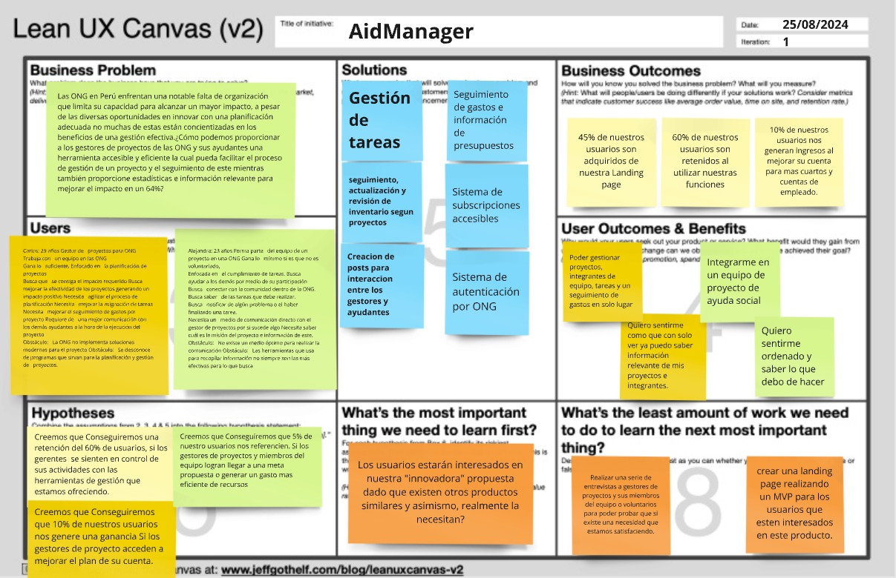

## 1.3 Segmentos Objetivo

La segmentación de nuestros usuarios clave nos permite comprender mejor sus necesidades, comportamientos y motivaciones, facilitando la creación de soluciones adecuadas para cada perfil.

---

| **Criterio**                 | **Segmento 1: Gestor de Proyectos ONG**                                                                                                                                                                                                     | **Segmento 2: Ayudante de Eventos ONG**                                                                                                                                                                                                      |
| ---------------------------- | ------------------------------------------------------------------------------------------------------------------------------------------------------------------------------------------------------------------------------------------- | -------------------------------------------------------------------------------------------------------------------------------------------------------------------------------------------------------------------------------------------- |
| **Variables**                | Gestor de proyectos encargado de planificar, organizar y supervisar actividades dentro de una ONG.                                                                                                                                          | Ayudante operativo que colabora en la ejecución de eventos y actividades sociales como parte del equipo de apoyo.                                                                                                                            |
| **Geográfica**               | Las ONG en Perú aplican análisis de datos estratégicos para maximizar recursos y optimizar sus proyectos sociales. _(DigitalForNonprofits, 2023)_                                                                                           | La correcta recolección y análisis de datos por parte de ayudantes contribuye a mejorar las condiciones de vida de comunidades vulnerables. _(OHCHR, 2022)_                                                                                  |
| **Demográfica**              | - Edad: 25 a 50+ años <br> - Género: Masculino y Femenino                                                                                                                                                                                   | - Edad: 18 a 35 años <br> - Género: Masculino y Femenino                                                                                                                                                                                     |
| **Psicológica**              | - Enfocados en lograr un **impacto significativo** en sus campañas. <br> - Buscan **aumentar eficiencia** y **reducir gastos innecesarios**.                                                                                                | - Motivados por contribuir activamente al éxito de las actividades sociales. <br> - Desean sentirse útiles y parte del cambio.                                                                                                               |
| **Comportamiento Funcional** | - **Actitudes:** Lidera proyectos, coordina equipos, asigna presupuestos, define objetivos y lugares de ejecución. <br> - **Conocimientos:** Tiene experiencia organizativa, pero carece de herramientas específicas para el sector social. | - **Actitudes:** Apoya logísticamente en eventos, anima y guía a los participantes, recoge información clave para los gestores. <br> - **Conocimientos:** Sabe cómo interactuar con el público y garantizar un ambiente ordenado y acogedor. |

---

# Capitulo II: Requiriments Elicitation & Analysis

## 2.1. Competidores

### 2.1.1. Análisis competitivo

Realizamos este análisis a fin de poder conocer el mercado al que nos enfrentamos en un inicio, para de esta manera poder evaluar las estrategias adoptadas por plataformas ya existentes, y así aprender de sus aciertos y errores.

<table>
    <tr>
        <th colspan="6">Competitive Analysis Landscape</th>
    </tr>
    <tr style="text-align: justify">
        <td colspan="2">
            <p>¿Por qué llevan a cabo este análisis?</p>
        </td>
        <td colspan="4">
            <p>El análisis lo llevamos a cabo para comparar nuestra idea de solución con otras existentes. De esta manera, podremos identificar nuestras fortalezas, debilidades, oportunidades y amenazas en relación con el mercado actual
            </p>
        </td>
    </tr>
    <tr>
        <td colspan="2">Empresas:</td>
        <th>Aidmanager</th>
        <th>Trello</th>
        <th>Miro</th>
        <th>Basecamp</th>
    </tr>
    <tr style="text-align: justify">
        <th rowspan="2">Perfil</th>
        <th>Overview</th>
        <!-- Aidmanager -->
        <td>
                Plataforma de gestión de tareas y proyectos dirigida a los equipos de trabajo. Ofrece herramientas como calendario o barra de progreso para la eficiente organización
        </td>
        <!-- Trello -->
        <td>
                Herramienta de gestión de proyectos en línea que utiliza un enfoque visual para la organización de tareas y proyectos
        </td>
        <!-- Miro -->
        <td>
                Plataforma de colaboración en línea con pizarra digital donde los usuarios pueden crear, compartir y colaborar en tiempo real
        </td>
        <!-- Basecamp -->
        <td>
                Herramienta en línea que ayuda a los equipos a administrar y organizar sus tareas y proyectos, proporcionando un espacio para compartir información
        </td>
    </tr>
    <tr>
        <th> Ventaja Competitiva ¿Qué valor ofrece a los clientes? </th>
        <!-- Aidmanager -->
        <td> 
            Entorno de trabajo colaborativo con las herramientas necesarias para la organización 
        </td>
        <!-- Trello -->
        <td> 
            Tarjetas visuales que permiten visualizar y gestionar las actividades 
        </td>
        <!-- Miro -->
        <td> 
            Canvas intuitivo para generar presentaciones, ideas y diagramas 
        </td>
        <!-- Basecamp -->
        <td>
            Espacio de trabajo único y completo
        </td>
    </tr>
    <tr>
        <th rowspan="2">Perfil de Marketing</th>
        <th>Mercado Objetivo</th>
        <!-- Aidmanager -->
        <td>
            Equipos de trabajo con problemas de organización
        </td>
        <!-- Trello -->
        <td> 
            Equipos de gran tamaño que necesitan de una aplicación para la organización de sus proyectos y tareas
        </td>
        <!-- Miro -->
        <td> 
            Usuarios que necesitan de una plataforma para estructurar y plasmar su conocimiento
        </td>
        <!-- Basecamp -->
        <td> 
            Organizaciones y empresas que buscan soluciones para simplificar su trabajo remoto
        </td>
    </tr>
    <tr>
        <th>Estrategias de Marketing</th>
        <!-- Aidmanager -->
        <td>
            Marketing digital, principalmente redes sociales
        </td>
        <!-- Trello -->
        <td> 
            Evaluación de habilidades y experiencia por parte de profesionales del mismo campo
        </td>
        <!-- Miro -->
        <td> 
            Redes sociales y pruebas con potenciales clientes
        </td>
        <!-- Basecamp -->
        <td> 
            Evaluación de habilidades y experiencia por parte de profesionales del mismo campo
        </td>
    </tr>
    <tr>
        <th rowspan="4">Perfil de Producto</th>
        <th>Productos y Servicios</th>
        <!-- Aidmanager -->
        <td>
            Herramientas de colaboración y planificación que les permita a los usuarios tener un mejor flujo de trabajo y organización
        </td>
        <!-- Trello -->
        <td> 
            Gran variedad de planes y opciones que satisfacen las necesidades de los equipos de trabajo, especialmente los más grandes
        </td>
        <!-- Miro -->
        <td> 
            Herramientas populares, como plantillas personalizables y cambio de apariencia según las necesidades del usuario
        </td>
        <!-- Basecamp -->
        <td> 
            Diferentes planes que ofrecen almacenamiento de datos, más proyectos y diversas características extra, como chat en tiempo real
        </td>
    </tr>
    <tr>
        <th rowspan="2">Precios y Costos</th>
        <td colspan="4"> Plan gratuito con características básicas </td>
    </tr>
    <tr>
    <!-- Aidmanager -->
        <td>
            <ul>
                <li>
                    Plan de pago por $7 mensual con características, como almacenamiento extra
                </li>
                <li>
                    Plan empresarial personalizado
                </li>
            </ul>
        </td>
        <!-- Trello -->
        <td> 
            Planes de pago que incluyen más funciones y almacenamiento.
        </td>
        <!-- Miro -->
        <td> 
            <ul>
                <li>
                    Planes de pago desde $8 mensuales que ofrecen funciones como aumentar el almacenamiento
                </li>
                <li>
                    Plan empresarial personalizado
                </li>
            </ul>
        </td>
        <!-- Basecamp -->
        <td> 
            <ul>
                <li>
                    Plan de negocios que ofrece más funciones y almacenamiento para equipos de hasta 100 usuarios
                </li>
                <li>
                    Plan empresarial personalizado
                </li>
            </ul>
        </td>
    </tr>
    <tr>
        <th>Canales de Distribución</th>
        <!-- Aidmanager -->
        <td>Móvil</td>
        <!-- El resto -->
        <td colspan="3"> Web y Móvil </td>
    </tr>
    <!-- Análisis FODA -->
    <tr>
        <th rowspan="4">Análisis FODA</th>
        <th>Fortalezas</th>
        <!--Aidmanager-->
        <td>
            La herramienta es sencilla de entender. Es escalable para equipos de cualquier tamaño y proyecto.
        </td>
        <!-- Trello -->
        <td>
            La herramienta tiene una interfaz gráfica que es sencilla de navegar y utilizar. También, ofrece una amplia gama de funciones, como la comunicación en línea
        </td>
        <!-- Miro -->
        <td>
            La herramienta puede adaptarse a equipos de cualquier tamaño y, sin importar la complejidad de proyecto que se está desarrollando
        </td>
        <!-- Basecamp -->
        <td>
            La herramienta tiene una interfaz de usuario fácil de usar y navegar, al igual que una gran cantidad de funciones. Además, está disponible para dispositivos móviles y computadoras personales
        </td>
    </tr>
    <tr>
        <th>Debilidades</th>
        <!--Aidmanager-->
        <td>
            Para el buen funcionamiento de la aplicación, es necesario contar con dispositivos de media o alta gama
        </td>
        <!-- Trello -->
        <td>
            <ul>
                <li>
                    No cuenta con una función de seguimiento de tareas.
                </li>
                <li>
                    No es adecuada para proyectos complejos
                </li>
            </ul>
        </td>
        <!-- Miro -->
        <td>
            Algunas características tienen una curva alta de aprendizaje que pueden desmotivar al usuario en aprender su uso
        </td>
        <!-- Basecamp -->
        <td>
            No es adecuada para proyectos complejos, ya que carece de funciones importantes para proyectos de gran escala
        </td>
    </tr>
    <tr>
        <th>Oportunidades</th>
        <!--Aidmanager-->
        <td>
            Las nuevas tecnologías nos permiten desarrollar nuevas funcionalidades para la mejor experiencia de usuario
        </td>
        <!-- Trello -->
        <td>
            Las empresas deben implementar nuevos métodos y tecnologías a su software para mantenerse en el mercado
        </td>
        <!-- Miro -->
        <td>
            El desarrollo de nueva tecnología permite que se agreguen nuevas e innovadoras funcionalidades
        </td>
        <!-- Basecamp -->
        <td>
            Las nuevas herramientas nos permiten abrirnos a nuevos mercados
        </td>
    </tr>
    <tr>
        <th>Amenazas</th>
        <!--Aidmanager-->
        <td>
            Ser una incipiente empresa implica que los clientes desconocen de tu marca, lo que hace que sea más complicado vender tu solución de software
        </td>
        <!-- Trello -->
        <td>
            El desafío más grande de una empresa tecnológica independiente son los nuevos competidores y la falta de relación con Google
        </td>
        <!-- Miro -->
        <td>
            La industria tecnológica presenta siempre nuevos competidores, por lo que debemos estar siempre ofreciendo nuevas razones para atraer más clientes y retener a los actuales
        </td>
        <!-- Basecamp -->
        <td>
            Los desafíos más grandes son los nuevos competidores, la falta de recursos y la alta competitividad de la competencia
        </td>
    </tr>
</table>

### 2.1.2. Estrategias y tácticas frente a competidores<br>

<table>
<colgroup>
<col style="width: 18%" />
<col style="width: 19%" />
<col style="width: 19%" />
<col style="width: 19%" />
<col style="width: 22%" />
</colgroup>
<thead>
<tr class="header">
<th><strong>SWOT</strong></th>
<th><strong>AidManager</strong></th>
<th><strong>Jira</strong></th>
<th><strong>Base Camp</strong></th>
<th><strong>Trello</strong></th>
</tr>
</thead>
<tbody>
<tr class="odd">
<td><strong>Fortalezas</strong></td>
<td>- Enfoque en ONGs peruanas con un precio accesible.<br />
- Escalabilidad y fácil implementación.<br />
- Enfoque en la experiencia del usuario.</td>
<td>- Altamente personalizable y adaptable a necesidades
específicas.<br />
- Integración con una gran cantidad de herramientas.</td>
<td>- Simplicidad y facilidad de uso.<br />
- Enfoque en la comunicación directa y colaboración en equipo.</td>
<td>- Herramientas avanzadas de recolección de datos.<br />
- Flexibilidad y personalización.<br />
- Capacidades de informes en tiempo real y mapeo geoespacial.</td>
</tr>
<tr class="even">
<td><strong>Oportunidades</strong></td>
<td>- Expandir presencia en mercados internacionales.<br />
- Desarrollar más funciones de colaboración y gestión de equipos.</td>
<td>- Expandir en mercados no técnicos.<br />
- Mejorar integración con herramientas no relacionadas con el desarrollo
de software.</td>
<td>- Ampliar funcionalidades para atraer a empresas más grandes.<br />
- Integración con más aplicaciones de terceros.</td>
<td>- Aumentar la oferta para sectores fuera del desarrollo
internacional.<br />
- Mejorar la accesibilidad a precios más bajos para ONGs pequeñas.</td>
</tr>
<tr class="odd">
<td><strong>Debilidades</strong></td>
<td>- Falta de reconocimiento internacional.<br />
- Dependencia en el mercado local peruano.</td>
<td>- Curva de aprendizaje pronunciada para nuevos usuarios.<br />
- Costos elevados para pequeñas organizaciones.</td>
<td>- Limitaciones en funcionalidades avanzadas.<br />
- No es ideal para proyectos complejos o grandes equipos.</td>
<td>- Precio elevado y costos de implementación altos.<br />
- Carece de una versión gratuita.<br />
- Requiere personal capacitado para aprovechar su complejidad al
máximo.</td>
</tr>
<tr class="even">
<td><strong>Amenazas</strong></td>
<td>- Competencia fuerte de plataformas internacionales con más
funciones.</td>
<td>- La creciente competencia de plataformas más simples y
económicas.<br />
- Amenazas de otras herramientas ágiles.</td>
<td>- Competencia con plataformas que ofrecen más funciones por precios
similares.<br />
- Cambio en tendencias de gestión de proyectos.</td>
<td>- Nuevas plataformas más económicas o gratuitas.<br />
- Cambios en la tecnología y expectativas del cliente podrían requerir
constantes actualizaciones y mejoras costosas.</td>
</tr>
</tbody>
</table>

## 2.2. Entrevistas

Las entrevistas representan una estrategia de investigación que implica el intercambio de diálogo con el propósito de adquirir datos, empleando cuestionamientos específicos para explorar en profundidad el pensamiento y la visión de la persona objeto de estudio.

### 2.2.1. Diseño de entrevistas

Para esta sección realizamos preguntas específicas para cada segmento, con el objetivo de recolectar información demográfica y comportamental relevante para el proyecto. Por ejemplo, indagamos sobre el tipo de navegador y dispositivos que utilizan con mayor frecuencia. Estos datos son clave para comprender el interés de nuestros usuarios y el impacto que nuestra solución podría tener en su vida diaria y entorno laboral.

---

#### **Preguntas Generales**

Estas preguntas se aplicaron a todos los entrevistados, independientemente del segmento:

1. ¿Cuál es su nombre?
2. ¿Qué edad tiene?
3. ¿A qué se dedica?
4. ¿En qué distrito reside?
5. ¿Qué navegadores y dispositivos usa?

---

#### **Entrevistas - Usuario Segmento 1 (Gestor)**

Preguntas enfocadas en los gestores de organización, desde su perspectiva laboral y cotidiana:

1. ¿Cuáles son los mayores desafíos que enfrentas al gestionar un equipo de voluntarios o colaboradores en una ONG?

2. ¿Qué herramientas utilizas actualmente para planificar y asignar tareas dentro de los proyectos sociales?

3. ¿Cómo manejas el seguimiento del progreso de las tareas y actividades de los proyectos de la ONG?

4. ¿Qué características consideras imprescindibles en una herramienta de gestión de proyectos para ONG?

5. ¿Cómo prefieres comunicarte y coordinarte con los voluntarios o miembros de tu equipo?

6. ¿Qué tan importante es para ti la posibilidad de visualizar el estado de las tareas y el impacto en tiempo real?

7. ¿Qué mejoras te gustaría ver en las herramientas de gestión de proyectos que utilizas actualmente en la ONG?

8. ¿Cómo te gustaría recibir notificaciones sobre el progreso de las tareas y los proyectos sociales?

9. ¿Qué tan fácil te resulta distribuir la carga de trabajo y responsabilidades entre los miembros del equipo?

10. ¿Cómo evalúas la eficiencia y el impacto de tu equipo después de completar un proyecto social?

---

#### **Entrevistas - Usuario Segmento 2 (Empleado)**

Preguntas enfocadas en los empleados de la organización, considerando su experiencia en los eventos:

1. ¿Qué dificultades encuentras al organizar tus tareas diarias dentro de los proyectos de la ONG?

2. ¿Qué herramientas utilizas para gestionar tu tiempo y tus responsabilidades en la organización?

3. ¿Cómo prefieres recibir y gestionar las tareas asignadas por tu líder de proyecto?

4. ¿Qué tan útil te resultaría una herramienta que te permita colaborar en tiempo real con otros miembros de la ONG?

5. ¿Cómo te gustaría ser notificado sobre nuevas tareas o cambios en las asignaciones del proyecto?

6. ¿Qué características valoras más en una aplicación de gestión de tareas para tu participación en la ONG?

7. ¿Cómo evalúas tu propio progreso en relación con las tareas asignadas en el proyecto?

8. ¿Qué tan importante es para ti poder visualizar todas tus tareas en un solo lugar dentro del proyecto?

9. ¿Cómo manejas el equilibrio entre múltiples tareas o actividades simultáneas en la ONG?

10. ¿Qué mejoras sugerirías para las herramientas de gestión de tareas que utilizas actualmente en tu trabajo en la ONG?

### 2.2.2. Registro de entrevistas

Enlace del video de las entrevistas: **[Video de entrevistas](https://upcedupe-my.sharepoint.com/:v:/g/personal/u201923446_upc_edu_pe/ERy4AZSeh1dEpczjxwLeNRUB_WM5fG8o_DGLoWM-tBmgFw?e=8TziSF&nav=eyJyZWZlcnJhbEluZm8iOnsicmVmZXJyYWxBcHAiOiJTdHJlYW1XZWJBcHAiLCJyZWZlcnJhbFZpZXciOiJTaGFyZURpYWxvZy1MaW5rIiwicmVmZXJyYWxBcHBQbGF0Zm9ybSI6IldlYiIsInJlZmVycmFsTW9kZSI6InZpZXcifX0%3D)**

**Segmento Objetivo:** Team Leader (Gestores de Proyectos en ONG)

##### Entrevista 1:

    Nombre: Kevin Tumbalobos Cubas
    Sexo: Masculino
    Residencia: San Miguel
    Inicio: 0:00
    Fin: 5:39


- Descripción  
  Kevin es gestor de proyectos en una ONG. Durante la entrevista mencionó que enfrenta dificultades al **asignar tareas y planificar actividades**, lo que hace que el proceso sea poco fluido. Actualmente utiliza Trello para organizar fases de trabajo y dar seguimiento al progreso.

  Considera que una aplicación ideal debería permitir la **creación y asignación de tareas con fechas límite**, mejorar el **seguimiento de gastos por proyecto** y facilitar la **comunicación directa con los miembros**. Prefiere coordinar con su equipo por llamadas o mensajes de texto, y le gustaría recibir notificaciones de avances tanto en su celular como en su correo electrónico.

---

##### Entrevista 2:

    Nombre: Francis Daniel Mamani Silva
    Sexo: Masculino
    Residencia: Pueblo Libre
    Inicio: 5:40
    Fin: 10:40

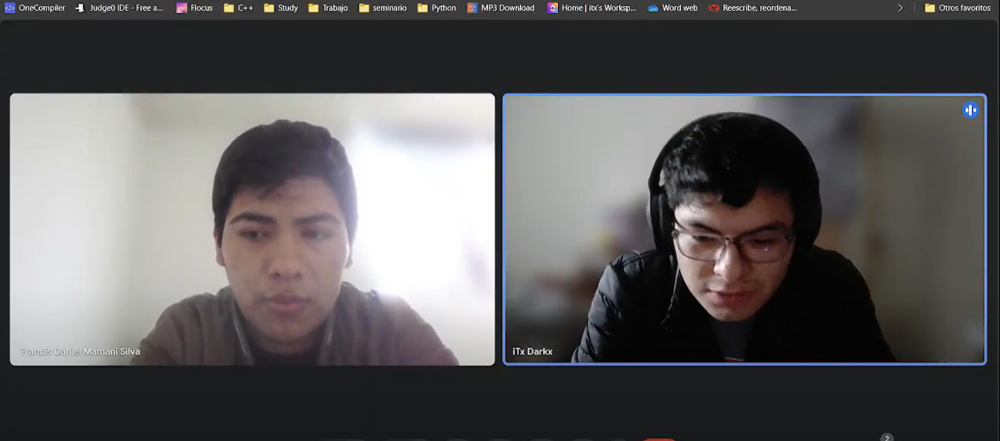

- Descripción  
  Francis es líder de proyectos en una ONG. Señala que sus principales retos son mantener una **comunicación clara y gestionar correctamente los tiempos**. Actualmente usa herramientas como Trello y Asana, además de reuniones periódicas por videollamada para coordinar avances.

  Considera que lo más importante en una herramienta de gestión es la **asignación de tareas, el seguimiento en tiempo real y la visualización del progreso**. Valora la **personalización de la herramienta** para ajustarla a las necesidades de cada proyecto. Además, le gustaría recibir notificaciones en su celular. Evalúa la carga de trabajo tomando en cuenta el esfuerzo y eficiencia de cada miembro del equipo.

---

##### Entrevista 3:

    Nombre: Oscar Aranda
    Sexo: Masculino
    Residencia: Lima, Perú
    Inicio: 10:41
    Fin: 14:05

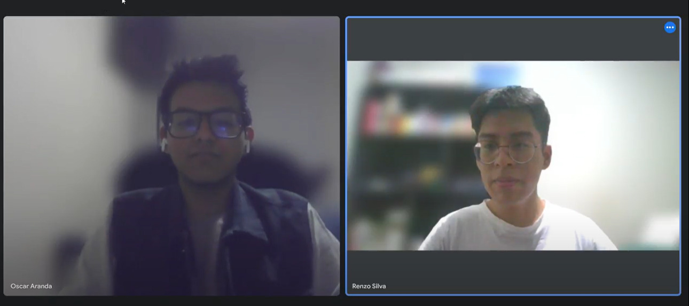

- Descripción  
  Oscar es gestor de un proyecto universitario en una ONG. Identifica como principales dificultades la **falta de seguimiento de tareas y la baja colaboración de los miembros**. Para comunicarse utiliza Google Meet o Discord, y emplea Trello para organizar actividades.

  Considera que una aplicación de gestión debe ofrecer **seguimiento en tiempo real de las tareas** y un **calendario de actividades integrado**. Evalúa la eficiencia de su equipo en reuniones de retroalimentación donde se revisan avances y fallas.

---

**Segmento Objetivo:** Trabajadores del Equipo (Miembros de ONG)

##### Entrevista 1:

    Nombre: Cynthia Santa Cruz Vargas
    Sexo: Femenino
    Residencia: Lima, Perú
    Inicio: 14:06
    Fin: 20:35


- Descripción  
  Cynthia es miembro de un equipo en una ONG. Su mayor reto es la **organización de las tareas y la falta de claridad de algunos compañeros**. Utiliza Office, Project y un sistema interno para organizar su trabajo.

  Considera que una aplicación debería tener un **sistema eficaz de seguimiento del progreso**, con **notificaciones automáticas**. Prefiere comunicarse cara a cara o por correo electrónico. Le gustaría contar con una función para **registrar el tiempo que tarda en completar una tarea**, y recibir notificaciones en su celular.

---

##### Entrevista 2:

    Nombre: Carla Córdova
    Sexo: Femenino
    Residencia: Lima, Perú
    Inicio: 20:36
    Fin: 25:47


- Descripción  
  Carla es miembro de un equipo en una ONG. Menciona que una de sus dificultades es que **sus tareas se acumulan porque no logra organizarlas de manera eficiente**. Utiliza Trello para organizar sus responsabilidades.

  Prefiere recibir las tareas en reuniones o mensajes por videollamada. Le gustaría que la aplicación le notifique sobre el progreso en el celular. Valora que la herramienta sea **ordenada, intuitiva y facilite la colaboración**. Sugiere que las tareas asignadas puedan **editarse y visualizarse en tiempo real**.

---

##### Entrevista 3:

    Nombre: Mauricio Rojas
    Sexo: Masculino
    Residencia: Lima, Perú
    Inicio: 25:50
    Fin: 32:58


- Descripción  
  Mauricio es miembro de un equipo en una ONG. Señala que enfrenta problemas porque las herramientas que utiliza son poco intuitivas. Para organizar sus actividades prefiere usar notas personales.

  Le gustaría una aplicación que permita la **colaboración en tiempo real** con otros miembros. Valora la posibilidad de **categorizar tareas** y gestionar todas en un mismo lugar. Evalúa su progreso por el tiempo que le toma completar cada tarea y busca alternar entre tareas sencillas y complejas para equilibrar su carga.

### 2.2.3. Análisis de entrevistas

**Segmento Objetivo: Líderes de equipo en ONG**

- **Falta de Seguimiento y Colaboración:**  
  El 75% de los líderes entrevistados mencionaron que uno de los mayores desafíos es la falta de seguimiento y la colaboración dentro de los proyectos sociales. Esto genera dificultades para coordinar tareas y garantizar que las actividades se ejecuten con el impacto esperado.

- **Comunicación Clara y Efectiva:**  
  Un 50% de los líderes destacó la importancia de mantener una comunicación fluida con voluntarios y colaboradores, considerándola clave para el éxito y la sostenibilidad de los proyectos.

- **Uso de Herramientas Digitales (Trello y Asana):**  
  El 100% de los líderes entrevistados utiliza Trello para asignar y organizar tareas en la ONG. Un 50% también menciona Asana como apoyo para planificar iniciativas sociales.

- **Herramientas de Comunicación:**  
  El 75% recurre a Google Meet o Discord para coordinarse, priorizando plataformas que permitan **videollamadas y reuniones rápidas** con los equipos.

- **Asignación de Tareas y Seguimiento en Tiempo Real:**  
  El 100% considera imprescindible que la herramienta de gestión permita **asignar tareas y dar seguimiento inmediato**, con visibilidad del avance de los proyectos sociales.

- **Personalización y Calendario:**  
  Un 50% señaló la necesidad de incluir **opciones de personalización** y un **calendario de actividades** que facilite la planificación de cronogramas comunitarios y entregables.

- **Reuniones de Retroalimentación:**  
  El 50% de los líderes evalúa la eficiencia de su equipo mediante **reuniones periódicas de revisión**, en las que se discuten fallas y se buscan soluciones para mejorar el impacto social de los proyectos.

---

**Segmento Objetivo: Miembros de equipo en ONG**

- **Organización de Tareas:**  
  El 100% de los miembros entrevistados mencionó que uno de los mayores desafíos es **organizar sus tareas dentro de los proyectos de la ONG**, especialmente cuando se acumulan y no logran priorizarlas de forma eficiente.

- **Falta de Conocimiento o Capacitación:**  
  Un 25% señaló que la falta de experiencia o conocimiento de algunos voluntarios dificulta aún más la coordinación del trabajo colectivo.

- **Uso de Trello:**  
  El 75% de los miembros utiliza **Trello** para organizar sus responsabilidades y coordinar con el equipo.

- **Sistemas Internos:**  
  Un 25% hace uso de **sistemas internos de la organización** para registrar y dar seguimiento a tareas específicas según el proyecto.

- **Interfaz Intuitiva y Colaborativa:**  
  El 100% valora que una aplicación sea **ordenada, fácil de usar y fomente la colaboración** entre los voluntarios y miembros de la ONG.

- **Notificaciones en Tiempo Real:**  
  El 75% prefiere recibir **notificaciones en el celular** sobre sus tareas asignadas, lo que les permite mantenerse al día con los avances y plazos de los proyectos sociales.

## 2.3. Needfinding

En esta sección se desarrollaron **User Personas** basados en la información recolectada durante las entrevistas. El objetivo es identificar los comportamientos, necesidades y procesos actuales de cada segmento antes de la implementación de nuestra solución.

### 2.3.1. User Personas

A continuación, se presentan las representaciones gráficas de los dos perfiles clave que guían el diseño de nuestra solución:

---

**User Persona - Segmento 1 (Gestor de Proyectos):**

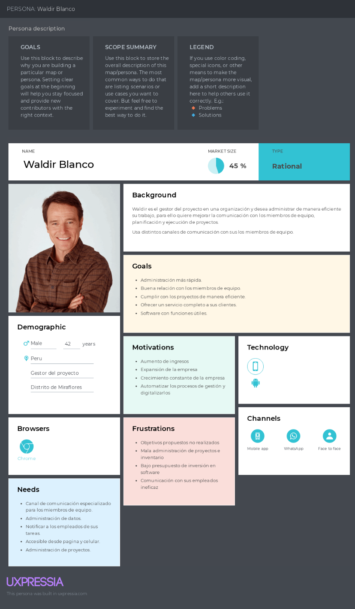

---

**User Persona - Segmento 2 (Ayudante de Eventos):**

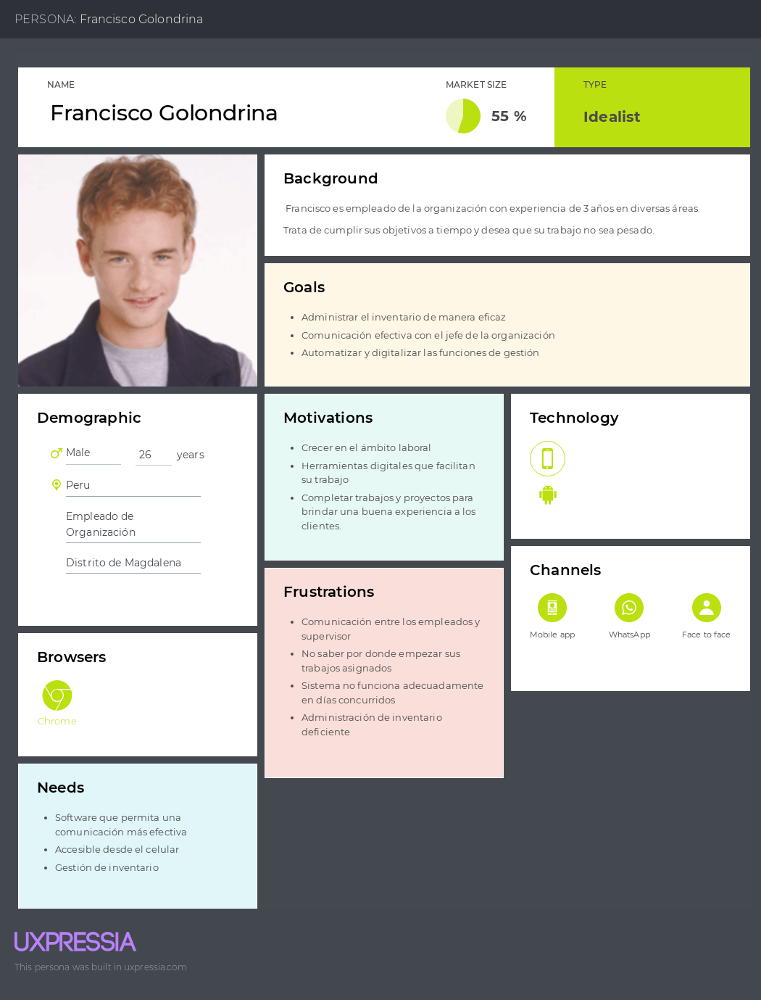

---

### 2.3.2. User Task Matrix

<br>
El User Task Matrix nos sirve para identificar los procesos que realizan ambos segmentos donde se pueden observar las similitudes respecto a la importancia y frecuencias de estos procesos. Esto es antes de implementar nuestra solución.
<table border="1" cellspacing="0" cellpadding="6" style="border-collapse: collapse; text-align: center;">
  <thead>
    <tr>
      <th rowspan="2">Título</th>
      <th colspan="2">Gestor</th>
      <th colspan="2">Ayudante</th>
    </tr>
    <tr>
      <th>Impacto</th>
      <th>Frecuencia</th>
      <th>Impacto</th>
      <th>Frecuencia</th>
    </tr>
  </thead>
  <tbody>
    <tr>
      <td>Comunicar tareas al equipo</td>
      <td>Alta</td>
      <td>Media</td>
      <td>Alta</td>
      <td>Baja</td>
    </tr>
    <tr>
      <td>Establecer fechas / cronograma</td>
      <td>Alta</td>
      <td>Media</td>
      <td>Media</td>
      <td>Baja</td>
    </tr>
    <tr>
      <td>Evaluar resultados del proyecto</td>
      <td>Alta</td>
      <td>Media</td>
      <td>Media</td>
      <td>Baja</td>
    </tr>
    <tr>
      <td>Registrar información del proyecto</td>
      <td>Alta</td>
      <td>Media</td>
      <td>Alta</td>
      <td>Alta</td>
    </tr>
    <tr>
      <td>Planificar reuniones</td>
      <td>Alta</td>
      <td>Baja</td>
      <td>Media</td>
      <td>Baja</td>
    </tr>
    <tr>
      <td>Registrar datos en Excel</td>
      <td>Alta</td>
      <td>Media</td>
      <td>Alta</td>
      <td>Baja</td>
    </tr>
    <tr>
      <td>Supervisar proyecto en ejecución</td>
      <td>Alta</td>
      <td>Media</td>
      <td>Alta</td>
      <td>Alta</td>
    </tr>
  </tbody>
</table>

### 2.3.3. User Journey Mapping

El **User Journey Mapping** es fundamental para comprender el recorrido que realizan nuestros segmentos en situaciones comunes dentro de su entorno laboral. A través de esta herramienta, identificamos sus **problemas**, **experiencias**, **emociones** y **oportunidades**, permitiéndonos enfocar nuestra solución en lo que realmente necesitan.

---

**Segmento 1 - Gestor de Proyectos**  
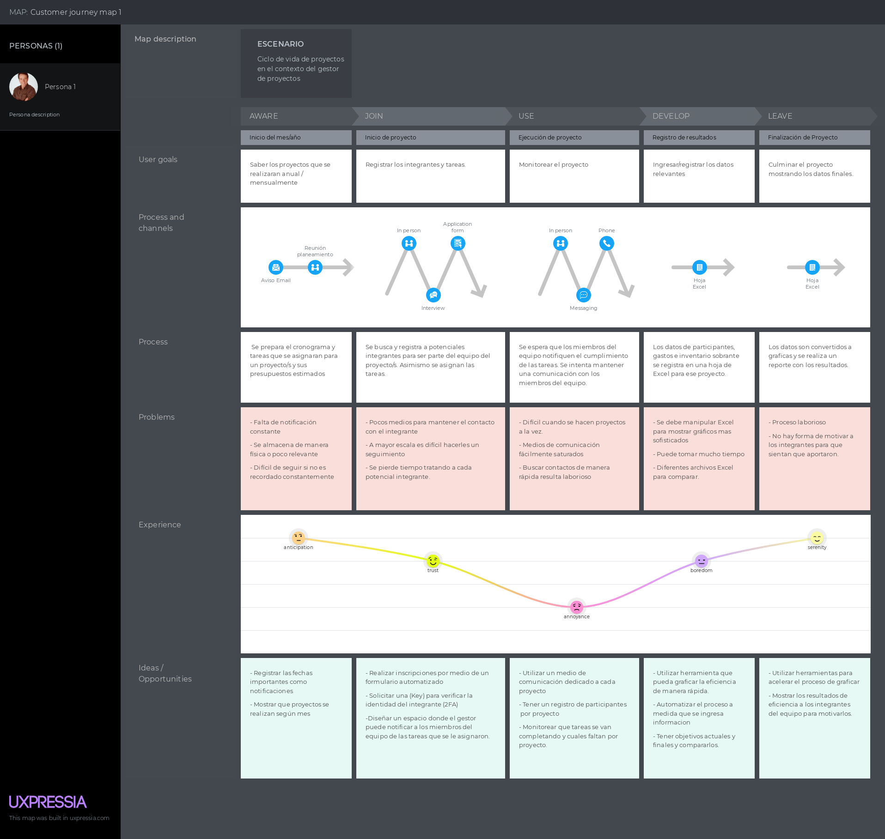

---

**Segmento 2 - Ayudante de Eventos**  
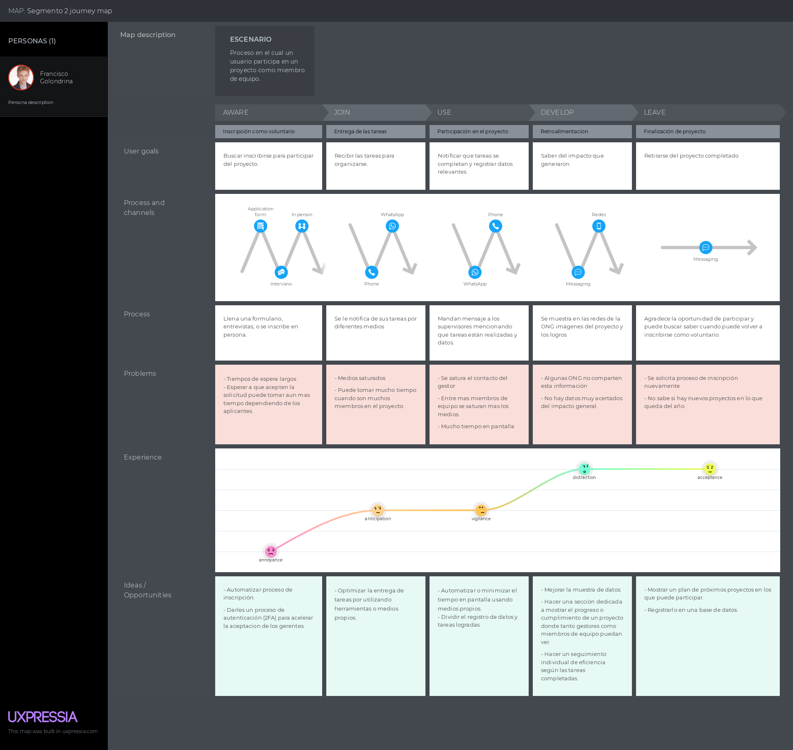

---

### 2.3.4. Empathy Mapping

El **Empathy Map** nos ayuda a visualizar lo que nuestros usuarios **piensan, sienten, dicen y hacen**, permitiéndonos generar un entendimiento más profundo de su contexto emocional y motivacional.

---

**Segmento 1 - Gestor de Proyectos:**  
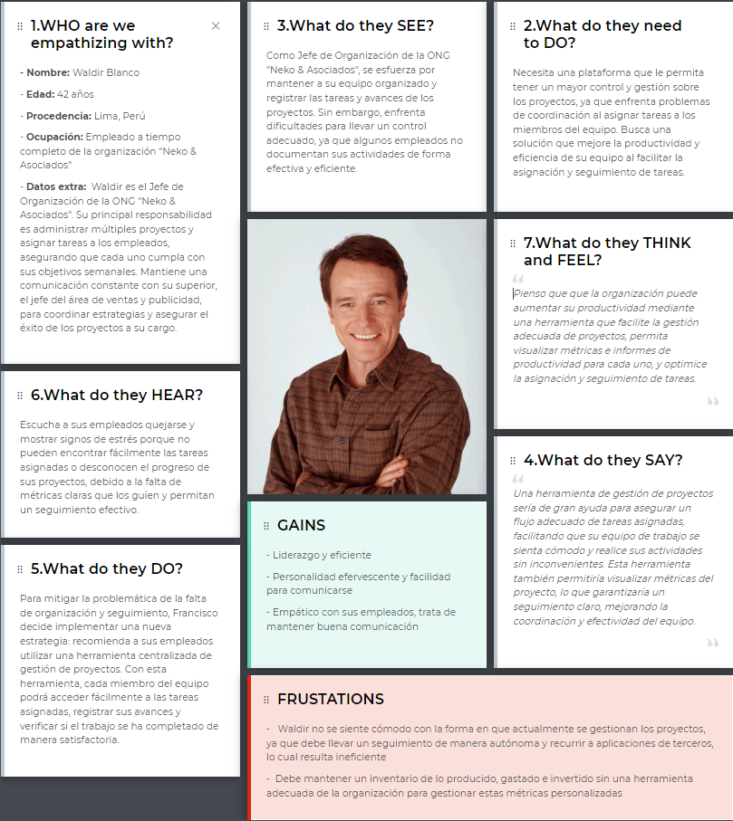

---

**Segmento 2 - Ayudante de Eventos:**  
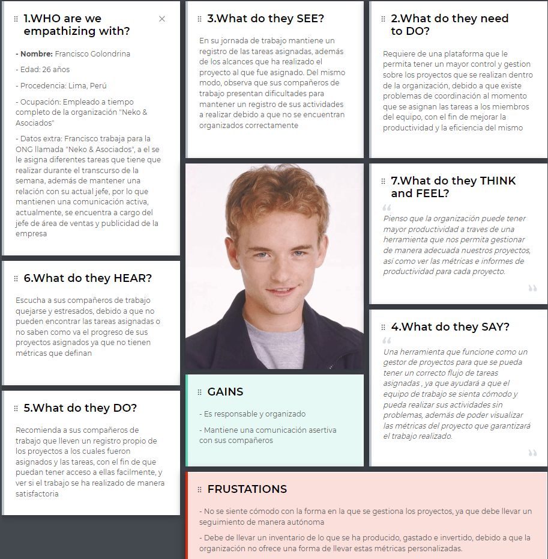

---

### 2.3.5. As-is Scenario Mapping

A continuación, se presenta el escenario actual (**As-Is**) de nuestros usuarios, antes de la implementación de nuestra solución. Este mapa refleja las actividades, puntos de dolor y métodos actuales que emplean los segmentos.

---

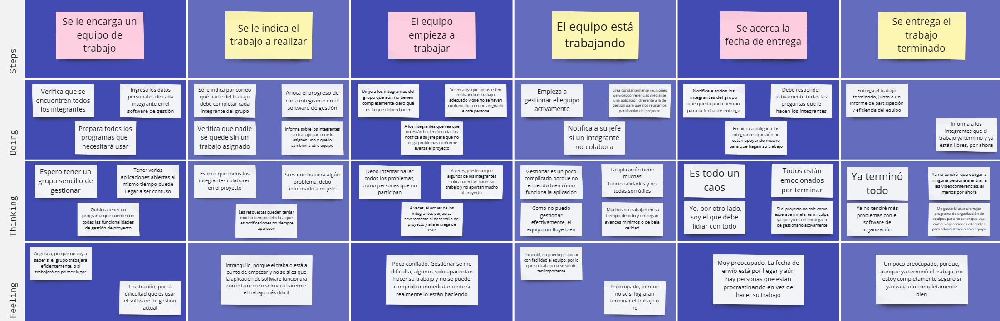  
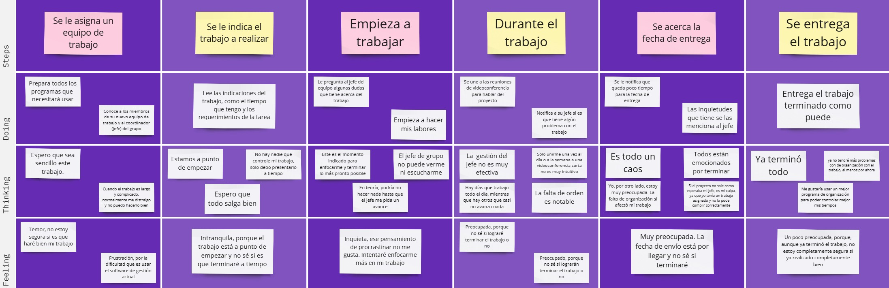

---

**Enlace al mapa interactivo:**  
[Ver en Miro](https://miro.com/welcomeonboard/bWFYbk5taHErYTV0YStFdFNwVFZvZTF3eTNsV25LNkhtYUIrb3pEWmN4MkpwaW1nZi90ZU1SSTFienhFOEFYSEl4TGVEYUlLanBjemhuYjN0N25waENlMVNNWGljYm1ORWFUbTlaYWFJcHp4WUVyUTQrbHNZbllSTEpoUGtpbTJnbHpza3F6REdEcmNpNEFOMmJXWXBBPT0hdjE=?share_link_id=727778410280)

---

## 2.4. Ubiquitous Language

En esta sección definimos los **términos clave** utilizados por los usuarios y el equipo de desarrollo, con el fin de garantizar una comprensión común y coherente durante todo el proyecto.

| **Término**              | **Definición**                                                                                                |
| ------------------------ | ------------------------------------------------------------------------------------------------------------- |
| **Gestor de Proyectos**  | Usuario responsable de planificar, asignar y supervisar las tareas dentro de la ONG.                          |
| **Ayudante / Staff**     | Usuario que colabora en la ejecución de actividades y eventos, y reporta al gestor.                           |
| **Tarea**                | Actividad específica asignada a un miembro del equipo, con fecha límite y objetivo claro.                     |
| **Proyecto**             | Conjunto de tareas organizadas que buscan lograr un impacto social específico dentro de la ONG.               |
| **MVP**                  | Producto Mínimo Viable, primera versión funcional de la solución con características esenciales.              |
| **Dashboard**            | Interfaz visual que permite al gestor visualizar el estado de proyectos, tareas y comunicación.               |
| **Inventario**           | Registro de insumos y materiales necesarios para llevar a cabo las actividades de la ONG.                     |
| **Comunicación Directa** | Canal interno dentro de la plataforma que permite a los usuarios intercambiar mensajes o alertas rápidamente. |
| **Landing Page**         | Página web introductoria para presentar el producto y captar el interés de los usuarios.                      |
| **Suscripción**          | Plan de acceso a la plataforma basado en cantidad de usuarios registrados y funcionalidades disponibles.      |

# Capítulo III: Requirements Specifications

## 3.1. To-Be Scenario Mapping

El **To-Be Scenario Mapping** representa el escenario futuro ideal que nuestros usuarios vivirán una vez implementada nuestra solución. A través de este mapeo, visualizamos cómo cambiarán y mejorarán los procesos actuales, abordando los puntos de dolor identificados en el escenario As-Is.

Este escenario muestra:

- La **optimización de tareas** mediante herramientas digitales adaptadas a las necesidades de las ONG.
- Una **comunicación fluida y directa** entre gestores y ayudantes.
- La **eficiencia operativa** en la planificación, ejecución y monitoreo de proyectos.
- El uso de un **dashboard centralizado**, accesible y fácil de usar, que permite supervisar proyectos, tareas, inventarios y finanzas en tiempo real.
- La eliminación de la dependencia de herramientas poco eficientes como Excel, WhatsApp o correos dispersos.

---

### Visualización del Escenario Futuro

---

**Gestor de Proyectos:**

- Planifica y asigna tareas desde una plataforma intuitiva.
- Supervisa el progreso de cada tarea y recibe notificaciones en tiempo real.
- Mantiene un control financiero básico, visualizando presupuestos y gastos.
- Se comunica rápidamente con el equipo mediante un canal directo dentro de la plataforma.

---

**Ayudante/Staff:**

- Recibe tareas claras con fechas y descripciones específicas.
- Marca tareas como completadas desde su dispositivo móvil o PC.
- Puede consultar información del proyecto y notificar cualquier incidencia al gestor de forma inmediata.
- Accede a un entorno más organizado, sintiéndose valorado y eficiente.

---

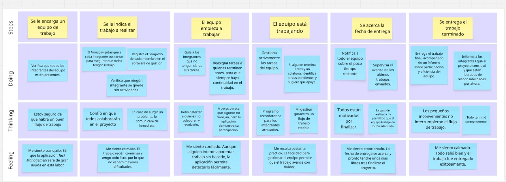  
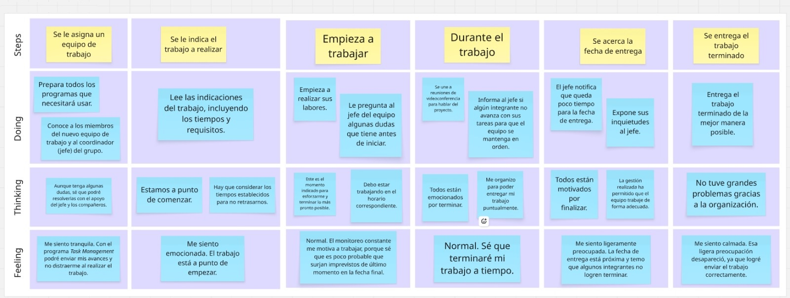

---

**Enlace al mapa interactivo:**  
[Ver en Miro](https://miro.com/welcomeonboard/bWFYbk5taHErYTV0YStFdFNwVFZvZTF3eTNsV25LNkhtYUIrb3pEWmN4MkpwaW1nZi90ZU1SSTFienhFOEFYSEl4TGVEYUlLanBjemhuYjN0N25waENlMVNNWGljYm1ORWFUbTlaYWFJcHdCQXlSb09TU1ppd25TaUpvbXZHNm1nbHpza3F6REdEcmNpNEFOMmJXWXBBPT0hdjE=?share_link_id=962634185128)

---

## 3.2. User Stories

**Épicas:**<br>

<table border="1" cellspacing="0" cellpadding="6" style="border-collapse: collapse; text-align: center;">
  <thead>
    <tr>
      <th>EPICA</th>
      <th>Título Épica</th>
      <th>HU asignadas</th>
    </tr>
  </thead>
  <tbody>
    <tr>
      <td>EP01</td>
      <td>Informar del producto y empresa</td>
      <td>HU01 – HU03</td>
    </tr>
    <tr>
      <td>EP02</td>
      <td>Gestionar Usuarios</td>
      <td>HU04 – HU06</td>
    </tr>
    <tr>
      <td>EP03</td>
      <td>Gestionar miembros de equipo</td>
      <td>HU07 – HU08</td>
    </tr>
    <tr>
      <td>EP04</td>
      <td>Gestionar Proyectos</td>
      <td>HU09 – HU11</td>
    </tr>
    <tr>
      <td>EP05</td>
      <td>Gestionar Tareas</td>
      <td>HU12 – HU15</td>
    </tr>
    <tr>
      <td>EP06</td>
      <td>Gestionar Fechas</td>
      <td>HU16</td>
    </tr>
    <tr>
      <td>EP07</td>
      <td>Gestionar Análisis</td>
      <td>HU17</td>
    </tr>
    <tr>
      <td>EP09</td>
      <td>Implementación de Seguridad</td>
      <td>HU18</td>
    </tr>
  </tbody>
</table>

<!-- Historias Usuario -->
<p><strong>Historias Usuario:</strong><br>
<strong>Owner:</strong> AidManager</p>

<table>
<colgroup>
<col style="width: 8%" />
<col style="width: 16%" />
<col style="width: 21%" />
<col style="width: 53%" />
</colgroup>
<thead>
<tr class="header">
<th>HUX</th>
<th>Historia de Usuario</th>
<th><p>Descripción</p><p>(Escenario)</p></th>
<th>Criterios de Aceptación (Dado que, Cuando, Entonces, Y)</th>
</tr>
</thead>
<tbody>
<tr class="odd">
<td rowspan="2">EP01-HU01</td>
<td rowspan="2">Ofrecer información de la empresa</td>
<td rowspan="2"><strong>Como</strong> visitante, <strong>quiero</strong>
conseguir información sobre la empresa <strong>para</strong> saber más
sobre su misión y visión.</td>
<td><p><strong>Caso A: El visitante encuentra información de la empresa.</strong></p>
<p><strong>Given</strong> el visitante está en la página de información,</p>
<p><strong>When</strong> revisa la sección de la empresa,</p>
<p><strong>Then</strong> debería ver detalles sobre la misión y visión de la empresa.</p></td>
</tr>
<tr class="even">
<td><p><strong>Caso A: El visitante recibe un error de cargar datos.</strong></p>
<p><strong>Given</strong> el visitante está en la página de información,</p>
<p><strong>When</strong> no encuentra detalles sobre la empresa,</p>
<p><strong>Then</strong> debería ver un mensaje de error indicando que la información está temporalmente no disponible.</p></td>
</tr>

<tr class="odd">
<td rowspan="2">EP01-HU02</td>
<td rowspan="2">Informar sobre los beneficios del producto</td>
<td rowspan="2"><strong>Como</strong> visitante, quiero conocer los beneficios del producto para evaluar si cumple con mis necesidades.</td>
<td><p><strong>Caso A:</strong></p>
<p><strong>Given</strong> el visitante está en la sección de beneficios,</p>
<p><strong>When</strong> revisa la lista de beneficios,</p>
<p><strong>Then</strong> debería ver una lista detallada de los beneficios que ofrece el producto.</p></td>
</tr>
<tr class="even">
<td><p><strong>Given</strong> el visitante está en la sección de beneficios,</p>
<p><strong>When</strong> no encuentra beneficios listados,</p>
<p><strong>Then</strong> debería ver un mensaje de error indicando que los beneficios no están disponibles.</p></td>
</tr>

<tr class="odd">
<td rowspan="2">EP01-HU03</td>
<td rowspan="2">Conocer los testimonios de los clientes pasados</td>
<td rowspan="2"><strong>Como</strong> visitante, <strong>quiero</strong>
leer testimonios de clientes anteriores <strong>para</strong> saber si han tenido experiencias positivas.</td>
<td><p><strong>Given</strong> el visitante está en la sección de testimonios,</p>
<p><strong>When</strong> revisa los comentarios y valoraciones,</p>
<p><strong>Then</strong> debería ver comentarios y valoraciones de clientes pasados.</p></td>
</tr>
<tr class="even">
<td><p><strong>Given</strong> el visitante está en la sección de testimonios,</p>
<p><strong>When</strong> no encuentra testimonios,</p>
<p><strong>Then</strong> debería ver un mensaje de error indicando que los testimonios no están disponibles.</p></td>
</tr>

<tr class="odd">
<td rowspan="2">EP02-HU04</td>
<td rowspan="2">Mostrar información de perfiles de gestores</td>
<td rowspan="2"><strong>Como</strong> miembro de equipo, <strong>quiero</strong>
conocer la información de los gestores de equipo <strong>para</strong> saber más de mis superiores e información de contacto.</td>
<td><p><strong>Caso: Se ve la información del perfil</strong></p>
<p><strong>Given</strong> el miembro de equipo está en la vista donde están los perfiles de los integrantes de la ONG,</p>
<p><strong>When</strong> selecciona un perfil,</p>
<p><strong>Then</strong> ve una información del miembro de equipo incluyendo la información de contacto y nombres.</p></td>
</tr>
<tr class="even">
<td><p><strong>Caso: No se ve la información del perfil</strong></p>
<p><strong>Given</strong> el miembro del equipo está en la vista donde está el perfil del gestor de la organización,</p>
<p><strong>When</strong> selecciona un perfil y no ve la información del perfil</p>
<p><strong>Then</strong> sale un mensaje de error pidiendo que recargue el perfil.</p></td>
</tr>

<tr class="odd">
<td rowspan="2">EP02-HU05</td>
<td rowspan="2">Editar información de perfil</td>
<td rowspan="2"><strong>Como</strong> usuario, <strong>quiero</strong>
poder editar mi perfil <strong>para</strong> actualizar mi información de contacto o errores que haya realizado al registrarme.</td>
<td><p><strong>Caso: Usuario edita su perfil</strong></p>
<p><strong>Given</strong> usuario está en su perfil,</p>
<p><strong>When</strong> presiona en los botones para editar perfil,</p>
<p><strong>Then</strong> edita la información del perfil.</p></td>
</tr>
<tr class="even">
<td><p><strong>Caso: Usuario falla en editar su perfil</strong></p>
<p><strong>Given</strong> usuario está en su perfil,</p>
<p><strong>When</strong> presiona en los botones para editar perfil y no pone la información requerida,</p>
<p><strong>Then</strong> aparece un mensaje solicitando la información solicitada.</p></td>
</tr>
</tbody>
</table>

<!-- HU10 (encabezado como TH en tu HTML) + HU11–HU20 en el mismo <table> -->
<table>
<colgroup>
<col style="width: 8%" />
<col style="width: 16%" />
<col style="width: 21%" />
<col style="width: 53%" />
</colgroup>
<thead>
<tr class="header">
<th rowspan="2">EP02-HU06</th>
<th rowspan="2">Autenticar usuarios por medio de código de organización</th>
<th rowspan="2"><strong>Como</strong> gestor, <strong>quiero</strong>
invitar a un miembro de equipo usando un código de organización <strong>para</strong> que este pueda registrarse a la organización.</th>
<th><p><strong>Caso: El miembro de equipo se registra correctamente.</strong></p>
<p><strong>Given</strong> el gestor envía el código de invitación al usuario miembro de equipo,</p>
<p><strong>When</strong> ingresa el código al registrarse en la aplicación, <strong>Then</strong> ingresa sin problema a la organización del código.</p></th>
</tr>
<tr class="odd">
<th><p><strong>Caso: El miembro de equipo ingresa un código invalido.</strong></p>
<p><strong>Given</strong> el gestor no envía el código de invitación al usuario miembro de equipo,</p>
<p><strong>When</strong> no ingresa el código o ingresa el código incorrecto al registrarse en la aplicación,</p>
<p><strong>Then</strong> sale un error solicitando que ingrese un código valido.</p></th>
</tr>
</thead>
<tbody>
<tr class="odd">
<td rowspan="2">EP03-HU07</td>
<td rowspan="2">Mostrar lista de perfiles de miembros de equipo.</td>
<td rowspan="2"><strong>Como</strong> gestor, <strong>quiero</strong>
ver un listado de los miembros y sus contactos <strong>para</strong> poder contactar fácilmente a los miembros del equipo.</td>
<td><p><strong>Caso: Se muestra la lista de usuarios</strong></p>
<p><strong>Given</strong> el gestor está en el panel de proyecto,</p>
<p><strong>When</strong> va a la lista de miembros de equipo,</p>
<p><strong>Then</strong> debería ver una lista de todos los miembros del equipo y sus contactos.</p></td>
</tr>
<tr class="even">
<td><p><strong>Caso: No se muestra la lista de usuarios</strong></p>
<p><strong>Given</strong> el gestor está en el panel de proyecto,</p>
<p><strong>When</strong> no se muestra la lista de miembros de equipo, <strong>Then</strong> aparece un mensaje de error.</p></td>
</tr>

<tr class="odd">
<td rowspan="2">EP03-HU08</td>
<td rowspan="2">Eliminar Perfil de miembro de equipo</td>
<td rowspan="2"><strong>Como</strong> gestor, <strong>quiero</strong>
eliminar un perfil de miembro de equipo <strong>para</strong> liberar espacio para nuevas cuentas o concluir la participación de un miembro de equipo.</td>
<td><p><strong>Caso: El gestor elimina usuario de la organización.</strong></p>
<p><strong>Given</strong> el gestor está en la lista de miembros,</p>
<p><strong>When</strong> selecciona un perfil y le da al botón de eliminar usuario y confirma esta acción, <strong>Then</strong> el usuario es eliminado y se muestra un mensaje exitoso.</p></td>
</tr>
<tr class="even">
<td><p><strong>Caso: El gestor falla en eliminar usuario de la organización.</strong></p>
<p><strong>Given</strong> el gestor está en la lista de miembros,</p>
<p><strong>When</strong> selecciona un perfil y le da al botón de eliminar usuario, pero no confirma esta acción,</p>
<p><strong>Then</strong> el usuario no es eliminado y se muestra un mensaje exitoso.</p></td>
</tr>

<tr class="odd">
<td rowspan="2">EP04-HU09</td>
<td rowspan="2">Visualizar de listado de proyectos</td>
<td rowspan="2"><strong>Como</strong> usuario, <strong>quiero</strong>
ver el listado de proyectos de mi interés <strong>para</strong> evaluar la información relacionada.</td>
<td><p><strong>Caso: Se carga el listado de proyectos</strong></p>
<p><strong>Given</strong> el usuario está en la sección de proyectos,</p>
<p><strong>When</strong> la sección carga correctamente,</p>
<p><strong>Then</strong> se debe de mostrar un listado de los proyectos en relación con el usuario.</p></td>
</tr>
<tr class="even">
<td><p><strong>Caso: Ocurre un error al cargar los datos</strong></p>
<p><strong>Given</strong> el usuario está en la sección de proyectos,</p>
<p><strong>When</strong> la sección carga demora demasiado,</p>
<p><strong>Then</strong> se muestra un mensaje de error para recargar.</p></td>
</tr>

<tr class="odd">
<td rowspan="2">EP04-HU10</td>
<td rowspan="2">Ingresar nuevo proyecto</td>
<td rowspan="2"><strong>Como</strong> gestor, <strong>quiero</strong>
ingresar un nuevo proyecto <strong>para</strong> hacerle su seguimiento administrativo.</td>
<td><p><strong>Caso: Se ingresa la información requerida</strong></p>
<p><strong>Given</strong> el gestor se encuentra en la vista de proyectos,</p>
<p><strong>When</strong> presiona el botón para agregar un proyecto y agrega el título, descripción, ubicación e imágenes de referencia,</p>
<p><strong>Then</strong> se muestra un mensaje de proyecto agregado y se actualiza la lista de proyectos con el más reciente primero.</p></td>
</tr>
<tr class="even">
<td><p><strong>Caso: No se ingresa la información requerida</strong></p>
<p><strong>Given</strong> el gestor se encuentra en la vista de proyectos,</p>
<p><strong>When</strong> presiona el botón para agregar un proyecto le falta agregar información importante como el título o imágenes de referencia,</p>
<p><strong>Then</strong> se muestra un error en el dialogo solicitando que se ingrese la información requerida para agregar un proyecto.</p></td>
</tr>

<tr class="odd">
<td rowspan="2">EP04-HU11</td>
<td rowspan="2">Editar información de proyecto</td>
<td rowspan="2"><strong>Como</strong> gestor, <strong>quiero</strong>
editar la información del proyecto <strong>para</strong> actualizar cambios como ubicación o descripción.</td>
<td><p><strong>Caso: Se edita la información del proyecto</strong></p>
<p><strong>Given</strong> gestor está en la sección de proyecto, <strong>When</strong> presione el botón de editar y cambie la información que desea editar,</p>
<p><strong>Then</strong> se actualiza la información del proyecto.</p></td>
</tr>
<tr class="even">
<td><p><strong>Caso: Ocurre un error al actualizar la información del proyecto</strong></p>
<p><strong>Given</strong> gestor está en la sección de proyecto, <strong>When</strong> presione el botón de editar y cambie la información que desea editar, pero ingrese datos erróneos o no válidos,</p>
<p><strong>Then</strong> se muestra un mensaje de error explicando que salió mal.</p></td>
</tr>

<tr class="odd">
<td rowspan="2">EP05-HU12</td>
<td rowspan="2">Visualizar tareas</td>
<td rowspan="2"><strong>Como</strong> gestor, <strong>quiero</strong>
ver las tareas del proyecto <strong>para</strong> evaluar los pendientes relacionados a las tareas.</td>
<td><p><strong>Caso: Se muestran las tareas correctamente.</strong></p>
<p><strong>Given</strong> el gestor está en la sección de proyecto,</p>
<p><strong>When</strong> presiona el botón de ver tareas y se redirige a esa sección,</p>
<p><strong>Then</strong> se observa las tareas To-Do, Doing y Done.</p></td>
</tr>
<tr class="even">
<td><p><strong>Caso: No se muestran tareas</strong></p>
<p><strong>Given</strong> el gestor está en la sección de proyecto,</p>
<p><strong>When</strong> presiona el botón de ver tareas y se redirige a esa sección y no tiene tareas agregadas,</p>
<p><strong>Then</strong> observa un mensaje que le solicite agregar tareas para empezar.</p></td>
</tr>

<tr class="odd">
<td rowspan="2">EP05-HU13</td>
<td rowspan="2">Crear tarea</td>
<td rowspan="2"><strong>Como</strong> gestor, <strong>quiero</strong>
crear tareas <strong>para</strong> organizar a mi equipo.</td>
<td><p><strong>Caso: Se agrega la tarea correctamente.</strong></p>
<p><strong>Given</strong> el gestor está en la sección de tareas,</p>
<p><strong>When</strong> presiona el botón de agregar tarea e ingresa el título, descripción, fecha de expiración, el estado de la tarea y a quien está asignada la tarea.</p>
<p><strong>Then</strong> Se agrega la tarea según la columna que le corresponde</p></td>
</tr>
<tr class="even">
<td><p><strong>Caso: Faltan datos en la tarea.</strong></p>
<p><strong>Given</strong> el gestor está en la sección de tareas,</p>
<p><strong>When</strong> presiona el botón de agregar tarea y le falta ingresar el título, descripción, fecha de expiración, el estado de la tarea o a quien está asignada la tarea.</p>
<p><strong>Then</strong> se muestra un mensaje solicitando que llene los campos faltantes con la información valida.</p></td>
</tr>

<tr class="odd">
<td rowspan="2">EP05-HU14</td>
<td rowspan="2">Cambio de estado de tarea</td>
<td rowspan="2"><strong>Como</strong> miembro de equipo, <strong>quiero</strong>
cambiar el estado de mi tarea <strong>para</strong> dar a saber cómo va mi progreso.</td>
<td><p><strong>Caso: Se cambia el estado de una tarea</strong></p>
<p><strong>Given</strong> el miembro de equipo está en la sección de tareas después de estar en la sección de proyecto,</p>
<p><strong>When</strong> presiona el botón para cambiar el estado de su tarea,</p>
<p><strong>Then</strong> la tarea debería cambiar de columna y actualizar su estado.</p></td>
</tr>
<tr class="even">
<td><p><strong>Caso: Sucede un error al cambiar el estado de una tarea</strong></p>
<p><strong>Given</strong> el miembro de equipo está en la sección de tareas después de estar en la sección de proyecto,</p>
<p><strong>When</strong> presiona el botón para cambiar el estado de su tarea, pero esta no cambia,</p>
<p><strong>Then</strong> se muestra un mensaje solicitando que vuelva a intentarlo.</p></td>
</tr>
</tbody>
</table>

<!-- Tabla con HU21–HU28 -->
<table>
<colgroup>
<col style="width: 8%" />
<col style="width: 16%" />
<col style="width: 21%" />
<col style="width: 53%" />
</colgroup>
<thead>
<tr class="header">
<th rowspan="2">EP05-HU15</th>
<th rowspan="2">Eliminar una tarea</th>
<th rowspan="2"><strong>Como</strong> gestor, <strong>quiero</strong>
eliminar una tarea <strong>para</strong> quitar una tarea que no correspondía con el proyecto.</th>
<th><p><strong>Caso: Se borra la tarea exitosamente</strong></p>
<p><strong>Given</strong> el gestor está en la sección de tareas,</p>
<p><strong>When</strong> presiona el botón de eliminar tareas y confirma su acción,</p>
<p><strong>Then</strong> se quita la tarea de la columna.</p></th>
</tr>
<tr class="odd">
<th><p><strong>Caso: Ocurre un error al borrar la tarea</strong></p>
<p><strong>Given</strong> el gestor está en la sección de tareas,</p>
<p><strong>When</strong> presiona el botón de eliminar tareas y confirma su acción, pero sucede un error al eliminar la tarea,</p>
<p><strong>Then</strong> se muestra un mensaje mencionando que ocurrió un error y que intente de nuevo.</p></th>
</tr>
</thead>
<tbody>
<tr class="odd">
<td rowspan="2">EP06-HU16</td>
<td rowspan="2">Visualizar de fechas vinculadas con las tareas y proyectos</td>
<td rowspan="2"><strong>Como</strong> usuario, <strong>quiero</strong>
revisar las fechas correspondientes de las tareas y proyectos <strong>para</strong> asegurarme que se cumplan a tiempo y organizar tiempos.</td>
<td><p><strong>Caso: Se vinculan las tareas con fechas correctamente</strong></p>
<p><strong>Given</strong> el usuario se encuentra en la sección calendario,</p>
<p><strong>When</strong> carga el calendario en el formato que desee el usuario,</p>
<p><strong>Then</strong> se muestran las tareas y proyectos según su fecha de expiración.</p></td>
</tr>
<tr class="even">
<td><p><strong>Caso: No aparecen las fechas</strong></p>
<p><strong>Given</strong> el usuario se encuentra en la sección calendario,</p>
<p><strong>When</strong> no observa el calendario con las fechas,</p>
<p><strong>Then</strong> se muestra un mensaje solicitando que se recargue.</p></td>
</tr>

<!-- Tabla con HU29–HU32 -->
<table>
<colgroup>
<col style="width: 8%" />
<col style="width: 16%" />
<col style="width: 21%" />
<col style="width: 53%" />
</colgroup>
<thead>
<tr class="header">
<th rowspan="2">EP08-HU17</th>
<th rowspan="2">Visualizar las estadísticas del proyecto</th>
<th rowspan="2"><strong>Como</strong> gestor, <strong>quiero</strong>
observar las analíticas del proyecto <strong>para</strong> evaluar tendencias y revisar el progreso.</th>
<th><p><strong>Caso: Se cargan los gráficos correctamente</strong></p>
<p><strong>Given</strong> el gestor está en la sección de métricas,</p>
<p><strong>When</strong> cargan los gráficos,</p>
<p><strong>Then</strong> se muestran los gráficos de tareas completadas y análisis de presupuesto.</p></th>
</tr>
<tr class="odd">
<th><p><strong>Caso: No cargan los gráficos correctamente</strong></p>
<p><strong>Given</strong> el gestor está en la sección de métricas,</p>
<p><strong>When</strong> no cargan los gráficos como se debería,</p>
<p><strong>Then</strong> se muestra un mensaje de error solicitando que se recargue la sección.</p></th>
</tr>
</thead>
<tbody>
</tbody>
</table>

<!-- HU33 -->
<table>
<colgroup>
<col style="width: 8%" />
<col style="width: 16%" />
<col style="width: 21%" />
<col style="width: 53%" />
</colgroup>
<thead>
<tr class="header">
<th rowspan="2">EP09-HU18</th>
<th rowspan="2">Verificar que el código de organización sea correcto</th>
<th rowspan="2"><strong>Como</strong> desarrollador, <strong>quiero</strong>
mantener la integridad del código de organización <strong>para</strong> validar el código de organización.</th>
<th><p><strong>Caso: La validación es realizada correctamente</strong></p>
<p><strong>Given</strong> el desarrollador utiliza algoritmos de validación</p>
<p><strong>When</strong> se ingresa un código de organización al api de la aplicación y es válido,</p>
<p><strong>Then</strong> se guarda en la base de datos de manera encriptada.</p></th>
</tr>
<tr class="odd">
<th><p><strong>Caso: La validación es realizada incorrectamente</strong></p>
<p><strong>Given</strong> el desarrollador utiliza algoritmos de validación</p>
<p><strong>When</strong> se ingresa un código de organización al api de la aplicación y no es válido,</p>
<p><strong>Then</strong> se devuelve un error con el mensaje de código invalido.</p></th>
</tr>
</thead>
<tbody>
</tbody>
</table>

## 3.3. Product Backlog

Se consideran las historias de usuario más importantes para el product backlog
Asimismo, se ha realizado un Trello para hacer seguimiento de nuestras tareas.

<table border="1">
  <thead>
    <tr>
      <th>Historia de Usuario</th>
      <th>Descripción</th>
      <th>Prioridad</th>
      <th>Story Points (1/2/3/5/8)</th>
    </tr>
  </thead>
  <tbody>
    <tr><td>HU01</td><td>Ofrecer información de la empresa</td><td>Alta</td><td>3</td></tr>
    <tr><td>HU02</td><td>Informar sobre los beneficios del producto</td><td>Alta</td><td>3</td></tr>
    <tr><td>HU03</td><td>Conocer los testimonios de los clientes pasados</td><td>Media</td><td>3</td></tr>
    <tr><td>HU04</td><td>Mostrar información de perfiles de gestores</td><td>Alta</td><td>3</td></tr>
    <tr><td>HU05</td><td>Editar información de perfil</td><td>Media</td><td>2</td></tr>
    <tr><td>HU06</td><td>Autenticar usuarios por medio de código de organización</td><td>Alta</td><td>3</td></tr>
    <tr><td>HU07</td><td>Mostrar lista de perfiles de miembros de equipo</td><td>Alta</td><td>3</td></tr>
    <tr><td>HU08</td><td>Eliminar Perfil de miembro de equipo</td><td>Media</td><td>3</td></tr>
    <tr><td>HU09</td><td>Visualizar de listado de proyectos</td><td>Alta</td><td>3</td></tr>
    <tr><td>HU10</td><td>Ingresar nuevo proyecto</td><td>Alta</td><td>3</td></tr>
    <tr><td>HU11</td><td>Editar información de proyecto</td><td>Alta</td><td>3</td></tr>
    <tr><td>HU12</td><td>Visualizar tareas</td><td>Media</td><td>2</td></tr>
    <tr><td>HU13</td><td>Crear tarea</td><td>Media</td><td>2</td></tr>
    <tr><td>HU14</td><td>Cambio de estado de tarea</td><td>Alta</td><td>3</td></tr>
    <tr><td>HU15</td><td>Eliminar una tarea</td><td>Alta</td><td>3</td></tr>
    <tr><td>HU16</td><td>Visualizar de fechas vinculadas con las tareas y proyectos</td><td>Alta</td><td>3</td></tr>
    <tr><td>HU17</td><td>Visualizar las estadísticas del proyecto</td><td>Alta</td><td>3</td></tr>
    <tr><td>HU18</td><td>Verificar que el código de organización sea correcto</td><td>Alta</td><td>3</td></tr>
  </tbody>
</table>

<br>

**Tablero de seguimiento en Trello:**  
[Acceder al tablero de Trello](https://trello.com/invite/b/68c85b3eb4ff2479a7135a32/ATTI73e2b3a9f5055d0f1b3d0328b76f8c5d6E5FD02E/aidmanager)
<br>

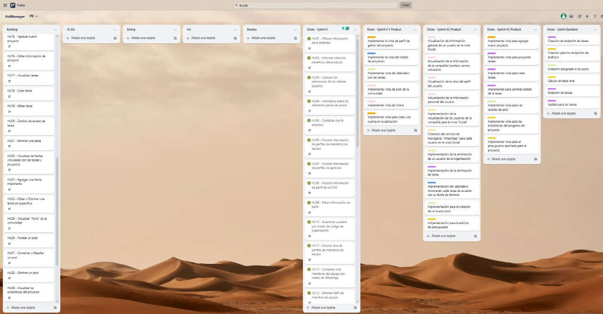

## 3.4. Impact Mapping

El **Impact Mapping** nos permite visualizar cómo nuestra solución contribuye a lograr los objetivos de negocio, alineando las metas con las necesidades de los usuarios y las funcionalidades clave del producto.

A través de estos mapas, identificamos:

- **Qué queremos lograr** (objetivo principal).
- **Quiénes** pueden ayudarnos o verse afectados (actores clave).
- **Cómo** pueden contribuir o qué comportamientos esperamos (impactos).
- **Qué debemos hacer** para lograr estos cambios (entregables del producto).

---

### Segmento 1 – Gestor de Proyectos

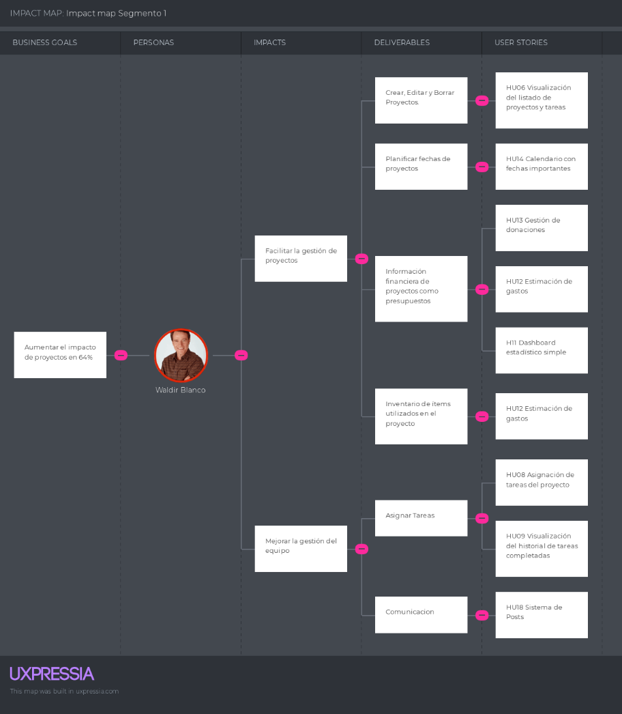

---

### Segmento 2 – Ayudante de Eventos

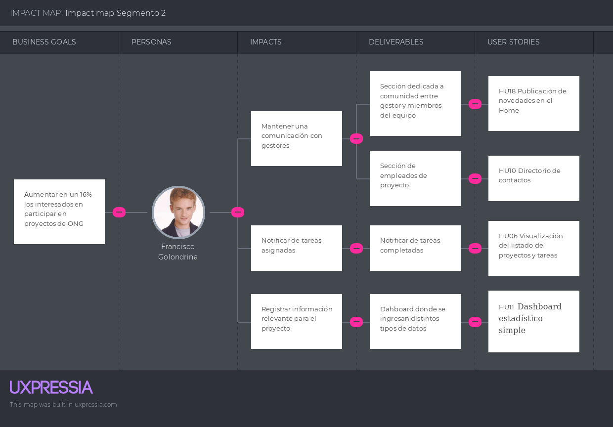

---

Cada mapa representa los caminos que nos llevan desde los objetivos estratégicos hasta acciones concretas dentro del sistema, permitiendo priorizar funcionalidades que generen **mayor impacto real** en el trabajo diario de los usuarios.

# Capítulo IV: Product Design

## 4.1. Style Guidelines

En AidManager, nos esforzamos por reflejar **profesionalismo**, **eficiencia** y **empatía** a través del diseño visual de nuestra aplicación web. Cada decisión estética ha sido cuidadosamente seleccionada para reforzar la identidad de nuestra startup y ofrecer a los usuarios una experiencia agradable, funcional y confiable.

Nuestra paleta de colores, compuesta por tonos celestes y verdes, evoca frescura, tranquilidad y conexión con la naturaleza. Las tipografías **Poppins** y **Lora** complementan esta visión, aportando una estética moderna, legible y sofisticada, que equilibra lo contemporáneo con lo humano.

Estas decisiones de diseño están alineadas con nuestra misión: **facilitar la gestión eficiente de eventos benéficos y donaciones**, fortaleciendo la confianza de quienes colaboran con nuestras causas.

---

### 4.1.1. General Style Guidelines

---

#### **Color Primario**

El color primario refleja **confianza, serenidad y estabilidad**. Simboliza fiabilidad y compromiso en la gestión de organizaciones benéficas, inspirando seguridad tanto en donantes como en beneficiarios.

- **Código HEX:** #008A66


---

#### **Color Secundario**

Nuestro color secundario transmite **calma, frescura y bienestar**. Representa la esperanza y el apoyo que brindamos, así como la naturaleza innovadora y refrescante de nuestras soluciones.

- **Código HEX:** #66EAC5


---

#### **Paleta de Colores Complementaria**

Estos colores complementarios enriquecen la identidad visual, manteniendo coherencia y dinamismo en la experiencia del usuario.

- #3652AD
- #6CFBCE
- #20C198
- #008A65

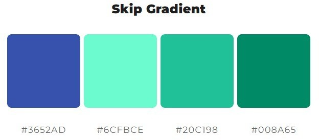

---

### **Tipografía**

Nuestra selección tipográfica fue pensada para combinar modernidad, elegancia y legibilidad, asegurando una comunicación clara y atractiva.

| **Tipografía** | **Descripción**                                                                                                                                                                   |
| -------------- | --------------------------------------------------------------------------------------------------------------------------------------------------------------------------------- |
| **Poppins**    | Tipografía moderna y limpia, de estilo geométrico, ideal para transmitir profesionalismo y eficiencia. Su excelente legibilidad la hace perfecta para interfaces intuitivas.      |
| **Lora**       | Tipografía serif elegante y tradicional, que aporta un toque de prestigio. Su combinación con Poppins equilibra lo contemporáneo con la confianza y seriedad del sector benéfico. |

<br>
<center>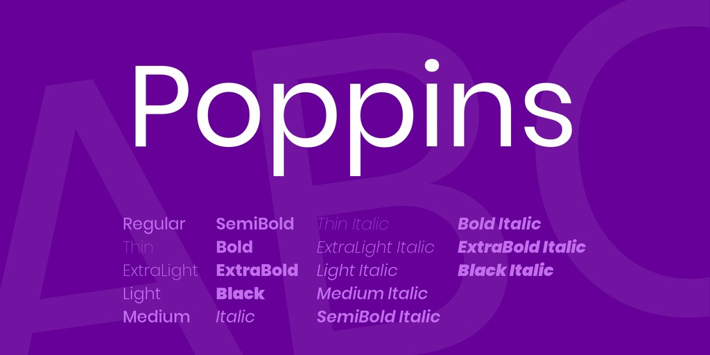</center>
<center><br><br></center>

---

### **Branding**

El logotipo de AidManager representa a una figura vista desde arriba, con los brazos abiertos, en tonos verde-azulados. Este diseño simboliza **apertura, apoyo y generosidad**, valores centrales de nuestra startup.

Nuestra identidad visual transmite:

- **Solidaridad** hacia las comunidades necesitadas.
- **Esperanza** para quienes buscan ayuda.
- **Renovación** a través de soluciones tecnológicas accesibles.

El logo actúa como un emblema de nuestro compromiso con la ayuda directa, fomentando un entorno de colaboración y empatía.

<br>
<center><br><br></center>

### 4.1.2. Web Style Guidelines

Descripción de los elementos que se utilizaran en el web app

**Background:** (primary, secondary, terniary)

Para el background se hace uso del color FFFFF para resaltar la pagina y para separar secciones D9ED8F
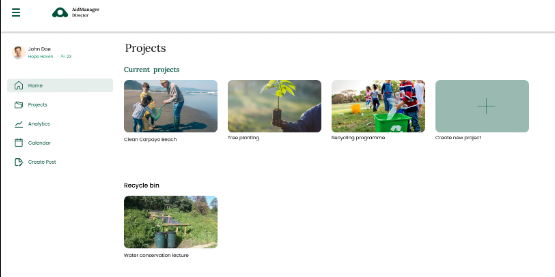

**Text Styles:** (H1, H2, p, a,)

Para el texto se escogieron colores que combinan con la temática de la pagina y que facilitan la lectura del usuario

<center>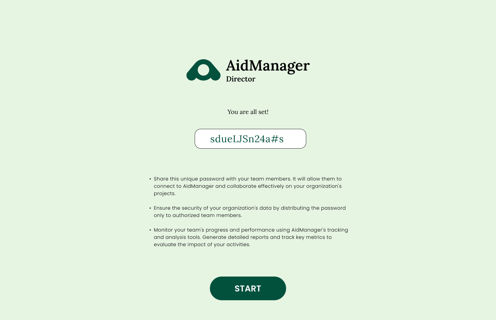</center>

**Button Styles:** (Button, dropdowns, Switches)

Para los botones el color cambia según el color del fondo

<center></center>

**Icons:** (Fondo blanco con los iconos que vamos a usar)
Tendremos iconografía de búsqueda, lápiz, ropa, reciclaje, icono de gráfico, foco, etc

<center></center>

**Misc**
Se determina el color y posición según la sección

<center>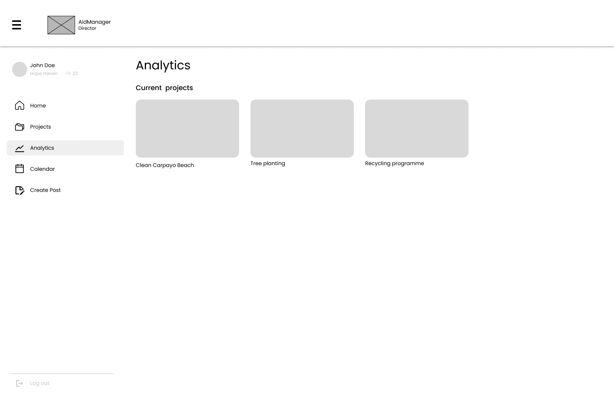</center>

Se muestra un style guidelines general que engloba la mayoría de diseño:

<center>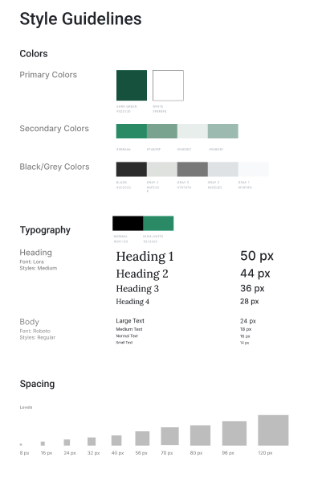</center>

### 4.1.3. Mobile Style Guidelines

Asimismo como hicimos con el web Style Guidelines seguimos un approach parecido para ambos dispositivos android y iOS

En el caso de iOS nos enfocamos en mantener una persistencia de diseño para que existan muchas diferencias con la contraparte de android.

#### 4.1.3.1. iOS Mobile Style Guidelines

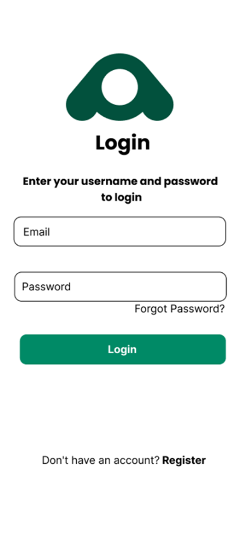


#### 4.1.3.2. Android Mobile Style Guidelines

#### 4.1.3.2.	Android Mobile Style Guidelines

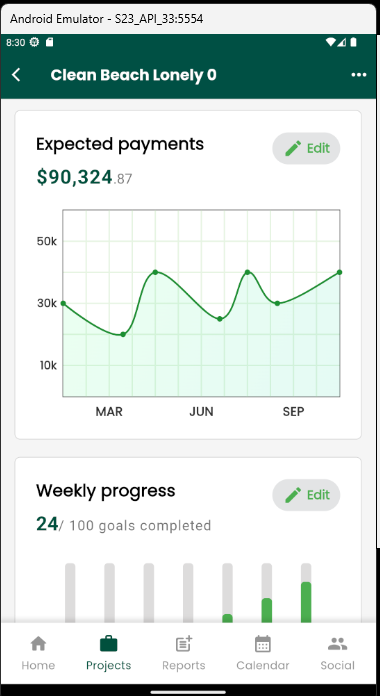


## 4.2. Information Architecture

Esta sección define cómo se organiza y estructura la **navegación** dentro de la aplicación móvil AidManager, facilitando la experiencia del usuario a través de un flujo intuitivo y eficiente.

---

### 4.2.1. Organization System

El sistema de organización se basa en un **flujo secuencial**, guiando al usuario paso a paso a través de las funcionalidades principales de la aplicación para lograr sus objetivos.

- Los usuarios siguen un **workflow estructurado**, pero también disponen de **accesos directos** para navegar rápidamente entre secciones.
- Se implementa una **jerarquía visual diferenciada** según el tipo de usuario:
  - **Gestores de proyecto**: Acceso prioritario a herramientas de gestión y supervisión.
  - **Miembros de equipo**: Acceso centrado en tareas asignadas y comunicación.

---

### 4.2.2. Labelling System

El sistema de etiquetado está diseñado para ser **claro y directo**, facilitando la comprensión de la aplicación.

- Los principales **labels** o etiquetas de navegación son:
  - **Home**
  - **Projects**
  - **Community**
  - **Profile**

Estos términos fueron seleccionados para representar de forma concisa las funciones clave, asegurando que los usuarios puedan identificar rápidamente las secciones más relevantes.

---

### 4.2.3. SEO and Meta Tags

Meta & SEO (Search Engine Optimization) Tags: sirven para que la página web donde promocionamos la aplicación sea encontrada fácilmente es lo que sale al encontrar la página en el buscador (se ponen en el <"head"> de la landing page o en la página store)
Título:

```
 <title> AidManager | La mejor opción de ONG para la gestión de proyectos </title>

```

Descripción:

```
 <meta name = "description" content = "Gestiona, Recolecta, Analiza y Visualiza los datos y colaboradores de tus proyectos todo en un solo lugar."/>

```

Palabras Clave:

```
 <meta name = "keyword" content = "ONG gestión, Gestionar Proyecto, ONG, dar Tareas, análisis de datos, Organizar, Orden "/>

```

### 4.2.4. Searching Systems

**¿Que se busca?:** El usuario busca su proyecto para gestionar. **¿Qué resultados se mostrarán?:** Se debe de mostrar cards y entre ellas el proyecto que está revisando.<br>

**Interfaz de búsqueda:** El dashboard muestra en el sidebar las secciones una vez se selecciona la sección de proyectos se mostrarán las cards con sus proyectos, el usuario selecciona el proyecto específico y se hacen las redirecciones a su proyecto para gestionar específicas.

### 4.2.5. Navigation Systems

La navegación de la Mobile App se estará basando en un Sistema de navegación Global donde por medio de las cards en el dashboard o los labels en el side-bar e incluso el bottom-nav. el usuario se redirija a la sección seleccionada. Asimismo, se usa la navegación local para ver información dedicada a las secciones.

## 4.3. Landing Page UI Design

Esta sección está orientada a mostrar el diseño de nuestra landing page la cual es necesaria para presentarnos y promover nuestro producto a los usuarios.

### 4.3.1. Landing Page Wireframe

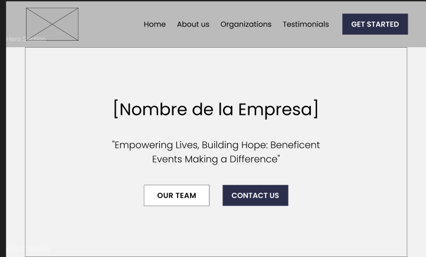
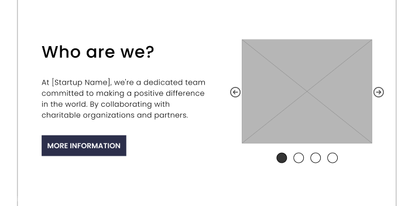
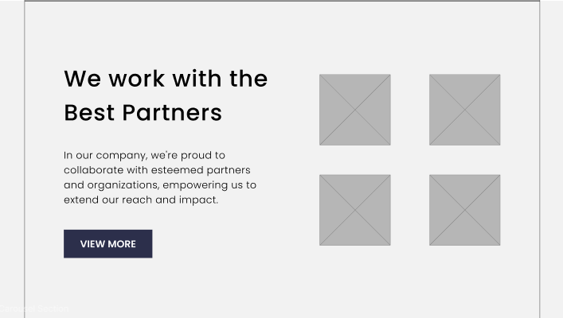
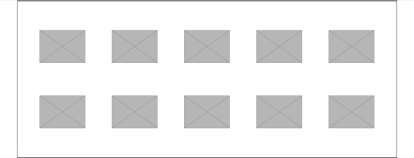
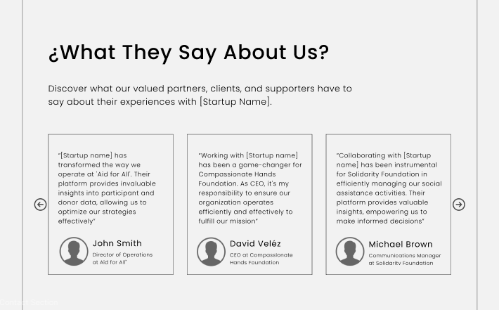
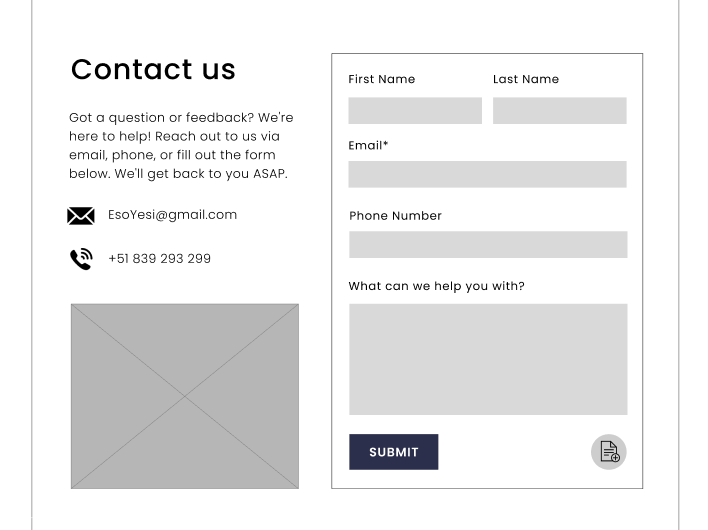
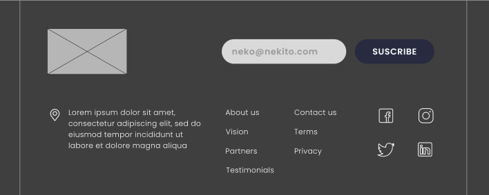

### 4.3.2. Landing Page Mock-up

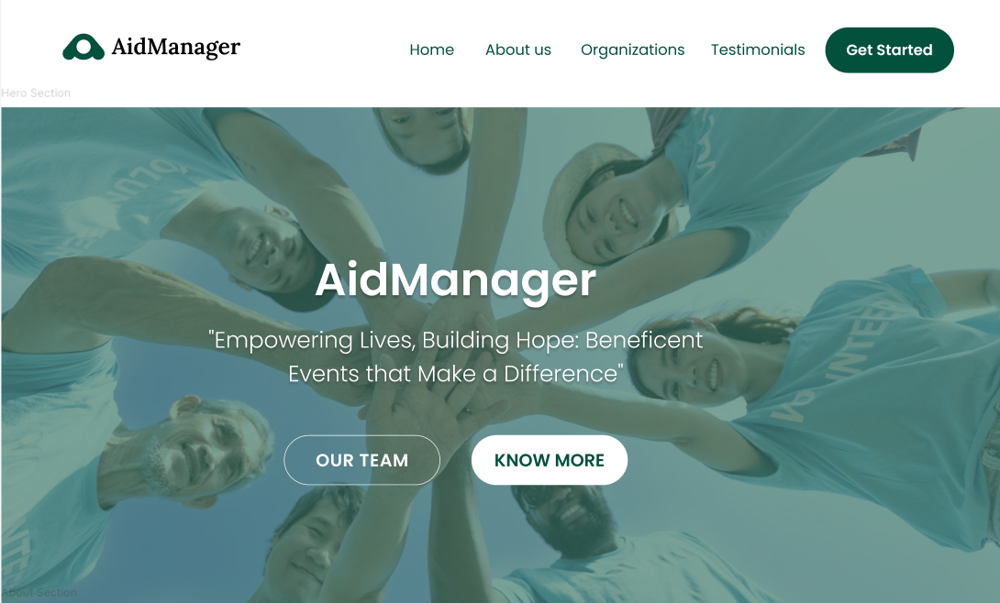
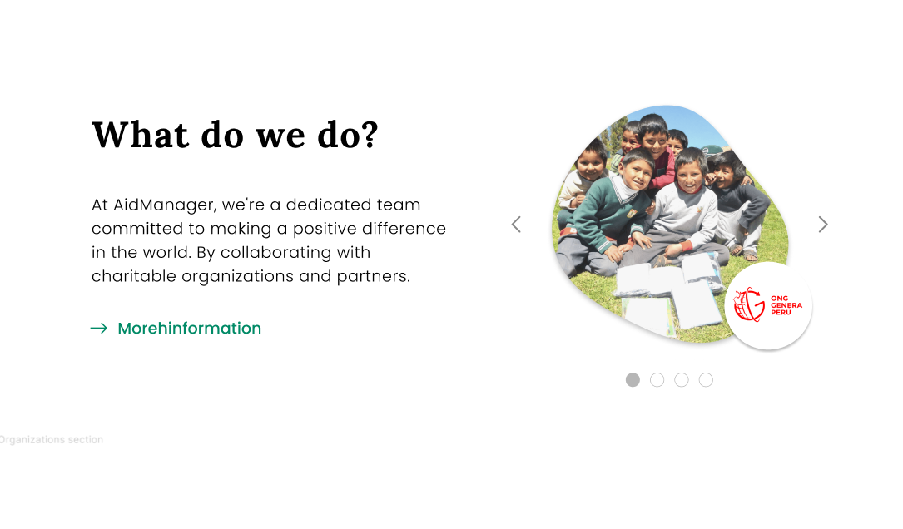
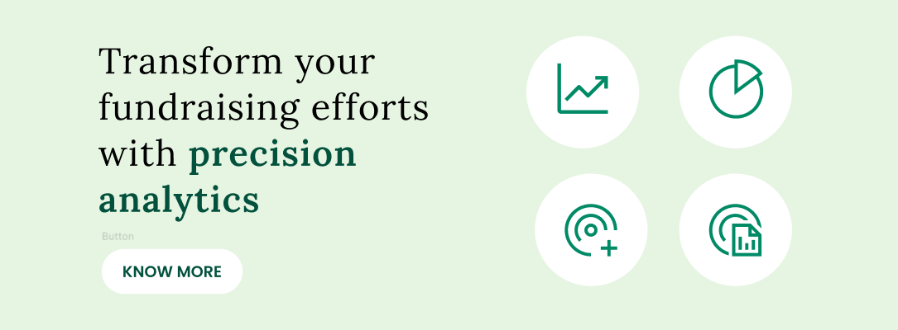
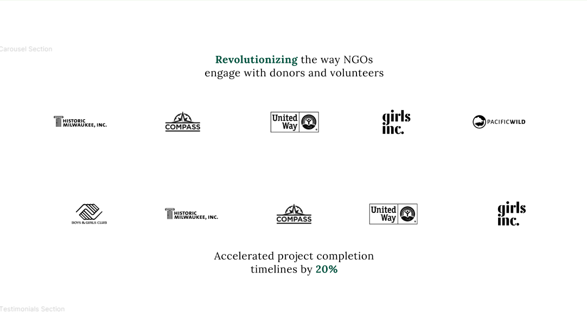
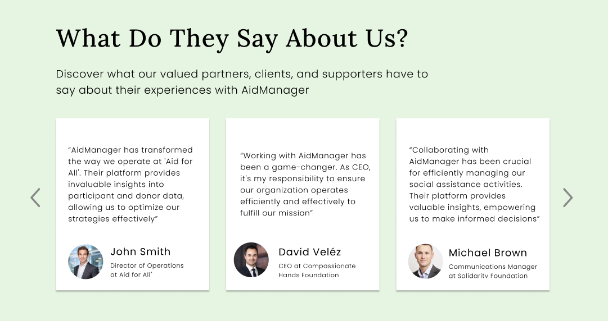
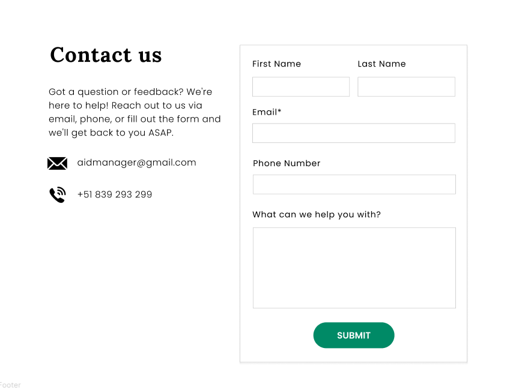
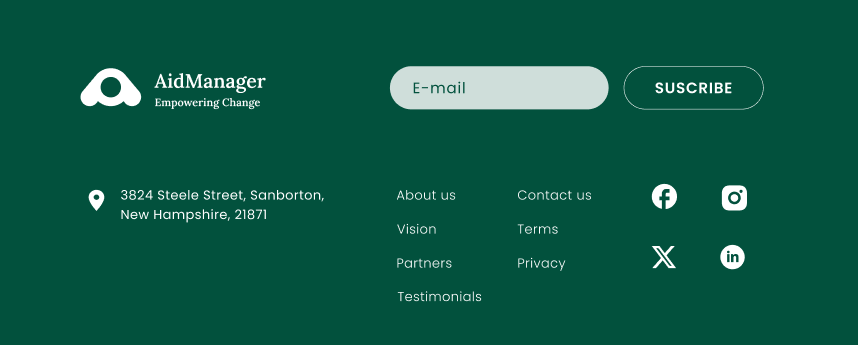

## 4.4. Mobile Applications UX/UI Design

Aquí nos enfocamos en mostrar el diseño de nuestra solución móvil.

#### 4.4.1. Mobile Application Wireframe

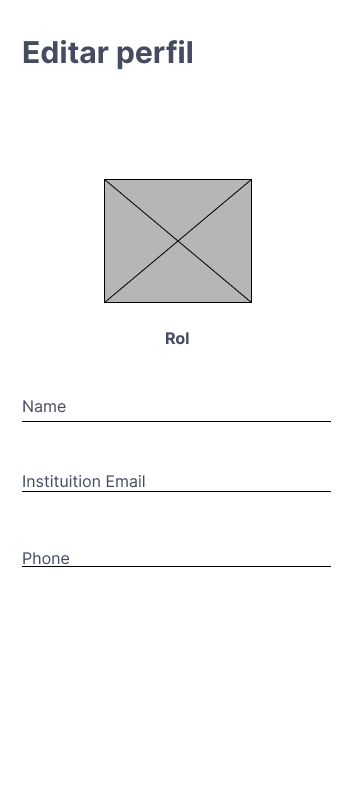
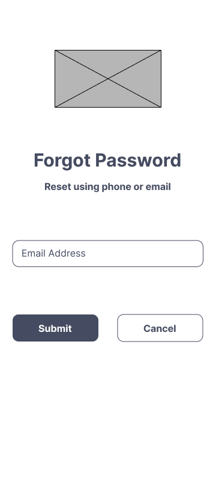
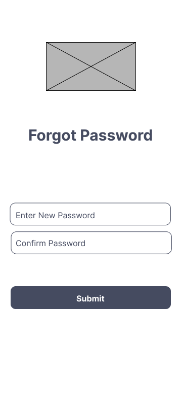
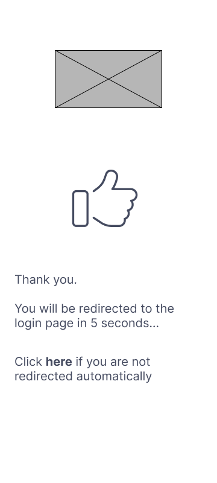
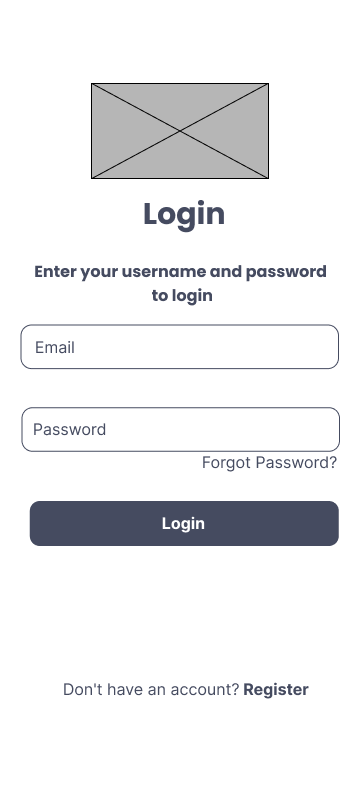
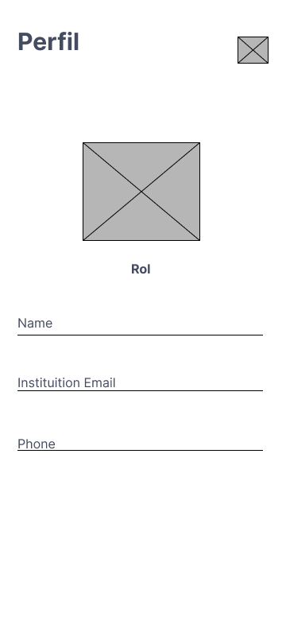
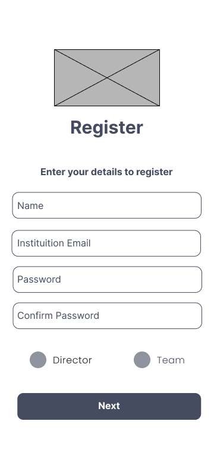
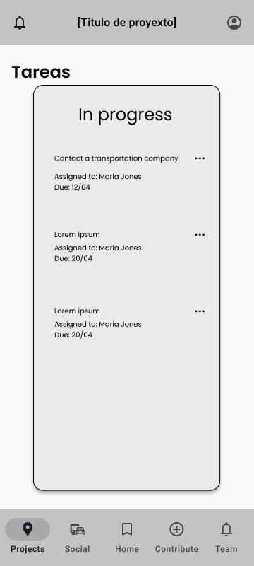
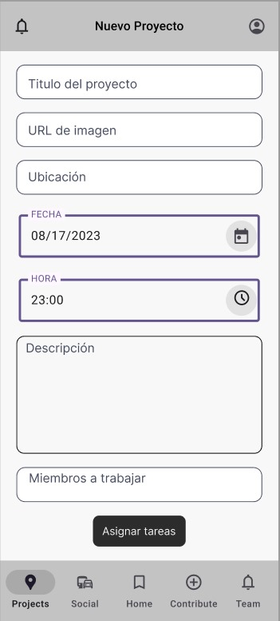
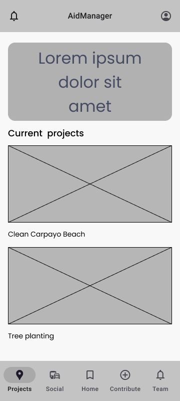
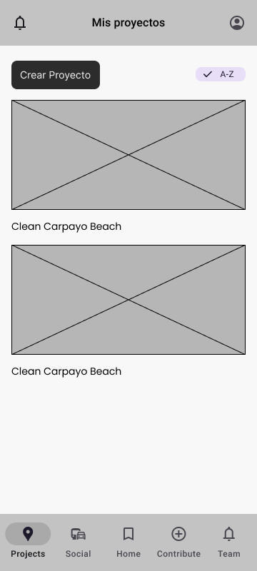


### 4.4.2. Mobile Application Wireflow Diagram

Gestor de Proyectos necesita ver el listado de proyectos y las tareas asignadas a estos.<br>


Como Gestor quiero recibir notificaciones sobre nuevos proyectos o actualizaciones de los existentes<br>


Gestor Crea un nuevo proyecto asignado a las tareas a los integrantes<br>


Como gestor de proyectos deseo revisar la información del trabajo realizado y exportar la información.<br>


Como gestor de proyecto deseo agregar un post para mi equipo pueda ver y reaccionar<br>


Como miembro de equipo deseo ver las tareas asignadas y las métricas del grupo.<br>


### 4.4.3. Mobile Application Mock-ups


### 4.4.4. Mobile Application Userflow Diagram


## 4.5. Mobile Application Prototyping

### 4.5.1. Android Mobile Applications Prototyping


### 4.5.2. iOS Mobile Applications Prototyping


## 4.6 Web Applications UX/UI Design

### 4.6.1. Web Applications Wireframes
</br>

**Segmento 1: Manager de ONG**

<center></center>
<center></center>
<center></center>
<center></center>
<center></center>
<center></center>
<center></center>
<center></center>
<center></center>
<center></center>
<center></center>
<center></center>
<center></center>

**Segmento 2: Equipo de ONG**

<center></center>
<center></center>
<center></center>
<center></center>
<center></center>
<center></center>
<center></center>
<center></center>
<center></center>
<center></center>
<center></center>

### 4.6.2. Web Applications Wireflow Diagrams.


### 4.6.3. Web Applications Mock-ups.

</br>


**Segmento 1: Manager de ONG**

<center></center>
<center></center>
<center></center>
<center></center>
<center></center>
<center></center>
<center></center>
<center></center>
<center></center>
<center></center>
<center></center>
<center></center>
<center></center>
<center></center>

**Segmento 2: Equipo de ONG**

<center></center>
<center></center>
<center></center>
<center></center>
<center></center>
<center></center>
<center></center>
<center></center>
<center></center>
<center></center>
<center></center>

### 4.6.4. Web Applications UserFlow Diagrams.


## 4.7. Mobile Application Prototyping

Para el desarrollo de los prototipos de la **interfaz móvil** de AidManager, se aplicaron criterios fundamentales que aseguran una experiencia de usuario óptima y adaptada a las necesidades del segmento objetivo.

---

### **Criterios de Diseño Aplicados:**

- **Claridad y Facilidad de Uso:**  
  Se priorizó una navegación **intuitiva y comprensible**, permitiendo a los usuarios entender de forma clara las funciones disponibles. La interfaz facilita la visualización de reportes estadísticos y tareas asignadas de manera eficiente.

- **Diseño Responsive:**  
  Se garantizó la compatibilidad con diversos tamaños de pantalla, asegurando que la aplicación funcione correctamente en cualquier dispositivo móvil, sin comprometer la usabilidad ni la estética.

- **Priorización de Información Relevante:**  
  El diseño destaca únicamente la información más relevante para los usuarios, permitiendo una interacción directa con las funcionalidades clave, evitando sobrecargas visuales y distracciones.

---

### **Vista del Prototipo:**


---

### **Prototipo Interactivo en Figma:**

[Ver Prototipo en Figma](https://www.figma.com/proto/I9eSDqC0GqeOs3fNvBbJAv/AidManager-app-web-Wireframe--Copy-?node-id=2301-10003&starting-point-node-id=2139%3A128776&t=5t7TF9vFAZDk7V2n-1)

---

### **Video del Prototipo Funcional:**

[Ver Video del Prototipo](<[https://upcedupe-my.sharepoint.com/:v:/g/personal/u202211894_upc_edu_pe/Ec5ztdvdCSNBsrwPHs9oaPwBUkfUaqyH38pDoOj_rVYPTg?e=nVMy6P&nav=eyJyZWZlcnJhbEluZm8iOnsicmVmZXJyYWxBcHAiOiJTdHJlYW1XZWJBcHAiLCJyZWZlcnJhbFZpZXciOiJTaGFyZURpYWxvZy1MaW5rIiwicmVmZXJyYWxBcHBQbGF0Zm9ybSI6IldlYiIsInJlZmVycmFsTW9kZSI6InZpZXcifX0%3D](https://upcedupe-my.sharepoint.com/:v:/g/personal/u202214784_upc_edu_pe/EXgxC3tcw85KkDGyOHjqfHIBSMt5Gqac3dwT7y5jJECUqQ?e=gKw15Z&nav=eyJyZWZlcnJhbEluZm8iOnsicmVmZXJyYWxBcHAiOiJTdHJlYW1XZWJBcHAiLCJyZWZlcnJhbFZpZXciOiJTaGFyZURpYWxvZy1MaW5rIiwicmVmZXJyYWxBcHBQbGF0Zm9ybSI6IldlYiIsInJlZmVycmFsTW9kZSI6InZpZXcifX0%3D)>)

---

### 4.8.1. Software Architecture – Context Level Diagram

El **Context Level Diagram** proporciona una visión general de alto nivel del sistema AidManager. Define cómo interactúa con usuarios externos (actores) y otros sistemas, estableciendo sus límites y relaciones clave.


---

### 4.8.2. Software Architecture – Container Level Diagram

El **Container Level Diagram** descompone el sistema en contenedores, tales como aplicaciones, bases de datos y servicios, mostrando cómo cada uno colabora para cumplir con los objetivos del sistema. Este nivel detalla las tecnologías utilizadas y sus responsabilidades principales.


---

### 4.8.3. Software Architecture – Component Level Diagram

El **Component Level Diagram** explora la estructura interna de cada contenedor, detallando los componentes clave y sus interacciones. Esto permite entender cómo se organiza y distribuye la funcionalidad dentro del sistema.

---

  
  
  
  


## 4.9. Software Object-Oriented Design

### 4.9.1. Class Diagrams

A continuación, se presenta el **Diagrama de Clases** del sistema AidManager, donde se visualizan las entidades clave, sus atributos, métodos y relaciones entre clases.


---

### 4.9.2. Class Dictionary

En esta sección se detallan las **clases principales** que conforman la arquitectura orientada a objetos del sistema:

| **Clase**          | **Descripción**                                                                                                                                                                    |
| ------------------ | ---------------------------------------------------------------------------------------------------------------------------------------------------------------------------------- |
| **User**           | Representa a los usuarios registrados en la plataforma, tanto **gestores** como **miembros de equipo**. Incluye métodos para gestionar cuentas, autenticación y datos de contacto. |
| **ProjectManager** | Clase específica para los **gestores de proyectos**. Contiene métodos para planificar, asignar tareas y supervisar proyectos.                                                      |
| **Assistant**      | Representa a los **asistentes** que colaboran en eventos y proyectos. Incluye atributos relacionados con su rol operativo y tareas asignadas.                                      |
| **Project**        | Define los **proyectos** gestionados en la plataforma. Contiene atributos como nombre, descripción, estado y métodos para actualizar su progreso.                                  |

---

Estas clases forman la base de la lógica de negocio de AidManager, facilitando la gestión eficiente de los elementos clave dentro de la aplicación.

## 4.10. Database Diagram

### 4.10.1. Relational/Non-Relational Database Diagram

A continuación se presenta el **Diagrama de Base de Datos** que respalda el funcionamiento de AidManager. Este diagrama muestra las entidades principales, sus relaciones y cómo se estructura la información clave para la gestión de proyectos, usuarios y tareas dentro del sistema.


Este diseño permite:

- Una gestión eficiente de **usuarios**, diferenciando gestores y asistentes.
- Registro y seguimiento detallado de **proyectos** y **tareas**.
- Integración con funciones como control de fechas, estadísticas y comunicación interna.

El modelo relacional asegura la **integridad de los datos** y la escalabilidad del sistema conforme crezcan las operaciones de la organización.

# Capítulo V: Product Implementation

## 5.1. Software Configuration Management

### 5.1.1. Software Development Environment Configuration

A continuación, se detallan las herramientas y entornos utilizados durante el desarrollo y despliegue de AidManager:

---

#### **Figma – Prototipado UX/UI**

- **Herramienta:** Figma
- **Propósito:** Figma fue la plataforma utilizada para el diseño visual de la aplicación, permitiéndonos crear:
  - **Wireframes** (bocetos de estructura de la app).
  - **Mock-ups** (diseños visuales detallados).
  - Prototipos interactivos tanto para **aplicaciones web como móviles**.

Figma es una herramienta colaborativa basada en la nube, ampliamente usada en el diseño de interfaces UX/UI, lo que facilitó la visualización y validación temprana de la experiencia de usuario.

- **Enlace al Prototipo Figma:**  
  [Ver Prototipo](https://www.figma.com/proto/I9eSDqC0GqeOs3fNvBbJAv/AidManager-app-web-Wireframe--Copy-?node-id=2301-10003&starting-point-node-id=2139%3A128776&t=5t7TF9vFAZDk7V2n-1)

---

#### **Software Deployment – Vercel**

- **Herramienta:** Vercel
- **Propósito:** Vercel se utilizó para el **despliegue de la Landing Page** de AidManager. Esta herramienta permite realizar despliegues rápidos y eficientes de aplicaciones web, facilitando la visualización de la versión online del proyecto.

- **Enlace al Despliegue:**  
  :

---

### Beneficios de esta configuración:

- Facilita la **colaboración remota** del equipo de diseño y desarrollo.
- Permite iterar rápidamente sobre la interfaz con herramientas visuales.
- Despliegue ágil de versiones funcionales accesibles desde cualquier dispositivo.

### 5.1.2. Source Code Management

Para la gestión del código fuente del proyecto **AidManager**, se utilizará un sistema de control de versiones basado en **Git**, facilitando el seguimiento de cambios, la colaboración del equipo y la integración continua de nuevas funcionalidades.

---

#### **Repositorio GitHub**

- **Landing Page:**  
  El código correspondiente a la Landing Page será gestionado en un repositorio específico en GitHub.

  - **Repositorio:** https://github.com/AidManager/AidManager-LandingPage

- **Product Implementation:**  
  El desarrollo completo de la aplicación se manejará en otro repositorio dedicado a la implementación del producto final.
  - **Repositorio:** https://github.com/AidManager/MobileApp

---

#### **Workflow: GitFlow**

Se adoptará **GitFlow** como metodología de control de versiones, permitiendo una organización clara del desarrollo mediante ramas principales y de apoyo.

---

##### **Ramas Principales:**

- **Main:**  
  Contiene el código **estable y listo para producción**. Toda versión oficial del proyecto se consolidará aquí.

- **Develop:**  
  Rama dedicada a integrar los **últimos cambios en desarrollo** antes de ser considerados para una nueva versión.

---

##### **Ramas de Desarrollo:**

- **Feature:**
  - Se crea desde **Develop**.
  - Se utiliza para el desarrollo de nuevas funcionalidades.
  - Una vez completada y probada, se fusiona nuevamente a **Develop** y se elimina.

---

##### **Ramas de Apoyo:**

- **Release:**

  - Nace desde **Develop**.
  - Sirve para la preparación de una nueva **versión estable**, enfocándose en la corrección de errores y ajustes menores.
  - Se fusiona tanto en **Main** como en **Develop** al finalizar.

- **Hotfix:**
  - Se crea desde **Main**.
  - Se utiliza para solucionar **problemas críticos** detectados en producción.
  - Se fusiona tanto en **Main** como en **Develop** una vez corregidos los errores.

---

### **Beneficios de GitFlow:**

- Facilita el **trabajo colaborativo** y paralelo.
- Permite una clara separación entre **desarrollo**, **pruebas** y **producción**.
- Mejora la gestión de versiones y la **entrega continua**.

### 5.1.3. Source Code Style Guide & Conventions

Para asegurar la consistencia y legibilidad del código en todo el proyecto AidManager, se adoptaron guías de estilo reconocidas y ampliamente aceptadas:

---

#### **HTML & CSS – Google HTML/CSS Style Guide**

- El tipo de documento debe especificarse al principio mediante meta tags.
- El elemento `<title>` debe estar dentro del `<head>`.
- **Sangría:** 2 espacios por nivel.
- Uso de **minúsculas** en elementos HTML, atributos, propiedades CSS y selectores.
- Atributos HTML siempre entre **comillas dobles**.
- Todos los elementos HTML deben tener su **etiqueta de cierre**.
- Evitar líneas de código excesivamente largas.
- Siempre especificar el **ancho**, **alto** y atributo **alt** en imágenes.

---

#### **JavaScript – Google JavaScript Style Guide**

- Terminar cada línea con un **punto y coma**.
- Uso de **camelCase** para nombres de variables y funciones.
- Valores de cadenas entre **comillas simples** (' ').
- Declaraciones agrupadas y claras, con funciones bien delimitadas y comentarios breves cuando sea necesario.

---

#### **Java – Google Java Style Guide**

- Nombres de paquetes en **minúsculas**.
- **Clases** con nombres en **UpperCamelCase**.
- **Métodos** y **variables** en **camelCase**.
- Coincidencia entre el nombre del archivo `.java` y la clase contenida.
- Sangría consistente (2 o 4 espacios según convención del equipo).
- Saltos de línea después de cada declaración para mejorar la legibilidad.
- Dividir líneas largas de más de 100 caracteres de manera lógica.

---

### 5.1.4. Software Deployment Configuration

La configuración del despliegue de AidManager se basa en herramientas modernas que permiten una gestión eficiente del código y una implementación ágil.

---

#### **GitHub – Control de Versiones y Flujo de Trabajo**

- Utilizamos **GitHub** como plataforma principal de versionado.
- Aplicamos la metodología **GitFlow**, garantizando:
  - Un flujo de trabajo ordenado.
  - Ramas específicas para desarrollo, lanzamientos y correcciones.
  - Revisión continua y controlada del código.

---

#### **Vercel – Despliegue Web**

- **Vercel** se emplea para el despliegue de la **Landing Page** y futuras versiones de la aplicación.
- Ideal para aplicaciones web **estáticas** o con interacciones mínimas.
- Permite un despliegue rápido y escalable, integrándose directamente con GitHub para **implementación automática** tras cada push a ramas configuradas.

---

### Beneficios:

- Control detallado del **código fuente** con un estilo uniforme.
- Flujo de trabajo ágil y seguro mediante GitHub y GitFlow.
- Despliegue automatizado y accesible con Vercel, facilitando el acceso a versiones actualizadas del producto.

## 5.2. Software Implementation & Deployment

### 5.2.1. Sprint Backlogs

| Id   | Title     | Id  | Title                                                                      | Description                                             | Estimations (Hours) | Assigned To             | Status |
| ---- | --------- | --- | -------------------------------------------------------------------------- | ------------------------------------------------------- | ------------------- | ----------------------- | ------ |
| CC01 | Projects  | C01 | Correciones y Conexion de bounded context de Projects                      | Correciones de la API y Front End, Asimismo conectarlos | 2                   | Piero Periche Quiroga   | Done   |
| CC02 | Teams     | C02 | Correciones y Conexion de bounded context de Teams                         | Correciones de la API y Front End, Asimismo conectarlos | 2                   | Piero Periche Quiroga   | Done   |
| CC03 | Tasks     | C03 | Correciones y Conexion de bounded context de Tasks                         | Correciones de la API y Front End, Asimismo conectarlos | 2                   | Diego Portales Ortiz    | Done   |
| CC04 | Dashboard | C04 | Correciones y Conexion de bounded context para los Dashboards de Analytics | Correciones de la API y Front End, Asimismo conectarlos | 3                   | Diego Portales Ortiz    | Done   |
| CC05 | Home      | C05 | Correciones y Conexion de bounded context relacionado a Home               | Correciones de la API y Front End, Asimismo conectarlos | 2                   | Fabiola Espinoza Inoñan | Done   |
| CC06 | Calendar  | C06 | Correciones y Conexion de bounded context relacionado con Calendar         | Correciones de la API y Front End, Asimismo conectarlos | 3                   | Fabiola Espinoza Inoñan | Done   |
| CC07 | Analytics | C07 | Correciones y Conexion de bounded context Analytics                        | Correciones de la API y Front End, Asimismo conectarlos | 2                   | Ricardo Barrutia Vaez   | Done   |
| CC08 | Users     | C08 | Correciones y Conexion de bounded context relacionado a los usuarios       | Correciones de la API y Front End, Asimismo conectarlos | 3                   | Ricardo Barrutia Vaez   | Done   |

### 5.2.2. Implemented Landing Page Evidence

Se presenta la implementación de la landing page
Los botones call to action funcionales y redirigiendo a los enlaces requeridos en el contexto de nuestra aplicación.

<center></center>

### 5.2.3. Implemented Frontend-Web Application Evidence

Se presenta la implementación de la aplicación Front End, en esta entrega se dejaron las funcionalidades de manera optima mas la conexión de base de datos requiere cambios.

<center></center>

### 5.2.4. Acuerdo de Servicio - SaaS

El presente **Acuerdo de Servicio** regula los términos y condiciones bajo los cuales los usuarios acceden y utilizan la plataforma **AidRecruits**, una solución SaaS (Software as a Service) desarrollada para mejorar la gestión de proyectos en organizaciones sin fines de lucro en el Perú.

Este acuerdo se incorpora como parte integral de los "Términos y Condiciones" disponibles públicamente en el sitio web de AidRecruits, y su aceptación es obligatoria para completar el registro y uso de la plataforma.

---

#### 1. Definiciones

- **"Plataforma"**: Aplicación móvil y/o web conocida como AidRecruits, operada por el equipo de desarrollo de AidRecruits.
- **"Usuario"**: Persona natural o jurídica que accede o utiliza la plataforma, sea en calidad de gestor de proyectos, ayudante, colaborador o invitado.
- **"ONG"**: Organización no gubernamental registrada que hace uso de la plataforma.
- **"Cuenta"**: Perfil de acceso individual asignado a cada usuario dentro de una organización.
- **"Plan"**: Modalidad de suscripción elegida por la ONG, según número de cuentas y duración (mensual o anual).

---

#### 2. Objeto del Acuerdo

AidRecruits concede al usuario una **licencia limitada, no exclusiva, intransferible y revocable** para utilizar la plataforma, exclusivamente con fines de gestión interna de proyectos sociales.

---

#### 3. Registro y Acceso

- El uso de la plataforma requiere la **creación de una cuenta** mediante un formulario de registro o código de organización provisto por un gestor.
- Cada usuario es responsable de la **confidencialidad de sus credenciales** y del uso que se haga bajo su sesión.
- AidRecruits se reserva el derecho de **suspender o eliminar cuentas** que infrinjan este acuerdo o que realicen usos no autorizados.

---

#### 4. Tarifas y Planes

- La plataforma opera bajo un modelo de **suscripción** que varía en función del número de cuentas activas y del periodo contratado (mensual o anual).
- AidRecruits podrá ofrecer **descuentos u opciones gratuitas promocionales**, a discreción del equipo, por tiempo limitado.
- Las suscripciones se **renuevan automáticamente**, salvo que el usuario manifieste su voluntad de cancelación antes del vencimiento del periodo actual.
- En caso de impago o rechazo del método de pago, AidRecruits se reserva el derecho de **suspender temporalmente el servicio** hasta regularización.

---

#### 5. Propiedad Intelectual

- Todos los derechos sobre la plataforma, su código fuente, diseño, marcas y funcionalidades pertenecen exclusivamente a **AidRecruits**.
- El usuario no podrá copiar, distribuir, descompilar, modificar ni revender ningún componente de la plataforma, salvo autorización expresa.

---

#### 6. Uso Aceptable

Queda expresamente prohibido:

- Utilizar la plataforma con fines ilegales o no éticos.
- Compartir credenciales o permitir el acceso a terceros no autorizados.
- Cargar contenido que infrinja derechos de autor, privacidad o confidencialidad.
- Interferir con la operación técnica de la plataforma.

---

#### 7. Protección de Datos y Privacidad

AidRecruits garantiza el cumplimiento de la **Ley N.º 29733 - Ley de Protección de Datos Personales** del Perú. En ese sentido:

- Los datos personales proporcionados serán usados únicamente para fines operativos de la plataforma.
- Los usuarios tienen derecho a **acceder, rectificar, actualizar o suprimir sus datos personales**, mediante solicitud escrita.
- AidRecruits emplea medidas de seguridad técnicas y organizativas adecuadas para proteger la confidencialidad de los datos.

---

#### 8. Disponibilidad del Servicio

- AidRecruits procura una **alta disponibilidad** del servicio, aunque no garantiza continuidad absoluta, ya que pueden existir interrupciones por mantenimiento programado o causas externas.
- En caso de interrupciones prolongadas, el equipo podrá ofrecer compensaciones proporcionales en el siguiente periodo de suscripción.

---

#### 9. Limitación de Responsabilidad

- AidRecruits no se responsabiliza por pérdidas indirectas, interrupciones por causas externas, ni por decisiones tomadas en base a datos gestionados por la plataforma.
- El uso del sistema es responsabilidad del usuario, quien acepta asumir los riesgos asociados a su operación.

---

#### 10. Modificaciones del Acuerdo

AidRecruits podrá actualizar este acuerdo cuando lo estime conveniente. En tal caso, notificará a los usuarios registrados con al menos **5 días de anticipación**. La continuidad en el uso de la plataforma implica la aceptación de las nuevas condiciones.

---

#### 11. Ley Aplicable y Jurisdicción

Este acuerdo se rige por las leyes de la **República del Perú**. En caso de controversia, ambas partes se someten a la jurisdicción de los juzgados y tribunales de **Lima Metropolitana**, con renuncia expresa a cualquier otro fuero.

### 5.2.5. Implemented Native-Mobile Application Evidence

Se presenta la implementación de la aplicación móvil, en esta entrega se puede considerar la implementación mas completa.

### 5.2.6. Implemented RESTful API and/or Serverless Backend Evidence

Se presenta la implementación de la aplicación back end, se toma en cuenta también la base de datos en un servicio cloud.

Primero que nada evidencias del funcionamiento en swagger

<center></center>

Como es TB1, no se llegó a realizar el despliegue en un servicio cloud, pero se tiene la evidencia de que la API funciona correctamente en el entorno local.

### 5.2.7. RESTful API documentation

Se presenta la documentación de la API mencionando los endpoints que tiene.

#### Analytics

```
GET
/api/v1/projects/{projectId}/analytics
Get Analytics by Project Id

PATCH
/api/v1/projects/{projectId}/analytics/lines
Update BarData

PATCH
/api/v1/projects/{projectId}/analytics/bardata
Update LineBarData


PATCH
/api/v1/projects/{projectId}/analytics/tasks


PATCH
/api/v1/projects/{projectId}/analytics/progressbar


PATCH
/api/v1/projects/{projectId}/analytics/status


GET
/api/v1/analytics-by-company/{companyId}
Get Analytics by Company Id

```

#### Authentication

```


POST
/api/v1/authentication/sign-in
SignIn

```

#### Comments

```
POST
/api/v1/posts/{postId}/comments
Post comment


GET
/api/v1/posts/{postId}/comments
Get comments


DELETE
/api/v1/posts/{postId}/comments/{commentId}
Delete comment


GET
/api/v1/posts/{postId}/comments/{commentId}
Get a specific comment


GET
/api/v1/comments/user/{userId}
Get comments by User Id
```

#### Company

```

GET
/api/v1/company/{companyId}
Get Company by Id


PUT
/api/v1/company/{companyId}
Update Company
```

#### Events

```
POST
/api/v1/events


GET
/api/v1/events


GET
/api/v1/events/{projectId}


PUT
/api/v1/events/{eventId}


DELETE
/api/v1/events/{eventId}

```

#### PaymentDetail

```

POST
/api/v1/payment-detail


GET
/api/v1/payment-detail/{id}

```

#### PostInteraction

```

POST
/api/v1/posts/post-interaction
Add Favorite Post


DELETE
/api/v1/posts/post-interaction
Remove favorite post


GET
/api/v1/posts/post-interaction/user/{userId}
Get all favorite posts by user id
```

#### Posts

```
POST
/api/v1/posts
Create a new post


PUT
/api/v1/posts/{id}/update/{userId}/company/{companyId}
Update post by id


PATCH
/api/v1/posts/{id}/rating/{userId}
Update rating field of post by id


GET
/api/v1/posts/{id}
Get post by id


DELETE
/api/v1/posts/{id}
Delete post by id


GET
/api/v1/posts/company/{companyId}
Get all posts by company id


GET
/api/v1/posts/user/{userId}
Get all posts by author/user id


GET
/api/v1/posts/liked/{userId}
Get all liked posts by user id
```

#### Projects

```
POST
/api/v1/projects
Creates a Project


PUT
/api/v1/projects/{projectId}
Update project


PATCH
/api/v1/projects/{projectId}
Update project rating


DELETE
/api/v1/projects/{projectId}
Delete project


GET
/api/v1/projects/{companyId}
Get All Projects


GET
/api/v1/projects/get/{projectId}
Get Project


PATCH
/api/v1/projects/{projectId}/images
Update a project Images


GET
/api/v1/projects/team/{projectId}
Get all project Team Members


GET
/api/v1/projects/user/{userId}
Get all projects by user


POST
/api/v1/projects/favorite
Save project as favorite


DELETE
/api/v1/projects/favorite
Delete project from favorite


GET
/api/v1/projects/favorite/{userId}
Get all favorite projects by user

```

#### TaskItems

```

POST
/api/v1/projects/{projectId}/task-items
Creates a Task


GET
/api/v1/projects/{projectId}/task-items/{id}
Get a Task by Id


PATCH
/api/v1/projects/{projectId}/task-items/{id}
Change Status


DELETE
/api/v1/projects/{projectId}/task-items/{id}
Deletes a Task


PUT
/api/v1/projects/{projectId}/task-items/edit/{id}
Update a Task


GET
/api/v1/projects/{projectId}/task-items/all
Get All Tasks from a project


GET
/api/v1/company-tasks/{companyId}
Get All Tasks from a Company


GET
/api/v1/company-tasks/{companyId}/user/{userId}
Get All Tasks assigned User by Company


GET
/api/v1/projects/{projectId}/task-items/user/{userId}
Get All Tasks by User
```

#### Users

```
POST
/api/v1/users/sign-up
Creates a new user


GET
/api/v1/users/{companyId}
Obtains all users


GET
/api/v1/users/user/{id}
Obtains a user by id


PUT
/api/v1/users/{userId}
Update a User


PATCH
/api/v1/users/update-image/{userId}
Update User Image


DELETE
/api/v1/users/kick-member/{userId}
Kick User

GET
/api/v1/users/deleted-users/{companyId}
Obtains all deleted users

```

### 5.2.8. Team Collaboration Insights

Se presentan los commits de los Integrantes del equipo


[Contribuciones del repositorio]


[Colaboradores del repositorio]


[Registro de los commits donde se realizaron la mayor cantidad]

## 5.3. Video About-the-Product

Link: https://youtu.be/5C6CFJQ90q8

# Capítulo VI: Product Verification & Validation

## 6.1. Testing Suites & Validation

Para realizar las pruebas unitarias y de integracion se ha usado el marco de pruebas NUnit que es de codigo abierto para todos los lenguajes .NET.

### 6.1.1. Core Entities Unit Tests

Se muestra evidencia de los test a las historios de usuario del proyecto


### 6.1.2. Core Integration Tests


### 6.1.3. Core Behavior-Driven Development


### 6.1.4. Core System Tests


## 6.2. Static Testing & Verification

### 6.2.1. Static Code Analysis

#### 6.2.1.1. Coding Standard & Code Conventions

Landing Page:

- Arquitectura Modular y Separación de Responsabilidades
    

Estructura organizada del Proyecto debido a que se implementa una arquitectura modular ejemplar siguiendo las mejores prácticas de React.

Cada componente tiene su propia carpeta con archivos JSX y CSS separados, facilitando el mantenimiento, escalabilidad y reutilización del código. Esta estructura permite que múltiples desarrolladores trabajen simultáneamente sin conflictos y sigue el principio de responsabilidad única.


- Convenciones de Nomenclatura React (PascalCase)
    

El código cumple estrictamente con las convenciones de nomenclatura de React usando PascalCase para todos los componentes.

Esto mejora la legibilidad, permite diferenciación inmediata entre componentes React y elementos HTML, y facilita la detección de errores durante el desarrollo.


- Implementación Correcta de React Hooks
    

Su funcionalidad es para la gestión de Estado y Efectos, el código demuestra un uso correcto y profesional de React Hooks (useState y useEffect) siguiendo las reglas de hooks y mejores prácticas.

La implementación incluye cleanup de event listeners, gestión apropiada de dependencias, y manejo de estado local sin mutaciones directas, lo que garantiza un comportamiento predecible y eficiente.


Web Application:

- Arquitectura Modular y Separación de Responsabilidades
    

Estructura organizada del proyecto debido a que se implementa una arquitectura modular ejemplar siguiendo las mejores prácticas de Vue.js.

El proyecto mantiene una separación clara de responsabilidades con carpetas dedicadas para modelos (entities), servicios (API communication), componentes reutilizables organizados por funcionalidad, páginas principales, y gestión de estado centralizada con Vue.

Esta estructura permite que múltiples desarrolladores trabajen simultáneamente sin conflictos, facilita el mantenimiento y escalabilidad del código, y sigue el principio de responsabilidad única donde cada archivo tiene un propósito específico y bien definido. Arquitectura de front-end modular basada en la separación de responsabilidades


- Gestión de estado centralizada con vue
    

Implementación de store centralizado para el manejo de estado global siguiendo las mejores prácticas de Vue con una estructura bien organizada.

El store incluye state para gestión del usuario y formularios, mutations con nombres descriptivos para modificaciones síncronas del estado, actions para operaciones asíncronas de actualización de datos, e integración con localStorage para persistencia de sesión.

Esta implementación garantiza un flujo de datos predecible, facilita el debugging, y permite compartir estado entre componentes de manera eficiente sin prop drilling.


- Modelos de dominio bien estructurados
    

Implementación de entidades de dominio con constructores claros y propiedades bien definidas que reflejan fielmente el modelo de negocio. Los modelos como User.entity.js definen constructores explícitos con todos los parámetros necesarios, utilizan nombres de propiedades descriptivos y consistentes, y mantienen una estructura clara que refleja el dominio del negocio.

Esta implementación facilita la validación de datos, mejora la legibilidad del código, reduce errores de tipeo en propiedades, y permite un mapeo directo entre los datos de la API y los objetos del frontend.


- Manejo Robusto de Errores y Operaciones Asíncronas
    

Implementación consistente de manejo de errores y operaciones asíncronas siguiendo las mejores prácticas de JavaScript moderno con async/await.

El código utiliza bloques try-catch sistemáticamente en todos los métodos de servicio para capturar errores, proporciona mensajes de error descriptivos con console.error que incluyen contexto específico como IDs y parámetros, y maneja correctamente las promesas con async/await evitando callback hell.

Esta implementación garantiza una experiencia de usuario más estable, facilita el debugging en desarrollo, previene crashes inesperados de la aplicación, y proporciona información valiosa para el monitoreo en producción.


API:

- Arquitectura Limpia y Patrones de Diseño Consistentes
    

Implementación sistemática de Domain-Driven Design (DDD) y arquitectura en capas siguiendo las mejores prácticas de desarrollo gestion con .NET.

El código utiliza una estructura arquitectónica bien definida organizando el proyecto en bounded contexts claramente separados (Authentication, Collaborate, IAM, ManageCosts, ManageTasks, Payment, UserProfile), implementa el patrón Repository con interfaces bien definidas que separan la lógica de dominio de la infraestructura de datos, y mantiene consistencia en la nomenclatura usando PascalCase para clases y métodos públicos (UserCommandService, CreateProjectCommand) y camelCase para parámetros y variables locales.

El código también implementa primary constructors de C# de manera consistente en todas las clases de servicio, como en public class AnalyticsCommandService(IAnalyticsRepository analyticsRepository, IUnitOfWork unitOfWork), y utiliza convenciones de nombres descriptivos que expresan claramente la intención del código.

Esta implementación garantiza mantenibilidad a largo plazo del código, facilita la comprensión del dominio de negocio por parte de nuevos desarrolladores, promueve la reutilización de componentes y establece una base sólida para el crecimiento y evolución del sistema.


- Manejo Robusto de Errores y Operaciones Asíncronas
    

Implementación consistente de manejo de errores y operaciones asíncronas siguiendo las mejores prácticas de C# moderno con async/await.

El código utiliza bloques try-catch sistemáticamente en todos los métodos de servicio para capturar errores, proporciona mensajes de error descriptivos con Console.WriteLine que incluyen contexto específico como IDs y parámetros, y maneja correctamente las promesas con async/await evitando deadlocks. Los servicios implementan transacciones de base de datos robustas con rollback automático en caso de error, como se observa en BaseRepository donde cada operación utiliza using (var trans = Context.Database.BeginTransaction()) con manejo explícito de commit y rollback.

Esta implementación garantiza una experiencia de usuario más estable, facilita el debugging en desarrollo, previene crashes inesperados de la aplicación, y proporciona información valiosa para el monitoreo en producción.

bloques try-catch


Async/Await


Transaction handling


- Configuración Diferenciada por Entorno y Gestión Segura de Variables
    

Implementación de configuración adaptativa por entorno con gestión segura de variables de entorno y logging contextual.

El código implementa configuración diferenciada por entorno de ejecución, cargando variables de entorno de forma segura usando Env.Load() y Environment.GetEnvironmentVariable("CONN_STRING"), configura diferentes niveles de logging según el entorno (LogLevel.Information para desarrollo y LogLevel.Error para producción), y habilita características específicas de debugging como EnableSensitiveDataLogging() y EnableDetailedErrors() únicamente en entornos de desarrollo. La configuración también incluye la detección automática del entorno mediante builder.Environment.IsDevelopment() y builder.Environment.IsProduction() para aplicar configuraciones específicas sin intervención manual.

Esta implementación garantiza seguridad en producción al ocultar información sensible, optimiza el rendimiento reduciendo el logging innecesario en producción, facilita el debugging en desarrollo con información detallada, y permite despliegues automáticos sin cambios de configuración manual.


#### 6.2.1.2. Code Quality & Code Security

Durante el desarrollo del sistema **AidManager**, se aplicaron prácticas orientadas a garantizar la calidad del código y su seguridad. Las medidas implementadas incluyen:

- Linting automático mediante herramientas como ESLint (frontend) y SonarLint (backend), lo que permitió detectar y corregir errores de estilo, declaraciones redundantes o malas prácticas de programación.
    
- Uso de revisiones por pares (code reviews) en cada solicitud de merge (pull request), garantizando la validación cruzada de lógica, rendimiento y claridad.
    
- Gestión segura de credenciales y secretos, utilizando variables de entorno (`.env`) para almacenar claves API, tokens y credenciales, evitando exposición en el repositorio.
    
- Separación de capas siguiendo principios de arquitectura limpia (Clean Architecture) para evitar lógica de negocio en el controlador o acceso inseguro a la base de datos.
    
- Uso de control de versiones (Git) con ramas organizadas (`main`, `dev`, `feature/*`) que facilitaron trazabilidad, integración continua y rollback cuando fue necesario.
    

Estas prácticas no solo fortalecen la base del software, sino que también reducen el riesgo de fallos en producción y mejoran la seguridad de los datos manejados por la plataforma.

### 6.2.2. Reviews

Durante el desarrollo del sistema **AidManager**, se llevaron a cabo revisiones periódicas del producto con el objetivo de validar el avance, identificar mejoras y garantizar la alineación con los requerimientos del usuario. Las principales revisiones realizadas fueron:

#### Sprint Reviews

[](https://github.com/disenio-de-experimentos-4446/Report/blob/main/Report/upc-pre-202501-1asi0732-4446-AidManager-report-tb1.md#sprint-reviews)

Al final de cada sprint se realizaron reuniones de revisión (Sprint Review) donde se presentaron los entregables funcionales al equipo y se recolectaron observaciones clave. Estas sesiones incluyeron:

- Demostraciones del sistema en su estado actual.
- Validación de historias de usuario completadas.
- Feedback inmediato por parte de los integrantes del grupo.
- Ajustes propuestos para el siguiente sprint.

#### Peer Reviews de Código

[](https://github.com/disenio-de-experimentos-4446/Report/blob/main/Report/upc-pre-202501-1asi0732-4446-AidManager-report-tb1.md#peer-reviews-de-c%C3%B3digo)

Cada componente desarrollado pasó por un proceso de revisión entre pares (peer review) antes de ser fusionado en la rama principal. En este proceso se revisaron aspectos como:

- Claridad del código y legibilidad.
- Cumplimiento de convenciones establecidas.
- Detección de errores lógicos o redundancias.
- Posibles mejoras en rendimiento y seguridad.

## 6.3. Validation Interviews

### 6.3.1. Diseño de Entrevistas

Estas preguntas se aplicaron a todos los entrevistados de validación para recopilar información demográfica y de uso tecnológico, relevante para el contexto de la solución AidManager.

Nombre Completo: (Para identificación interna y seguimiento, si es necesario).

Edad: (Dato demográfico).

Rol Actual / Ocupación: (Confirmar su alineación con el segmento objetivo).

¿En qué distrito reside / Dónde desarrolla principalmente sus actividades? (Contexto geográfico).

¿Qué tipo de navegador web utiliza con mayor frecuencia para actividades laborales/voluntariado? (Ej. Chrome, Firefox, Safari, Edge).

¿Qué dispositivos utiliza con mayor frecuencia para acceder a herramientas o plataformas digitales (ordenador, tablet, smartphone)?

---

#### Segmento 1: (Managers) Gestor de proyectos de ONG

[](https://github.com/disenio-de-experimentos-4446/Report/blob/main/Report/upc-pre-202501-1asi0732-4446-AidManager-report-tb1.md#segmento-1-managers-gestor-de-proyectos-de-ong)

- "Después de la interacción, ¿te resultó fácil saber dónde ir o qué hacer en cada momento? ¿Encontraste alguna sección confusa o dónde te perdiste?"
    
- "Cuando realizaste las tareas (ej. al crear un proyecto o asignar una tarea), ¿tuviste claro si la acción se había completado con éxito, si había un error, o qué estaba ocurriendo? ¿Recibiste feedback adecuado?"
    
- "Para las tareas que realizaste (ej. crear proyecto, asignar tarea), ¿qué tan rápido o fácil te pareció completarlas? ¿Hubo algo que te tomó más tiempo de lo esperado o que sentiste que podría ser más directo?"
    
- "Si cometiste un error o quisiste deshacer algo, ¿te resultó fácil corregirlo o volver atrás? ¿Sentiste que tenías control sobre la aplicación?"
    
- "Los términos usados en la aplicación (ej. 'proyecto', 'tarea', 'team Register Code') y el diseño general (botones, iconos), ¿te parecieron consistentes y fáciles de entender? ¿Se alinean con lo que esperas de una herramienta de gestión?"
    
- "¿Qué te pareció el diseño visual de la aplicación? ¿Sentiste que había información innecesaria o que la interfaz estaba recargada?"
    
- "Pensando en tus desafíos actuales de gestión, ¿crees que AidManager, tal como lo probaste, te ayudaría a resolver alguno de esos problemas? ¿Cuál específicamente?"
    
- "Si tuvieras que priorizar las funcionalidades que probaste o imaginaste, ¿cuáles serían las más valiosas para ti? ¿Hay alguna funcionalidad clave que sentiste que faltaba o que te gustaría ver mejorada?"
    

---

#### Segmento 2: (TeamMembers) Ayudante de Eventos ONG

[](https://github.com/disenio-de-experimentos-4446/Report/blob/main/Report/upc-pre-202501-1asi0732-4446-AidManager-report-tb1.md#segmento-2-teammembers-ayudante-de-eventos-ong)

- "Al buscar tus tareas o la información de un proyecto, ¿te pareció que la información estaba clara y era fácil de entender? ¿Las etiquetas o textos tenían sentido para ti?"
    
- "Cuando necesitaste encontrar una tarea específica o los detalles de un evento, ¿te resultó sencillo llegar a esa información? ¿Hubo algo que te costó encontrar?"
    
- "Para las tareas que realizaste (ej. marcar tarea como completada), ¿qué tan fácil te resultó ejecutar esa acción? ¿Cómo supiste que tu acción se había guardado correctamente?"
    
- "Al intentar comunicarte con tu gestor, ¿te pareció un proceso intuitivo? ¿Crees que este canal te permitiría una comunicación efectiva en tu rol de voluntario?"
    
- "El diseño general de la aplicación, ¿te pareció coherente entre las diferentes pantallas? ¿Hubo algo que te llamó la atención positivamente o negativamente en la parte visual?"
    
- "¿Crees que usar una herramienta como AidManager, tal como la probaste, mejoraría tu experiencia como voluntario o simplificaría alguna parte de tu participación?"
    
- "Si pudieras darle una sugerencia basada en tu experiencia de hoy, ¿cuál sería? ¿Qué te gustaría ver añadido o cambiado para que fuera aún más útil para ti?"

### 6.3.2. Registro de Entrevistas

## Segmento 1: (Managers) Gestores de proyectos ONG

**Nombre:** Diego Ávalos 
**Edad:** 28 
**Ocupación:** Comunicación de Eventos y RRPP 
**Browser:** Chrome 
**Device:** Laptop, Celular (en campo) 
**Distrito:** San Isidro 
**Timing:** 0:30 (Inicio de la entrevista)


Diego Ávalos, quien se dedica a la comunicación de eventos y relaciones públicas para diversas ONGs, utiliza Chrome en su laptop o celular para trabajar. Durante la entrevista, se le mostró una demo de una herramienta de gestión de proyectos para ONGs, que incluía funcionalidades como la gestión de tareas, analíticas, un calendario y la creación de publicaciones.

En su experiencia con la herramienta, Diego encontró que la información de las tareas era digerible y entendible, pero sugirió que los plazos y las funciones podrían ser más definidos para una mejor comprensión. Le resultó complicado encontrar información específica y el historial de eventos pasados debido a que la información estaba descentralizada. Sin embargo, marcar las tareas como completadas fue sencillo y le gustó la confirmación visual de que su acción se había guardado correctamente. La comunicación con el gestor a través de la aplicación le pareció intuitiva y útil, a pesar de no saber si los mensajes se recibían de inmediato.

En cuanto al diseño, la coherencia visual y el uso de colores le resultaron agradables y no generaron distracciones. Diego cree que esta herramienta de gestión de proyectos mejoraría significativamente su experiencia como voluntario, ya que permitiría un seguimiento integral de los proyectos y reduciría la necesidad de buscar información en correos o chats dispersos. Como sugerencia, propuso añadir un calendario que permitiera visualizar los eventos y tareas por días, con la posibilidad de vincularse con otras aplicaciones de calendario como Google Calendar u Outlook.

---

**Nombre:** Isabel Hoffmann 
**Edad:** 51 
**Ocupación:** Gestión de eventos 
**Browser:** Chrome 
**Device:** Laptop, Celular 
**Distrito:** La Libertad 
**Timing:** 13:22

Isabel es gestora de proyectos de ONG donde menciona que el uso de excel y la baja comunicación puede generar problemas a la hora de organizarse. En la entrevista un poco breve menciona que le encanto la propuesta y que esta muy interesada en la seccion de analiticas de la solucion ya que menciona que el seguimiento financiero y gestion de tareas es sumamente relevante en su rubro.


---

**Nombre:** Maria Hoffmann 
**Edad:** 51 
**Ocupación:** Gestion de eventos 
**Browser:** Chrome 
**Device:** Laptop, Celular 
**Distrito:** La Libertad 
**Timing:** 40:00

Maria trabaja como gestora de eventos en una ONG donde ya ha participado de distintos proyectos de ayuda social, maneja un equipo de voluntarios en cada equipo y menciona que se comunica con ellos via whatsapp. Cuando Maria prueba la app se ve interesada en saber las restriciones que tiene los voluntarios respecto as sus tareas, es decir que solo vean aquellas tareas que les corresponden, adicionalmente, menciona que la UI de la aplicacion movil es muy fluida y se siente profesional, efficiente y rapida. Como comentario final se sorprende de la velocidad y simpleza del proceso que implica usar la aplicacion movil.


## Segmento 2: (TeamMembers) Ayudante de Eventos ONG


**Nombre:** Alvaro Jimenez Agapito  
**Edad:** 19 
**Ocupación:** Voluntario de ONG 
**Browser:** Google Chrome  
**Device:** Laptop Toshiba  
**Distrito:** Miraflores, Lima  
**Timing:** 25:02


Alvaro Jimenez Agapito, Voluntario de ONG, utiliza herramientas manuales como hojas de cálculo y registros en papel para gestionar los proyectos. Con AidManager, encontró que la información de las tareas era clara, pero sugirió que sería útil tener más detalles visibles sin abrir cada tarea. La interfaz fue intuitiva, aunque al principio le costó entender cómo filtrar las tareas correctamente.

Marcar tareas como completadas fue fácil y recibió una confirmación visual clara. La comunicación con el lider del proyecto fue buena, pero sugirió un chat en tiempo real o notificaciones para mejorar la efectividad. El diseño de la aplicación le pareció coherente, aunque recomendó mejorar el contraste de los textos pequeños.

Alvaro cree que AidManager mejoraría su experiencia como voluntario y recomendó añadir un sistema de notificaciones y una vista de calendario para facilitar la planificación y evitar olvidar fechas importantes.

---

**Nombre:** Luis Eduardo
**Edad:** 21
**Ocupación:** Voluntario de ONG
**Browser:** Chrome
**Device:** Laptop y Movil
**Distrito:** SanBorja, Lima  
**Timing:** 59:38


Luis Eduardo, un joven de 21 años residente en San Borja, es estudiante de Ingeniería de Software y colabora como TEAM Member en diversas ONGs. Para sus actividades de voluntariado y estudio, prefiere los navegadores web Brave o Chrome y utiliza principalmente su computadora y laptop.

Durante la demostración de la aplicación (que asumo fue para él, dado que se inicia una nueva sección de demo después de su presentación), se le mostró el flujo de ingreso a la plataforma, donde el usuario debe introducir credenciales y un código de ONG provisto por el gestor. Se resaltó la vista principal donde aparecen los posts de su project manager y la sección de proyectos. Como TEAM Member, Luis Eduardo no puede agregar proyectos, pero sí puede observar los que tiene asignados y moverlos según su estado (ej. a "done"), después de un proceso de validación. También se le presentó la sección de analíticas, la cual se actualiza mensualmente (con planes de futura actualización en vivo), y la función de calendario, donde debería ver las fechas de las tareas de sus proyectos.

**Nombre:** Diego Bazán 
**Edad:** 25 años 
**Ocupación:** Estudiante y Asesor de ventas para una ONG 
**Browser:** Chrome 
**Device:** Laptop 
**Distrito:** San Isidro 
**Timing:** 1:07:00


Diego Bazán, un estudiante de 25 años con más de dos años de experiencia como asesor de ventas para una ONG, fue entrevistado sobre su percepción de una herramienta de gestión de proyectos. Para él, la información general y las etiquetas en la herramienta eran entendibles y digeribles, pero notó que los plazos extendidos y la desorganización en la creación de eventos y gestión de ventas dificultaban el proceso. Sugirió que los plazos y funciones deberían estar más definidos para mayor claridad y entendimiento.

Al buscar tareas específicas o detalles de eventos, Diego encontró complicaciones debido a que la información estaba descentralizada, haciendo difícil localizar lo necesario para la creación del evento o la asignación de roles. También le resultó difícil encontrar el historial de eventos pasados.

Marcar las tareas como completadas fue un proceso fácil, y le agradó la confirmación visual (un "check verde") que le daba seguridad de que su acción se había guardado correctamente. Como mejora, sugirió un mensaje de confirmación que pudiera ser anexado al correo para doble verificación y visibilidad para el equipo.

La comunicación con el gestor a través de la herramienta le pareció bastante intuitiva, con un botón visible que llevaba a un chat o formulario directo. Aunque no sabía si los mensajes se recibían de forma inmediata, tenía la confirmación de envío y que serían leídos.

El diseño visual de la aplicación le pareció perfecto, coherente y ordenado, con colores que no generaban distracciones ni fatiga. Destacó la claridad como primordial y el tamaño de las letras como adecuado.

Diego cree que una herramienta como Aid Manager mejoraría "definitivamente" su experiencia como voluntario y simplificaría su participación. La considera "perfecta" para la organización y seguimiento integral de tareas y proyectos para todo un equipo, ya que reduce la necesidad de buscar información dispersa en correos o chats primitivos. Su principal sugerencia para mejorar la herramienta es la adición de un tipo de calendario integrado donde pueda visualizar eventos y tareas organizados por días, con la posibilidad de vincular alertas a otras aplicaciones de calendario como Google Calendar u Outlook.


### 6.3.3. Evaluaciones según heurísticas

CARRERA: Ingeniería de Software 
CURSO: Diseño de Experimentos de Ingeniería de Software 
SECCIÓN: 7508
PROFESOR: Noriega Melendez, Julio Manuel
AUDITOR: AidRecruits

SITE o APP A EVALUAR: AidManager

TAREAS A EVALUAR: El alcance de esta evaluación incluye la revisión de la usabilidad de las siguientes tareas:

Tareas a Evaluar: El alcance de esta evaluación incluye la revisión de la usabilidad de las siguientes tareas:

Registro de un usuario nuevo (Gestor de Proyectos). Selección y pago de plan de suscripción. Añadir un nuevo proyecto. Agendar reuniones o hitos de proyecto. Actualizar información de un proyecto. Visualizar estadísticas de proyectos en el Dashboard (Web). Enviar consultas a un gestion. Eliminar un proyecto. Monitoreo rápido de información de proyectos (Móvil). Registrar/Editar proyecto desde la aplicación móvil.

Tareas No Incluidas en esta Versión: Cualquier funcionalidad no cubierta o no principal para esta etapa de validación, tales como el cambio de datos de perfil, implementación de CRM en su totalidad en móvil, etc

| Nivel | Descripción                                                                                                                                                                                   |
| ----- | --------------------------------------------------------------------------------------------------------------------------------------------------------------------------------------------- |
| 1     | Problema superficial puede ser fácilmente superador por el usuario ó ocurre con muy poco frecuencia No necesita ser arreglado a no ser que exista disponibilidad de tiempo                    |
| 2     | Problema menor puede ocurrir un poco más frecuentemente o es un poco más difícil de superar para el usuario. Se le debería asignar una prioridad baja resolverlo de cara al siguiente reléase |
| 3     | Problema mayor ocurre frecuentemente o los usuarios no son capaces de resolverlos. Es importante que sean corregidos y se les debe signar una prioridad alta.                                 |
| 4     | Problema muy grave un error de gran impacto que impide al usuario continuar con el uso de la herramienta. Es imperativo que sea corregido antes del lanzamiento.                              |

|#|Problema|Escala de Severidad|Heurística/Principio violada(o)|
|---|---|---|---|
|1|Problemas en el proceso de registro de cuenta: Hubo un "error técnico" durante el registro y las restricciones de contraseña (mayúscula, minúscula, admiración) requirieron guía verbal, lo que dificultó la primera impresión.|3|Usabilidad: Prevención de errores / Ayuda y documentación / Coincidencia entre el sistema y el mundo real.|
|2|Confusión y dificultad en el proceso de selección de fecha para la instalación: Un usuario "se perdió" y tuvo que ser guiado para seleccionar la fecha correcta en el calendario.|3|Usabilidad: Reconocimiento en lugar de recuerdo / Prevención de errores / Flexibilidad y eficiencia de uso.|
|3|Falta de opción de idioma español en la interfaz.|3|Diseño Inclusivo: Localización / Accesibilidad.|
|4|Problemas de visibilidad de scroll: Usuarios tuvieron que ser guiados para desplazarse hacia abajo y encontrar campos adicionales o selecciones de horario en formularios (ej. añadir proyecto, agendar instalación, secciones iniciales de Landing Page).|2|Usabilidad: Visibilidad del estado del sistema / Estética y diseño minimalista.|
|5|Falta de opciones avanzadas de facturación y exportación de datos para el segmento gestion: El usuario gestion deseaba opciones de facturación más detalladas (ej. RUC, nombre de empresa) y la capacidad de descargar datos del dashboard (ej. Excel) para análisis.|2|Usabilidad: Flexibilidad y eficiencia de uso / Coincidencia entre el sistema y el mundo real.|
|6|Iconografía o etiquetado poco claro: El significado del icono "ojo" para ver más información de la proyecto no fue inmediatamente claro para un usuario. Hubo ligera confusión entre "nombre" y "tipo" de proyecto, y "título" y "descripción" para preguntas.|2|Usabilidad: Reconocimiento en lugar de recuerdo / Coincidencia entre el sistema y el mundo real.|
|7|Incapacidad para subir fotos a la información de la proyecto.|2|Usabilidad: Flexibilidad y eficiencia de uso (característica esperada).|
|8|Información de perfil estática: La sección de perfil del usuario mostraba datos fijos debido a problemas de conexión con la base de datos, lo que afectó la expectativa del usuario de ver su información dinámica.|1|Usabilidad: Coincidencia entre el sistema y el mundo real (limitación técnica impactando la expectativa).|
|9|Interrupciones o pausas en la aplicación móvil: Se observó una pausa inicial o problema de carga antes de que el usuario pudiera interactuar completamente con la aplicación móvil.|1|Usabilidad: Visibilidad del estado del sistema / Tiempos de respuesta.|
#### Problema #1: Problemas en el proceso de registro de cuenta y restricciones de contraseña.

Severidad: 3 Heurística violada: Usabilidad: Prevención de errores / Ayuda y documentación / Coincidencia entre el sistema y el mundo real.

Problema: Durante el proceso de registro de una nueva cuenta, se reportó un "error técnico" no relacionado con la contraseña que interrumpió el flujo. Adicionalmente, las restricciones de contraseña (requiriendo una mayúscula, una minúscula y un signo de admiración) no fueron comunicadas claramente en la interfaz, lo que obligó al entrevistador a brindar guía verbal ("Básicamente, la contraseña tiene una restricción que solicita que se tenga una mayúscula, una minúscula de admiración."). Esta falta de claridad y el error técnico inicial generan frustración y dificultan la primera interacción del usuario con la aplicación, afectando la experiencia de incorporación.

Recomendación:

Manejo de Errores: Investigar y resolver la causa del "error técnico" reportado durante el registro. Todos los errores deben ser comunicados al usuario de forma clara, con un lenguaje sencillo y ofreciendo una solución o indicando los siguientes pasos. Visibilidad de Restricciones de Contraseña: Mostrar las restricciones de contraseña de forma clara y visible junto al campo de entrada (ej., "La contraseña debe tener al menos 8 caracteres, incluyendo una mayúscula, una minúscula y un carácter especial como !"). Validar la entrada en tiempo real con feedback instantáneo al usuario para guiarlo hacia una contraseña válida antes de enviar el formulario.

#### Problema #2: Confusión y dificultad en el proceso de selección de fecha para la agenda de hitos.


Severidad: 3 Heurística violada: Usabilidad: Reconocimiento en lugar de recuerdo / Prevención de errores / Flexibilidad y eficiencia de uso.

Problema: Un usuario durante la prueba del agendamiento de un hito o reunión de proyecto expresó confusión ("acá me perdí") y tuvo dificultades para seleccionar una fecha correctamente, requiriendo intervención del entrevistador ("creo que debe presionar 2 meses, creo para que se registre correctamente. No, acá me perdí pásale ahí un botón, no, no selecciono la fecha"). Esto sugiere que la interacción con el calendario o el selector de fechas no es intuitiva, o que la confirmación de la selección no es suficientemente clara, impidiendo al usuario completar la tarea de forma autónoma.

Recomendación:

Claridad del Selector de Fechas: Revisar el diseño del componente del selector de fechas para asegurar que sea intuitivo. Feedback Visual: Proporcionar un feedback visual claro e inmediato cuando una fecha es seleccionada (ej. resaltando la fecha, o mostrando la fecha seleccionada en un resumen). Guía Explícita: Si hay pasos adicionales (ej., presionar "2 meses"), deben ser explícitos en la interfaz, no implícitos o que requieran conjeturas del usuario. Asegurar que haya un botón de "confirmar" o "siguiente" bien visible una vez que la selección esté completa.

#### Problema #3: Falta de opción de idioma español en la interfaz.


Severidad: 3 Heurística violada: Diseño Inclusivo: Localización / Accesibilidad.

Problema: Un usuario recomendó explícitamente que la aplicación "sea también en idioma, en en español, español". Aunque la entrevista se realizó en español, la interfaz de usuario de la aplicación no ofrecía una opción clara para cambiar el idioma, sugiriendo que podría estar configurada en inglés o no ser adaptable. Esto limita la accesibilidad y la usabilidad para los usuarios hispanohablantes nativos, lo que es crítico en un mercado como Perú.

Recomendación:

Soporte Multi-idioma: Implementar un sistema de localización que permita traducir toda la interfaz de usuario al español y a otros idiomas relevantes. Selector de Idioma Visible: Colocar un selector de idioma de fácil acceso (ej., en el encabezado, pie de página o configuración del perfil) para que los usuarios puedan cambiar el idioma según sus preferencias. Detección Automática (Opcional): Considerar la detección del idioma del navegador o del dispositivo para ofrecer la aplicación en el idioma preferido del usuario por defecto, siempre con la opción de cambiarlo.

#### Problema #4: Problemas de visibilidad de scroll y falta de indicación de contenido oculto (y botones pequeños).


Severidad: 2 Heurística violada: Usabilidad: Visibilidad del estado del sistema / Estética y diseño minimalista. Problema: En múltiples ocasiones, los entrevistadores tuvieron que indicar a los usuarios que "bajen" o "hagan scroll hacia abajo" para poder ver campos adicionales en formularios (como al añadir un proyecto, ingresar el correo y país en el registro, o ver las opciones de horarios para agendar un hito). Esto indica que no hay suficientes indicadores visuales (ej., barras de scroll, elementos "cortados" en la parte inferior de la pantalla) que sugieran la presencia de contenido más allá del área visible inicial, lo que interrumpe el flujo del usuario y puede llevar a la omisión de información importante. Adicionalmente, la mención de "botones pequeños" puede contribuir a la dificultad de interacción, haciendo que los usuarios no los perciban o les cueste interactuar con ellos, especialmente si están cerca de los bordes o requieren scroll.

Recomendación:

Indicadores Visuales de Scroll: Asegurar que los formularios y secciones largas tengan barras de desplazamiento visibles o que los elementos se "corten" sutilmente en el borde inferior de la pantalla para indicar que hay más contenido. Optimización del Espacio: Rediseñar las interfaces para que los campos más importantes sean visibles sin necesidad de scroll inicial, especialmente en los primeros pasos de un proceso. Diseño Responsivo: Confirmar que la aplicación se adapta correctamente a diferentes tamaños de pantalla, minimizando la necesidad de scroll vertical excesivo en resoluciones comunes. Tamaño de Botones: Revisar el tamaño de los botones interactivos para asegurar que sean fácilmente visibles y se pueda interactuar con ellos sin dificultad, siguiendo las guías de diseño de interfaz de usuario para botones táctiles (ej. un tamaño mínimo de 48x48 dp).

#### Problema #5: Ambigüedad en la entrada de datos de prueba.


Severidad: 2 Heurística violada: Usabilidad: Consistencia y estándares / Ayuda y documentación.

Problema: Durante el proceso de pago simulado, los usuarios tuvieron dudas sobre cómo ingresar los datos de la tarjeta de prueba. Específicamente, se les tuvo que indicar verbalmente que la fecha de expiración debía ser "mayor" a la actual (ej. "28"), y hubo confusión sobre cómo llenar el número de tarjeta de prueba ("repetir el número 42, o sea, eso lo pongo 42 muchas... me imagino que es hasta el límite"). Esta falta de instrucciones claras en la interfaz para datos de prueba genera fricción y dependencia de la guía externa, lo que sería un problema en un entorno de usuario real.

Recomendación:

Instrucciones Claras para Datos de Prueba: En entornos de prueba o demostración, añadir instrucciones explícitas y sencillas sobre cómo introducir los datos de prueba (ej., "Para fines de demostración, use MM/AA: 12/28" o "Ingrese 16 dígitos cualesquiera, ejemplo: 4242..."). Validación en Tiempo Real: Implementar validaciones en tiempo real para los campos que ofrezcan feedback inmediato y claro sobre el formato esperado. Campos de Entrada Estándar: Asegurarse de que los campos de entrada sigan convenciones estándar de la industria para tipos de datos como números de tarjeta o fechas.

#### Problema #6: Falta de opciones avanzadas de gestión y exportación de datos para el segmento de Gestor de Proyectos, y centralización de analíticas.


Severidad: 2 Heurística violada: Usabilidad: Flexibilidad y eficiencia de uso / Coincidencia entre el sistema y el mundo real.

Problema: El usuario del segmento de Gestor de Proyectos expresó la necesidad de funcionalidades de gestión de proyectos más robustas, como la capacidad de incluir datos específicos del proyecto (ej. presupuesto asignado, tipo de tarea) en los reportes, lo cual no estaba visiblemente disponible. Además, solicitó opciones de filtrado más avanzadas en el dashboard (ej. por trimestre, por mes) y la capacidad de exportar datos a formatos como Excel, para un análisis más profundo ("una opción de descarga en Excel también me sirve porque a esos datos hay que tratarlos más"). Se mencionó también que "la vista de analíticas podría ser más centralizada y que tenga distintas áreas", lo que sugiere una necesidad de una visión más comprensiva y personalizable de los datos del proyecto. Esto indica que la aplicación, en su estado actual, no satisface completamente las necesidades de gestión y análisis de datos más complejas de un usuario de perfil gestion.

Recomendación:

Gestión de Proyectos gestion: Expandir las opciones de reportes para incluir campos para información corporativa y de proyecto detallada (presupuesto, hitos, responsabilidades, etc.) y permitir la generación de informes detallados. Filtros Avanzados en Dashboard: Añadir opciones de filtrado de tiempo más granulares (ej. día, semana, mes, trimestre, año) y personalizables en el dashboard, permitiendo a los usuarios segmentar y analizar datos por diferentes criterios de proyecto (ej. por estado, por tipo de tarea, por miembro del equipo). Exportación de Datos: Implementar funcionalidades de exportación de datos del dashboard a formatos comunes como CSV o Excel para permitir a los usuarios realizar análisis externos. Centralización de Analíticas: Rediseñar la sección de analíticas para ofrecer una vista más consolidada y personalizable, permitiendo a los usuarios visualizar diferentes aspectos del rendimiento del proyecto en un solo lugar y navegar fácilmente entre ellos.

#### Problema #7: Iconografía o etiquetado poco claro.


Severidad: 2 Heurística violada: Usabilidad: Reconocimiento en lugar de recuerdo / Coincidencia entre el sistema y el mundo real.

Problema: Un usuario tuvo dudas sobre el significado del icono de "ojito" en la interfaz ("el del ojito no estaba seguro. ¿Para qué era?"). Además, se observó una ligera confusión entre los términos "nombre" y "tipo" de proyecto al registrar un nuevo proyecto, y entre "título" y "descripción". Estas inconsistencias o ambigüedades en la terminología y la iconografía requieren que el usuario adivine o dependa de la guía, lo que reduce la eficiencia y aumenta la carga cognitiva.

Recomendación:

Iconografía Intuitiva: Utilizar iconos universalmente reconocibles o añadir etiquetas de texto debajo de los iconos. Considerar tooltips al pasar el cursor sobre los iconos para proporcionar una descripción. Claridad Terminológica: Revisar la terminología utilizada en toda la aplicación para asegurar consistencia y que coincida con el lenguaje que los usuarios esperarían. Utilizar etiquetas claras para campos como "Nombre del Proyecto" y "Tipo de Proyecto", o "Asunto de la Pregunta" y "Detalle de la Pregunta". Pruebas de Usabilidad Continua: Realizar más pruebas con usuarios para identificar cualquier otra área donde el etiquetado o la iconografía puedan ser ambiguos.

#### Problema #8: Ausencia de la función para adjuntar archivos o documentos a proyectos.


Severidad: 2 Heurística violada: Usabilidad: Flexibilidad y eficiencia de uso.

Problema: Un usuario sugirió la adición de una funcionalidad para "colocarle las fotos, ahí hay imágenes" al registrar o gestionar un proyecto. Adaptando este comentario, se infiere que la capacidad de adjuntar documentos relevantes al proyecto (como planes, imágenes, reportes, etc.) no estaba presente. Esta característica, que es común y esperada en aplicaciones de gestión de proyectos, no estaba disponible. Su ausencia limita la capacidad del usuario para centralizar y contextualizar la información de sus proyectos de manera visual y documental, lo que podría mejorar significativamente la experiencia y la utilidad de la aplicación para los Gestores de Proyectos.

Recomendación:

Implementar Carga de Archivos: Desarrollar e integrar una funcionalidad que permita a los usuarios adjuntar documentos, imágenes y otros archivos relevantes a sus proyectos. Beneficios Claros: Comunicar cómo esta característica puede enriquecer la experiencia del usuario (ej., "Adjunte planes, presupuestos y recursos clave a su proyecto", "Centralice toda la información de su proyecto").

#### Problema #9: Pausas o cargas iniciales en la aplicación móvil.

Severidad: 1 Heurística violada: Usabilidad: Visibilidad del estado del sistema / Tiempos de respuesta.

Problema: Se observó una pausa o un momento de carga inicial en la aplicación móvil antes de que el usuario pudiera ingresar su contraseña y acceder a la interfaz. Aunque no impidió el uso, cualquier retraso inicial en el acceso puede generar una percepción de lentitud o ineficiencia en la aplicación.

Recomendación:

Optimización del Rendimiento: Optimizar el rendimiento de la aplicación móvil para reducir los tiempos de carga inicial y asegurar una experiencia fluida desde el primer momento. Indicadores de Carga: Si la carga es inevitable, proporcionar un indicador visual claro (ej., spinner, barra de progreso) para que el usuario sepa que la aplicación está funcionando y no está congelada. Aspectos Positivos Destacados: Durante la validación, los usuarios también mencionaron aspectos positivos importantes de EcoGuardian:

Tareas asignadas visibles solo por miembros del equipo: Los usuarios percibieron positivamente la funcionalidad de que las tareas asignadas sean visibles únicamente para los miembros del equipo relevantes. Esto fomenta la claridad y reduce el ruido informativo, siendo una característica bien recibida para la gestión de tareas. Layout similar a aplicaciones de CRM y gestión: La familiaridad del layout con aplicaciones de CRM y gestión existentes fue un punto a favor. Esto reduce la curva de aprendizaje y hace que la interfaz sea intuitiva para los usuarios familiarizados con este tipo de herramientas. Diseño atractivo: Los usuarios expresaron que "les gustó mucho cómo quedó" el diseño general de la aplicación, lo que contribuye a una experiencia de usuario más agradable y profesional. Procesos rápidos: La velocidad de los procesos fue un aspecto muy valorado, indicando que "los procesos son super rápidos lo cual está excelente". La eficiencia en las operaciones es crucial para la productividad y la satisfacción del usuario.

## 6.4. Auditoría de Experiencias de Usuario

### 6.4.1. Auditoría realizada

#### 6.4.1.1. Información del grupo auditado

#### 6.4.1.2. Cronograma de auditoría realizada

#### 6.4.1.3. Contenido de auditoría realizada

### 6.4.2. Auditoría recibida

#### 6.4.2.1. Información del grupo auditor

#### 6.4.2.2. Cronograma de auditoría recibida

#### 6.4.2.3. Contenido de auditoría recibida

#### 6.4.2.4. Resumen de modificaciones para subsanar hallazgos

# Capítulo VII: DevOps Practices

## 7.1. Continuous Integration
### 7.1.1. Tools and Practices.
En esta sección, se detallan las herramientas y prácticas utilizadas durante el desarrollo del proyecto. Estas herramientas jugaron un papel fundamental en la implementación exitosa del proyecto y en la garantía de su calidad y eficiencia.

* GitHub Actions sirvió como plataforma central para la gestión del código fuente y el control de versiones. Facilitó el despliegue de producción desde la rama master hacia la aplicación web en Azure.

<br>
  

### 7.1.2. Build & Test Suite Pipeline Components.

Se implementó un pipeline de compilación y ejecución de pruebas automatizadas utilizando **GitHub Actions**, con el objetivo de validar la calidad y funcionamiento del backend desarrollado en .NET 8 antes de su despliegue.

El pipeline se activa automáticamente al realizar `push` o `pull_request` en las ramas `main`, `testing` o `pipeline-test`. Este asegura que el código se descargue, compile correctamente, restaure sus dependencias y que la suite completa de pruebas unitarias y de integración se ejecute satisfactoriamente.

## Estructura del Pipeline

El pipeline está definido en el archivo `.github/workflows/build-test-suite.yml`, compuesto por los siguientes pasos:

1. **Clonación del repositorio**  
   Descarga el código fuente para trabajar con la versión más reciente.

2. **Configuración del SDK de .NET 8**  
   Se instala la versión 8 del SDK de .NET para asegurar la compatibilidad con el proyecto.

3. **Restauración de dependencias**  
   Se restauran los paquetes NuGet necesarios para compilar el proyecto.

4. **Compilación de la solución**  
   El proyecto se compila en modo Release para garantizar que el código está listo para producción.

5. **Ejecución de la suite de pruebas**  
   Se ejecutan todas las pruebas unitarias e integración definidas en la solución, asegurando la calidad del código.

```yaml
steps:
  - uses: actions/checkout@v3
  - uses: actions/setup-dotnet@v3
    with:
      dotnet-version: '8.0.x'
  - run: dotnet restore AidManager-BackEnd.sln
  - run: dotnet build AidManager-BackEnd.sln --configuration Release --no-restore
  - run: dotnet test AidManager-BackEnd.sln --configuration Release --no-build --verbosity normal --logger "trx"
```

  
<br>
<br>


  


## 7.2. Continuous Delivery

### 7.2.1. Tools and Practices.
<!-- Benchmark en HTML embebido dentro de Markdown -->

<h2>Benchmark</h2>

<table border="1" cellspacing="0" cellpadding="8">
  <tr>
    <th colspan="4" style="text-align:left;">
      <strong>¿Por qué llevar a cabo este análisis?</strong><br/>
      Realizar un análisis competitivo es importante ya que es esencial para averiguar qué hacen las diferentes opciones que podremos tener. Asimismo, nos otorga la capacidad de reconocer sus fortalezas, oportunidades y debilidades y así poder tomar una decisión.
    </th>
  </tr>
  <tr>
    <th>Nombre</th>
    <th>Jenkins</th>
    <th>Bamboo</th>
    <th>Azure DevOps</th>
  </tr>
  <tr>
    <td><strong>Logo</strong></td>
    <td></td>
    <td></td>
    <td></td>
  </tr>
  <tr>
    <td><strong>Perfil</strong><br/>Overview</td>
    <td>Jenkins es un servidor open source para la integración continua. Es una herramienta extensible que permite compilar y probar software de forma continua, lo que facilita a los desarrolladores integrar cambios en un proyecto y entregar nuevas versiones a los usuarios.</td>
    <td>Bamboo es una herramienta de integración continua de Atlassian que reúne compilaciones, pruebas y versiones automatizadas en un solo flujo de trabajo. Permite automatizar el flujo desde el código hasta la implementación, lo que facilita la entrega continua.</td>
    <td>Azure DevOps es un conjunto de servicios y herramientas proporcionado por Microsoft para gestionar todo el ciclo de vida del desarrollo de software. Esta plataforma es muy utilizada para las empresas que desean integrar metodologías ágiles y prácticas modernas implementando la metodología DevOps.</td>
  </tr>
  <tr>
    <td><strong>Perfil de Producto</strong><br/>Fortalezas</td>
    <td>
      <ul>
        <li>Ofrece una amplia gama de plugins.</li>
        <li>Gran comunidad de usuarios y soporte.</li>
        <li>Open source y flexible.</li>
        <li><strong>Ventajas:</strong> Integración continua, extensibilidad y comunidad.</li>
      </ul>
    </td>
    <td>
      <ul>
        <li>Integra perfectamente con otros productos de Atlassian como JIRA y Bitbucket.</li>
        <li>Proporciona una interfaz intuitiva y fácil de usar.</li>
        <li><strong>Ventajas:</strong> Integración con Atlassian, seguimiento automatizado.</li>
      </ul>
    </td>
    <td>
      <ul>
        <li>Proporciona servicios de compilación, gestión de repositorios, testing, integración y despliegue continuo.</li>
        <li><strong>Ventajas:</strong> Integración nativa con Azure, control de calidad y seguridad de código.</li>
      </ul>
    </td>
  </tr>
  <tr>
    <td><strong>Desventajas</strong></td>
    <td>
      <ul>
        <li><strong>Complejidad inicial:</strong> Configurar Jenkins puede ser complicado debido a su amplia gama de opciones y complementos.</li>
        <li><strong>Mantenimiento:</strong> Requiere actualizaciones y mantenimiento regular para evitar problemas de seguridad.</li>
        <li><strong>Escalabilidad:</strong> A medida que crece, puede volverse más difícil de administrar.</li>
      </ul>
    </td>
    <td>
      <ul>
        <li><strong>Costo:</strong> Bamboo no es de código abierto y requiere una licencia, lo que puede ser costoso para algunas organizaciones.</li>
        <li><strong>Menos personalización:</strong> Aunque es fácil de usar, tiene menos opciones de personalización en comparación con Jenkins.</li>
        <li><strong>Dependencia de Atlassian:</strong> Si no utilizas otros productos de Atlassian, algunas características pueden no ser tan útiles.</li>
      </ul>
    </td>
    <td>
      <ul>
        <li><strong>Curva de aprendizaje:</strong> Puede llevar tiempo familiarizarse con todas las características de Azure DevOps.</li>
        <li><strong>Integración limitada con otras herramientas:</strong> Aunque funciona bien con Azure, la integración con otras herramientas puede ser menos fluida.</li>
        <li><strong>Costo:</strong> Algunas características avanzadas pueden requerir una suscripción de pago.</li>
      </ul>
    </td>
  </tr>
</table>

### 7.2.2. Stages Deployment Pipeline Components.

Se implementó un pipeline de integración continua (CI) utilizando **GitHub Actions** para automatizar la validación del backend desarrollado en .NET 8. Este pipeline se activa al realizar `push` o `pull_request` en las ramas `main`, `testing` o `pipeline-test`.

El objetivo del pipeline es asegurar que el código se descargue, compile, restaure sus dependencias y pase las pruebas unitarias antes de cualquier despliegue.

---

##Estructura del Pipeline

El pipeline está definido en el archivo `.github/workflows/ci-cd.yml`, y está compuesto por los siguientes pasos:

1. **Clonación del repositorio**
2. **Configuración del SDK de .NET 8**
3. **Restauración de dependencias**
4. **Compilación del proyecto**
5. **Ejecución de pruebas unitarias**

```yaml
steps:
  - uses: actions/checkout@v3
  - uses: actions/setup-dotnet@v3
    with:
      dotnet-version: '8.0.x'
  - run: dotnet restore AidManager-BackEnd.sln
  - run: dotnet build AidManager-BackEnd.sln --configuration Release --no-restore
  - run: dotnet test AidManager-BackEnd.sln --configuration Release --no-build 
```
Resultado de la ejecucion: Visualizacion del archivo .yml
1. Visualizacion del archivo .yml
   <br>
   

2. Inicio del pipeline tras un commit en la rama pipeline-test
   <br>
   

3. Resultado general del build test
   <br>
   

4. Logs detallados del pipeline
   <br>
   

5. Compilacion y pruebas unitarias exitosa
   <br>
   

## 7.3. Continuous deployment
### 7.3.1. Tools and Practices.
<h2>Benchmark</h2>

<table border="1" cellspacing="0" cellpadding="8">
  <tr>
    <th colspan="4" style="text-align:left;">
      <strong>¿Por qué llevar a cabo este análisis?</strong><br/>
      Realizar un análisis competitivo es importante ya que es esencial para averiguar qué hacen las diferentes opciones que podremos tener. Asimismo, nos otorga la capacidad de reconocer sus fortalezas, oportunidades y debilidades y así poder tomar una decisión.
    </th>
  </tr>
  <tr>
    <th>Nombre</th>
    <th>GitHub Actions</th>
    <th>Jenkins</th>
    <th>GitLab CI/CD</th>
  </tr>
  <tr>
    <td><strong>Logo</strong></td>
    <td></td>
    <td></td>
    <td></td>
  </tr>
  <tr>
    <td><strong>Perfil</strong><br/>Overview</td>
    <td>GitHub Actions es un servicio de CI/CD integrado directamente en GitHub que permite automatizar flujos de trabajo y gestión de repositorios.</td>
    <td>Jenkins es una herramienta de automatización de código abierto que permite la integración continua y la entrega continua (CI/CD).</td>
    <td>GitLab CI/CD es una característica integrada en GitLab para la automatización del ciclo de vida del desarrollo de software.</td>
  </tr>
  <tr>
    <td><strong>Perfil de Producto</strong><br/>Fortalezas</td>
    <td>
      <ul>
        <li><strong>Integración Profunda:</strong> Totalmente integrado con GitHub.</li>
        <li><strong>Personalización:</strong> Permite flujos personalizados con acciones reutilizables.</li>
        <li><strong>Comunidad y Ecosistema:</strong> Amplia comunidad y acciones disponibles.</li>
      </ul>
    </td>
    <td>
      <ul>
        <li><strong>Flexibilidad:</strong> Altamente personalizable con una gran variedad de plugins.</li>
        <li><strong>Escalabilidad:</strong> Administra proyectos grandes y complejos.</li>
        <li><strong>Gran Comunidad:</strong> Amplio soporte activo.</li>
      </ul>
    </td>
    <td>
      <ul>
        <li><strong>Integración Completa:</strong> Integrado en todo el ecosistema GitLab.</li>
        <li><strong>Automatización Extensa:</strong> CI/CD, Issues, Repos, Monitorización y más.</li>
        <li><strong>Registros y Reportes:</strong> Visibilidad completa y herramientas de análisis.</li>
      </ul>
    </td>
  </tr>
  <tr>
    <td><strong>Desventajas</strong></td>
    <td>
      <ul>
        <li><strong>Curva de Aprendizaje:</strong> Configurar flujos personalizados puede ser complejo.</li>
        <li><strong>Límites de uso:</strong> Recursos limitados en planes gratuitos.</li>
        <li><strong>Almacenamiento y ejecución:</strong> Restricciones para usuarios gratuitos.</li>
      </ul>
    </td>
    <td>
      <ul>
        <li><strong>Configuración compleja:</strong> Requiere conocimiento técnico para configurar y mantener.</li>
        <li><strong>Escalado Manual:</strong> La administración puede volverse compleja con el crecimiento.</li>
      </ul>
    </td>
    <td>
      <ul>
        <li><strong>Requerimientos de Infraestructura:</strong> Puede necesitar runners propios.</li>
        <li><strong>Complejidad:</strong> Algunas configuraciones requieren más tiempo y planificación.</li>
      </ul>
    </td>
  </tr>
</table>

### 7.3.2. Production Deployment Pipeline Components.

Este apartado describe la configuración y ejecución del pipeline de despliegue a producción del proyecto **AidManager-General-BackEnd** utilizando GitHub Actions y Railway.

### Configuración del Workflow

El workflow `deploy-to-production.yml` se activa automáticamente cuando se hace `push` a la rama `testing`, permitiendo automatizar las etapas de build, test y despliegue del proyecto.

```yaml
name: AidManager CI/CD Pipeline

on:
  push:
    branches: [testing]  # Rama de despliegue

jobs:
  build-test-deploy:
    runs-on: ubuntu-latest

    steps:
      - uses: actions/checkout@v3

      - uses: actions/setup-dotnet@v3
        with:
          dotnet-version: '8.0.x'

      - run: dotnet restore AidManager-BackEnd.sln

      - run: dotnet build AidManager-BackEnd.sln --configuration Release --no-restore

      - run: dotnet test AidManager-BackEnd.sln --configuration Release --no-build

      - run: npm install -g @railway/cli

      - run: railway login --token ${{ secrets.RAILWAY_TOKEN }}

      - run: railway up --production
```

### Éxito en ejecución del pipeline:

## 7.4. Continuous Monitoring

Esta sección describe las herramientas, prácticas y componentes implementados para garantizar una estrategia efectiva de monitoreo continuo, enfocada en asegurar la disponibilidad del sistema, detectar fallas de forma proactiva y mejorar la confiabilidad general del servicio.

### 7.4.1. Tools and Practices

Se utilizaron diversas herramientas orientadas a monitoreo de aplicaciones distribuidas:

- **Prometheus:** Para la recolección de métricas del backend y contenedores. 
- **Grafana:** Visualización de métricas clave mediante dashboards personalizables. 
- **Elastic Stack (Elasticsearch, Logstash, Kibana):** Gestión centralizada de logs para facilitar auditorías, trazabilidad y diagnóstico. 
- **Firebase Crashlytics:** Diagnóstico de errores en tiempo real en la aplicación móvil. 
- **StatusCake:** Verificación continua de disponibilidad en endpoints críticos. 

Prácticas clave aplicadas:

- **Establecimiento de líneas base:** Se definieron indicadores de referencia de uso de CPU, memoria y latencia por servicio.
- **Monitoreo de métricas clave:** Incluye uso de recursos, tiempos de respuesta, tasa de errores HTTP, disponibilidad y actividad por módulo.
- **Monitoreo sintético:** Simulación de peticiones a rutas específicas como `/health` para asegurar disponibilidad continua.
- **Registro centralizado:** Logs del backend, frontend y base de datos son recolectados y almacenados en Elasticsearch mediante Filebeat.
- **Cheques de salud automatizados:** Incluidos en el pipeline de despliegue, ejecutados antes de habilitar cada servicio.

### 7.4.2. Monitoring Pipeline Components

El pipeline de monitoreo está compuesto por múltiples módulos para recolectar, almacenar y analizar datos operativos.

**Agentes de recolección de datos:**
- **Node Exporter:** Métricas del sistema operativo en servidores Linux.
- **cAdvisor:** Métricas de uso de contenedores.
- **Filebeat:** Recolección de logs desde múltiples fuentes.

**Agregación y almacenamiento:**
- **Prometheus Server:** Almacenamiento de métricas de series temporales.
- **Elasticsearch:** Indexación de logs para búsqueda eficiente.
- **InfluxDB:** Base de datos de métricas con alta frecuencia de escritura.

**Procesamiento y análisis:**
- **Logstash:** Transformación de logs antes de enviarlos a Elasticsearch.
- **Kibana:** Interfaz para visualización y exploración de registros.
- **Grafana:** Dashboards para monitoreo en tiempo real.
- **Alertmanager:** Encargado de gestionar alertas generadas desde Prometheus.

### 7.4.3. Alerting Pipeline Components

**Generación de alertas:**
- **Reglas en Prometheus:** Condiciones configuradas para métricas como uso de CPU elevado, errores HTTP 5xx, y caídas en servicios críticos.
- **StatusCake:** Alertas cuando la API o servicios clave no están disponibles.

**Gestión de alertas:**
- **Alertmanager:** Agrupación y envío de alertas a través de múltiples canales.
- **OpsGenie:** Enrutamiento automatizado hacia el equipo responsable según nivel de severidad.

**Integración y escalación:**
- **PagerDuty:** Escalación programada para incidentes fuera del horario laboral.
- **Slack:** Canal específico para alertas técnicas y colaboración en incidentes.

### 7.4.4. Notification Pipeline Components

**Configuración de notificaciones:**
- **Alertmanager:** Define receptores y reglas de enrutamiento por tipo de alerta.
- **Webhooks:** Integración con sistemas externos y dashboards de operación.

**Canales de notificación:**
- **Correo electrónico:** Notificaciones automáticas de errores críticos y fallas de disponibilidad.
- **SMS (Twilio):** Para notificaciones de incidentes urgentes al equipo de soporte.

**Aplicaciones de mensajería:**
- **Slack:** Alertas en tiempo real para el equipo de desarrollo y operaciones.
- **Microsoft Teams:** Integración para notificaciones al equipo de gestión y análisis.

**Paneles de control:**
- **Grafana:** Visualización del estado de los servicios, métricas clave y alertas.
- **Kibana:** Exploración de eventos, errores y logs históricos en múltiples entornos.
# Capítulo VIII: Experiment-Driven Development

## 8.1. Experiment Planning

### 8.1.1. As-Is Summary

Actualmente, las ONG en Perú enfrentan una serie de desafíos relacionados con la gestión de sus proyectos, recursos humanos y fondos financieros. A pesar de contar con personal comprometido y voluntad de generar impacto, la mayoría de estas organizaciones no dispone de herramientas adecuadas para optimizar su operativa interna.

---

#### Herramientas utilizadas actualmente

- **Microsoft Excel:** Es la herramienta más utilizada para llevar registros financieros y planificar tareas, aunque presenta limitaciones para colaboración y seguimiento en tiempo real.
- **WhatsApp / Correo electrónico:** Utilizados como medios principales de comunicación entre gestores y equipos, lo cual genera dispersión, falta de trazabilidad y pérdida de información.
- **Reuniones presenciales o por videollamada:** Son el medio más formal para coordinar acciones, pero requieren tiempo, logística y disponibilidad simultánea.

---

#### Problemas identificados

- Fragmentación en la gestión de información.
- Dificultad para realizar seguimiento de tareas asignadas.
- Poca claridad en roles, metas y avance de proyectos.
- Limitado uso de datos para evaluar impacto y tomar decisiones.
- Comunicación ineficiente y poco estructurada entre los miembros del equipo.

---

#### Necesidad de mejora

Existe una oportunidad significativa para implementar una solución **todo-en-uno** que integre planificación, comunicación, análisis financiero y gestión de tareas, en un entorno centralizado y accesible. Esto permitiría mejorar la eficiencia operativa, reducir errores de coordinación y facilitar la transparencia del impacto social generado por cada ONG.

### 8.1.2. Raw Material: Assumptions, Knowledge Gaps, Ideas, Claims

En esta sección se listan los insumos en bruto que alimentan el diseño de nuestros experimentos. Se clasifican en cuatro categorías: **supuestos (assumptions)**, **lagunas de conocimiento (knowledge gaps)**, **ideas** y **afirmaciones (claims)** que influencian la estrategia de validación.

---

#### Assumptions

- Las ONG desean digitalizar su gestión pero no cuentan con herramientas accesibles ni adaptadas a su contexto.
- Los gestores de proyectos tienen disposición para adoptar nuevas tecnologías si estas no requieren capacitación extensa.
- Los voluntarios y ayudantes valoran la claridad en tareas y comunicación directa con el gestor.
- La falta de adopción tecnológica se debe más a desconocimiento que a resistencia al cambio.
- La gestión financiera es un punto crítico que influye directamente en la sostenibilidad de los proyectos sociales.

---

#### Knowledge Gaps

- ¿Cuáles son las principales razones por las que las ONG no usan soluciones existentes como Trello o Jira?
- ¿Qué funcionalidades consideran imprescindibles los gestores al momento de organizar sus proyectos?
- ¿Qué tan dispuestos están los usuarios a pagar por una plataforma de gestión si actualmente usan medios gratuitos como Excel o WhatsApp?
- ¿Qué porcentaje del tiempo se pierde actualmente en tareas de coordinación que podrían automatizarse?
- ¿Qué nivel de digitalización tienen las ONGs fuera de Lima y cómo afecta esto la viabilidad del producto?

---

#### Ideas

- Incluir un onboarding simplificado con tutorial interactivo para nuevos usuarios.
- Implementar recordatorios automáticos para tareas pendientes vía notificación push.
- Usar un sistema de tags para clasificar proyectos por tipo, zona de impacto o prioridad.
- Diseñar dashboards visuales que faciliten el seguimiento del impacto social por proyecto.
- Ofrecer un modo offline que sincronice datos al recuperar conexión, útil para zonas rurales.

---

#### Claims

- “Las ONG peruanas tienen necesidades tecnológicas específicas que no están siendo atendidas por plataformas genéricas.”
- “Una solución ágil y adaptada a las ONG puede mejorar sustancialmente la eficiencia operativa.”
- “La adopción de tecnología en el tercer sector está limitada por la falta de productos asequibles y adecuados, no por falta de interés.”
- “La mejora en la gestión interna tiene un efecto directo en el impacto social de los proyectos.”
- “La comunicación fluida entre gestores y ayudantes puede reducir errores y tiempos muertos en la ejecución de actividades.”

### 8.1.3. Experiment-Ready Questions

Esta sección presenta un conjunto de **preguntas listas para experimentar**, diseñadas para validar las hipótesis clave planteadas previamente. Cada pregunta busca descubrir información crítica sobre el comportamiento, las necesidades y la aceptación del usuario hacia la solución propuesta.

---

#### Validación del producto y su utilidad

- ¿Los gestores de ONG consideran que una plataforma especializada puede reemplazar sus métodos actuales como Excel o WhatsApp?
- ¿Qué funcionalidades consideran imprescindibles para organizar sus proyectos de forma efectiva?
- ¿Los ayudantes entienden fácilmente las tareas asignadas dentro de la plataforma?
- ¿La plataforma permite una comunicación más eficiente que los medios actuales?

---

#### Validación del modelo de negocio

- ¿Están dispuestos los gestores a pagar por una suscripción mensual/anual por una herramienta que centraliza tareas, finanzas y comunicación?
- ¿El precio por cuenta adicional representa una barrera significativa para organizaciones en crecimiento?
- ¿Qué tipo de planes o esquemas de pago serían más atractivos para organizaciones con presupuestos limitados?

---

#### Validación de impacto y retención

- ¿Qué tan seguido ingresan los usuarios a la plataforma para monitorear tareas o revisar presupuestos?
- ¿Los usuarios continuarían usando la plataforma después del primer mes?
- ¿Los usuarios perciben una mejora tangible en la organización de sus proyectos sociales?

---

#### Validación de atracción y recomendación

- ¿Los usuarios recomendarían esta herramienta a otras ONG?
- ¿Qué elementos de la landing page captan más la atención del visitante?
- ¿Qué canal de comunicación (redes, email, referidos) genera más registros?

---

Estas preguntas permitirán diseñar experimentos enfocados, como pruebas de usabilidad, entrevistas, encuestas y análisis de métricas, que servirán para evaluar el nivel de aceptación del producto, la utilidad real de sus funciones y la viabilidad del modelo de negocio.

### 8.1.4. Question Backlog

- ¿Cuánto tiempo de gestión y seguimiento de tareas se ahorrará con el uso de AidManager en comparación con métodos tradicionales como Excel o WhatsApp?
- ¿Cómo influirá el uso de un sistema de comunicación interno en la rapidez y eficacia de la coordinación entre gestores y ayudantes?
- ¿Qué impacto tendrá la visualización en tiempo real del avance de proyectos en la toma de decisiones de los gestores?
- ¿La herramienta de gestión financiera permitirá detectar desviaciones presupuestarias de manera más rápida que los métodos actuales?
- ¿Qué porcentaje de organizaciones estaría dispuesto a pagar por un plan mejorado después de probar el sistema por tres meses?
- ¿La inclusión de dashboards visuales incrementará el uso semanal de la aplicación por parte de los gestores?
- ¿Qué funcionalidades son percibidas como imprescindibles por los ayudantes de proyectos en campo?
- ¿Cuánto mejora la satisfacción del usuario al contar con una única plataforma para comunicación, gestión y seguimiento?

### 8.1.5. Experiment Cards

## Experiment Card 1: Implementación de Gráficos Analíticos para el Desempeño del Proyecto

### **Question**

¿La implementación de gráficos analíticos en AidManager mejora la toma de decisiones y la visibilidad del desempeño del proyecto?

### **Why (¿Por qué es importante para el negocio?)**

Los gráficos analíticos proporcionan a los usuarios una forma visual y clara de evaluar el progreso y desempeño de sus proyectos. Esto puede ayudar a los gestores a identificar rápidamente áreas de mejora y tomar decisiones informadas para optimizar los plazos y resultados.

### **What (¿Cuál es la manera más fácil de validarlo?)**

Desarrollar gráficos analíticos que muestren métricas clave del proyecto, como el progreso general, las tareas completadas y los retrasos. Realizar un análisis A/B entre un grupo de usuarios con acceso a estos gráficos y un grupo de control sin ellos, midiendo el impacto en la eficiencia de la gestión de proyectos.

### **Hypothesis**

Los usuarios que tienen acceso a gráficos analíticos mejorarán su capacidad de gestionar proyectos y tomar decisiones, aumentando la eficiencia del proyecto en un 15%.

### **Métricas**


- Tasa de toma de decisiones informadas (medida por la cantidad de cambios realizados basados en la información de los gráficos)
- Tiempo promedio para completar proyectos
- Nivel de satisfacción del usuario con los gráficos analíticos

### **Metas**

- Incrementar la eficiencia de la gestión de proyectos en un 15%.
- Aumentar el uso de los gráficos analíticos en un 20%.

### **Análisis Previo**

Sin herramientas visuales para el análisis del desempeño, los usuarios se han basado principalmente en informes textuales, lo que podría dificultar la rápida identificación de áreas críticas dentro de los proyectos.

---

## Experiment Card 2: Gestión de Tareas con Estado "Todo", "In Process" y "Done"

### **Question**

¿El uso de un gestor de tareas con estados "Todo", "In Process" y "Done" mejora la organización y el seguimiento de tareas en AidManager?

### **Why (¿Por qué es importante para el negocio?)**

Un sistema visual y claro de gestión de tareas, donde los usuarios puedan ver el estado de cada tarea, facilita el seguimiento del progreso y mejora la organización dentro de los equipos. Esto podría mejorar la eficiencia operativa y la entrega de proyectos a tiempo.

### **What (¿Cuál es la manera más fácil de validarlo?)**

Implementar un sistema de gestión de tareas en tres estados: "Todo", "In Process" y "Done". Realizar un test A/B entre un grupo que utiliza este sistema y un grupo de control sin el sistema, para evaluar cómo afecta a la productividad y al cumplimiento de plazos.

### **Hypothesis**

Los usuarios que utilizan el sistema de gestión de tareas con los estados definidos aumentarán la eficiencia de la gestión de proyectos en un 20%.

### **Métricas**

- Número de tareas completadas dentro del tiempo asignado
- Tiempo promedio de transición entre estados
- Nivel de satisfacción de los usuarios con el sistema de gestión de tareas

### **Metas**

- Aumentar la tasa de tareas completadas dentro del tiempo en un 25%.
- Reducir el tiempo promedio de transición entre estados en un 15%.

### **Análisis Previo**

Los usuarios han experimentado dificultades para visualizar el progreso de las tareas y a menudo pierden de vista el estado actual de cada tarea dentro del proyecto.

---

## Experiment Card 3: Impacto de la Mejora de la Visibilidad de Tareas Pendientes en la Productividad

### **Question**

¿La mejora en la visibilidad de las tareas pendientes mediante el sistema de "Todo", "In Process" y "Done" incrementa la productividad general del equipo?

### **Why (¿Por qué es importante para el negocio?)**

Un sistema claro para visualizar las tareas pendientes puede ayudar a los usuarios a enfocarse en lo que es importante en cada momento, aumentando su productividad y reduciendo el tiempo perdido en la gestión de tareas.

### **What (¿Cuál es la manera más fácil de validarlo?)**

Implementar el sistema de gestión de tareas con los tres estados mencionados y medir la eficiencia del equipo en términos de tiempo de entrega y número de tareas completadas antes de la fecha límite.

### **Hypothesis**

Mejorar la visibilidad de las tareas pendientes mediante la implementación de un sistema organizado de "Todo", "In Process" y "Done" incrementará la productividad del equipo en un 30%.

### **Métricas**

- Número de tareas completadas dentro del tiempo límite
- Tiempo promedio de finalización de tareas
- Nivel de satisfacción del usuario con la visibilidad de las tareas pendientes

### **Metas**


- Incrementar la productividad del equipo en un 30%.
- Reducir el tiempo de finalización de tareas en un 20%.

### **Análisis Previo**

Los equipos han reportado dificultades para gestionar las tareas debido a la falta de un sistema claro de priorización y seguimiento. Las tareas pendientes no siempre son visibles o bien gestionadas, lo que causa retrasos en el proyecto.

## 8.2. Experiment Design

### 8.2.1. Hypotheses

A continuación, se presentan las principales hipótesis del proyecto AidManager, siguiendo la estructura de Lean UX. Cada hipótesis responde a una necesidad concreta detectada en los usuarios y se puede validar mediante pruebas reales con el MVP y entrevistas.

---

|**Hipótesis**|**Cómo lo validaremos**|
|---|---|
|Creemos que al ofrecer una **interfaz sencilla para asignar tareas**, los gestores podrán trabajar más rápido.|Observaremos un aumento del **20% en la creación de tareas** durante las primeras semanas.|
|Creemos que al implementar un **módulo financiero claro**, los gestores podrán planificar mejor sus recursos.|El **uso del módulo financiero** alcanzará al menos un **50% de adopción** entre proyectos activos.|
|Creemos que una **comunicación integrada** mejorará la coordinación equipo-gestor.|Se observará un **incremento del 20% en la frecuencia de mensajes** enviados dentro del sistema.|
|Creemos que una **plataforma orientada a ONGs peruanas** generará mayor adopción que herramientas genéricas.|Al menos un **60% de los entrevistados** preferirá nuestra solución sobre herramientas existentes.|
|Creemos que una **versión premium con más cuentas** atraerá a ONGs en expansión.|Un **10% de usuarios** migrará al plan premium en los primeros seis meses.|
|Creemos que una **landing page informativa** generará interés inicial suficiente para validar demanda.|Mediremos una tasa de conversión de **al menos 10%** de visitantes a registros en lista de espera.|

---

Cada una de estas hipótesis se vincula directamente con funcionalidades clave del MVP y será contrastada con datos reales a través de pruebas controladas, entrevistas y análisis de comportamiento de los usuarios.

### 8.2.2. Domain Business Metrics

A continuación, se presentan las métricas oficiales que serán utilizadas para evaluar el impacto del producto en el dominio de gestión de proyectos para ONG:

| Métrica                                                 | Descripción                                                                         | Fórmula de Cálculo                                                                                      | Fuente de Datos                             | Meta Deseada                             | Frecuencia |
| ------------------------------------------------------- | ----------------------------------------------------------------------------------- | ------------------------------------------------------------------------------------------------------- | ------------------------------------------- | ---------------------------------------- | ---------- |
| **Tasa de Retención de Usuarios Activos**               | Mide cuántos usuarios continúan utilizando la plataforma después del onboarding.    | Retención = (Usuarios activos en mes n / Usuarios activos en mes n-1) × 100                             | Registro de sesiones en backend / Analytics | ≥ 60% mensual                            | Mensual    |
| **Porcentaje de Tareas Completadas a Tiempo**           | Evalúa la eficiencia en la ejecución de tareas dentro de los proyectos.             | % Tareas a Tiempo = (Tareas completadas antes o en la fecha límite / Total de tareas completadas) × 100 | Base de datos de tareas                     | ≥ 75%                                    | Por Sprint |
| **Nivel de Uso del Módulo de Comunicación**             | Mide el grado de interacción entre los miembros del equipo dentro de la plataforma. | Uso = Número de mensajes o interacciones por proyecto / Número de usuarios del proyecto                 | Logs de mensajería interna                  | ≥ 20 interacciones por proyecto / semana | Semanal    |
| **Tiempo Promedio de Respuesta entre Gestor y Miembro** | Mide la fluidez en la comunicación.                                                 | Tiempo Promedio = Σ (Tiempo de respuesta) / Total de respuestas                                         | Registro de mensajes internos               | ≤ 2 horas                                | Semanal    |
| **Incremento de Proyectos Finalizados**                 | Evalúa si la plataforma contribuye a la gestión eficiente de proyectos.             | Incremento = Proyectos finalizados con AidManager − Proyectos finalizados antes del uso                 | Entrevistas + Dashboard                     | +20% en 3 meses                          | Trimestral |
### 8.2.3. Measures

En esta sección se definen las **medidas clave** que permitirán evaluar el éxito o fracaso de los experimentos. Estas métricas se alinean con los resultados esperados del usuario y del negocio, permitiendo validar o refutar las hipótesis formuladas.

---

#### Métricas cuantitativas

|Métrica|Descripción|Objetivo esperado|
|---|---|---|
|**Tasa de activación**|Porcentaje de usuarios que completan el registro y configuran su primer proyecto|≥ 45% de usuarios nuevos|
|**Retención mensual**|Porcentaje de usuarios activos que retornan a la plataforma al siguiente mes|≥ 60%|
|**Tasa de tareas completadas**|Porcentaje de tareas asignadas que son marcadas como completadas por los ayudantes|≥ 80% de cumplimiento|
|**Uso del módulo financiero**|Número de veces que los usuarios acceden al módulo de análisis financiero|≥ 50 sesiones por semana|
|**Frecuencia de uso de la mensajería**|Cantidad de mensajes enviados entre gestores y ayudantes en la plataforma|≥ 20 mensajes por proyecto|
|**Tasa de mejora de plan**|Porcentaje de usuarios que cambian a un plan premium por necesidad de más cuentas|≥ 10% de los usuarios activos|
|**Tasa de referencia**|Porcentaje de usuarios que recomiendan la plataforma a otras ONG|≥ 5%|

---

#### Métricas cualitativas

- **Satisfacción del usuario (NPS)**: Recogida mediante encuestas post-uso sobre la utilidad del sistema.
- **Feedback abierto en entrevistas de validación**: Comentarios sobre facilidad de uso, velocidad, claridad y percepción de impacto.
- **Percepción de impacto social**: Evaluaciones sobre si la plataforma ayudó a mejorar la ejecución del proyecto social.

---

#### Indicadores de validación mínima

- Si el **NPS** es mayor a **+30**, se considera validado el enfoque de experiencia de usuario.
- Si al menos el **60% de los gestores** indican que prefieren la solución frente a sus métodos actuales (Excel/WhatsApp), se valida la propuesta de valor.
- Si el uso del módulo de tareas supera el **70%** de los proyectos registrados, se valida la funcionalidad central.

### 8.2.4. Conditions

## **Experimental Condition:**

### **Pregunta de investigación**

¿El sistema de gráficos analíticos mejora la visibilidad del desempeño del proyecto y ayuda en la toma de decisiones?

### **Hipótesis**

Los usuarios que tienen acceso a los gráficos analíticos mejorarán su capacidad para gestionar proyectos, aumentando la eficiencia en la toma de decisiones y la finalización de tareas.

### **Condición experimental**

Los usuarios que participen en el grupo experimental tendrán acceso a gráficos analíticos que muestren el progreso del proyecto, como el porcentaje de tareas completadas, los plazos cumplidos y los retrasos. El objetivo es medir cómo el acceso a estos gráficos mejora la productividad de los proyectos y la toma de decisiones informadas.

---

### **Control Condition:**

### **Pregunta de investigación**

¿El sistema de gestión de tareas con estados "Todo", "In Process" y "Done" mejora la eficiencia y organización de los proyectos?

### **Hipótesis**

Los usuarios que utilicen el sistema de gestión de tareas con los estados definidos ("Todo", "In Process", "Done") aumentarán la eficiencia de los proyectos gestionados.

### **Condición control**

Los usuarios en el grupo de control seguirán utilizando el sistema tradicional de gestión de tareas sin una visualización clara de los estados de las tareas. No tendrán acceso a los gráficos analíticos ni a las mejoras de organización que permite la gestión de tareas con estados definidos.

### 8.2.5. Scale Calculations and Decisions

Esta sección define los criterios y decisiones a tomar en función de los resultados obtenidos durante los experimentos, tanto para el sistema de **gráficos analíticos** como para la **gestión de tareas con estados definidos**.

|**Condición**|**Resultado Esperado**|**Decisión**|
|---|---|---|
|Validación total|- Los usuarios del grupo experimental usan los gráficos de forma recurrente.  <br>- Aumenta el porcentaje de tareas completadas y decisiones efectivas.|Escalar los **gráficos analíticos** a todos los usuarios y convertirlo en funcionalidad principal.|
|Validación del tablero Kanban|- Los usuarios del grupo de control muestran mejoras claras con la visualización "Todo", "In Process", "Done".|Incorporar el **sistema de estados de tareas** como parte central de la UX del módulo de tareas.|
|Validación parcial|- Solo se cumple una de las dos métricas clave (por ejemplo, mayor visibilidad pero sin aumento en tareas finalizadas).|Iterar sobre la funcionalidad (por ejemplo, simplificar gráficos o mejorar onboarding del sistema de tareas).|
|Resultado inconcluso|- El uso fue bajo, o los resultados muestran mucha variabilidad según el tipo de usuario u ONG.|Ajustar la segmentación de usuarios o rediseñar los dashboards/estados según tipo de proyecto.|
|Invalidación|- No hay diferencia significativa entre grupo control y experimental.  <br>- El sistema añade complejidad sin mejoras en productividad.|Descartar la funcionalidad en su forma actual y considerar otras soluciones (como alertas automatizadas o dashboards simplificados).|

---

#### ✔ Reglas de decisión para escalar (thresholds)

- **Gráficos analíticos se escalarán** si el 60% de los usuarios activos en el experimento reportan mejoras en toma de decisiones **y** hay un aumento de al menos **20% en finalización de tareas**.
- **Sistema de estados de tareas se escalará** si el 70% de los proyectos experimentales registran **una disminución del tiempo promedio por tarea** o un incremento en tareas "Done".
- Se considerará **validación parcial** si solo se cumple uno de los dos indicadores clave en cada funcionalidad.
- Si **ninguno de los objetivos mínimos se cumple**, se considera **invalidado** y se propone rediseño o descarte.

### 8.2.6. Methods Selection

Para analizar los datos y validar las hipótesis de nuestro producto AidManager, evaluamos tres herramientas ampliamente utilizadas en el mercado: **Google Analytics**, **Matomo** y **Plausible Analytics**. Esta evaluación se basó en criterios relevantes como: precio, privacidad, facilidad de integración, nivel de personalización, escalabilidad y enfoque hacia organizaciones sin fines de lucro.

|Característica|Google Analytics|Matomo|Plausible Analytics|
|---|---|---|---|
|Precio|Gratis (GA4) / Premium (GA360)|Gratis (self-hosted) / Premium (cloud-hosted)|Pago mensual (modelo transparente, open source)|
|Privacidad de datos|Datos almacenados en servidores de Google|Alto control de privacidad, self-hosted|Sin cookies, cumple con GDPR, datos anónimos|
|Facilidad de implementación|Alta, especialmente en ecosistema Google|Alta (self-hosted), media (cloud)|Muy alta, se integra con una línea de código|
|Nivel de personalización|Avanzado, requiere curva de aprendizaje|Muy alto, informes personalizables|Básico pero efectivo|
|Integraciones|Amplia (Google Ads, Firebase, etc.)|CMS, e-commerce, CRMs|Compatible con CMS modernos|
|Visualización de datos|Dashboards avanzados, informes completos|Dashboards editables, exportación a Excel|Gráficos simples y fáciles de entender|
|Soporte y comunidad|Documentación extensa, comunidad activa|Comunidad fuerte, soporte en versión de pago|Comunidad activa, documentación clara|
|Escalabilidad|Alta, recomendada para grandes volúmenes|Alta en ambientes auto-gestionados|Ideal para startups y ONGs pequeñas|
|Actualizaciones|Constantes|Comunidad activa, mejoras frecuentes|Constantes, con foco en rendimiento y privacidad|

**Elección final:**  
Seleccionamos **Google Analytics 4** por su integración nativa con herramientas de seguimiento web, métricas de usuario, y por ser ampliamente adoptado y documentado. Asimismo, su plan gratuito es funcional para ONGs en crecimiento y nos permite configurar eventos clave sin costo adicional.

### 8.2.7. Data Analytics: Goals, KPIs and Metrics Selection

A continuación, se describen los **objetivos**, **KPIs** y **métricas** que utilizaremos para evaluar el desempeño del producto AidManager, en relación con nuestros experimentos y validaciones.

1. **Tasa de activación de gestores**
    
    - **Descripción:** Porcentaje de usuarios gestores que completan el registro de su ONG y configuran al menos un proyecto.
    - **Meta:** Alcanzar una tasa del 40% durante los primeros dos meses tras el lanzamiento.
2. **Tasa de asignación de tareas**
    
    - **Descripción:** Porcentaje de proyectos en los que se han asignado tareas a al menos un miembro del equipo.
    - **Meta:** Lograr que el 60% de los gestores activos utilicen el módulo de asignación en el primer mes.
3. **Frecuencia de uso del módulo de comunicación**
    
    - **Descripción:** Número de veces que se utiliza el chat interno o se envían mensajes entre gestores y miembros del equipo.
    - **Meta:** Promediar al menos 2 interacciones por usuario activo semanalmente.
4. **Tasa de tareas completadas a tiempo**
    
    - **Descripción:** Porcentaje de tareas marcadas como completadas antes o en la fecha límite establecida.
    - **Meta:** Superar el 70% de cumplimiento puntual al tercer mes.
5. **Uso del módulo financiero**
    
    - **Descripción:** Porcentaje de usuarios gestores que ingresan presupuestos y gastos en el sistema.
    - **Meta:** Lograr que el 50% de los gestores activen y utilicen el módulo financiero dentro de los primeros 45 días.
6. **Tiempo promedio en la aplicación**
    
    - **Descripción:** Tiempo promedio que un usuario pasa dentro de la aplicación móvil o web en cada sesión.
    - **Meta:** Aumentar el tiempo medio a más de 7 minutos por sesión luego de 2 meses de uso continuo.
7. **Tasa de upgrade al plan premium**
    
    - **Descripción:** Porcentaje de organizaciones que migran a un plan con mayor capacidad de usuarios.
    - **Meta:** Alcanzar un 10% de upgrade en los primeros 6 meses.

Estas métricas nos permitirán analizar con precisión el comportamiento de los usuarios y validar si nuestro producto logra resolver los problemas identificados en la etapa de needfinding.

### 8.2.8. Web and Mobile Tracking Plan

Con el objetivo de evaluar en tiempo real el comportamiento de los usuarios en la plataforma **AidManager**, se implementará un plan de seguimiento integral tanto para la versión web como para la aplicación móvil. Este plan permitirá recolectar datos clave para validar hipótesis, medir la efectividad del diseño de UX y analizar el impacto funcional del producto en contextos reales de uso.

---

#### Herramienta de Tracking Seleccionada

La herramienta elegida para el seguimiento es **Google Analytics 4 (GA4)**, por su capacidad multiplataforma, soporte de eventos personalizados, y su integración sencilla con Firebase para la app móvil.

Además, se utilizará **Google Tag Manager (GTM)** para facilitar la gestión de eventos sin necesidad de intervención directa en el código.

---

#### Eventos y Acciones a Rastrear

|**Categoría**|**Evento de Tracking**|**Propósito**|
|---|---|---|
|Onboarding|`onboarding_completed`|Medir tasa de activación de nuevos usuarios|
|Registro de ONG|`org_created`|Validar si los usuarios configuran correctamente su primera organización|
|Creación de proyecto|`project_created`|Confirmar el inicio de actividad en la plataforma|
|Asignación de tareas|`task_assigned`|Rastrear adopción del módulo de tareas|
|Cambio de estado de tarea|`task_status_updated`|Medir uso del sistema "Todo/In Progress/Done"|
|Envío de mensajes|`message_sent`|Analizar uso del canal de comunicación interno|
|Acceso al módulo financiero|`financial_module_opened`|Validar uso de herramientas de planificación financiera|
|Registro de gasto|`expense_registered`|Medir profundidad del uso del módulo financiero|
|Visualización de gráficos|`analytics_viewed`|Rastrear el interés por los dashboards de análisis de desempeño|
|Tiempo en pantalla|`session_duration`|Obtener promedio de interacción por sesión|
|Upgrade de plan|`plan_upgraded`|Medir conversión al plan premium|
|Referencia|`referral_invited`|Evaluar el crecimiento por recomendaciones|

---

#### Segmentación

Los datos serán segmentados por:

- Tipo de usuario: **Manager**, **TeamMember**,
- Plataforma: **Web** y **Mobile**
- Región geográfica: Lima, provincias, zonas rurales
- Tipo de proyecto: educación, salud, medioambiente, etc.
- Frecuencia de uso: usuarios recurrentes vs. nuevos

---

#### Objetivo del Tracking

- Validar hipótesis clave mediante comportamiento real
- Optimizar los flujos de usuario (UX) a partir de los embudos de conversión
- Identificar puntos de abandono o fricción
- Detectar funcionalidades subutilizadas que requieran mejoras o rediseño
- Medir la eficacia del onboarding y del contenido informativo

---

#### Consideraciones de Privacidad

- Se implementará el anonimato de IP y eventos conforme al reglamento **GDPR** y **Ley de Protección de Datos Personales en Perú (Ley 29733)**.
- Se incluirá un consentimiento de cookies y política de privacidad explícita en el sitio y la app.
- No se capturarán datos sensibles ni identificadores personales sin autorización explícita.

## 8.3. Experimentation

### 8.3.1. To-Be User Stories

A continuación se detallan las historias de usuario previstas para la plataforma **AidManager**, orientadas a mejorar la eficiencia operativa de organizaciones sociales mediante la gestión digital de proyectos, tareas, usuarios y métricas de impacto.

| ID       | Actor             | User Story                                                                                                                                   | Criterios de Aceptación                                                                                                                                                |
| -------- | ----------------- | -------------------------------------------------------------------------------------------------------------------------------------------- | ---------------------------------------------------------------------------------------------------------------------------------------------------------------------- |
| US-AM-01 | Coordinador ONG   | Como coordinador, quiero registrar nuevos proyectos sociales, para gestionarlos desde la plataforma.                                         | - El sistema debe permitir crear proyectos con título, descripción, objetivos, fechas y responsables.  <br>- Se debe mostrar mensaje de confirmación tras el registro. |
| US-AM-02 | Voluntario        | Como voluntario, quiero visualizar los proyectos en los que participo, para conocer mis tareas asignadas.                                    | - El sistema debe mostrar una lista de proyectos relacionados al usuario logueado.  <br>- Debe incluir fechas clave y responsables del proyecto.                       |
| US-AM-03 | Coordinador ONG   | Como coordinador, quiero asignar tareas específicas a los voluntarios, para asegurar una correcta distribución del trabajo.                  | - El sistema debe permitir crear tareas y asignarlas a usuarios del proyecto.  <br>- Cada tarea debe tener estado, prioridad y fecha límite.                           |
| US-AM-04 | Voluntario        | Como voluntario, quiero registrar el progreso de mis tareas, para mantener al equipo informado.                                              | - El sistema debe permitir actualizar el estado de una tarea.  <br>- Se debe guardar un historial de cambios por tarea.                                                |
| US-AM-05 | Coordinador ONG   | Como coordinador, quiero visualizar un dashboard con el avance de cada proyecto, para tomar decisiones informadas.                           | - El sistema debe mostrar porcentaje de avance, tareas completadas y pendientes por proyecto.  <br>- Debe permitir filtrar por fechas o responsables.                  |
| US-AM-06 | Administrador ONG | Como administrador, quiero gestionar los usuarios de la plataforma, para controlar accesos y roles.                                          | - El sistema debe permitir registrar, editar, eliminar y asignar roles a los usuarios.  <br>- Se deben validar roles antes de mostrar funcionalidades.                 |
| US-AM-07 | Coordinador ONG   | Como coordinador, quiero enviar notificaciones automáticas a los voluntarios sobre tareas pendientes, para mejorar la eficiencia del equipo. | - El sistema debe enviar recordatorios según fecha límite configurada.  <br>- Debe notificarse por correo o dentro de la app.                                          |
| US-AM-08 | Administrador ONG | Como administrador, quiero visualizar métricas de impacto social por proyecto, para sustentar reportes institucionales.                      | - El sistema debe mostrar indicadores como beneficiarios alcanzados, horas voluntarias, etc.  <br>- Debe poder exportarse a PDF o Excel.                               |
| US-AM-09 | Voluntario        | Como voluntario, quiero recibir notificaciones de nuevas tareas asignadas, para actuar con rapidez.                                          | - El sistema debe generar una notificación inmediata tras la asignación.  <br>- Debe incluir un enlace directo a la tarea correspondiente.                             |

### 8.3.2. To-Be Product Backlog

A continuación se presenta el backlog de producto correspondiente al sistema **AidManager**, basado en las historias de usuario definidas en la sección anterior. Cada ítem está priorizado según su valor funcional y esfuerzo estimado para el desarrollo.

|ID|Historia de Usuario Relacionada|Épica|Característica|Prioridad|Esfuerzo Estimado|
|---|---|---|---|---|---|
|PB-AM-01|US-AM-01|Gestión de Proyectos|Registro de nuevos proyectos sociales|Alta|5 puntos|
|PB-AM-02|US-AM-02|Visualización Personal|Listado de proyectos asignados al voluntario|Alta|3 puntos|
|PB-AM-03|US-AM-03|Gestión de Tareas|Asignación de tareas a voluntarios|Alta|5 puntos|
|PB-AM-04|US-AM-04|Seguimiento de Tareas|Registro y actualización del progreso de tareas|Alta|5 puntos|
|PB-AM-05|US-AM-05|Panel de Control|Dashboard con avance y estado de proyectos|Alta|8 puntos|
|PB-AM-06|US-AM-06|Gestión de Usuarios|Alta, edición y eliminación de usuarios y asignación de roles|Media|5 puntos|
|PB-AM-07|US-AM-07|Notificaciones|Recordatorios automáticos de tareas pendientes|Media|5 puntos|
|PB-AM-08|US-AM-08|Reportes e Indicadores|Métricas de impacto social y exportación|Alta|8 puntos|
|PB-AM-09|US-AM-09|Notificaciones|Aviso inmediato al voluntario por nueva tarea asignada|Media|3 puntos|

### 8.3.3. Pipeline-supported, Experiment-Driven To-Be Software Platform Lifecycle

#### 8.3.3.1. To-Be Sprint Backlogs

#### 8.3.3.2. Implemented To-Be Landing Page Evidence

#### 8.3.3.3. Implemented To-Be Frontend-Web Application Evidence

#### 8.3.3.4. Implemented To-Be Native-Mobile Application Evidence

#### 8.3.3.5. Implemented To-Be RESTful API and/or Serverless Backend Evidence

#### 8.3.3.6. Team Collaboration Insights

### 8.3.4. To-Be Validation Interviews

#### 8.3.4.1. Diseño de Entrevistas

#### 8.3.4.2. Registro de Entrevistas

## 8.4. Experiment Aftermath & Analysis

### 8.4.1. Analysis and Interpretation of Results

### 8.4.2. Re-scored and Re-prioritized Question Backlog

## 8.5. Continuous Learning

### 8.5.1. Shareback Session Artifacts: Learning Workflow

## 8.6. To-Be Software Platform Pre-launch

### 8.6.1. About-the-Product Intro Video

# Conclusiones

### Conclusiones y recomendaciones

En esta TB1 sentimos que dimos un buen primer paso como equipo: logramos ponernos de acuerdo en el alcance, organizamos el trabajo con roles claros y un backlog visible, y construimos entregables que reflejan lo que queremos lograr; hicimos prototipos, priorizamos historias y fuimos iterando con retroalimentación constante, lo que nos ayudó a alinear ideas y aprender a coordinarnos mejor; sentimos que tenemos una base sólida y un rumbo claro para la siguiente iteración, con un equipo que se comunica mejor, reparte mejor el trabajo y mantiene el foco en resultados.

### Video About-the-Team

---

# Bibliografía

---

# Anexos
