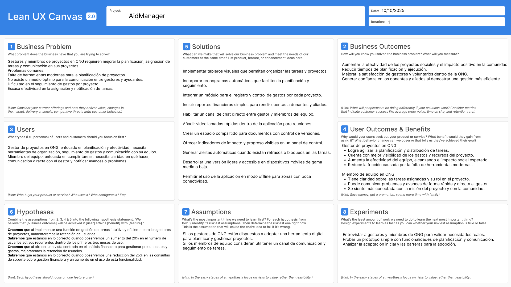
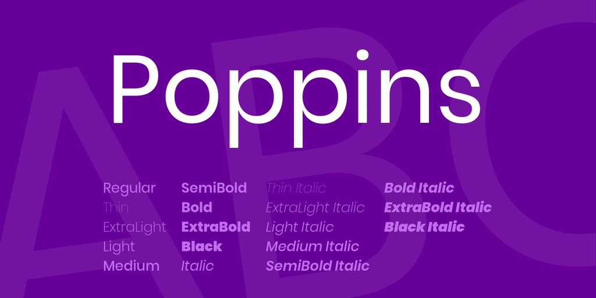
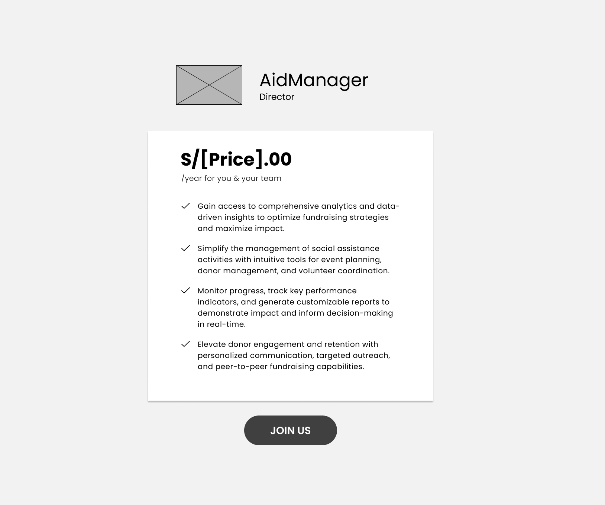
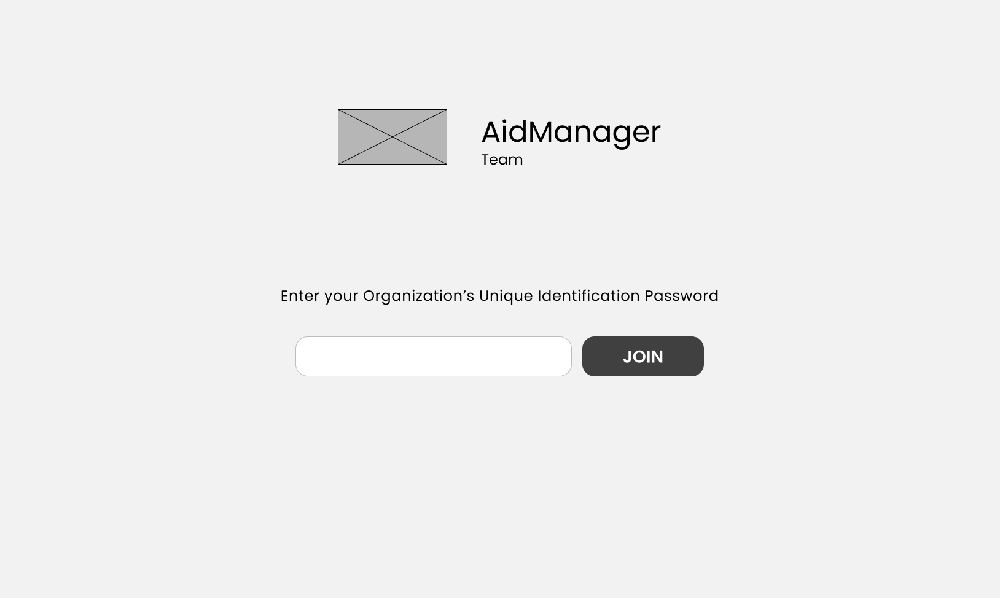
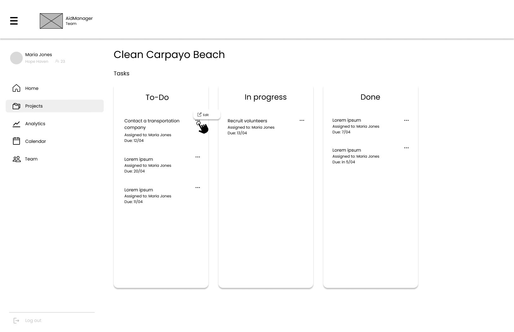
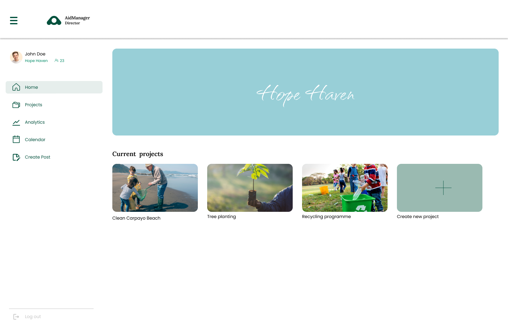
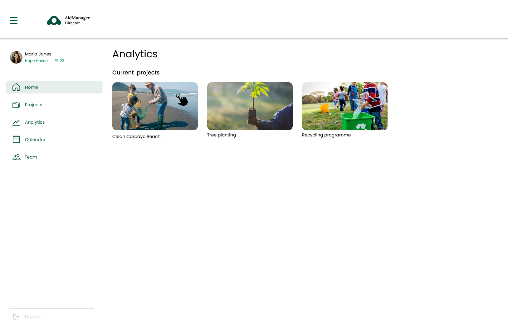
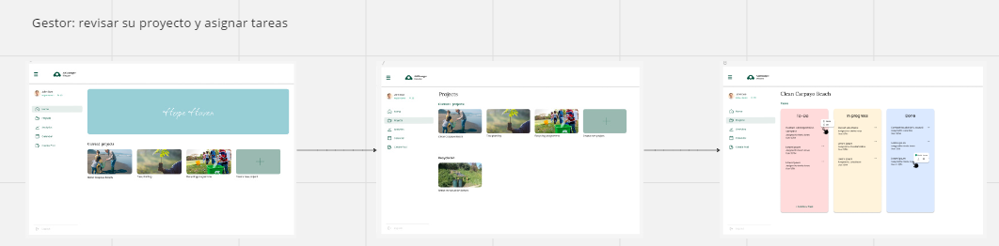
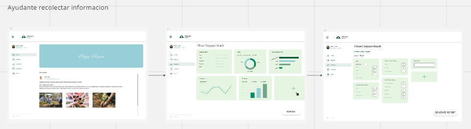
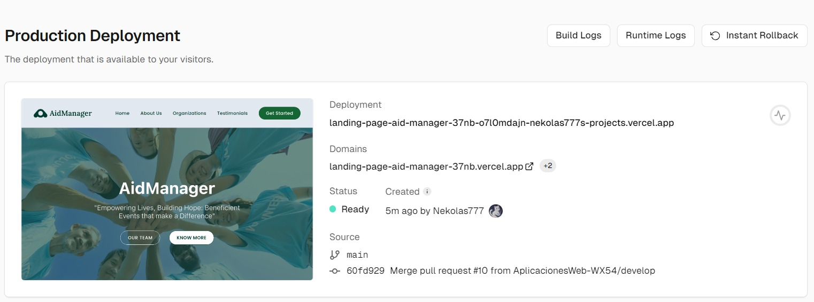

<div align="center">


Universidad Peruana de Ciencias Aplicadas

Carrera: Ingeniería de Software

Ciclo: 2025-20

Curso: Diseño de Experimentos de Ingeniería de Software

Sección: 7508

Profesor: Julio Manuel Noriega Melendez

Informe del Trabajo Parcial  - TP

Startup: Los Tralaleros Web

Producto: AidManager

### Team Members:

| Member                           | Code       |
|----------------------------------|------------|
| Barrutia Vaez, Ricardo Andree    | U201714765 |
| Espinoza Inoñan, Fabiola Ximena  | U202214784 |
| Periche Quiroga, Piero Fernando  | U202210192 |
| Portales Ortiz, Diego Alejandro  | U202123501 |


**Septiembre del 2025**
</div>
  
---  
# Registro de Versiones del Informe


| Versión | Fecha      | Autor                                                                                                                                             | Descripción de modificaciones                                                                      |
|---------|------------|---------------------------------------------------------------------------------------------------------------------------------------------------|----------------------------------------------------------------------------------------------------|
| 1.0      | 14/09/2025 | Barrutia Vaez, Ricardo Andree   <br/> Espinoza Inoñan, Fabiola Ximena <br/> Periche Quiroga, Piero Fernando <br/> Portales Ortiz, Diego Alejandro | Capitulo 1 <br/> Capitulo 2 <br/> Capitulo 3 <br/> Capitulo 4 <br/> Capitulo 5<br/> Mejora continua |


---  
# Project Report Collaboration Insights


---  
# Student Outcome
El curso contribuye al cumplimiento del Student Outcome ABET: **ABET – EAC - Student Outcome 4** <br> Criterio: *La capacidad de reconocer responsabilidades éticas y profesionales en situaciones de ingeniería y hacer juicios informados, que deben considerar el impacto de las soluciones de ingeniería en contextos globales, económicos, ambientales y sociales.*

En el siguiente cuadro se describe las acciones realizadas y enunciados de conclusiones por parte del grupo, que permiten sustentar el haber alcanzado el logro del ABET – EAC - Student Outcome 4.

| Criterio específico                                                                                                                                    | Acciones realizadas                                                                                                                                                                                                                                                                                                                                                                                                                                                                                                                                                                                                                                                                                                                                                                                                                                                                                                                                                                                                                                                  | Conclusiones                                                                                                                                                                                                                                                         |  
|--------------------------------------------------------------------------------------------------------------------------------------------------------|----------------------------------------------------------------------------------------------------------------------------------------------------------------------------------------------------------------------------------------------------------------------------------------------------------------------------------------------------------------------------------------------------------------------------------------------------------------------------------------------------------------------------------------------------------------------------------------------------------------------------------------------------------------------------------------------------------------------------------------------------------------------------------------------------------------------------------------------------------------------------------------------------------------------------------------------------------------------------------------------------------------------------------------------------------------------|----------------------------------------------------------------------------------------------------------------------------------------------------------------------------------------------------------------------------------------------------------------------|  
| Reconoce responsabilidad ética y profesional en situaciones de ingeniería de software                                                                  | TB1:<br/> **Barrutia Vaez, Ricardo Andree:** <br/> Durante el proyecto asumí mi responsabilidad ética al cumplir con mis tareas de manera honesta y comprometida, respetando los aportes de mis compañeros y asegurando que el trabajo reflejara transparencia y profesionalismo. <br/>**Espinoza Iñoñan, Fabiola Ximena:** <br/> Me comprometí a trabajar con responsabilidad y ética, cuidando que mis entregas fueran claras y confiables, y respetando siempre la labor de mis compañeros dentro del proyecto. <br/>**Periche Quiroga, Piero Fernando:** <br/>Asumí un rol responsable dentro del equipo, cumpliendo con mis obligaciones de manera ética y colaborativa, velando porque las decisiones tomadas beneficiaran al grupo y mantuvieran la integridad del proyecto. <br/>**Portales Ortiz, Diego Alejandro** <br/>Fui consciente de la importancia de actuar con ética y profesionalismo en cada actividad, cumpliendo con mis tareas asignadas de manera responsable y garantizando que mi aporte se realizara con compromiso y transparencia <br/> | Como equipo demostramos responsabilidad ética y profesional en cada fase del proyecto, cumpliendo con nuestras tareas de manera transparente y respetando el trabajo de los demás. Mantuvimos un compromiso constante con la calidad y la integridad del entregable. |
| Emite juicios informados considerando el impacto de las soluciones de ingeniería de software en contextos globales, económicos, ambientales y sociales | TB1:<br/>  **Barrutia Vaez, Ricardo Andree:** <br/>Al analizar las decisiones del proyecto reflexioné sobre cómo nuestra solución podía impactar en distintos contextos, considerando la viabilidad económica y la utilidad social de lo desarrollado. <br/>  **Espinoza Iñoñan, Fabiola Ximena**    <br/> Reconocí que nuestras decisiones debían tomar en cuenta no solo lo técnico, sino también los posibles efectos en los usuarios y en el entorno social, buscando siempre un equilibrio responsable.   <br/>   Periche Quiroga, Piero Fernando             <br/>Tuve en cuenta que la solución debía ser útil en diferentes contextos y que factores como lo económico y lo social podían influir en cómo la usarían las personas.  <br/>  Portales Ortiz, Diego Alejandro            <br/> Al participar en el proyecto tuve en cuenta que toda solución de software tiene un impacto que va más allá de lo tecnológico, por lo que procuré analizar también las implicancias sociales y económicas de lo que estábamos desarrollando. <br/>                | El grupo tuvo en cuenta que la solución no solo debía cumplir con lo técnico, sino también considerar su impacto en lo económico, social y ambiental. Esto nos ayudó a tomar mejores decisiones y hacer que la propuesta sea más útil en distintos contextos.                                                                                                                                                                                                                                                                     |
---  
# Contenido
## Tabla de contenidos

### [Capítulo I: Introducción](https://github.com/G2-UPC-PRE-202402-SI730-WX53-DevDynasty/GastroGo-Report#cap%C3%ADtulo-i-introducci%C3%B3n-1)
- [1.1. Startup Profile](https://github.com/G2-UPC-PRE-202402-SI730-WX53-DevDynasty/GastroGo-Report#11-startup-profile)
    - [1.1.1 Descripción de la Startup](https://github.com/G2-UPC-PRE-202402-SI730-WX53-DevDynasty/GastroGo-Report#111-descripci%C3%B3n-de-la-startup)
    - [1.1.2 Perfiles de integrantes del equipo](https://github.com/G2-UPC-PRE-202402-SI730-WX53-DevDynasty/GastroGo-Report#112-perfiles-de-integrantes-del-equipo)
- [1.2 Solution Profile](https://github.com/G2-UPC-PRE-202402-SI730-WX53-DevDynasty/GastroGo-Report#12-solution-profile)
    - [1.2.1 Antecedentes y problemática](https://github.com/G2-UPC-PRE-202402-SI730-WX53-DevDynasty/GastroGo-Report#121-antecedentes-y-problem%C3%A1tica)
    - [1.2.2 Lean UX Process](https://github.com/G2-UPC-PRE-202402-SI730-WX53-DevDynasty/GastroGo-Report#122-lean-ux-process)
        - [1.2.2.1. Lean UX Problem Statements](https://github.com/G2-UPC-PRE-202402-SI730-WX53-DevDynasty/GastroGo-Report#1221-lean-ux-problem-statements)
        - [1.2.2.2. Lean UX Assumptions](https://github.com/G2-UPC-PRE-202402-SI730-WX53-DevDynasty/GastroGo-Report#1222-lean-ux-assumptions)
        - [1.2.2.3. Lean UX Hypothesis Statements](https://github.com/G2-UPC-PRE-202402-SI730-WX53-DevDynasty/GastroGo-Report#1223-lean-ux-hypothesis-statements)
        - [1.2.2.4. Lean UX Canvas](https://github.com/G2-UPC-PRE-202402-SI730-WX53-DevDynasty/GastroGo-Report#1224-lean-ux-canvas)
- [1.3. Segmentos objetivo](https://github.com/G2-UPC-PRE-202402-SI730-WX53-DevDynasty/GastroGo-Report#13-segmentos-objetivo)

### [Capítulo II: Requirements Elicitation & Analysis]()
- [2.1. Competidores]()
    - [2.1.1. Análisis competitivo]()
    - [2.1.2. Estrategias y tácticas frente a competidores]()
- [2.2. Entrevistas]()
    - [2.2.1. Diseño de entrevistas]()
    - [2.2.2. Registro de entrevistas]()
    - [2.2.3. Análisis de entrevistas]()
- [2.3. Needfinding]()
    - [2.3.1. User Personas]()
    - [2.3.2. User Task Matrix]()
    - [2.3.3. User Journey Mapping]()
    - [2.3.4. Empathy Mapping]()
    - [2.3.5. As-is Scenario Mapping]()
- [2.4. Ubiquitous Language]()

### [Capítulo III: Requirements Specification]()
- [3.1. To-Be Scenario Mapping]()
- [3.2. User Stories]()
- [3.3. Impact Mapping]()
- [3.4. Product Backlog]()


### [Capítulo IV: Product Design]()
- [4.1. Style Guidelines]()
    - [4.1.1. General Style Guidelines]()
    - [4.1.2. Web Style Guidelines]()
    - [4.1.3. Mobile Style Guidelines]()
        - [4.1.3.1. iOS Mobile Style Guidelines]()
        - [4.1.3.2. Android Mobile Style Guidelines]()
- [4.2. Information Architecture]()
    - [4.2.1. Organization Systems]()
    - [4.2.2. Labeling Systems]()
    - [4.2.3. SEO Tags and Meta Tags]()
    - [4.2.4. Searching Systems]()
    - [4.2.5. Navigation Systems]()
- [4.3. Landing Page UI Design]()
    - [4.3.1. Landing Page Wireframe]()
    - [4.3.2. Landing Page Mock-up]()
- [4.4. Mobile Applications UX/UI Design]()
    - [4.4.1. Mobile Applications Wireframes]()
    - [4.4.2. Mobile Applications Wireflow Diagrams]()
    - [4.4.3. Mobile Applications Mock-ups]()
    - [4.4.4. Mobile Applications User Flow Diagrams]()
- [4.5. Mobile Applications Prototyping]()
    - [4.5.1. Android Mobile Applications Prototyping]()
    - [4.5.2. iOS Mobile Applications Prototyping]()
- [4.6. Web Applications UX/UI Design]()
    - [4.6.1. Web Applications Wireframes]()
    - [4.6.2. Web Applications Wireflow Diagrams]()
    - [4.6.3. Web Applications Mock-ups]()
    - [4.6.4. Web Applications User Flow Diagrams]()
- [4.7. Web Applications Prototyping]()
- [4.8. Domain-Driven Software Architecture]()
    - [4.8.1. Software Architecture Context Diagram]()
    - [4.8.2. Software Architecture Container Diagrams]()
    - [4.8.3. Software Architecture Components Diagrams]()
- [4.9. Software Object-Oriented Design]()
    - [4.9.1. Class Diagrams]()
    - [4.9.2. Class Dictionary]()
- [4.10. Database Design]()
    - [4.10.1. Relational/Non-Relational Database Diagram]()


### [Capítulo V: Product Implementation, Validation & Deployment]()
- [5.1. Software Configuration Management]()
    - [5.1.1. Software Development Environment Configuration]()
    - [5.1.2. Source Code Management]()
    - [5.1.3. Source Code Style Guide & Conventions]()
    - [5.1.4. Software Deployment Configuration]()
- [5.2. Landing Page, Services & Applications Implementation]()
    - [5.2.1. Sprint 1]()
        - [5.2.1.1. Sprint Planning 1]()
        - [5.2.1.2. Sprint Backlog 1]()
        - [5.2.1.3. Development Evidence for Sprint Review]()
        - [5.2.1.4. Testing Suite Evidence for Sprint Review]()
        - [5.2.1.5. Execution Evidence for Sprint Review]()
        - [5.2.1.6. Services Documentation Evidence for Sprint Review]()
        - [5.2.1.7. Software Deployment Evidence for Sprint Review]()
        - [5.2.1.8. Team Collaboration Insights during Sprint]()
    - [5.2.2. Sprint 2]()
        - [5.2.2.1. Sprint Planning 2]()
        - [5.2.2.2. Sprint Backlog 2]()
        - [5.2.2.3. Development Evidence for Sprint Review]()
        - [5.2.2.4. Testing Suite Evidence for Sprint Review]()
        - [5.2.2.5. Execution Evidence for Sprint Review]()
        - [5.2.2.6. Services Documentation Evidence for Sprint Review]()
        - [5.2.2.7. Software Deployment Evidence for Sprint Review]()
        - [5.2.2.8. Team Collaboration Insights during Sprint]()
    - [5.2.3. Sprint 3]()
        - [5.2.3.1. Sprint Planning 3]()
        - [5.2.3.2. Sprint Backlog 3]()
        - [5.2.3.3. Development Evidence for Sprint Review]()
        - [5.2.3.4. Testing Suite Evidence for Sprint Review]()
        - [5.2.3.5. Execution Evidence for Sprint Review]()
        - [5.2.3.6. Services Documentation Evidence for Sprint Review]()
        - [5.2.3.7. Software Deployment Evidence for Sprint Review]()
        - [5.2.3.8. Team Collaboration Insights during Sprint]()
    - [5.2.4. Sprint 4]()
        - [5.2.4.1. Sprint Planning 4]()
        - [5.2.4.2. Sprint Backlog 4]()
        - [5.2.4.3. Development Evidence for Sprint Review]()
        - [5.2.4.4. Testing Suite Evidence for Sprint Review]()
        - [5.2.4.5. Execution Evidence for Sprint Review]()
        - [5.2.4.6. Services Documentation Evidence for Sprint Review]()
        - [5.2.4.7. Software Deployment Evidence for Sprint Review]()
        - [5.2.4.8. Team Collaboration Insights during Sprint]()
- [5.3. Validation Interviews]()
    - [5.3.1. Diseño de Entrevistas]()
    - [5.3.2. Registro de Entrevistas]()
    - [5.3.3. Evaluaciones según heurísticas]()
- [5.4. Video About-the-Product]()


### [Capítulo VI: Product Verification & Validation]()
- [6.1. Testing Suites & Validation]()
    - [6.1.1. Core Entities Unit Tests]()
    - [6.1.2. Core Integration Tests]()
    - [6.1.3. Core Behavior-Driven Development]()
    - [6.1.4. Core System Tests]()
- [6.2. Static Testing & Verification]()
    - [6.2.1. Static Code Analysis]()
        - [6.2.1.1. Coding standard & Code conventions]()
        - [6.2.1.2. Code Quality & Code Security]()
    - [6.2.2. Reviews]()
- [6.3. Validation Interviews]()
    - [6.3.1. Diseño de Entrevistas]()
    - [6.3.2. Registro de Entrevistas]()
    - [6.3.3. Evaluaciones según heurísticas]()
- [6.4. Auditoría de Experiencias de Usuario]()
    - [6.4.1. Auditoría realizada]()
        - [6.4.1.1. Información del grupo auditado]()
        - [6.4.1.2. Cronograma de auditoría realizada]()
        - [6.4.1.3. Contenido de auditoría realizada]()
    - [6.4.2. Auditoría recibida]()
        - [6.4.2.1. Información del grupo auditor]()
        - [6.4.2.2. Cronograma de auditoría recibida]()
        - [6.4.2.3. Contenido de auditoría recibida]()
        - [6.4.2.4. Resumen de modificaciones para subsanar hallazgos]()


### [Capítulo VII: DevOps Practices]()
- [7.1. Continuous Integration]()
    - [7.1.1. Tools and Practices]()
    - [7.1.2. Build & Test Suite Pipeline Components]()
- [7.2. Continuous Delivery]()
    - [7.2.1. Tools and Practices]()
    - [7.2.2. Stages Deployment Pipeline Components]()
- [7.3. Continuous Deployment]()
    - [7.3.1. Tools and Practices]()
    - [7.3.2. Production Deployment Pipeline Components]()
- [7.4. Continuous Monitoring]()
    - [7.4.1. Tools and Practices]()
    - [7.4.2. Monitoring Pipeline Components]()
    - [7.4.3. Alerting Pipeline Components]()
    - [7.4.4. Notification Pipeline Components]()


### [Capítulo VIII: Experiment-Driven Development]()
- [8.1. Experiment Planning]()
    - [8.1.1. As-Is Summary]()
    - [8.1.2. Raw Material: Assumptions, Knowledge Gaps, Ideas, Claims]()
    - [8.1.3. Experiment-Ready Questions]()
    - [8.1.4. Question Backlog]()
    - [8.1.5. Experiment Cards]()
- [8.2. Experiment Design]()
    - [8.2.1. Hypotheses]()
    - [8.2.2. Domain Business Metrics]()
    - [8.2.3. Measures]()
    - [8.2.4. Conditions]()
    - [8.2.5. Scale Calculations and Decisions]()
    - [8.2.6. Methods Selection]()
    - [8.2.7. Data Analytics: Goals, KPIs and Metrics Selection]()
    - [8.2.8. Web and Mobile Tracking Plan]()
- [8.3. Experimentation]()
    - [8.3.1. To-Be User Stories]()
    - [8.3.2. To-Be Product Backlog]()
    - [8.3.3. Pipeline-supported Experiment-Driven To-Be Software Platform Lifecycle]()
        - [8.3.3.1. To-Be Sprint Backlogs]()
        - [8.3.3.2. Implemented To-Be Landing Page Evidence]()
        - [8.3.3.3. Implemented To-Be Frontend-Web Application Evidence]()
        - [8.3.3.4. Implemented To-Be Native-Mobile Application Evidence]()
        - [8.3.3.5. Implemented To-Be RESTful API and/or Serverless Backend Evidence]()
        - [8.3.3.6. Team Collaboration Insights]()
    - [8.3.4. To-Be Validation Interviews]()
        - [8.3.4.1. Diseño de Entrevistas]()
        - [8.3.4.2. Registro de Entrevistas]()
- [8.4. Experiment Aftermath & Analysis]()
    - [8.4.1. Analysis and Interpretation of Results]()
    - [8.4.2. Re-scored and Re-prioritized Question Backlog]()
- [8.5. Continuous Learning]()
    - [8.5.1. Shareback Session Artifacts: Learning Workflow]()
- [8.6. To-Be Software Platform Pre-launch]()
    - [8.6.1. About-the-Product Intro Video]()
---

# Capítulo I: Introducción
## 1.1. Startup Profile
Esta sección introduce a nuestro equipo y presenta la esencia de nuestra startup.

### 1.1.1. Descripción de la Startup

**AidRecruits** es una startup comprometida con transformar la forma en que las **ONG** gestionan y amplifican su impacto social en el Perú. Nuestro objetivo es potenciar la **calidad de la ayuda social**, desarrollando soluciones tecnológicas innovadoras que optimicen los procesos administrativos y operativos de estas organizaciones.

Buscamos brindar herramientas accesibles y efectivas que permitan a las ONG enfocarse en lo que realmente importa: **ayudar a las comunidades que más lo necesitan**. En un entorno donde los recursos son limitados y los desafíos constantes, creemos que la tecnología puede ser el catalizador para un cambio duradero.

Con una visión centrada en la **solidaridad nacional** y la proyección hacia un futuro **internacional**, fortalecemos la capacidad de las ONG para generar un cambio real y sostenible en la sociedad. A través de plataformas diseñadas específicamente para sus necesidades, facilitamos la organización, la transparencia y la colaboración.

Creemos firmemente que, mediante el uso eficiente de la tecnología, es posible construir un entorno más justo, inclusivo y eficiente, donde cada proyecto social logre alcanzar su máximo potencial y donde las barreras administrativas ya no limiten el deseo de ayudar.

---


### 1.1.2 Perfiles de integrantes del equipo

## 1.2. Solution Profile
Nuestro perfil de solución se divide en 2 partes los “Antecedes y Problemática” y el proceso UX.
### 1.2.1. Antecedentes y problemática

**Antecedentes:**

Actualmente, las organizaciones no gubernamentales (ONGs) desempeñan un
papel fundamental en la atención de necesidades humanitarias y en el
desarrollo de comunidades en todo el mundo. Según la Oficina de Naciones
Unidas para la Coordinación de Asuntos Humanitarios (OCHA) en 2023 se
reportaron 801,425 personas en necesidades de alimentación, servicios de
agua, saneamiento e higiene. En el Perú existen 978 Organizaciones
privadas sin fines de lucro de las cuales principalmente 428 se han
categorizado como de salud, 19 de educación y 35 de vivienda (SIGCTI,
2024), esto nos demuestra que existe una gran cantidad de organizaciones
privadas sin fines de lucro. No obstante, cuando buscamos organizaciones
ONDG (Organizaciones No Gubernamentales de Desarrollo) encontramos un
total de 1835 (SIGCTI, 2024).

**Problemática:**

A pesar de la presencia significativa de estas organizaciones, el
alcance de su impacto aún es limitado, según Equilibrium CenDE en 2023,
encontró que, aunque el 80% de casi 1,200 encuestados reconoce lo que es
una ONG un 71% no estaba informado o no conocía las iniciativas
realizadas por las ONGs en ese año. Además, sólo un 7% de los
encuestados no mostró interés en participar en la solución de problemas
públicos o sociales, lo que sugiere que existe una gran disposición por
parte de la población para apoyar estas iniciativas (Equilibrium CenDE,
2023).

Si bien hay muchas variables que influyen a la hora de hacer un análisis
para identificar cuáles pueden ser las razones para que el impacto,
alcance o el objetivo de la ONG sean afectados, siempre se pueden
minimizar o mitigar por medio de un plan de acción organizado y una
gestión efectiva. Según María Gabriela Moya en su post respecto al
desafío de las ONG en la gestión organizacional y de proyectos.
(LinkedIn, 2023) la mayoría de los sistemas de gestión en las ONG son
obsoletos y orientados más en la cantidad que la calidad de sus
proyectos. Adicionalmente, también menciona de como los sectores que
influyen a mayor medida son la gestión de fondos, la capacitación, la
comunicación y finalmente la supervisión como los pilares en lo que
vendría siendo un proyecto mejor gestionado e innovador en el mercado.

Tomando en cuenta que aún existen ONG que reciben grandes cantidades de
datos solo son para obtener una cifra que represente los asistentes a
algún evento o cuanto se logró de un objetivo de donación omitiendo lo
enriquecedor de esta data recolectada, como se menciona en el artículo
"Data Analytics for Nonprofits" (DigitalForNonprofits, 2023), en el
mundo de hoy para realizar acciones estratégicas y maximizar recursos
distintas empresas utilizan lo llamado análisis de datos, esta práctica
se puede aplicar a un modelo de negocios sin fines de lucro como las ONG
donde se consiguen los mismos beneficios que brindan los análisis de
datos.

Finalmente, muchas ONG carecen o conocen de herramientas adecuadas para
gestionar sus equipos y proyectos de manera ágil y colaborativa. En un
entorno donde los recursos pueden llegar a ser mal implementados y la
eficiencia es crucial, la falta de una plataforma que permita una
gestión integral de proyectos y una comunicación fluida entre los
miembros del equipo puede resultar en una pérdida de tiempo y mal uso de
las colaboraciones recibidas.

**Solución:**

Las ONGs necesitan sistemas que no solo les permitan organizar sus
tareas y gestionar su presupuesto, sino también analizar su impacto en
tiempo real, facilitar la toma de decisiones basadas en datos y fomentar
una comunicación abierta y efectiva entre todos los miembros del equipo.<br>

**5W’s y 2H’s**

**What (¿Que se está haciendo?):** Un sistema de gestión móvil y fácil de usar el cual cubra la comunicación, seguimiento, supervisión y el planeamiento de proyectos.<br>

**Why (¿Por qué se está haciendo?):** Las ONG actualmente no son muy conscientes de como una herramienta de gestión puede impulsar su crecimiento y mejorar el impacto positivo que pueden generar.<br>

**When (¿Cuándo se usa?):** Se usa cuando se quiere realizar un plan de acción para un proyecto de ayuda social, cuando se busque realizar un seguimiento financiero o incluso cuando se requiere saber de la eficiencia de los proyectos y cuando un gestor desea gestionar a un equipo trabajando en el proyecto.<br>

**Where (¿Dónde se usa?):** El uso está diseñado para Perú, ya que se recompilará información de los proyectos, al ser un aplicativo móvil está diseñado para dispositivos móviles.<br>

**Who (¿Quién lo usa?):** El usuario principal para nosotros son las ONG de quienes el producto está orientado a los gestores de proyectos y los miembros del equipo, ya que son estos los que van a implementar la información e interactuar entre sí, nuestro usuario principal entonces se divide en el segmento de (supervisor / gestor) y el miembro del equipo.<br>

**How (¿Cómo?):** En el aplicativo se ingresan los datos de proyectos, la organización y asimismo los miembros del equipo enfocándose en los análisis de tareas completadas y presupuestos.<br>

**How Much (¿Cuánto costaría?):** La aplicación tendrá sus funcionalidades Core a medio de pago es decir el proceso de gestión recopilación y refinamiento de datos junto con las mejores oportunidades de mejora para estas. Tanto el Core de la aplicación como la suscripción se tendrán que renovar cada cierto tiempo donde las organizaciones se tendrán que escoger un plan anual o mensual. No obstante, contamos con un límite de cuentas en el plan y si el usuario es parte de una organización más grande entonces ofreceremos un plan con mayor cantidad de cuentas.

### 1.2.2. Lean UX Process

Los procesos Lean UX son fundamentales para definir con precisión nuestras ideas y establecer un plan de acción enfocado en responder preguntas clave a través del **Needfinding**.

#### 1.2.2.1. Lean UX Problem Statement

Este apartado aborda la situación actual del sector, las limitaciones de la competencia y nuestra propuesta de solución.

Las **ONG en Perú** enfrentan una notoria falta de organización que limita su capacidad de generar un **impacto significativo**. Esta ineficiencia afecta especialmente la **gestión de fondos**, la **capacitación**, la **comunicación interna** y la **supervisión de proyectos**. A pesar de las oportunidades existentes para mejorar mediante una planificación adecuada, muchas ONG no son plenamente conscientes de los beneficios que una gestión efectiva puede brindarles.

Esta falta de organización no solo perjudica la imagen de las ONG, sino que también reduce la **eficacia de sus iniciativas** y disminuye el alcance e impacto que podrían lograr.

Por otro lado, los productos de gestión actualmente disponibles en el mercado son, en su mayoría:
- **Costosos**, y por ende poco accesibles para la mayoría de ONG peruanas, que operan con recursos limitados.
- **Excesivamente complejos**, con funcionalidades que no se ajustan a sus necesidades reales, lo cual dificulta la adopción y genera resistencia entre sus equipos.

> **Pregunta clave:**  
> ¿Cómo podemos ofrecer una **solución de gestión de proyectos accesible**, adaptada a las **necesidades reales de las ONG en Perú**, que les permita optimizar sus operaciones, mejorar su eficiencia y aumentar su impacto social?

#### 1.2.2.2. Lean UX Assumptions
**Business Outcome**<br>

En esta sección vamos a usar las métricas de Montaña conceptualizada por Jeff Gothelf e implementaremos algunas de las “pirate metrics” para poder definir los niveles de la montaña para llegar poder analizar los comportamientos de nuestros usuarios y analizar que parte del User Journey es relevante para nosotros y hacer assumptions de como actuarán nuestros usuarios en base al producto.<br>

Acquisition: (Base): [1000 visitantes] El usuario se percatará de nuestra solución por medio de las redes sociales como medio de comunicación asimismo promocionando nuestra landing page, de la misma manera intentaremos ofrecer el servicio a los mismos usuarios con métodos de comunicación directa como por ejemplo ofrecerles el servicio a las instituciones (ONG).<br>

Activation: (Plateau): [450 users: 100% users] En esta sección el usuario que gestiona a los equipos crea su cuenta registrando su correo y registra la institución si está aún no está registrada, realiza la suscripción de acuerdo con el plan anual o mensual, en caso aún no se encuentre registrada la ONG tendrá que llenar un formulario con la información de esta. Finalmente, se generará un código de autenticación para que los miembros del equipo puedan generar una cuenta y participar del proyecto. De los usuarios que se percaten del producto esperamos que 45% de estos se anime a utilizarlo.<br>

Retention: (Plateau + 1 level): [60% users] De los usuarios que se animaran a utilizarlo esperamos que el 60% de estos continúe utilizando nuestro producto mensualmente para gestionar sus proyectos y comunicarse entre sí. En esta sección el usuario utiliza las herramientas que le proporciona nuestro producto para la gestión, planificación y análisis de proyectos, ya tiene a su equipo registrado y les asigna las tareas mientras que estos mantienen una participación utilizando los medios de comunicación que ofrecemos.<br>

Revenue: (Plateau + 2 levels): [10% users] Los usuarios que utilizan nuestro producto son usuarios estrictamente de paga, no obstante, si es que llegara la situación donde su organización se expande entonces van a tener proyectos a mayor escala, con más ayudantes y cuentas y excederán el límite de las que les proporcionamos en su plan inicial. De esta manera se espera que un 10% de los usuarios retenidos que consigan este crecimiento estarán dispuestos a mejorar su plan generándonos un mayor ingreso.<br>

Referral:(top) [5% users] Finalmente de los usuarios que retuvimos esperamos que un 5% de estos nos referencien a sus colegas o a nuevas ONG indirectamente promocionándonos y aumentando el flujo de usuarios potenciales que podemos obtener.<br>

**Users**
En esta sección creamos un Proto-Persona como un assumption de cómo son nuestros usuarios enfocándonos más en el aspecto de actitud.<br>
<table>
<colgroup>
<col style="width: 25%" />
<col style="width: 36%" />
<col style="width: 37%" />
</colgroup>
<thead>
<tr class="header">
<th><strong>Demográfica</strong></th>
<th><strong>Comportamiento</strong></th>
<th><strong>Necesidades / Obstáculos</strong></th>
</tr>
</thead>
<tbody>
<tr class="odd">
<td>Carlos (29 años): Gestor de proyectos para ONG</td>
<td><p>Trabaja con un equipo en las ONG</p>
<p>Gana lo suficiente</p>
<p>Enfocado en la planificación de proyectos</p>
<p>Busca que se consiga el impacto requerido</p>
<p>Busca mejorar la efectividad de los proyectos generando un impacto
positivo</p></td>
<td><p>Necesita agilizar el proceso de planificación</p>
<p>Necesita mejorar la asignación de tareas</p>
<p>Necesita mejorar el seguimiento de gastos por proyecto</p>
<p>Requiere de una mejor comunicación con los demás ayudantes a la hora
de la ejecución del proyecto</p>
<p>Obstáculo: La ONG no implementa soluciones modernas para el
proyecto</p>
<p>Obstáculo: Se desconoce de programas que sirvan para la planificación
y gestión de proyectos.</p></td>
</tr>
<tr class="even">
<td>Alejandra (23 años): Forma parte del equipo de un proyecto en una
ONG</td>
<td><p>Gana lo mínimo si es que no es voluntariado</p>
<p>Enfocada en el cumplimiento de tareas.</p>
<p>Busca ayudar a los demás por medio de su participación</p>
<p>Busca conectar con la comunidad dentro de la ONG.</p>
<p>Busca saber de las tareas que debe realizar.</p>
<p>Busca notificar de algún problema o el haber finalizado una
tarea.</p></td>
<td><p>Necesita un medio de comunicación directo con el gestor de
proyectos por si sucede algo</p>
<p>Necesita saber cuál es la misión del proyecto e información de
este.</p>
<p>Obstáculo: No existe un medio óptimo para realizar la
comunicación</p>
<p>Obstáculo: Las herramientas que usa para recopilar información no
siempre son las más efectivas para lo que busca</p></td>
</tr>
</tbody>
</table>

### User Outcomes & Benefits

En esta sección buscamos **empatizar** con nuestros usuarios, comprender sus necesidades emocionales y funcionales, y ofrecerles resultados tangibles a través de nuestra solución.

---

#### **¿Qué desea lograr el usuario?**

- **Gestor de ONG:** Quiere asegurarse de que las tareas asignadas a su equipo se gestionen de manera clara y se puedan supervisar eficazmente.
- **Miembro del equipo:** Desea conocer con precisión sus responsabilidades y contar con un canal ágil para comunicarse con su gestor en caso de surgir inconvenientes.

---

#### **¿Cómo quiere sentirse el usuario durante este proceso?**

- **Gestor:** Necesita sentirse en **control**, con la capacidad de supervisar todo el proyecto desde una sola plataforma centralizada.
- **Miembro del equipo:** Busca sentir que tiene una **comunicación directa y sin barreras**, pudiendo contribuir activamente al proyecto.

---

#### **¿Cómo nuestro producto contribuye a su logro personal?**

- El **gestor** experimentará una mejora en la eficiencia operativa de su equipo, lo que incrementará el impacto social del proyecto y reforzará su percepción de **éxito profesional**.
- El **equipo** tendrá claridad sobre sus tareas y una comunicación fluida, lo que facilitará el cumplimiento de sus funciones y les permitirá sentirse **valorados** y **eficaces**.

---

#### **¿Por qué nuestro usuario elegiría esta solución?**

- El **gestor** busca simplificar la gestión y supervisión de proyectos, evitando herramientas costosas o innecesariamente complejas.
- El **equipo** necesita una plataforma intuitiva que facilite la comunicación y les permita tener claridad sobre sus actividades diarias.

---

#### **¿Qué cambios de comportamiento validan el éxito del producto?**

- Los gestores serán capaces de **asignar y monitorear tareas** de forma efectiva a través de la plataforma.
- Los equipos reportarán una **mejor comunicación interna** y una mayor **organización** en la ejecución de sus proyectos.

---

---

### Solutions

Las soluciones propuestas abordan las **necesidades prioritarias** identificadas durante el análisis de usuarios y sus restricciones operativas.

---

- **Monitoreo de proyectos:**  
  Visibilidad en tiempo real del estado de cada proyecto, eliminando la necesidad de herramientas externas como correos electrónicos o WhatsApp.

- **Asignación y seguimiento de tareas:**  
  El gestor podrá asignar tareas desde la plataforma y dar seguimiento al progreso individual. Solo el usuario asignado podrá marcar la tarea como completada, garantizando responsabilidad.

- **Revisión de inventario:**  
  Gestión eficiente de insumos y materiales mediante el registro de proveedores, cantidades y disponibilidad, facilitando la planificación de recursos.

- **Gestión financiera:**  
  Herramientas simples para la comparación de presupuestos, control de gastos y detección de oportunidades de optimización financiera.

- **Comunicación directa:**  
  Canal de comunicación ágil y enfocado entre el gestor y los miembros del equipo, reduciendo distracciones y mejorando la capacidad de respuesta ante imprevistos.

- **Accesibilidad económica:**  
  Modelos de suscripción basados en el número de cuentas activas, no en tipos de servicio, permitiendo que ONG emergentes accedan a la solución de forma **económicamente viable**.

---


### 1.2.2.3. Lean UX Hypothesis Statement

---

#### **Hipótesis**

A continuación, se presenta la tabla de hipótesis siguiendo el enfoque Lean UX:

**Creemos que** al implementar una función de **gestión de tareas intuitiva y eficiente** para los gestores de proyectos, aumentaremos la **retención de usuarios**. 

**Sabremos que** estamos en lo correcto cuando observemos un **aumento del 20%** en el número de **usuarios activos recurrentes** dentro de los **primeros tres meses** de uso. 

**Creemos que** al ofrecer una vista centrada en el **análisis financiero** para gestionar presupuestos y gastos, mejoraremos la **retención de usuarios**. 

**Sabremos que** estamos en lo correcto cuando observemos una **reducción del 25%** en las **consultas de soporte** sobre gestión financiera y un **aumento** en el **uso de esta funcionalidad**. 

**Creemos que** al proporcionar herramientas de **gestión, análisis y comunicación** que incrementen el **impacto de los proyectos**, mejoraremos la **retención de usuarios**. 

**Sabremos que** estamos en lo correcto cuando observemos un **aumento del 60%** en la **tasa de usuarios recurrentes** y un **incremento medible** en el impacto de sus proyectos.

**Creemos que** al implementar un sistema de **comunicación eficiente** entre gestores de proyectos y ayudantes, mejoraremos la **interacción** y **retención de usuarios**. 

**Sabremos que** estamos en lo correcto cuando observemos un **aumento del 20%** en la **frecuencia de uso** de la función de comunicación dentro de los **primeros tres meses**. 

**Creemos que** al ofrecer un **plan mejorado** que permita a los gestores agregar más integrantes a sus cuentas, aumentaremos nuestras **ganancias**. 

**Sabremos que** estamos en lo correcto cuando al menos el **10% de los usuarios** se **suscriba** al plan mejorado dentro de los **primeros seis meses**. 

---

#### **Lo más importante que debemos aprender**

Para el éxito de nuestro proyecto, es fundamental identificar si los usuarios realmente están **interesados** en nuestra propuesta **innovadora**.

Aunque existan herramientas similares, necesitamos confirmar si nuestra solución:
- Es **necesaria** en el contexto de las ONG peruanas.
- **Satisface** sus necesidades específicas de gestión de proyectos.

---

#### **Minimum Viable Product (MVP)**

El **MVP** nos permitirá obtener **aprendizajes rápidos**. Nos enfocaremos en responder la siguiente pregunta clave:

> **¿Qué es lo más importante que necesitamos aprender primero?**

- Validar si **existe demanda real** para nuestra solución.
- Realizaremos **entrevistas** con gestores de proyectos y sus equipos en ONG.
- Evaluaremos si nuestra herramienta **resuelve una necesidad concreta**.

Adicionalmente, desarrollaremos una **landing page** orientada a captar el interés de potenciales usuarios y medir el **nivel de atracción** hacia nuestra herramienta de gestión.

---


#### 1.2.2.4. Lean UX Canvas
En esta sección juntamos la información de los procesos UX y los juntamos en este canvas.



## 1.3 Segmentos Objetivo

La segmentación de nuestros usuarios clave nos permite comprender mejor sus necesidades, comportamientos y motivaciones, facilitando la creación de soluciones adecuadas para cada perfil.

---

| **Criterio**                   | **Segmento 1: Gestor de Proyectos ONG**                                                                                                       | **Segmento 2: Ayudante de Eventos ONG**                                                                                                      |
|--------------------------------|-----------------------------------------------------------------------------------------------------------------------------------------------|----------------------------------------------------------------------------------------------------------------------------------------------|
| **Variables**                  | Gestor de proyectos encargado de planificar, organizar y supervisar actividades dentro de una ONG.                                           | Ayudante operativo que colabora en la ejecución de eventos y actividades sociales como parte del equipo de apoyo.                            |
| **Geográfica**                 | Las ONG en Perú aplican análisis de datos estratégicos para maximizar recursos y optimizar sus proyectos sociales. *(DigitalForNonprofits, 2023)* | La correcta recolección y análisis de datos por parte de ayudantes contribuye a mejorar las condiciones de vida de comunidades vulnerables. *(OHCHR, 2022)* |
| **Demográfica**                | - Edad: 25 a 50+ años <br> - Género: Masculino y Femenino                                                                                     | - Edad: 18 a 35 años <br> - Género: Masculino y Femenino                                                                                      |
| **Psicológica**                | - Enfocados en lograr un **impacto significativo** en sus campañas. <br> - Buscan **aumentar eficiencia** y **reducir gastos innecesarios**.  | - Motivados por contribuir activamente al éxito de las actividades sociales. <br> - Desean sentirse útiles y parte del cambio.                |
| **Comportamiento Funcional**   | - **Actitudes:** Lidera proyectos, coordina equipos, asigna presupuestos, define objetivos y lugares de ejecución. <br> - **Conocimientos:** Tiene experiencia organizativa, pero carece de herramientas específicas para el sector social. | - **Actitudes:** Apoya logísticamente en eventos, anima y guía a los participantes, recoge información clave para los gestores. <br> - **Conocimientos:** Sabe cómo interactuar con el público y garantizar un ambiente ordenado y acogedor. |

---


# Capitulo II: Requiriments Elicitation & Analysis

## 2.1. Competidores
### 2.1.1. Análisis competitivo
Realizamos este análisis a fin de poder conocer el mercado al que nos enfrentamos en un inicio, para de esta manera poder evaluar las estrategias adoptadas por plataformas ya existentes, y así aprender de sus aciertos y errores.

<table>
    <tr>
        <th colspan="6">Competitive Analysis Landscape</th>
    </tr>
    <tr style="text-align: justify">
        <td colspan="2">
            <p>¿Por qué llevan a cabo este análisis?</p>
        </td>
        <td colspan="4">
            <p>El análisis lo llevamos a cabo para comparar nuestra idea de solución con otras existentes. De esta manera, podremos identificar nuestras fortalezas, debilidades, oportunidades y amenazas en relación con el mercado actual
            </p>
        </td>
    </tr>
    <tr>
        <td colspan="2">Empresas:</td>
        <th>Aidmanager</th>
        <th>Trello</th>
        <th>Miro</th>
        <th>Basecamp</th>
    </tr>
    <tr style="text-align: justify">
        <th rowspan="2">Perfil</th>
        <th>Overview</th>
        <!-- Aidmanager -->
        <td>
                Plataforma de gestión de tareas y proyectos dirigida a los equipos de trabajo. Ofrece herramientas como calendario o barra de progreso para la eficiente organización
        </td>
        <!-- Trello -->
        <td>
                Herramienta de gestión de proyectos en línea que utiliza un enfoque visual para la organización de tareas y proyectos
        </td>
        <!-- Miro -->
        <td>
                Plataforma de colaboración en línea con pizarra digital donde los usuarios pueden crear, compartir y colaborar en tiempo real
        </td>
        <!-- Basecamp -->
        <td>
                Herramienta en línea que ayuda a los equipos a administrar y organizar sus tareas y proyectos, proporcionando un espacio para compartir información
        </td>
    </tr>
    <tr>
        <th> Ventaja Competitiva ¿Qué valor ofrece a los clientes? </th>
        <!-- Aidmanager -->
        <td> 
            Entorno de trabajo colaborativo con las herramientas necesarias para la organización 
        </td>
        <!-- Trello -->
        <td> 
            Tarjetas visuales que permiten visualizar y gestionar las actividades 
        </td>
        <!-- Miro -->
        <td> 
            Canvas intuitivo para generar presentaciones, ideas y diagramas 
        </td>
        <!-- Basecamp -->
        <td>
            Espacio de trabajo único y completo
        </td>
    </tr>
    <tr>
        <th rowspan="2">Perfil de Marketing</th>
        <th>Mercado Objetivo</th>
        <!-- Aidmanager -->
        <td>
            Equipos de trabajo con problemas de organización
        </td>
        <!-- Trello -->
        <td> 
            Equipos de gran tamaño que necesitan de una aplicación para la organización de sus proyectos y tareas
        </td>
        <!-- Miro -->
        <td> 
            Usuarios que necesitan de una plataforma para estructurar y plasmar su conocimiento
        </td>
        <!-- Basecamp -->
        <td> 
            Organizaciones y empresas que buscan soluciones para simplificar su trabajo remoto
        </td>
    </tr>
    <tr>
        <th>Estrategias de Marketing</th>
        <!-- Aidmanager -->
        <td>
            Marketing digital, principalmente redes sociales
        </td>
        <!-- Trello -->
        <td> 
            Evaluación de habilidades y experiencia por parte de profesionales del mismo campo
        </td>
        <!-- Miro -->
        <td> 
            Redes sociales y pruebas con potenciales clientes
        </td>
        <!-- Basecamp -->
        <td> 
            Evaluación de habilidades y experiencia por parte de profesionales del mismo campo
        </td>
    </tr>
    <tr>
        <th rowspan="4">Perfil de Producto</th>
        <th>Productos y Servicios</th>
        <!-- Aidmanager -->
        <td>
            Herramientas de colaboración y planificación que les permita a los usuarios tener un mejor flujo de trabajo y organización
        </td>
        <!-- Trello -->
        <td> 
            Gran variedad de planes y opciones que satisfacen las necesidades de los equipos de trabajo, especialmente los más grandes
        </td>
        <!-- Miro -->
        <td> 
            Herramientas populares, como plantillas personalizables y cambio de apariencia según las necesidades del usuario
        </td>
        <!-- Basecamp -->
        <td> 
            Diferentes planes que ofrecen almacenamiento de datos, más proyectos y diversas características extra, como chat en tiempo real
        </td>
    </tr>
    <tr>
        <th rowspan="2">Precios y Costos</th>
        <td colspan="4"> Plan gratuito con características básicas </td>
    </tr>
    <tr>
    <!-- Aidmanager -->
        <td>
            <ul>
                <li>
                    Plan de pago por $7 mensual con características, como almacenamiento extra
                </li>
                <li>
                    Plan empresarial personalizado
                </li>
            </ul>
        </td>
        <!-- Trello -->
        <td> 
            Planes de pago que incluyen más funciones y almacenamiento.
        </td>
        <!-- Miro -->
        <td> 
            <ul>
                <li>
                    Planes de pago desde $8 mensuales que ofrecen funciones como aumentar el almacenamiento
                </li>
                <li>
                    Plan empresarial personalizado
                </li>
            </ul>
        </td>
        <!-- Basecamp -->
        <td> 
            <ul>
                <li>
                    Plan de negocios que ofrece más funciones y almacenamiento para equipos de hasta 100 usuarios
                </li>
                <li>
                    Plan empresarial personalizado
                </li>
            </ul>
        </td>
    </tr>
    <tr>
        <th>Canales de Distribución</th>
        <!-- Aidmanager -->
        <td>Móvil</td>
        <!-- El resto -->
        <td colspan="3"> Web y Móvil </td>
    </tr>
    <!-- Análisis FODA -->
    <tr>
        <th rowspan="4">Análisis FODA</th>
        <th>Fortalezas</th>
        <!--Aidmanager-->
        <td>
            La herramienta es sencilla de entender. Es escalable para equipos de cualquier tamaño y proyecto.
        </td>
        <!-- Trello -->
        <td>
            La herramienta tiene una interfaz gráfica que es sencilla de navegar y utilizar. También, ofrece una amplia gama de funciones, como la comunicación en línea
        </td>
        <!-- Miro -->
        <td>
            La herramienta puede adaptarse a equipos de cualquier tamaño y, sin importar la complejidad de proyecto que se está desarrollando
        </td>
        <!-- Basecamp -->
        <td>
            La herramienta tiene una interfaz de usuario fácil de usar y navegar, al igual que una gran cantidad de funciones. Además, está disponible para dispositivos móviles y computadoras personales
        </td>
    </tr>
    <tr>
        <th>Debilidades</th>
        <!--Aidmanager-->
        <td>
            Para el buen funcionamiento de la aplicación, es necesario contar con dispositivos de media o alta gama
        </td>
        <!-- Trello -->
        <td>
            <ul>
                <li>
                    No cuenta con una función de seguimiento de tareas.
                </li>
                <li>
                    No es adecuada para proyectos complejos
                </li>
            </ul>
        </td>
        <!-- Miro -->
        <td>
            Algunas características tienen una curva alta de aprendizaje que pueden desmotivar al usuario en aprender su uso
        </td>
        <!-- Basecamp -->
        <td>
            No es adecuada para proyectos complejos, ya que carece de funciones importantes para proyectos de gran escala
        </td>
    </tr>
    <tr>
        <th>Oportunidades</th>
        <!--Aidmanager-->
        <td>
            Las nuevas tecnologías nos permiten desarrollar nuevas funcionalidades para la mejor experiencia de usuario
        </td>
        <!-- Trello -->
        <td>
            Las empresas deben implementar nuevos métodos y tecnologías a su software para mantenerse en el mercado
        </td>
        <!-- Miro -->
        <td>
            El desarrollo de nueva tecnología permite que se agreguen nuevas e innovadoras funcionalidades
        </td>
        <!-- Basecamp -->
        <td>
            Las nuevas herramientas nos permiten abrirnos a nuevos mercados
        </td>
    </tr>
    <tr>
        <th>Amenazas</th>
        <!--Aidmanager-->
        <td>
            Ser una incipiente empresa implica que los clientes desconocen de tu marca, lo que hace que sea más complicado vender tu solución de software
        </td>
        <!-- Trello -->
        <td>
            El desafío más grande de una empresa tecnológica independiente son los nuevos competidores y la falta de relación con Google
        </td>
        <!-- Miro -->
        <td>
            La industria tecnológica presenta siempre nuevos competidores, por lo que debemos estar siempre ofreciendo nuevas razones para atraer más clientes y retener a los actuales
        </td>
        <!-- Basecamp -->
        <td>
            Los desafíos más grandes son los nuevos competidores, la falta de recursos y la alta competitividad de la competencia
        </td>
    </tr>
</table>


### 2.1.2. Estrategias y tácticas frente a competidores<br>

<table>
<colgroup>
<col style="width: 18%" />
<col style="width: 19%" />
<col style="width: 19%" />
<col style="width: 19%" />
<col style="width: 22%" />
</colgroup>
<thead>
<tr class="header">
<th><strong>SWOT</strong></th>
<th><strong>AidManager</strong></th>
<th><strong>Jira</strong></th>
<th><strong>Base Camp</strong></th>
<th><strong>Trello</strong></th>
</tr>
</thead>
<tbody>
<tr class="odd">
<td><strong>Fortalezas</strong></td>
<td>- Enfoque en ONGs peruanas con un precio accesible.<br />
- Escalabilidad y fácil implementación.<br />
- Enfoque en la experiencia del usuario.</td>
<td>- Altamente personalizable y adaptable a necesidades
específicas.<br />
- Integración con una gran cantidad de herramientas.</td>
<td>- Simplicidad y facilidad de uso.<br />
- Enfoque en la comunicación directa y colaboración en equipo.</td>
<td>- Herramientas avanzadas de recolección de datos.<br />
- Flexibilidad y personalización.<br />
- Capacidades de informes en tiempo real y mapeo geoespacial.</td>
</tr>
<tr class="even">
<td><strong>Oportunidades</strong></td>
<td>- Expandir presencia en mercados internacionales.<br />
- Desarrollar más funciones de colaboración y gestión de equipos.</td>
<td>- Expandir en mercados no técnicos.<br />
- Mejorar integración con herramientas no relacionadas con el desarrollo
de software.</td>
<td>- Ampliar funcionalidades para atraer a empresas más grandes.<br />
- Integración con más aplicaciones de terceros.</td>
<td>- Aumentar la oferta para sectores fuera del desarrollo
internacional.<br />
- Mejorar la accesibilidad a precios más bajos para ONGs pequeñas.</td>
</tr>
<tr class="odd">
<td><strong>Debilidades</strong></td>
<td>- Falta de reconocimiento internacional.<br />
- Dependencia en el mercado local peruano.</td>
<td>- Curva de aprendizaje pronunciada para nuevos usuarios.<br />
- Costos elevados para pequeñas organizaciones.</td>
<td>- Limitaciones en funcionalidades avanzadas.<br />
- No es ideal para proyectos complejos o grandes equipos.</td>
<td>- Precio elevado y costos de implementación altos.<br />
- Carece de una versión gratuita.<br />
- Requiere personal capacitado para aprovechar su complejidad al
máximo.</td>
</tr>
<tr class="even">
<td><strong>Amenazas</strong></td>
<td>- Competencia fuerte de plataformas internacionales con más
funciones.</td>
<td>- La creciente competencia de plataformas más simples y
económicas.<br />
- Amenazas de otras herramientas ágiles.</td>
<td>- Competencia con plataformas que ofrecen más funciones por precios
similares.<br />
- Cambio en tendencias de gestión de proyectos.</td>
<td>- Nuevas plataformas más económicas o gratuitas.<br />
- Cambios en la tecnología y expectativas del cliente podrían requerir
constantes actualizaciones y mejoras costosas.</td>
</tr>
</tbody>
</table>

## 2.2. Entrevistas
Las entrevistas representan una estrategia de investigación que implica el intercambio de diálogo con el propósito de adquirir datos, empleando cuestionamientos específicos para explorar en profundidad el pensamiento y la visión de la persona objeto de estudio.

### 2.2.1. Diseño de entrevistas

Para esta sección realizamos preguntas específicas para cada segmento, con el objetivo de recolectar información demográfica y comportamental relevante para el proyecto. Por ejemplo, indagamos sobre el tipo de navegador y dispositivos que utilizan con mayor frecuencia. Estos datos son clave para comprender el interés de nuestros usuarios y el impacto que nuestra solución podría tener en su vida diaria y entorno laboral.

---

#### **Preguntas Generales**

Estas preguntas se aplicaron a todos los entrevistados, independientemente del segmento:

1. ¿Cuál es su nombre?
2. ¿Qué edad tiene?
3. ¿A qué se dedica?
4. ¿En qué distrito reside?
5. ¿Qué navegadores y dispositivos usa?

---

#### **Entrevistas - Usuario Segmento 1 (Gestor)**

Preguntas enfocadas en los gestores de organización, desde su perspectiva laboral y cotidiana:


1. ¿Cuáles son los mayores desafíos que enfrentas al gestionar un equipo de voluntarios o colaboradores en una ONG?

2. ¿Qué herramientas utilizas actualmente para planificar y asignar tareas dentro de los proyectos sociales?

3. ¿Cómo manejas el seguimiento del progreso de las tareas y actividades de los proyectos de la ONG?

4. ¿Qué características consideras imprescindibles en una herramienta de gestión de proyectos para ONG?

5. ¿Cómo prefieres comunicarte y coordinarte con los voluntarios o miembros de tu equipo?

6. ¿Qué tan importante es para ti la posibilidad de visualizar el estado de las tareas y el impacto en tiempo real?

7. ¿Qué mejoras te gustaría ver en las herramientas de gestión de proyectos que utilizas actualmente en la ONG?

8. ¿Cómo te gustaría recibir notificaciones sobre el progreso de las tareas y los proyectos sociales?

9. ¿Qué tan fácil te resulta distribuir la carga de trabajo y responsabilidades entre los miembros del equipo?

10. ¿Cómo evalúas la eficiencia y el impacto de tu equipo después de completar un proyecto social?

---

#### **Entrevistas - Usuario Segmento 2 (Empleado)**

Preguntas enfocadas en los empleados de la organización, considerando su experiencia en los eventos:

1. ¿Qué dificultades encuentras al organizar tus tareas diarias dentro de los proyectos de la ONG?

2. ¿Qué herramientas utilizas para gestionar tu tiempo y tus responsabilidades en la organización?

3. ¿Cómo prefieres recibir y gestionar las tareas asignadas por tu líder de proyecto?

4. ¿Qué tan útil te resultaría una herramienta que te permita colaborar en tiempo real con otros miembros de la ONG?

5. ¿Cómo te gustaría ser notificado sobre nuevas tareas o cambios en las asignaciones del proyecto?

6. ¿Qué características valoras más en una aplicación de gestión de tareas para tu participación en la ONG?

7. ¿Cómo evalúas tu propio progreso en relación con las tareas asignadas en el proyecto?

8. ¿Qué tan importante es para ti poder visualizar todas tus tareas en un solo lugar dentro del proyecto?

9. ¿Cómo manejas el equilibrio entre múltiples tareas o actividades simultáneas en la ONG?

10. ¿Qué mejoras sugerirías para las herramientas de gestión de tareas que utilizas actualmente en tu trabajo en la ONG?

### 2.2.2. Registro de entrevistas
Enlace del video de las entrevistas: **[Video de entrevistas](https://upcedupe-my.sharepoint.com/:v:/g/personal/u201923446_upc_edu_pe/ERy4AZSeh1dEpczjxwLeNRUB_WM5fG8o_DGLoWM-tBmgFw?e=8TziSF&nav=eyJyZWZlcnJhbEluZm8iOnsicmVmZXJyYWxBcHAiOiJTdHJlYW1XZWJBcHAiLCJyZWZlcnJhbFZpZXciOiJTaGFyZURpYWxvZy1MaW5rIiwicmVmZXJyYWxBcHBQbGF0Zm9ybSI6IldlYiIsInJlZmVycmFsTW9kZSI6InZpZXcifX0%3D)**

**Segmento Objetivo:** Team Leader (Gestores de Proyectos en ONG)

##### Entrevista 1:
    Nombre: Kevin Tumbalobos Cubas
    Sexo: Masculino
    Residencia: San Miguel
    Inicio: 0:00
    Fin: 5:39


- Descripción  
  Kevin es gestor de proyectos en una ONG. Durante la entrevista mencionó que enfrenta dificultades al **asignar tareas y planificar actividades**, lo que hace que el proceso sea poco fluido. Actualmente utiliza Trello para organizar fases de trabajo y dar seguimiento al progreso.

  Considera que una aplicación ideal debería permitir la **creación y asignación de tareas con fechas límite**, mejorar el **seguimiento de gastos por proyecto** y facilitar la **comunicación directa con los miembros**. Prefiere coordinar con su equipo por llamadas o mensajes de texto, y le gustaría recibir notificaciones de avances tanto en su celular como en su correo electrónico.

---

##### Entrevista 2:
    Nombre: Francis Daniel Mamani Silva
    Sexo: Masculino
    Residencia: Pueblo Libre
    Inicio: 5:40
    Fin: 10:40


- Descripción  
  Francis es líder de proyectos en una ONG. Señala que sus principales retos son mantener una **comunicación clara y gestionar correctamente los tiempos**. Actualmente usa herramientas como Trello y Asana, además de reuniones periódicas por videollamada para coordinar avances.

  Considera que lo más importante en una herramienta de gestión es la **asignación de tareas, el seguimiento en tiempo real y la visualización del progreso**. Valora la **personalización de la herramienta** para ajustarla a las necesidades de cada proyecto. Además, le gustaría recibir notificaciones en su celular. Evalúa la carga de trabajo tomando en cuenta el esfuerzo y eficiencia de cada miembro del equipo.

---

##### Entrevista 3:
    Nombre: Oscar Aranda
    Sexo: Masculino
    Residencia: Lima, Perú
    Inicio: 10:41
    Fin: 14:05


- Descripción  
  Oscar es gestor de un proyecto universitario en una ONG. Identifica como principales dificultades la **falta de seguimiento de tareas y la baja colaboración de los miembros**. Para comunicarse utiliza Google Meet o Discord, y emplea Trello para organizar actividades.

  Considera que una aplicación de gestión debe ofrecer **seguimiento en tiempo real de las tareas** y un **calendario de actividades integrado**. Evalúa la eficiencia de su equipo en reuniones de retroalimentación donde se revisan avances y fallas.

---

**Segmento Objetivo:** Trabajadores del Equipo (Miembros de ONG)

##### Entrevista 1:
    Nombre: Cynthia Santa Cruz Vargas
    Sexo: Femenino
    Residencia: Lima, Perú
    Inicio: 14:06
    Fin: 20:35


- Descripción  
  Cynthia es miembro de un equipo en una ONG. Su mayor reto es la **organización de las tareas y la falta de claridad de algunos compañeros**. Utiliza Office, Project y un sistema interno para organizar su trabajo.

  Considera que una aplicación debería tener un **sistema eficaz de seguimiento del progreso**, con **notificaciones automáticas**. Prefiere comunicarse cara a cara o por correo electrónico. Le gustaría contar con una función para **registrar el tiempo que tarda en completar una tarea**, y recibir notificaciones en su celular.

---

##### Entrevista 2:
    Nombre: Carla Córdova
    Sexo: Femenino
    Residencia: Lima, Perú
    Inicio: 20:36
    Fin: 25:47


- Descripción  
  Carla es miembro de un equipo en una ONG. Menciona que una de sus dificultades es que **sus tareas se acumulan porque no logra organizarlas de manera eficiente**. Utiliza Trello para organizar sus responsabilidades.

  Prefiere recibir las tareas en reuniones o mensajes por videollamada. Le gustaría que la aplicación le notifique sobre el progreso en el celular. Valora que la herramienta sea **ordenada, intuitiva y facilite la colaboración**. Sugiere que las tareas asignadas puedan **editarse y visualizarse en tiempo real**.

---

##### Entrevista 3:
    Nombre: Mauricio Rojas
    Sexo: Masculino
    Residencia: Lima, Perú
    Inicio: 25:50
    Fin: 32:58


- Descripción  
  Mauricio es miembro de un equipo en una ONG. Señala que enfrenta problemas porque las herramientas que utiliza son poco intuitivas. Para organizar sus actividades prefiere usar notas personales.

  Le gustaría una aplicación que permita la **colaboración en tiempo real** con otros miembros. Valora la posibilidad de **categorizar tareas** y gestionar todas en un mismo lugar. Evalúa su progreso por el tiempo que le toma completar cada tarea y busca alternar entre tareas sencillas y complejas para equilibrar su carga.

### 2.2.3. Análisis de entrevistas
**Segmento Objetivo: Líderes de equipo en ONG**

- **Falta de Seguimiento y Colaboración:**  
  El 75% de los líderes entrevistados mencionaron que uno de los mayores desafíos es la falta de seguimiento y la colaboración dentro de los proyectos sociales. Esto genera dificultades para coordinar tareas y garantizar que las actividades se ejecuten con el impacto esperado.

- **Comunicación Clara y Efectiva:**  
  Un 50% de los líderes destacó la importancia de mantener una comunicación fluida con voluntarios y colaboradores, considerándola clave para el éxito y la sostenibilidad de los proyectos.

- **Uso de Herramientas Digitales (Trello y Asana):**  
  El 100% de los líderes entrevistados utiliza Trello para asignar y organizar tareas en la ONG. Un 50% también menciona Asana como apoyo para planificar iniciativas sociales.

- **Herramientas de Comunicación:**  
  El 75% recurre a Google Meet o Discord para coordinarse, priorizando plataformas que permitan **videollamadas y reuniones rápidas** con los equipos.

- **Asignación de Tareas y Seguimiento en Tiempo Real:**  
  El 100% considera imprescindible que la herramienta de gestión permita **asignar tareas y dar seguimiento inmediato**, con visibilidad del avance de los proyectos sociales.

- **Personalización y Calendario:**  
  Un 50% señaló la necesidad de incluir **opciones de personalización** y un **calendario de actividades** que facilite la planificación de cronogramas comunitarios y entregables.

- **Reuniones de Retroalimentación:**  
  El 50% de los líderes evalúa la eficiencia de su equipo mediante **reuniones periódicas de revisión**, en las que se discuten fallas y se buscan soluciones para mejorar el impacto social de los proyectos.

---

**Segmento Objetivo: Miembros de equipo en ONG**

- **Organización de Tareas:**  
  El 100% de los miembros entrevistados mencionó que uno de los mayores desafíos es **organizar sus tareas dentro de los proyectos de la ONG**, especialmente cuando se acumulan y no logran priorizarlas de forma eficiente.

- **Falta de Conocimiento o Capacitación:**  
  Un 25% señaló que la falta de experiencia o conocimiento de algunos voluntarios dificulta aún más la coordinación del trabajo colectivo.

- **Uso de Trello:**  
  El 75% de los miembros utiliza **Trello** para organizar sus responsabilidades y coordinar con el equipo.

- **Sistemas Internos:**  
  Un 25% hace uso de **sistemas internos de la organización** para registrar y dar seguimiento a tareas específicas según el proyecto.

- **Interfaz Intuitiva y Colaborativa:**  
  El 100% valora que una aplicación sea **ordenada, fácil de usar y fomente la colaboración** entre los voluntarios y miembros de la ONG.

- **Notificaciones en Tiempo Real:**  
  El 75% prefiere recibir **notificaciones en el celular** sobre sus tareas asignadas, lo que les permite mantenerse al día con los avances y plazos de los proyectos sociales.

## 2.3. Needfinding

En esta sección se desarrollaron **User Personas** basados en la información recolectada durante las entrevistas. El objetivo es identificar los comportamientos, necesidades y procesos actuales de cada segmento antes de la implementación de nuestra solución.

### 2.3.1. User Personas

A continuación, se presentan las representaciones gráficas de los dos perfiles clave que guían el diseño de nuestra solución:

---

**User Persona - Segmento 1 (Gestor de Proyectos):**


---

**User Persona - Segmento 2 (Ayudante de Eventos):**


---


### 2.3.2. User Task Matrix
<br>
El User Task Matrix nos sirve para identificar los procesos que realizan ambos segmentos donde se pueden observar las similitudes respecto a la importancia y frecuencias de estos procesos. Esto es antes de implementar nuestra solución.
<table border="1" cellspacing="0" cellpadding="6" style="border-collapse: collapse; text-align: center;">
  <thead>
    <tr>
      <th rowspan="2">Título</th>
      <th colspan="2">Gestor</th>
      <th colspan="2">Ayudante</th>
    </tr>
    <tr>
      <th>Impacto</th>
      <th>Frecuencia</th>
      <th>Impacto</th>
      <th>Frecuencia</th>
    </tr>
  </thead>
  <tbody>
    <tr>
      <td>Comunicar tareas al equipo</td>
      <td>Alta</td>
      <td>Media</td>
      <td>Alta</td>
      <td>Baja</td>
    </tr>
    <tr>
      <td>Establecer fechas / cronograma</td>
      <td>Alta</td>
      <td>Media</td>
      <td>Media</td>
      <td>Baja</td>
    </tr>
    <tr>
      <td>Evaluar resultados del proyecto</td>
      <td>Alta</td>
      <td>Media</td>
      <td>Media</td>
      <td>Baja</td>
    </tr>
    <tr>
      <td>Registrar información del proyecto</td>
      <td>Alta</td>
      <td>Media</td>
      <td>Alta</td>
      <td>Alta</td>
    </tr>
    <tr>
      <td>Planificar reuniones</td>
      <td>Alta</td>
      <td>Baja</td>
      <td>Media</td>
      <td>Baja</td>
    </tr>
    <tr>
      <td>Registrar datos en Excel</td>
      <td>Alta</td>
      <td>Media</td>
      <td>Alta</td>
      <td>Baja</td>
    </tr>
    <tr>
      <td>Supervisar proyecto en ejecución</td>
      <td>Alta</td>
      <td>Media</td>
      <td>Alta</td>
      <td>Alta</td>
    </tr>
  </tbody>
</table>


### 2.3.3. User Journey Mapping

El **User Journey Mapping** es fundamental para comprender el recorrido que realizan nuestros segmentos en situaciones comunes dentro de su entorno laboral. A través de esta herramienta, identificamos sus **problemas**, **experiencias**, **emociones** y **oportunidades**, permitiéndonos enfocar nuestra solución en lo que realmente necesitan.

---

**Segmento 1 - Gestor de Proyectos**  


---

**Segmento 2 - Ayudante de Eventos**  


---

### 2.3.4. Empathy Mapping

El **Empathy Map** nos ayuda a visualizar lo que nuestros usuarios **piensan, sienten, dicen y hacen**, permitiéndonos generar un entendimiento más profundo de su contexto emocional y motivacional.

---

**Segmento 1 - Gestor de Proyectos:**  


---

**Segmento 2 - Ayudante de Eventos:**  


---

### 2.3.5. As-is Scenario Mapping

A continuación, se presenta el escenario actual (**As-Is**) de nuestros usuarios, antes de la implementación de nuestra solución. Este mapa refleja las actividades, puntos de dolor y métodos actuales que emplean los segmentos.

---

  


---

**Enlace al mapa interactivo:**  
[Ver en Miro](https://miro.com/welcomeonboard/bWFYbk5taHErYTV0YStFdFNwVFZvZTF3eTNsV25LNkhtYUIrb3pEWmN4MkpwaW1nZi90ZU1SSTFienhFOEFYSEl4TGVEYUlLanBjemhuYjN0N25waENlMVNNWGljYm1ORWFUbTlaYWFJcHp4WUVyUTQrbHNZbllSTEpoUGtpbTJnbHpza3F6REdEcmNpNEFOMmJXWXBBPT0hdjE=?share_link_id=727778410280)

---


## 2.4. Ubiquitous Language

En esta sección definimos los **términos clave** utilizados por los usuarios y el equipo de desarrollo, con el fin de garantizar una comprensión común y coherente durante todo el proyecto.

| **Término**             | **Definición**                                                                                                 |
|-------------------------|---------------------------------------------------------------------------------------------------------------|
| **Gestor de Proyectos** | Usuario responsable de planificar, asignar y supervisar las tareas dentro de la ONG.                         |
| **Ayudante / Staff**    | Usuario que colabora en la ejecución de actividades y eventos, y reporta al gestor.                           |
| **Tarea**               | Actividad específica asignada a un miembro del equipo, con fecha límite y objetivo claro.                     |
| **Proyecto**            | Conjunto de tareas organizadas que buscan lograr un impacto social específico dentro de la ONG.               |
| **MVP**                 | Producto Mínimo Viable, primera versión funcional de la solución con características esenciales.              |
| **Dashboard**           | Interfaz visual que permite al gestor visualizar el estado de proyectos, tareas y comunicación.               |
| **Inventario**          | Registro de insumos y materiales necesarios para llevar a cabo las actividades de la ONG.                     |
| **Comunicación Directa**| Canal interno dentro de la plataforma que permite a los usuarios intercambiar mensajes o alertas rápidamente. |
| **Landing Page**        | Página web introductoria para presentar el producto y captar el interés de los usuarios.                      |
| **Suscripción**         | Plan de acceso a la plataforma basado en cantidad de usuarios registrados y funcionalidades disponibles.      |


# Capítulo III: Requirements Specifications

## 3.1. To-Be Scenario Mapping

El **To-Be Scenario Mapping** representa el escenario futuro ideal que nuestros usuarios vivirán una vez implementada nuestra solución. A través de este mapeo, visualizamos cómo cambiarán y mejorarán los procesos actuales, abordando los puntos de dolor identificados en el escenario As-Is.

Este escenario muestra:
- La **optimización de tareas** mediante herramientas digitales adaptadas a las necesidades de las ONG.
- Una **comunicación fluida y directa** entre gestores y ayudantes.
- La **eficiencia operativa** en la planificación, ejecución y monitoreo de proyectos.
- El uso de un **dashboard centralizado**, accesible y fácil de usar, que permite supervisar proyectos, tareas, inventarios y finanzas en tiempo real.
- La eliminación de la dependencia de herramientas poco eficientes como Excel, WhatsApp o correos dispersos.

---

### Visualización del Escenario Futuro

---

**Gestor de Proyectos:**
- Planifica y asigna tareas desde una plataforma intuitiva.
- Supervisa el progreso de cada tarea y recibe notificaciones en tiempo real.
- Mantiene un control financiero básico, visualizando presupuestos y gastos.
- Se comunica rápidamente con el equipo mediante un canal directo dentro de la plataforma.

---

**Ayudante/Staff:**
- Recibe tareas claras con fechas y descripciones específicas.
- Marca tareas como completadas desde su dispositivo móvil o PC.
- Puede consultar información del proyecto y notificar cualquier incidencia al gestor de forma inmediata.
- Accede a un entorno más organizado, sintiéndose valorado y eficiente.

---

  


---

**Enlace al mapa interactivo:**  
[Ver en Miro](https://miro.com/welcomeonboard/bWFYbk5taHErYTV0YStFdFNwVFZvZTF3eTNsV25LNkhtYUIrb3pEWmN4MkpwaW1nZi90ZU1SSTFienhFOEFYSEl4TGVEYUlLanBjemhuYjN0N25waENlMVNNWGljYm1ORWFUbTlaYWFJcHdCQXlSb09TU1ppd25TaUpvbXZHNm1nbHpza3F6REdEcmNpNEFOMmJXWXBBPT0hdjE=?share_link_id=962634185128)

---


## 3.2. User Stories
**Épicas:**<br>

<table border="1" cellspacing="0" cellpadding="6" style="border-collapse: collapse; text-align: center;">
  <thead>
    <tr>
      <th>EPICA</th>
      <th>Título Épica</th>
      <th>HU asignadas</th>
    </tr>
  </thead>
  <tbody>
    <tr>
      <td>EP01</td>
      <td>Informar del producto y empresa</td>
      <td>HU01 – HU05</td>
    </tr>
    <tr>
      <td>EP02</td>
      <td>Gestionar Usuarios</td>
      <td>HU06 – HU10</td>
    </tr>
    <tr>
      <td>EP03</td>
      <td>Gestionar miembros de equipo</td>
      <td>HU11 – HU13</td>
    </tr>
    <tr>
      <td>EP04</td>
      <td>Gestionar Proyectos</td>
      <td>HU14 – HU16</td>
    </tr>
    <tr>
      <td>EP05</td>
      <td>Gestionar Tareas</td>
      <td>HU17 – HU21</td>
    </tr>
    <tr>
      <td>EP06</td>
      <td>Gestionar Fechas</td>
      <td>HU22 – HU24</td>
    </tr>
    <tr>
      <td>EP07</td>
      <td>Gestionar la comunicación con el equipo</td>
      <td>HU25 – HU28</td>
    </tr>
    <tr>
      <td>EP08</td>
      <td>Gestionar Análisis</td>
      <td>HU29 – HU31</td>
    </tr>
    <tr>
      <td>EP09</td>
      <td>Implementación de Seguridad</td>
      <td>HU32 – HU33</td>
    </tr>
  </tbody>
</table>


**Historias Usuario:**<br>
**Owner: AidManager**<br>
<table>
<colgroup>
<col style="width: 8%" />
<col style="width: 16%" />
<col style="width: 21%" />
<col style="width: 53%" />
</colgroup>
<thead>
<tr class="header">
<th>HUX</th>
<th>Historia de Usuario</th>
<th><p>Descripción</p>
<p>(Escenario)</p></th>
<th>Criterios de Aceptación (Dado que, Cuando, Entonces, Y)</th>
</tr>
</thead>
<tbody>
<tr class="odd">
<td rowspan="2">HU01</td>
<td rowspan="2">Ofrecer información de la empresa</td>
<td rowspan="2"><strong>Como</strong> visitante, <strong>quiero</strong>
conseguir información sobre la empresa <strong>para</strong> saber más
sobre su misión y visión.</td>
<td><p><strong>Caso A: El visitante encuentra información de la
empresa.</strong></p>
<p><strong>Given</strong> el visitante está en la página de
información,</p>
<p><strong>When</strong> revisa la sección de la empresa,</p>
<p><strong>Then</strong> debería ver detalles sobre la misión y visión
de la empresa.</p></td>
</tr>
<tr class="even">
<td><p><strong>Caso A: El visitante recibe un error de cargar
datos.</strong></p>
<p><strong>Given</strong> el visitante está en la página de
información,</p>
<p><strong>When</strong> no encuentra detalles sobre la empresa,</p>
<p><strong>Then</strong> debería ver un mensaje de error indicando que
la información está temporalmente no disponible.</p></td>
</tr>
<tr class="odd">
<td rowspan="2">HU02</td>
<td rowspan="2">Informar sobre los beneficios del producto</td>
<td rowspan="2"><strong>Como</strong> visitante, quiero conocer los
beneficios del producto para evaluar si cumple con mis necesidades.</td>
<td><p><strong>Caso A:</strong></p>
<p><strong>Given</strong> el visitante está en la sección de
beneficios,</p>
<p><strong>When</strong> revisa la lista de beneficios,</p>
<p><strong>Then</strong> debería ver una lista detallada de los
beneficios que ofrece el producto.</p></td>
</tr>
<tr class="even">
<td><p><strong>Given</strong> el visitante está en la sección de
beneficios,</p>
<p><strong>When</strong> no encuentra beneficios listados,</p>
<p><strong>Then</strong> debería ver un mensaje de error indicando que
los beneficios no están disponibles.</p></td>
</tr>
<tr class="odd">
<td rowspan="2">HU03</td>
<td rowspan="2">Conocer los testimonios de los clientes pasados</td>
<td rowspan="2"><strong>Como</strong> visitante, <strong>quiero</strong>
leer testimonios de clientes anteriores <strong>para</strong> saber si
han tenido experiencias positivas.</td>
<td><p><strong>Given</strong> el visitante está en la sección de
testimonios,</p>
<p><strong>When</strong> revisa los comentarios y valoraciones,</p>
<p><strong>Then</strong> debería ver comentarios y valoraciones de
clientes pasados.</p></td>
</tr>
<tr class="even">
<td><p><strong>Given</strong> el visitante está en la sección de
testimonios,</p>
<p><strong>When</strong> no encuentra testimonios,</p>
<p><strong>Then</strong> debería ver un mensaje de error indicando que
los testimonios no están disponibles.</p></td>
</tr>
<tr class="odd">
<td rowspan="2">HU04</td>
<td rowspan="2">Informarse sobre los diferentes planes de precio</td>
<td rowspan="2"><strong>Como</strong> visitante, <strong>quiero</strong>
ver los diferentes planes de precio <strong>para</strong> elegir el que
mejor se ajuste a mi presupuesto.</td>
<td><p><strong>Given</strong> el usuario está en la sección de
precios,</p>
<p><strong>When</strong> revisa la comparación de planes,</p>
<p><strong>Then</strong> debería ver una comparación clara de los
diferentes planes de precios disponibles.</p></td>
</tr>
<tr class="even">
<td><p><strong>Given</strong> el usuario está en la sección de
precios,</p>
<p><strong>When</strong> no encuentra información sobre los planes,</p>
<p><strong>Then</strong> debería ver un mensaje de error indicando que
los precios no están disponibles.</p></td>
</tr>
<tr class="odd">
<td rowspan="2">HU05</td>
<td rowspan="2">Contactar con la empresa</td>
<td rowspan="2"><strong>Como</strong> usuario, <strong>quiero</strong>
poder contactar con la empresa <strong>para</strong> resolver mis
dudas.</td>
<td><p><strong>Given</strong> el usuario está en la sección de
contactos,</p>
<p><strong>When</strong> revisa las opciones de comunicación</p>
<p><strong>Then</strong> debería ver opciones para contactar con la
empresa (teléfono, email, formulario de contacto).</p></td>
</tr>
<tr class="even">
<td><p><strong>Given</strong> el usuario está en la sección de
contacto,</p>
<p><strong>When</strong> no encuentra opciones de contacto,</p>
<p><strong>Then</strong> debería ver un mensaje de error indicando que
los métodos de contacto no están disponibles.</p></td>
</tr>
<tr class="odd">
<td rowspan="2">HU06</td>
<td rowspan="2">Mostrar información de perfiles de miembros de
equipo.</td>
<td rowspan="2"><strong>Como</strong> gestor, <strong>quiero</strong>
ver la información de los miembros de equipo <strong>para</strong>
realizar un monitoreo de identidad y tener información de contacto.</td>
<td><p><strong>Caso: Se ve la información del perfil<br />
Given</strong> el gestor está en la vista donde están los perfiles de
integrantes,</p>
<p><strong>When</strong> selecciona un perfil,</p>
<p><strong>Then</strong> aparece una información del miembro de equipo
incluyendo su nombre e información de contacto.</p></td>
</tr>
<tr class="even">
<td><p><strong>Caso: No se ve la información del perfil</strong></p>
<p><strong>Given</strong> el gestor está en la vista donde están los
perfiles de integrantes,</p>
<p><strong>When</strong> selecciona un perfil y no ve la información del
perfil</p>
<p><strong>Then</strong> aparece un mensaje de error pidiendo que
recargue el perfil.</p></td>
</tr>
<tr class="odd">
<td rowspan="2">HU07</td>
<td rowspan="2">Mostrar información de perfiles de gestores</td>
<td rowspan="2"><strong>Como</strong> miembro de equipo,
<strong>quiero</strong> conocer la información de los gestores de equipo
<strong>para</strong> saber más de mis superiores e información de
contacto.</td>
<td><p><strong>Caso: Se ve la información del perfil</strong></p>
<p><strong>Given</strong> el miembro de equipo está en la vista donde
están los perfiles de los integrantes de la ONG,</p>
<p><strong>When</strong> selecciona un perfil,</p>
<p><strong>Then</strong> ve una información del miembro de equipo
incluyendo la información de contacto y nombres.</p></td>
</tr>
<tr class="even">
<td><p><strong>Caso: No se ve la información del perfil</strong></p>
<p><strong>Given</strong> el miembro del equipo está en la vista donde
está el perfil del gestor de la organización,</p>
<p><strong>When</strong> selecciona un perfil y no ve la información del
perfil</p>
<p><strong>Then</strong> sale un mensaje de error pidiendo que recargue
el perfil.</p></td>
</tr>
<tr class="odd">
<td rowspan="2">HU08</td>
<td rowspan="2">Mostrar información de perfil de la ONG</td>
<td rowspan="2"><strong>Como</strong> usuario, <strong>quiero</strong>
conocer más de la organización de la cual participo
<strong>para</strong> informarme de la misión y visión de esta
misma.</td>
<td><p><strong>Caso: Se muestra la información de la ONG</strong></p>
<p><strong>Given</strong> el usuario se encuentra en el menú principal o
en la sección de proyectos,</p>
<p><strong>When</strong> selecciona el botón con el nombre de la
organización,</p>
<p><strong>Then</strong> ve la información correspondiente de la
organización.</p></td>
</tr>
<tr class="even">
<td><p><strong>Caso: Se muestra la información de la ONG desde el
usuario gestor</strong></p>
<p><strong>Given</strong> el gestor se encuentra en el menú principal o
en la sección de proyectos,</p>
<p><strong>When</strong> selecciona el botón con el nombre de la
organización,</p>
<p><strong>Then</strong> ve la información correspondiente de la
organización y la opción de editar esta misma información.</p></td>
</tr>
<tr class="odd">
<td rowspan="2">HU09</td>
<td rowspan="2">Editar información de perfil</td>
<td rowspan="2"><strong>Como</strong> usuario, <strong>quiero</strong>
poder editar mi perfil <strong>para</strong> actualizar mi información
de contacto o errores que haya realizado al registrarme.</td>
<td><p><strong>Caso: Usuario edita su perfil</strong></p>
<p><strong>Given</strong> usuario está en su perfil,</p>
<p><strong>When</strong> presiona en los botones para editar perfil,</p>
<p><strong>Then</strong> edita la información del perfil.</p></td>
</tr>
<tr class="even">
<td><p><strong>Caso: Usuario falla en editar su perfil</strong></p>
<p><strong>Given</strong> usuario está en su perfil,</p>
<p><strong>When</strong> presiona en los botones para editar perfil y no
pone la información requerida,</p>
<p><strong>Then</strong> aparece un mensaje solicitando la información
solicitada.</p></td>
</tr>
</tbody>
</table>

<table>
<colgroup>
<col style="width: 8%" />
<col style="width: 16%" />
<col style="width: 21%" />
<col style="width: 53%" />
</colgroup>
<thead>
<tr class="header">
<th rowspan="2">HU10</th>
<th rowspan="2">Autenticar usuarios por medio de código de
organización</th>
<th rowspan="2"><strong>Como</strong> gestor, <strong>quiero</strong>
invitar a un miembro de equipo usando un código de organización
<strong>para</strong> que este pueda registrarse a la organización.</th>
<th><p><strong>Caso: El miembro de equipo se registra
correctamente.</strong></p>
<p><strong>Given</strong> el gestor envía el código de invitación al
usuario miembro de equipo,</p>
<p><strong>When</strong> ingresa el código al registrarse en la
aplicación, <strong>Then</strong> ingresa sin problema a la organización
del código.</p></th>
</tr>
<tr class="odd">
<th><p><strong>Caso: El miembro de equipo ingresa un código
invalido.</strong></p>
<p><strong>Given</strong> el gestor no envía el código de invitación al
usuario miembro de equipo,</p>
<p><strong>When</strong> no ingresa el código o ingresa el código
incorrecto al registrarse en la aplicación,</p>
<p><strong>Then</strong> sale un error solicitando que ingrese un código
valido.</p></th>
</tr>
</thead>
<tbody>
<tr class="odd">
<td rowspan="2">HU11</td>
<td rowspan="2">Mostrar lista de perfiles de miembros de equipo.</td>
<td rowspan="2"><strong>Como</strong> gestor, <strong>quiero</strong>
ver un listado de los miembros y sus contactos <strong>para</strong>
poder contactar fácilmente a los miembros del equipo.</td>
<td><p><strong>Caso: Se muestra la lista de usuarios</strong></p>
<p><strong>Given</strong> el gestor está en el panel de proyecto,</p>
<p><strong>When</strong> va a la lista de miembros de equipo,</p>
<p><strong>Then</strong> debería ver una lista de todos los miembros del
equipo y sus contactos.</p></td>
</tr>
<tr class="even">
<td><p><strong>Caso: No se muestra la lista de usuarios</strong></p>
<p><strong>Given</strong> el gestor está en el panel de proyecto,</p>
<p><strong>When</strong> no se muestra la lista de miembros de equipo,
<strong>Then</strong> aparece un mensaje de error.</p></td>
</tr>
<tr class="odd">
<td rowspan="2">HU12</td>
<td rowspan="2">Contactar a los miembros del equipo por medio de
WhatsApp</td>
<td rowspan="2"><strong>Como</strong> usuario, <strong>quiero</strong>
conocer los contactos de mis compañeros <strong>para</strong> poder
mantener una comunicación.</td>
<td><p><strong>Caso: El link de WhatsApp direcciona a la
aplicación</strong></p>
<p><strong>Given</strong> el usuario está en la lista de miembros,</p>
<p><strong>When</strong> presiona el botón de WhatsApp y acepte los
permisos para redireccionar a la aplicación,</p>
<p><strong>Then</strong> se redirecciona a la aplicación de WhatsApp con
el número del perfil.</p></td>
</tr>
<tr class="even">
<td><p><strong>Caso: El link de WhatsApp falla.</strong></p>
<p><strong>Given</strong> el usuario está en la lista de miembros,</p>
<p><strong>When</strong> presiona el botón de WhatsApp y no acepta los
permisos para redireccionar a la aplicación,</p>
<p><strong>Then</strong> sale un mensaje mencionando que debe aceptar
los permisos para redireccionar a aplicaciones.</p></td>
</tr>
<tr class="odd">
<td rowspan="2">HU13</td>
<td rowspan="2">Eliminar Perfil de miembro de equipo</td>
<td rowspan="2"><strong>Como</strong> gestor, <strong>quiero</strong>
eliminar un perfil de miembro de equipo <strong>para</strong> liberar
espacio para nuevas cuentas o concluir la participación de un miembro de
equipo.</td>
<td><p><strong>Caso: El gestor elimina usuario de la
organización.</strong></p>
<p><strong>Given</strong> el gestor está en la lista de miembros,</p>
<p><strong>When</strong> selecciona un perfil y le da al botón de
eliminar usuario y confirma esta acción, <strong>Then</strong> el
usuario es eliminado y se muestra un mensaje exitoso.</p></td>
</tr>
<tr class="even">
<td><p><strong>Caso: El gestor falla en eliminar usuario de la
organización.</strong></p>
<p><strong>Given</strong> el gestor está en la lista de miembros,</p>
<p><strong>When</strong> selecciona un perfil y le da al botón de
eliminar usuario, pero no confirma esta acción,</p>
<p><strong>Then</strong> el usuario no es eliminado y se muestra un
mensaje exitoso.</p></td>
</tr>
<tr class="odd">
<td rowspan="2">HU14</td>
<td rowspan="2">Visualizar de listado de proyectos</td>
<td rowspan="2"><strong>Como</strong> usuario, <strong>quiero</strong>
ver el listado de proyectos de mi interés <strong>para</strong> evaluar
la información relacionada.</td>
<td><p><strong>Caso: Se carga el listado de proyectos</strong></p>
<p><strong>Given</strong> el usuario está en la sección de
proyectos,</p>
<p><strong>When</strong> la sección carga correctamente,</p>
<p><strong>Then</strong> se debe de mostrar un listado de los proyectos
en relación con el usuario.</p></td>
</tr>
<tr class="even">
<td><p><strong>Caso: Ocurre un error al cargar los datos</strong></p>
<p><strong>Given</strong> el usuario está en la sección de
proyectos,</p>
<p><strong>When</strong> la sección carga demora demasiado,</p>
<p><strong>Then</strong> se muestra un mensaje de error para
recargar.</p></td>
</tr>
<tr class="odd">
<td rowspan="2">HU15</td>
<td rowspan="2">Ingresar nuevo proyecto</td>
<td rowspan="2"><strong>Como</strong> gestor, <strong>quiero</strong>
ingresar un nuevo proyecto <strong>para</strong> hacerle su seguimiento
administrativo.</td>
<td><p><strong>Caso: Se ingresa la información requerida</strong></p>
<p><strong>Given</strong> el gestor se encuentra en la vista de
proyectos,</p>
<p><strong>When</strong> presiona el botón para agregar un proyecto y
agrega el título, descripción, ubicación e imágenes de referencia,</p>
<p><strong>Then</strong> se muestra un mensaje de proyecto agregado y se
actualiza la lista de proyectos con el más reciente primero.</p></td>
</tr>
<tr class="even">
<td><p><strong>Caso: No se ingresa la información requerida</strong></p>
<p><strong>Given</strong> el gestor se encuentra en la vista de
proyectos,</p>
<p><strong>When</strong> presiona el botón para agregar un proyecto le
falta agregar información importante como el título o imágenes de
referencia,</p>
<p><strong>Then</strong> se muestra un error en el dialogo solicitando
que se ingrese la información requerida para agregar un
proyecto.</p></td>
</tr>
<tr class="odd">
<td rowspan="2">HU16</td>
<td rowspan="2">Editar información de proyecto</td>
<td rowspan="2"><strong>Como</strong> gestor, <strong>quiero</strong>
editar la información del proyecto <strong>para</strong> actualizar
cambios como ubicación o descripción.</td>
<td><p><strong>Caso: Se edita la información del proyecto</strong></p>
<p><strong>Given</strong> gestor está en la sección de proyecto,
<strong>When</strong> presione el botón de editar y cambie la
información que desea editar,</p>
<p><strong>Then</strong> se actualiza la información del
proyecto.</p></td>
</tr>
<tr class="even">
<td><p><strong>Caso: Ocurre un error al actualizar la información del
proyecto</strong></p>
<p><strong>Given</strong> gestor está en la sección de proyecto,
<strong>When</strong> presione el botón de editar y cambie la
información que desea editar, pero ingrese datos erróneos o no
válidos,</p>
<p><strong>Then</strong> se muestra un mensaje de error explicando que
salió mal.</p></td>
</tr>
<tr class="odd">
<td rowspan="2">HU17</td>
<td rowspan="2">Visualizar tareas</td>
<td rowspan="2"><strong>Como</strong> gestor, <strong>quiero</strong>
ver las tareas del proyecto <strong>para</strong> evaluar los pendientes
relacionados a las tareas.</td>
<td><p><strong>Caso: Se muestran las tareas correctamente.</strong></p>
<p><strong>Given</strong> el gestor está en la sección de proyecto,</p>
<p><strong>When</strong> presiona el botón de ver tareas y se redirige a
esa sección,</p>
<p><strong>Then</strong> se observa las tareas To-Do, Doing y
Done.</p></td>
</tr>
<tr class="even">
<td><p><strong>Caso: No se muestran tareas</strong></p>
<p><strong>Given</strong> el gestor está en la sección de proyecto,</p>
<p><strong>When</strong> presiona el botón de ver tareas y se redirige a
esa sección y no tiene tareas agregadas,</p>
<p><strong>Then</strong> observa un mensaje que le solicite agregar
tareas para empezar.</p></td>
</tr>
<tr class="odd">
<td rowspan="2">HU18</td>
<td rowspan="2">Crear tarea</td>
<td rowspan="2"><strong>Como</strong> gestor, <strong>quiero</strong>
crear tareas <strong>para</strong> organizar a mi equipo.</td>
<td><p><strong>Caso: Se agrega la tarea correctamente.</strong></p>
<p><strong>Given</strong> el gestor está en la sección de tareas,</p>
<p><strong>When</strong> presiona el botón de agregar tarea e ingresa el
título, descripción, fecha de expiración, el estado de la tarea y a
quien está asignada la tarea.</p>
<p><strong>Then</strong> Se agrega la tarea según la columna que le
corresponde</p></td>
</tr>
<tr class="even">
<td><p><strong>Caso: Faltan datos en la tarea.</strong></p>
<p><strong>Given</strong> el gestor está en la sección de tareas,</p>
<p><strong>When</strong> presiona el botón de agregar tarea y le falta
ingresar el título, descripción, fecha de expiración, el estado de la
tarea o a quien está asignada la tarea.</p>
<p><strong>Then</strong> se muestra un mensaje solicitando que llene los
campos faltantes con la información valida.</p></td>
</tr>
<tr class="odd">
<td rowspan="2">HU19</td>
<td rowspan="2">Editar tarea</td>
<td rowspan="2"><strong>Como</strong> gestor, <strong>quiero</strong>
editar alguna tarea <strong>para</strong> aumentar la fecha de
expiración o cambiar al miembro de equipo asignado</td>
<td><p><strong>Caso: Se edita la tarea correctamente</strong></p>
<p><strong>Given</strong> el gestor está en la sección de tareas,</p>
<p><strong>When</strong> presiona el botón de editar tarea y cambia el
ingresa la fecha de expiración, el estado de la tarea o a quien está
asignada la tarea.</p>
<p><strong>Then</strong> se muestra un mensaje confirmando que se
actualizo la tarea y se actualiza la columna donde está.</p></td>
</tr>
<tr class="even">
<td><p><strong>Caso: No se edita la tarea correctamente</strong></p>
<p><strong>Given</strong> el gestor está en la sección de tareas,</p>
<p><strong>When</strong> presiona el botón de editar tarea y cambia el
ingresa la fecha de expiración, el estado de la tarea o a quien está
asignada la tarea con un dato erróneo.</p>
<p><strong>Then</strong> se muestra un mensaje solicitando que se
ingrese información valida o mostrando el error.</p></td>
</tr>
<tr class="odd">
<td rowspan="2">HU20</td>
<td rowspan="2">Cambio de estado de tarea</td>
<td rowspan="2"><strong>Como</strong> miembro de equipo,
<strong>quiero</strong> cambiar el estado de mi tarea
<strong>para</strong> dar a saber cómo va mi progreso.</td>
<td><p><strong>Caso: Se cambia el estado de una tarea</strong></p>
<p><strong>Given</strong> el miembro de equipo está en la sección de
tareas después de estar en la sección de proyecto,</p>
<p><strong>When</strong> presiona el botón para cambiar el estado de su
tarea,</p>
<p><strong>Then</strong> la tarea debería cambiar de columna y
actualizar su estado.</p></td>
</tr>
<tr class="even">
<td><p><strong>Caso: Sucede un error al cambiar el estado de una
tarea</strong></p>
<p><strong>Given</strong> el miembro de equipo está en la sección de
tareas después de estar en la sección de proyecto,</p>
<p><strong>When</strong> presiona el botón para cambiar el estado de su
tarea, pero esta no cambia,</p>
<p><strong>Then</strong> se muestra un mensaje solicitando que vuelva a
intentarlo.</p></td>
</tr>
</tbody>
</table>

<table>
<colgroup>
<col style="width: 8%" />
<col style="width: 16%" />
<col style="width: 21%" />
<col style="width: 53%" />
</colgroup>
<thead>
<tr class="header">
<th rowspan="2">HU21</th>
<th rowspan="2">Eliminar una tarea</th>
<th rowspan="2"><strong>Como</strong> gestor, <strong>quiero</strong>
eliminar una tarea <strong>para</strong> quitar una tarea que no
correspondía con el proyecto.</th>
<th><p><strong>Caso: Se borra la tarea exitosamente</strong></p>
<p><strong>Given</strong> el gestor está en la sección de tareas,</p>
<p><strong>When</strong> presiona el botón de eliminar tareas y confirma
su acción,</p>
<p><strong>Then</strong> se quita la tarea de la columna.</p></th>
</tr>
<tr class="odd">
<th><p><strong>Caso: Ocurre un error al borrar la tarea</strong></p>
<p><strong>Given</strong> el gestor está en la sección de tareas,</p>
<p><strong>When</strong> presiona el botón de eliminar tareas y confirma
su acción, pero sucede un error al eliminar la tarea,</p>
<p><strong>Then</strong> se muestra un mensaje mencionando que ocurrió
un error y que intente de nuevo.</p></th>
</tr>
</thead>
<tbody>
<tr class="odd">
<td rowspan="2">HU22</td>
<td rowspan="2">Visualizar de fechas vinculadas con las tareas y
proyectos</td>
<td rowspan="2"><strong>Como</strong> usuario, <strong>quiero</strong>
revisar las fechas correspondientes de las tareas y proyectos
<strong>para</strong> asegurarme que se cumplan a tiempo y organizar
tiempos.</td>
<td><p><strong>Caso: Se vinculan las tareas con fechas
correctamente</strong></p>
<p><strong>Given</strong> el usuario se encuentra en la sección
calendario,</p>
<p><strong>When</strong> carga el calendario en el formato que desee el
usuario,</p>
<p><strong>Then</strong> se muestran las tareas y proyectos según su
fecha de expiración.</p></td>
</tr>
<tr class="even">
<td><p><strong>Caso: No aparecen las fechas</strong></p>
<p><strong>Given</strong> el usuario se encuentra en la sección
calendario,</p>
<p><strong>When</strong> no observa el calendario con las fechas,</p>
<p><strong>Then</strong> se muestra un mensaje solicitando que se
recargue.</p></td>
</tr>
<tr class="odd">
<td rowspan="2">HU23</td>
<td rowspan="2">Agregar una fecha relacionada a tarea</td>
<td rowspan="2"><strong>Como</strong> gestor, <strong>quiero</strong>
agregar una fecha importante <strong>para</strong> organizar los tiempos
del equipo.</td>
<td><p><strong>Caso: Se ingresa una fecha</strong></p>
<p><strong>Given</strong> el gestor está en la sección de
calendario,</p>
<p><strong>When</strong> ingresa los datos como nombre, fecha y
descripción,</p>
<p><strong>Then</strong> se agrega en la fecha seleccionada la fecha
importante.</p></td>
</tr>
<tr class="even">
<td><p><strong>Caso: Se ingresan datos inválidos</strong></p>
<p><strong>Given</strong> el gestor está en la sección de
calendario,</p>
<p><strong>When</strong> ingresa datos inválidos para el nombre, fecha y
descripción,</p>
<p><strong>Then</strong> se muestra un mensaje mencionando que los datos
son inválidos.</p></td>
</tr>
<tr class="odd">
<td rowspan="2">HU24</td>
<td rowspan="2">Editar o Eliminar una fecha en especifico</td>
<td rowspan="2"><strong>Como</strong> gestor, <strong>quiero</strong>
editar o eliminar una fecha <strong>para</strong> evitar un error o
cambiar la fecha que ingrese previamente.</td>
<td><p><strong>Caso: Se realiza una operación con el
calendario</strong></p>
<p><strong>Given</strong> el gestor está en la sección de
calendario,</p>
<p><strong>When</strong> presiona el botón de editar e ingresa los datos
o presiona el botón de eliminar,</p>
<p><strong>Then</strong> los cambios se realizan según la operación y se
actualiza el calendario.</p></td>
</tr>
<tr class="even">
<td><p><strong>Caso: Realizar una operación de calendario
falla.</strong></p>
<p><strong>Given</strong> el gestor está en la sección de
calendario,</p>
<p><strong>When</strong> presiona el botón de editar e ingresa los datos
o presiona el botón de eliminar y sucede un error al realizar la
operación,</p>
<p><strong>Then</strong> se muestra un mensaje informando del error y
solicitando que intente de nuevo.</p></td>
</tr>
<tr class="odd">
<td rowspan="2">HU25</td>
<td rowspan="2">Visualizar “Posts” de la comunidad</td>
<td rowspan="2"><strong>Como</strong> usuario, <strong>quiero</strong>
saber de la comunidad de la organización <strong>para</strong> saber de
los progresos de mis colegas e inspirarme en el cambio que se está
generando.</td>
<td><p><strong>Caso: Se muestra un listado de posts.</strong></p>
<p><strong>Given</strong> el usuario está la sección de comunidad,
<strong>When</strong> carga esta sección,</p>
<p><strong>Then</strong> se muestran los posts de la
organización.</p></td>
</tr>
<tr class="even">
<td><p><strong>Caso: Ocurre un error al mostrar el listado de
posts.</strong></p>
<p><strong>Given</strong> el usuario está la sección de comunidad,
<strong>When</strong> no carga esta sección,</p>
<p><strong>Then</strong> se solicita recargar por medio de un
mensaje.</p></td>
</tr>
<tr class="odd">
<td rowspan="2">HU26</td>
<td rowspan="2">Postear un post</td>
<td rowspan="2"><strong>Como</strong> gestor, <strong>quiero</strong>
agregar un post <strong>para</strong> mostrar a los integrantes de la
organización el progreso que se está logrando.</td>
<td><p><strong>Caso: Se crea un post</strong></p>
<p><strong>Given</strong> el gestor está en la sección de comunidad,</p>
<p><strong>When</strong> presiona el botón de agregar post e ingresa la
información como título, descripción e imagen referencial,</p>
<p><strong>Then</strong> el post es agregado a la lista de posts y se
muestra un mensaje confirmando la publicación.</p></td>
</tr>
<tr class="even">
<td><p><strong>Caso: Falla la creación un post</strong></p>
<p><strong>Given</strong> el gestor está en la sección de comunidad,</p>
<p><strong>When</strong> presiona el botón de agregar post e ingresa
incorrectamente la información como título, descripción o imagen
referencial,</p>
<p><strong>Then</strong> se muestra un mensaje de error solicitando que
se ingresen bien los datos.</p></td>
</tr>
<tr class="odd">
<td rowspan="2">HU27</td>
<td rowspan="2">Comentar o Reseñar un post</td>
<td rowspan="2"><strong>Como</strong> miembro de equipo,
<strong>quiero</strong> dar mi opinión y reseñar un post
<strong>para</strong> compartir con mis colegas lo que pienso e
interactuar con la comunidad.</td>
<td><p><strong>Caso: se realiza un comentario y reseña a un
post</strong></p>
<p><strong>Given</strong> el miembro de equipo está en la sección de
comunidad,</p>
<p><strong>When</strong> ingresa su reseña y comentario,</p>
<p><strong>Then</strong> aparece el comentario en la sección de
comentarios del post.</p></td>
</tr>
<tr class="even">
<td><p><strong>Caso: falla en realizarse un comentario y reseña a un
post</strong></p>
<p><strong>Given</strong> el miembro de equipo está en la sección de
comunidad,</p>
<p><strong>When</strong> ingresa su reseña y comentario y este no
carga,</p>
<p><strong>Then</strong> se muestra un mensaje de error solicitando que
reintente comentar.</p></td>
</tr>
<tr class="odd">
<td rowspan="2">HU28</td>
<td rowspan="2">Eliminar un post</td>
<td rowspan="2"><strong>Como</strong> gestor, <strong>quiero</strong>
eliminar un post <strong>para</strong> corregir algún post erróneo.</td>
<td><p><strong>Caso: Se elimina un post</strong></p>
<p><strong>Given</strong> el gestor está en la sección de comunidad,</p>
<p><strong>When</strong> presiona el botón de eliminar post y se
confirma esta operación.</p>
<p><strong>Then</strong> se muestra un mensaje confirmando la
eliminación del post.</p></td>
</tr>
<tr class="even">
<td><p><strong>Caso: Falla la eliminación un post</strong></p>
<p><strong>Given</strong> el gestor está en la sección de comunidad,</p>
<p><strong>When</strong> presiona el botón de eliminar post y tarda en
procesarse la operación,</p>
<p><strong>Then</strong> se muestra un mensaje de error pidiendo que
intente de nuevo.</p></td>
</tr>
</tbody>
</table>

<table>
<colgroup>
<col style="width: 8%" />
<col style="width: 16%" />
<col style="width: 21%" />
<col style="width: 53%" />
</colgroup>
<thead>
<tr class="header">
<th rowspan="2">HU29</th>
<th rowspan="2">Visualizar las estadísticas del proyecto</th>
<th rowspan="2"><strong>Como</strong> gestor, <strong>quiero</strong>
observar las analíticas del proyecto <strong>para</strong> evaluar
tendencias y revisar el progreso.</th>
<th><p><strong>Caso: Se cargan los gráficos correctamente</strong></p>
<p><strong>Given</strong> el gestor está en la sección de métricas,</p>
<p><strong>When</strong> cargan los gráficos,</p>
<p><strong>Then</strong> se muestran los gráficos de tareas completadas
y análisis de presupuesto.</p></th>
</tr>
<tr class="odd">
<th><p><strong>Caso: No cargan los gráficos correctamente</strong></p>
<p><strong>Given</strong> el gestor está en la sección de métricas,</p>
<p><strong>When</strong> no cargan los gráficos como se debería,</p>
<p><strong>Then</strong> se muestra un mensaje de error solicitando que
se recargue la sección.</p></th>
</tr>
</thead>
<tbody>
<tr class="odd">
<td rowspan="2">HU30</td>
<td rowspan="2">Agregar datos de presupuesto</td>
<td rowspan="2"><strong>Como</strong> gestor, <strong>quiero</strong>
gestionar las prioridades de las tareas <strong>para</strong> asegurar
que las tareas más importantes se completen primero.</td>
<td><p><strong>Given</strong> el gestor está en la sección de
prioridades,</p>
<p><strong>When</strong> establece prioridades para las tareas,</p>
<p><strong>Then</strong> debería ver las tareas organizadas según las
prioridades establecidas.</p></td>
</tr>
<tr class="even">
<td><p><strong>Given</strong> el gestor está en la sección de
prioridades,</p>
<p><strong>When</strong> no puede gestionar prioridades,</p>
<p><strong>Then</strong> debería ver un mensaje de error indicando que
la gestión de prioridades no está funcionando.</p></td>
</tr>
<tr class="odd">
<td rowspan="2">HU31</td>
<td rowspan="2">Editar datos de presupuesto</td>
<td rowspan="2"><strong>Como</strong> gestor, <strong>quiero</strong>
revisar el estado de las tareas <strong>para</strong> asegurarse de que
todas las tareas se están completando según lo planeado.</td>
<td><p><strong>Given</strong> el gestor está en la sección de estado de
tareas,</p>
<p><strong>When</strong> revisa el estado de las tareas,</p>
<p><strong>Then</strong> debería ver el estado actual de todas las
tareas (completadas, en progreso, pendientes).</p></td>
</tr>
<tr class="even">
<td><p><strong>Given</strong> el gestor está en la sección de estado de
tareas,</p>
<p><strong>When</strong> no puede ver el estado de las tareas,</p>
<p><strong>Then</strong> debería ver un mensaje de error indicando que
la información del estado de tareas no está disponible.</p></td>
</tr>
<tr class="odd">
<td rowspan="2">HU32</td>
<td rowspan="2">Implementar encriptación de contraseñas y código de
organización</td>
<td rowspan="2"><strong>Como</strong> desarrollador,
<strong>quiero</strong> asegurar las contraseñas y códigos
<strong>para</strong> salvaguardar los datos relevantes de mis usuarios
y mantener confidencialidad.</td>
<td><p><strong>Caso: La encriptación es realizada</strong></p>
<p><strong>Given</strong> el desarrollador utiliza algoritmos de
encriptación</p>
<p><strong>When</strong> se ingresa una contraseña al api de la
aplicación,</p>
<p><strong>Then</strong> se guarda en la base de datos de manera
encriptada.</p></td>
</tr>
<tr class="even">
<td><p><strong>Caso: Falla el proceso de encriptación</strong></p>
<p><strong>Given</strong> el desarrollador utiliza algoritmos de
encriptación</p>
<p><strong>When</strong> se ingresa una contraseña al api de la
aplicación y falla el proceso de encriptación,</p>
<p><strong>Then</strong> se registra la anomalía y se devuelve un
error.</p></td>
</tr>
</tbody>
</table>

<table>
<colgroup>
<col style="width: 8%" />
<col style="width: 16%" />
<col style="width: 21%" />
<col style="width: 53%" />
</colgroup>
<thead>
<tr class="header">
<th rowspan="2">HU33</th>
<th rowspan="2">Verificar que el código de organización sea
correcto</th>
<th rowspan="2"><strong>Como</strong> desarrollador,
<strong>quiero</strong> mantener la integridad del código de
organización <strong>para</strong> validar el código de
organización.</th>
<th><p><strong>Caso: La validación es realizada
correctamente</strong></p>
<p><strong>Given</strong> el desarrollador utiliza algoritmos de
validación</p>
<p><strong>When</strong> se ingresa un código de organización al api de
la aplicación y es válido,</p>
<p><strong>Then</strong> se guarda en la base de datos de manera
encriptada.</p></th>
</tr>
<tr class="odd">
<th><p><strong>Caso: La validación es realizada
incorrectamente</strong></p>
<p><strong>Given</strong> el desarrollador utiliza algoritmos de
validación</p>
<p><strong>When</strong> se ingresa un código de organización al api de
la aplicación y no es válido,</p>
<p><strong>Then</strong> se devuelve un error con el mensaje de código
invalido.</p></th>
</tr>
</thead>
<tbody>
</tbody>
</table>


## 3.3. Product Backlog
Se consideran las historias de usuario más importantes para el product backlog
Asimismo, se ha realizado un Trello para hacer seguimiento de nuestras tareas.
<table border="1">
  <thead>
    <tr>
      <th>Historia de Usuario</th>
      <th>Descripción</th>
      <th>Prioridad</th>
      <th>Story Points (1/2/3/5/8)</th>
    </tr>
  </thead>
  <tbody>
    <tr><td>HU01</td><td>Ofrecer información de la empresa</td><td>Alta</td><td>3</td></tr>
    <tr><td>HU02</td><td>Informar sobre los beneficios del producto</td><td>Alta</td><td>3</td></tr>
    <tr><td>HU03</td><td>Conocer los testimonios de los clientes pasados</td><td>Media</td><td>3</td></tr>
    <tr><td>HU05</td><td>Contactar con la empresa</td><td>Alta</td><td>2</td></tr>
    <tr><td>HU06</td><td>Mostrar información de perfiles de miembros de equipo</td><td>Media</td><td>2</td></tr>
    <tr><td>HU07</td><td>Mostrar información de perfiles de gestores</td><td>Alta</td><td>3</td></tr>
    <tr><td>HU08</td><td>Mostrar información de perfil de la ONG</td><td>Alta</td><td>3</td></tr>
    <tr><td>HU09</td><td>Editar información de perfil</td><td>Media</td><td>2</td></tr>
    <tr><td>HU10</td><td>Autenticar usuarios por medio de código de organización</td><td>Alta</td><td>3</td></tr>
    <tr><td>HU11</td><td>Mostrar lista de perfiles de miembros de equipo</td><td>Alta</td><td>3</td></tr>
    <tr><td>HU12</td><td>Contactar a los miembros del equipo por medio de WhatsApp</td><td>Media</td><td>2</td></tr>
    <tr><td>HU13</td><td>Eliminar Perfil de miembro de equipo</td><td>Media</td><td>3</td></tr>
    <tr><td>HU14</td><td>Visualizar de listado de proyectos</td><td>Alta</td><td>3</td></tr>
    <tr><td>HU15</td><td>Ingresar nuevo proyecto</td><td>Alta</td><td>3</td></tr>
    <tr><td>HU16</td><td>Editar información de proyecto</td><td>Alta</td><td>3</td></tr>
    <tr><td>HU17</td><td>Visualizar tareas</td><td>Media</td><td>2</td></tr>
    <tr><td>HU18</td><td>Crear tarea</td><td>Media</td><td>2</td></tr>
    <tr><td>HU19</td><td>Editar tarea</td><td>Alta</td><td>3</td></tr>
    <tr><td>HU20</td><td>Cambio de estado de tarea</td><td>Alta</td><td>3</td></tr>
    <tr><td>HU21</td><td>Eliminar una tarea</td><td>Alta</td><td>3</td></tr>
    <tr><td>HU22</td><td>Visualizar de fechas vinculadas con las tareas y proyectos</td><td>Alta</td><td>3</td></tr>
    <tr><td>HU23</td><td>Agregar una fecha importante</td><td>Media</td><td>2</td></tr>
    <tr><td>HU24</td><td>Editar o Eliminar una fecha en específico</td><td>Alta</td><td>3</td></tr>
    <tr><td>HU25</td><td>Visualizar “Posts” de la comunidad</td><td>Media</td><td>2</td></tr>
    <tr><td>HU26</td><td>Postear un post</td><td>Media</td><td>3</td></tr>
    <tr><td>HU27</td><td>Comentar o Reseñar un post</td><td>Alta</td><td>3</td></tr>
    <tr><td>HU28</td><td>Eliminar un post</td><td>Alta</td><td>3</td></tr>
    <tr><td>HU29</td><td>Visualizar las estadísticas del proyecto</td><td>Alta</td><td>3</td></tr>
    <tr><td>HU30</td><td>Agregar datos de presupuesto</td><td>Media</td><td>2</td></tr>
    <tr><td>HU31</td><td>Editar datos de presupuesto</td><td>Media</td><td>2</td></tr>
    <tr><td>HU32</td><td>Implementar encriptación de contraseñas y código de organización</td><td>Media</td><td>3</td></tr>
    <tr><td>HU33</td><td>Verificar que el código de organización sea correcto</td><td>Alta</td><td>3</td></tr>
  </tbody>
</table>

<br>

**Tablero de seguimiento en Trello:**  
[Acceder al tablero de Trello](https://trello.com/invite/b/66c568966561935d142481d8/ATTI5751dc000e3f7d636dff7058d697c8dd6B2D7184/aidmanagermobile)
<br>


## 3.4. Impact Mapping

El **Impact Mapping** nos permite visualizar cómo nuestra solución contribuye a lograr los objetivos de negocio, alineando las metas con las necesidades de los usuarios y las funcionalidades clave del producto.

A través de estos mapas, identificamos:
- **Qué queremos lograr** (objetivo principal).
- **Quiénes** pueden ayudarnos o verse afectados (actores clave).
- **Cómo** pueden contribuir o qué comportamientos esperamos (impactos).
- **Qué debemos hacer** para lograr estos cambios (entregables del producto).

---

### Segmento 1 – Gestor de Proyectos


---

### Segmento 2 – Ayudante de Eventos


---

Cada mapa representa los caminos que nos llevan desde los objetivos estratégicos hasta acciones concretas dentro del sistema, permitiendo priorizar funcionalidades que generen **mayor impacto real** en el trabajo diario de los usuarios.

# Capítulo IV: Product Design

## 4.1. Style Guidelines

En AidManager, nos esforzamos por reflejar **profesionalismo**, **eficiencia** y **empatía** a través del diseño visual de nuestra aplicación web. Cada decisión estética ha sido cuidadosamente seleccionada para reforzar la identidad de nuestra startup y ofrecer a los usuarios una experiencia agradable, funcional y confiable.

Nuestra paleta de colores, compuesta por tonos celestes y verdes, evoca frescura, tranquilidad y conexión con la naturaleza. Las tipografías **Poppins** y **Lora** complementan esta visión, aportando una estética moderna, legible y sofisticada, que equilibra lo contemporáneo con lo humano.

Estas decisiones de diseño están alineadas con nuestra misión: **facilitar la gestión eficiente de eventos benéficos y donaciones**, fortaleciendo la confianza de quienes colaboran con nuestras causas.

---

### 4.1.1. General Style Guidelines

---

#### **Color Primario**

El color primario refleja **confianza, serenidad y estabilidad**. Simboliza fiabilidad y compromiso en la gestión de organizaciones benéficas, inspirando seguridad tanto en donantes como en beneficiarios.

- **Código HEX:** #008A66


---

#### **Color Secundario**

Nuestro color secundario transmite **calma, frescura y bienestar**. Representa la esperanza y el apoyo que brindamos, así como la naturaleza innovadora y refrescante de nuestras soluciones.

- **Código HEX:** #66EAC5


---

#### **Paleta de Colores Complementaria**

Estos colores complementarios enriquecen la identidad visual, manteniendo coherencia y dinamismo en la experiencia del usuario.

- #3652AD
- #6CFBCE
- #20C198
- #008A65


---

### **Tipografía**

Nuestra selección tipográfica fue pensada para combinar modernidad, elegancia y legibilidad, asegurando una comunicación clara y atractiva.

| **Tipografía** | **Descripción** |
|----------------|-----------------|
| **Poppins**    | Tipografía moderna y limpia, de estilo geométrico, ideal para transmitir profesionalismo y eficiencia. Su excelente legibilidad la hace perfecta para interfaces intuitivas. |
| **Lora**       | Tipografía serif elegante y tradicional, que aporta un toque de prestigio. Su combinación con Poppins equilibra lo contemporáneo con la confianza y seriedad del sector benéfico. |

<br>
<center></center>
<center><br><br></center>

---

### **Branding**

El logotipo de AidManager representa a una figura vista desde arriba, con los brazos abiertos, en tonos verde-azulados. Este diseño simboliza **apertura, apoyo y generosidad**, valores centrales de nuestra startup.

Nuestra identidad visual transmite:
- **Solidaridad** hacia las comunidades necesitadas.
- **Esperanza** para quienes buscan ayuda.
- **Renovación** a través de soluciones tecnológicas accesibles.

El logo actúa como un emblema de nuestro compromiso con la ayuda directa, fomentando un entorno de colaboración y empatía.

<br>
<center><br><br></center>

### 4.1.2.	Web Style Guidelines
Descripción de los elementos que se utilizaran en el web app

**Background:** (primary, secondary, terniary)

Para el background se hace uso del color FFFFF para resaltar la pagina y para separar secciones D9ED8F


**Text Styles:** (H1, H2, p, a,)

Para el texto se escogieron colores que combinan con la temática de la pagina y que facilitan la lectura del usuario
<center></center>

**Button Styles:** (Button, dropdowns, Switches)

Para los botones el color cambia según el color del fondo
<center></center>

**Icons:** (Fondo blanco con los iconos que vamos a usar)
Tendremos iconografía de búsqueda, lápiz, ropa, reciclaje, icono de gráfico, foco, etc

<center></center>

**Misc**
Se determina el color y posición según la sección
<center></center>


Se muestra un style guidelines general que engloba la mayoría de diseño:

<center></center>


### 4.1.3.	Mobile Style Guidelines
Asimismo como hicimos con el web Style Guidelines seguimos un approach parecido para ambos dispositivos android y iOS

En el caso de iOS nos enfocamos en mantener una persistencia de diseño para que existan muchas diferencias con la contraparte de android.

#### 4.1.3.1.	iOS Mobile Style Guidelines


#### 4.1.3.2.	Android Mobile Style Guidelines


## 4.2. Information Architecture

Esta sección define cómo se organiza y estructura la **navegación** dentro de la aplicación móvil AidManager, facilitando la experiencia del usuario a través de un flujo intuitivo y eficiente.

---

### 4.2.1. Organization System

El sistema de organización se basa en un **flujo secuencial**, guiando al usuario paso a paso a través de las funcionalidades principales de la aplicación para lograr sus objetivos.

- Los usuarios siguen un **workflow estructurado**, pero también disponen de **accesos directos** para navegar rápidamente entre secciones.
- Se implementa una **jerarquía visual diferenciada** según el tipo de usuario:
    - **Gestores de proyecto**: Acceso prioritario a herramientas de gestión y supervisión.
    - **Miembros de equipo**: Acceso centrado en tareas asignadas y comunicación.

---

### 4.2.2. Labelling System

El sistema de etiquetado está diseñado para ser **claro y directo**, facilitando la comprensión de la aplicación.

- Los principales **labels** o etiquetas de navegación son:
    - **Home**
    - **Projects**
    - **Community**
    - **Profile**

Estos términos fueron seleccionados para representar de forma concisa las funciones clave, asegurando que los usuarios puedan identificar rápidamente las secciones más relevantes.

---

### 4.2.3.	SEO and Meta Tags
Meta & SEO (Search Engine Optimization) Tags: sirven para que la página web donde promocionamos la aplicación sea encontrada fácilmente es lo que sale al encontrar la página en el buscador (se ponen en el <"head"> de la landing page o en la página store)
Título:

```
 <title> AidManager | La mejor opción de ONG para la gestión de proyectos </title>

```

Descripción:

```
 <meta name = "description" content = "Gestiona, Recolecta, Analiza y Visualiza los datos y colaboradores de tus proyectos todo en un solo lugar."/> 

```

Palabras Clave:

```
 <meta name = "keyword" content = "ONG gestión, Gestionar Proyecto, ONG, dar Tareas, análisis de datos, Organizar, Orden "/>

```

### 4.2.4.	Searching Systems
**¿Que se busca?:** El usuario busca su proyecto para gestionar. **¿Qué resultados se mostrarán?:** Se debe de mostrar cards y entre ellas el proyecto que está revisando.<br>

**Interfaz de búsqueda:** El dashboard muestra en el sidebar las secciones una vez se selecciona la sección de proyectos se mostrarán las cards con sus proyectos, el usuario selecciona el proyecto específico y se hacen las redirecciones a su proyecto para gestionar específicas.

### 4.2.5.	Navigation Systems
La navegación de la Mobile App se estará basando en un Sistema de navegación Global donde por medio de las cards en el dashboard o los labels en el side-bar e incluso el bottom-nav. el usuario se redirija a la sección seleccionada. Asimismo, se usa la navegación local para ver información dedicada a las secciones.
## 4.3.	Landing Page UI Design
Esta sección está orientada a mostrar el diseño de nuestra landing page la cual es necesaria para presentarnos y promover nuestro producto a los usuarios.
### 4.3.1.	Landing Page Wireframe


### 4.3.2.	Landing Page Mock-up


## 4.4.	Mobile Applications UX/UI Design
Aquí nos enfocamos en mostrar el diseño de nuestra solución móvil.
#### 4.4.1.	Mobile Application Wireframe


### 4.4.2.	Mobile Application Wireflow Diagram

Gestor de Proyectos necesita ver el listado de proyectos y las tareas asignadas a estos.<br>


Como Gestor quiero recibir notificaciones sobre nuevos proyectos o actualizaciones de los existentes<br>


Gestor Crea un nuevo proyecto asignado a las tareas a los integrantes<br>


Como gestor de proyectos deseo revisar la información del trabajo realizado y exportar la información.<br>


Como gestor de proyecto deseo agregar un post para mi equipo pueda ver y reaccionar<br>


Como miembro de equipo deseo ver las tareas asignadas y las métricas del grupo.<br>


### 4.4.3.	Mobile Application Mock-ups


### 4.4.4.	Mobile Application Userflow Diagram


## 4.5. Mobile Application Prototyping

### 4.5.1. Android Mobile Applications Prototyping


### 4.5.2. iOS Mobile Applications Prototyping


## 4.6 Web Applications UX/UI Design

### 4.6.1. Web Applications Wireframes
</br>

**Segmento 1: Manager de ONG**
<center></center>
<center></center>
<center></center>
<center></center>
<center></center>
<center></center>
<center></center>
<center></center>
<center></center>
<center></center>
<center></center>
<center></center>
<center></center>


**Segmento 2: Equipo de ONG**
<center></center>
<center></center>
<center></center>
<center></center>
<center></center>
<center></center>
<center></center>
<center></center>
<center></center>
<center></center>
<center></center>

### 4.6.2. Web Applications Wireflow Diagrams.


### 4.6.3. Web Applications Mock-ups.

</br>

**Segmento 1: Manager de ONG**
<center></center>
<center></center>
<center></center>
<center></center>
<center></center>
<center></center>
<center></center>
<center></center>
<center></center>
<center></center>
<center></center>
<center></center>
<center></center>
<center></center>


**Segmento 2: Equipo de ONG**
<center></center>
<center></center>
<center></center>
<center></center>
<center></center>
<center></center>
<center></center>
<center></center>
<center></center>
<center></center>
<center></center>

### 4.6.4. Web Applications UserFlow Diagrams.






## 4.7. Mobile Application Prototyping

Para el desarrollo de los prototipos de la **interfaz móvil** de AidManager, se aplicaron criterios fundamentales que aseguran una experiencia de usuario óptima y adaptada a las necesidades del segmento objetivo.

---

### **Criterios de Diseño Aplicados:**

- **Claridad y Facilidad de Uso:**  
  Se priorizó una navegación **intuitiva y comprensible**, permitiendo a los usuarios entender de forma clara las funciones disponibles. La interfaz facilita la visualización de reportes estadísticos y tareas asignadas de manera eficiente.

- **Diseño Responsive:**  
  Se garantizó la compatibilidad con diversos tamaños de pantalla, asegurando que la aplicación funcione correctamente en cualquier dispositivo móvil, sin comprometer la usabilidad ni la estética.

- **Priorización de Información Relevante:**  
  El diseño destaca únicamente la información más relevante para los usuarios, permitiendo una interacción directa con las funcionalidades clave, evitando sobrecargas visuales y distracciones.

---

### **Vista del Prototipo:**


---

### **Prototipo Interactivo en Figma:**

[Ver Prototipo en Figma](https://www.figma.com/proto/I9eSDqC0GqeOs3fNvBbJAv/AidManager-app-web-Wireframe--Copy-?node-id=2301-10003&starting-point-node-id=2139%3A128776&t=5t7TF9vFAZDk7V2n-1)

---

### **Video del Prototipo Funcional:**

[Ver Video del Prototipo](https://upcedupe-my.sharepoint.com/:v:/g/personal/u202211894_upc_edu_pe/Ec5ztdvdCSNBsrwPHs9oaPwBUkfUaqyH38pDoOj_rVYPTg?e=nVMy6P&nav=eyJyZWZlcnJhbEluZm8iOnsicmVmZXJyYWxBcHAiOiJTdHJlYW1XZWJBcHAiLCJyZWZlcnJhbFZpZXciOiJTaGFyZURpYWxvZy1MaW5rIiwicmVmZXJyYWxBcHBQbGF0Zm9ybSI6IldlYiIsInJlZmVycmFsTW9kZSI6InZpZXcifX0%3D)

---

### 4.8.1. Software Architecture – Context Level Diagram

El **Context Level Diagram** proporciona una visión general de alto nivel del sistema AidManager. Define cómo interactúa con usuarios externos (actores) y otros sistemas, estableciendo sus límites y relaciones clave.


---

### 4.8.2. Software Architecture – Container Level Diagram

El **Container Level Diagram** descompone el sistema en contenedores, tales como aplicaciones, bases de datos y servicios, mostrando cómo cada uno colabora para cumplir con los objetivos del sistema. Este nivel detalla las tecnologías utilizadas y sus responsabilidades principales.


---

### 4.8.3. Software Architecture – Component Level Diagram

El **Component Level Diagram** explora la estructura interna de cada contenedor, detallando los componentes clave y sus interacciones. Esto permite entender cómo se organiza y distribuye la funcionalidad dentro del sistema.

---

  
  
  
  


## 4.9. Software Object-Oriented Design

### 4.9.1. Class Diagrams

A continuación, se presenta el **Diagrama de Clases** del sistema AidManager, donde se visualizan las entidades clave, sus atributos, métodos y relaciones entre clases.


---

### 4.9.2. Class Dictionary

En esta sección se detallan las **clases principales** que conforman la arquitectura orientada a objetos del sistema:

| **Clase**          | **Descripción**                                                                                          |
|--------------------|----------------------------------------------------------------------------------------------------------|
| **User**           | Representa a los usuarios registrados en la plataforma, tanto **gestores** como **miembros de equipo**. Incluye métodos para gestionar cuentas, autenticación y datos de contacto. |
| **ProjectManager** | Clase específica para los **gestores de proyectos**. Contiene métodos para planificar, asignar tareas y supervisar proyectos. |
| **Assistant**      | Representa a los **asistentes** que colaboran en eventos y proyectos. Incluye atributos relacionados con su rol operativo y tareas asignadas. |
| **Project**        | Define los **proyectos** gestionados en la plataforma. Contiene atributos como nombre, descripción, estado y métodos para actualizar su progreso. |

---

Estas clases forman la base de la lógica de negocio de AidManager, facilitando la gestión eficiente de los elementos clave dentro de la aplicación.


## 4.10. Database Diagram

### 4.10.1. Relational/Non-Relational Database Diagram

A continuación se presenta el **Diagrama de Base de Datos** que respalda el funcionamiento de AidManager. Este diagrama muestra las entidades principales, sus relaciones y cómo se estructura la información clave para la gestión de proyectos, usuarios y tareas dentro del sistema.


Este diseño permite:
- Una gestión eficiente de **usuarios**, diferenciando gestores y asistentes.
- Registro y seguimiento detallado de **proyectos** y **tareas**.
- Integración con funciones como control de fechas, estadísticas y comunicación interna.

El modelo relacional asegura la **integridad de los datos** y la escalabilidad del sistema conforme crezcan las operaciones de la organización.


# Capítulo V: Product Implementation


## 5.1. Software Configuration Management

### 5.1.1. Software Development Environment Configuration

A continuación, se detallan las herramientas y entornos utilizados durante el desarrollo y despliegue de AidManager:

---

#### **Figma – Prototipado UX/UI**

- **Herramienta:** Figma
- **Propósito:** Figma fue la plataforma utilizada para el diseño visual de la aplicación, permitiéndonos crear:
    - **Wireframes** (bocetos de estructura de la app).
    - **Mock-ups** (diseños visuales detallados).
    - Prototipos interactivos tanto para **aplicaciones web como móviles**.

Figma es una herramienta colaborativa basada en la nube, ampliamente usada en el diseño de interfaces UX/UI, lo que facilitó la visualización y validación temprana de la experiencia de usuario.

- **Enlace al Prototipo Figma:**  
  [Ver Prototipo](https://www.figma.com/proto/I9eSDqC0GqeOs3fNvBbJAv/AidManager-app-web-Wireframe--Copy-?node-id=2301-10003&starting-point-node-id=2139%3A128776&t=5t7TF9vFAZDk7V2n-1)

---

#### **Software Deployment – Vercel**

- **Herramienta:** Vercel
- **Propósito:** Vercel se utilizó para el **despliegue de la Landing Page** de AidManager. Esta herramienta permite realizar despliegues rápidos y eficientes de aplicaciones web, facilitando la visualización de la versión online del proyecto.

- **Enlace al Despliegue:**  
  :

---

### Beneficios de esta configuración:
- Facilita la **colaboración remota** del equipo de diseño y desarrollo.
- Permite iterar rápidamente sobre la interfaz con herramientas visuales.
- Despliegue ágil de versiones funcionales accesibles desde cualquier dispositivo.


### 5.1.2. Source Code Management

Para la gestión del código fuente del proyecto **AidManager**, se utilizará un sistema de control de versiones basado en **Git**, facilitando el seguimiento de cambios, la colaboración del equipo y la integración continua de nuevas funcionalidades.

---

#### **Repositorio GitHub**

- **Landing Page:**  
  El código correspondiente a la Landing Page será gestionado en un repositorio específico en GitHub.
    - **Repositorio:** https://github.com/Diseno-de-Experimentos-4446/Aid-Manager-Web-Application

- **Product Implementation:**  
  El desarrollo completo de la aplicación se manejará en otro repositorio dedicado a la implementación del producto final.
    - **Repositorio:** https://github.com/Diseno-de-Experimentos-4446/Aid-Manager-Mobile-App

---

#### **Workflow: GitFlow**

Se adoptará **GitFlow** como metodología de control de versiones, permitiendo una organización clara del desarrollo mediante ramas principales y de apoyo.

---

##### **Ramas Principales:**

- **Main:**  
  Contiene el código **estable y listo para producción**. Toda versión oficial del proyecto se consolidará aquí.

- **Develop:**  
  Rama dedicada a integrar los **últimos cambios en desarrollo** antes de ser considerados para una nueva versión.

---

##### **Ramas de Desarrollo:**

- **Feature:**
    - Se crea desde **Develop**.
    - Se utiliza para el desarrollo de nuevas funcionalidades.
    - Una vez completada y probada, se fusiona nuevamente a **Develop** y se elimina.

---

##### **Ramas de Apoyo:**

- **Release:**
    - Nace desde **Develop**.
    - Sirve para la preparación de una nueva **versión estable**, enfocándose en la corrección de errores y ajustes menores.
    - Se fusiona tanto en **Main** como en **Develop** al finalizar.

- **Hotfix:**
    - Se crea desde **Main**.
    - Se utiliza para solucionar **problemas críticos** detectados en producción.
    - Se fusiona tanto en **Main** como en **Develop** una vez corregidos los errores.

---

### **Beneficios de GitFlow:**

- Facilita el **trabajo colaborativo** y paralelo.
- Permite una clara separación entre **desarrollo**, **pruebas** y **producción**.
- Mejora la gestión de versiones y la **entrega continua**.


### 5.1.3. Source Code Style Guide & Conventions

Para asegurar la consistencia y legibilidad del código en todo el proyecto AidManager, se adoptaron guías de estilo reconocidas y ampliamente aceptadas:

---

#### **HTML & CSS – Google HTML/CSS Style Guide**

- El tipo de documento debe especificarse al principio mediante meta tags.
- El elemento `<title>` debe estar dentro del `<head>`.
- **Sangría:** 2 espacios por nivel.
- Uso de **minúsculas** en elementos HTML, atributos, propiedades CSS y selectores.
- Atributos HTML siempre entre **comillas dobles**.
- Todos los elementos HTML deben tener su **etiqueta de cierre**.
- Evitar líneas de código excesivamente largas.
- Siempre especificar el **ancho**, **alto** y atributo **alt** en imágenes.

---

#### **JavaScript – Google JavaScript Style Guide**

- Terminar cada línea con un **punto y coma**.
- Uso de **camelCase** para nombres de variables y funciones.
- Valores de cadenas entre **comillas simples** (' ').
- Declaraciones agrupadas y claras, con funciones bien delimitadas y comentarios breves cuando sea necesario.

---

#### **Java – Google Java Style Guide**

- Nombres de paquetes en **minúsculas**.
- **Clases** con nombres en **UpperCamelCase**.
- **Métodos** y **variables** en **camelCase**.
- Coincidencia entre el nombre del archivo `.java` y la clase contenida.
- Sangría consistente (2 o 4 espacios según convención del equipo).
- Saltos de línea después de cada declaración para mejorar la legibilidad.
- Dividir líneas largas de más de 100 caracteres de manera lógica.

---

### 5.1.4. Software Deployment Configuration

La configuración del despliegue de AidManager se basa en herramientas modernas que permiten una gestión eficiente del código y una implementación ágil.

---

#### **GitHub – Control de Versiones y Flujo de Trabajo**

- Utilizamos **GitHub** como plataforma principal de versionado.
- Aplicamos la metodología **GitFlow**, garantizando:
    - Un flujo de trabajo ordenado.
    - Ramas específicas para desarrollo, lanzamientos y correcciones.
    - Revisión continua y controlada del código.

---

#### **Vercel – Despliegue Web**

- **Vercel** se emplea para el despliegue de la **Landing Page** y futuras versiones de la aplicación.
- Ideal para aplicaciones web **estáticas** o con interacciones mínimas.
- Permite un despliegue rápido y escalable, integrándose directamente con GitHub para **implementación automática** tras cada push a ramas configuradas.

---

### Beneficios:
- Control detallado del **código fuente** con un estilo uniforme.
- Flujo de trabajo ágil y seguro mediante GitHub y GitFlow.
- Despliegue automatizado y accesible con Vercel, facilitando el acceso a versiones actualizadas del producto.


## 5.2. Software Implementation & Deployment
### 5.2.1. Sprint Backlogs

| Id   | Title            | Id   | Title                           | Description                                                                           | Estimations (Hours) | Assigned To             | Status |
|------|------------------|------|---------------------------------|---------------------------------------------------------------------------------------|---------------------|-------------------------|--------|
| CC01 | Projects | C01  | Correciones y Conexion de bounded context de Projects | Correciones de la API y Front End, Asimismo conectarlos	 |           2        | Piero Periche Quiroga   | Done   |
| CC02 | Teams | C02 | Correciones y Conexion de bounded context de Teams | Correciones de la API y Front End, Asimismo conectarlos    	 |          2      | Piero Periche Quiroga   | Done   |
| CC03 | Tasks | C03 | Correciones y Conexion de bounded context de Tasks | Correciones de la API y Front End, Asimismo conectarlos	 |   	             2        | Diego Portales Ortiz    | Done   |
| CC04 | Dashboard | C04 | Correciones y Conexion de bounded context para los Dashboards de Analytics | Correciones de la API y Front End, Asimismo conectarlos	 |   	           3        | Diego Portales Ortiz    | Done   |
| CC05 | Home | C05 | Correciones y Conexion de bounded context relacionado a Home | Correciones de la API y Front End, Asimismo conectarlos	 |   	       2             | Fabiola Espinoza Inoñan | Done   |
| CC06 | Calendar | C06 | Correciones y Conexion de bounded context relacionado con Calendar | Correciones de la API y Front End, Asimismo conectarlos	 |   	       3            | Fabiola Espinoza Inoñan | Done   |
| CC07 | Analytics | C07 | Correciones y Conexion de bounded context Analytics | Correciones de la API y Front End, Asimismo conectarlos	 |            2        | Ricardo Barrutia Vaez   | Done   |
| CC08 | Users | C08 | Correciones y Conexion de bounded context relacionado a los usuarios | Correciones de la API y Front End, Asimismo conectarlos	 |          3          | Ricardo Barrutia Vaez   | Done   |

### 5.2.2. Implemented Landing Page Evidence
Se presenta la implementación de la landing page
Los botones call to action funcionales y redirigiendo a los enlaces requeridos en el contexto de nuestra aplicación.

<center></center>

### 5.2.3. Implemented Frontend-Web Application Evidence
Se presenta la implementación de la aplicación Front End, en esta entrega se dejaron las funcionalidades de manera optima mas la conexión de base de datos requiere cambios.

<center></center>

### 5.2.4. Acuerdo de Servicio - SaaS

El presente **Acuerdo de Servicio** regula los términos y condiciones bajo los cuales los usuarios acceden y utilizan la plataforma **AidRecruits**, una solución SaaS (Software as a Service) desarrollada para mejorar la gestión de proyectos en organizaciones sin fines de lucro en el Perú.

Este acuerdo se incorpora como parte integral de los "Términos y Condiciones" disponibles públicamente en el sitio web de AidRecruits, y su aceptación es obligatoria para completar el registro y uso de la plataforma.

---

#### 1. Definiciones

- **"Plataforma"**: Aplicación móvil y/o web conocida como AidRecruits, operada por el equipo de desarrollo de AidRecruits.
- **"Usuario"**: Persona natural o jurídica que accede o utiliza la plataforma, sea en calidad de gestor de proyectos, ayudante, colaborador o invitado.
- **"ONG"**: Organización no gubernamental registrada que hace uso de la plataforma.
- **"Cuenta"**: Perfil de acceso individual asignado a cada usuario dentro de una organización.
- **"Plan"**: Modalidad de suscripción elegida por la ONG, según número de cuentas y duración (mensual o anual).

---

#### 2. Objeto del Acuerdo

AidRecruits concede al usuario una **licencia limitada, no exclusiva, intransferible y revocable** para utilizar la plataforma, exclusivamente con fines de gestión interna de proyectos sociales.

---

#### 3. Registro y Acceso

- El uso de la plataforma requiere la **creación de una cuenta** mediante un formulario de registro o código de organización provisto por un gestor.
- Cada usuario es responsable de la **confidencialidad de sus credenciales** y del uso que se haga bajo su sesión.
- AidRecruits se reserva el derecho de **suspender o eliminar cuentas** que infrinjan este acuerdo o que realicen usos no autorizados.

---

#### 4. Tarifas y Planes

- La plataforma opera bajo un modelo de **suscripción** que varía en función del número de cuentas activas y del periodo contratado (mensual o anual).
- AidRecruits podrá ofrecer **descuentos u opciones gratuitas promocionales**, a discreción del equipo, por tiempo limitado.
- Las suscripciones se **renuevan automáticamente**, salvo que el usuario manifieste su voluntad de cancelación antes del vencimiento del periodo actual.
- En caso de impago o rechazo del método de pago, AidRecruits se reserva el derecho de **suspender temporalmente el servicio** hasta regularización.

---

#### 5. Propiedad Intelectual

- Todos los derechos sobre la plataforma, su código fuente, diseño, marcas y funcionalidades pertenecen exclusivamente a **AidRecruits**.
- El usuario no podrá copiar, distribuir, descompilar, modificar ni revender ningún componente de la plataforma, salvo autorización expresa.

---

#### 6. Uso Aceptable

Queda expresamente prohibido:

- Utilizar la plataforma con fines ilegales o no éticos.
- Compartir credenciales o permitir el acceso a terceros no autorizados.
- Cargar contenido que infrinja derechos de autor, privacidad o confidencialidad.
- Interferir con la operación técnica de la plataforma.

---

#### 7. Protección de Datos y Privacidad

AidRecruits garantiza el cumplimiento de la **Ley N.º 29733 - Ley de Protección de Datos Personales** del Perú. En ese sentido:

- Los datos personales proporcionados serán usados únicamente para fines operativos de la plataforma.
- Los usuarios tienen derecho a **acceder, rectificar, actualizar o suprimir sus datos personales**, mediante solicitud escrita.
- AidRecruits emplea medidas de seguridad técnicas y organizativas adecuadas para proteger la confidencialidad de los datos.

---

#### 8. Disponibilidad del Servicio

- AidRecruits procura una **alta disponibilidad** del servicio, aunque no garantiza continuidad absoluta, ya que pueden existir interrupciones por mantenimiento programado o causas externas.
- En caso de interrupciones prolongadas, el equipo podrá ofrecer compensaciones proporcionales en el siguiente periodo de suscripción.

---

#### 9. Limitación de Responsabilidad

- AidRecruits no se responsabiliza por pérdidas indirectas, interrupciones por causas externas, ni por decisiones tomadas en base a datos gestionados por la plataforma.
- El uso del sistema es responsabilidad del usuario, quien acepta asumir los riesgos asociados a su operación.

---

#### 10. Modificaciones del Acuerdo

AidRecruits podrá actualizar este acuerdo cuando lo estime conveniente. En tal caso, notificará a los usuarios registrados con al menos **5 días de anticipación**. La continuidad en el uso de la plataforma implica la aceptación de las nuevas condiciones.

---

#### 11. Ley Aplicable y Jurisdicción

Este acuerdo se rige por las leyes de la **República del Perú**. En caso de controversia, ambas partes se someten a la jurisdicción de los juzgados y tribunales de **Lima Metropolitana**, con renuncia expresa a cualquier otro fuero.


### 5.2.5. Implemented Native-Mobile Application Evidence
Se presenta la implementación de la aplicación móvil, en esta entrega se puede considerar la implementación mas completa.

### 5.2.6. Implemented RESTful API and/or Serverless Backend Evidence

Se presenta la implementación de la aplicación back end, se toma en cuenta también la base de datos en un servicio cloud.

Primero que nada evidencias del funcionamiento en swagger
<center></center>

Como es TB1, no se llegó a realizar el despliegue en un servicio cloud, pero se tiene la evidencia de que la API funciona correctamente en el entorno local.


### 5.2.7. RESTful API documentation

Se presenta la documentación de la API mencionando los endpoints que tiene.

#### Analytics

```
GET
/api/v1/projects/{projectId}/analytics
Get Analytics by Project Id

PATCH
/api/v1/projects/{projectId}/analytics/lines
Update BarData

PATCH
/api/v1/projects/{projectId}/analytics/bardata
Update LineBarData


PATCH
/api/v1/projects/{projectId}/analytics/tasks


PATCH
/api/v1/projects/{projectId}/analytics/progressbar


PATCH
/api/v1/projects/{projectId}/analytics/status


GET
/api/v1/analytics-by-company/{companyId}
Get Analytics by Company Id

```
#### Authentication
```


POST
/api/v1/authentication/sign-in
SignIn

```

#### Comments

```
POST
/api/v1/posts/{postId}/comments
Post comment


GET
/api/v1/posts/{postId}/comments
Get comments


DELETE
/api/v1/posts/{postId}/comments/{commentId}
Delete comment


GET
/api/v1/posts/{postId}/comments/{commentId}
Get a specific comment


GET
/api/v1/comments/user/{userId}
Get comments by User Id
```
#### Company
```

GET
/api/v1/company/{companyId}
Get Company by Id


PUT
/api/v1/company/{companyId}
Update Company
```

#### Events

```
POST
/api/v1/events


GET
/api/v1/events


GET
/api/v1/events/{projectId}


PUT
/api/v1/events/{eventId}


DELETE
/api/v1/events/{eventId}

```

#### PaymentDetail

```

POST
/api/v1/payment-detail


GET
/api/v1/payment-detail/{id}

```
#### PostInteraction
```

POST
/api/v1/posts/post-interaction
Add Favorite Post


DELETE
/api/v1/posts/post-interaction
Remove favorite post


GET
/api/v1/posts/post-interaction/user/{userId}
Get all favorite posts by user id
```
#### Posts

```
POST
/api/v1/posts
Create a new post


PUT
/api/v1/posts/{id}/update/{userId}/company/{companyId}
Update post by id


PATCH
/api/v1/posts/{id}/rating/{userId}
Update rating field of post by id


GET
/api/v1/posts/{id}
Get post by id


DELETE
/api/v1/posts/{id}
Delete post by id


GET
/api/v1/posts/company/{companyId}
Get all posts by company id


GET
/api/v1/posts/user/{userId}
Get all posts by author/user id


GET
/api/v1/posts/liked/{userId}
Get all liked posts by user id
```
#### Projects

```
POST
/api/v1/projects
Creates a Project


PUT
/api/v1/projects/{projectId}
Update project


PATCH
/api/v1/projects/{projectId}
Update project rating


DELETE
/api/v1/projects/{projectId}
Delete project


GET
/api/v1/projects/{companyId}
Get All Projects


GET
/api/v1/projects/get/{projectId}
Get Project


PATCH
/api/v1/projects/{projectId}/images
Update a project Images


GET
/api/v1/projects/team/{projectId}
Get all project Team Members


GET
/api/v1/projects/user/{userId}
Get all projects by user


POST
/api/v1/projects/favorite
Save project as favorite


DELETE
/api/v1/projects/favorite
Delete project from favorite


GET
/api/v1/projects/favorite/{userId}
Get all favorite projects by user

```

#### TaskItems


```

POST
/api/v1/projects/{projectId}/task-items
Creates a Task


GET
/api/v1/projects/{projectId}/task-items/{id}
Get a Task by Id


PATCH
/api/v1/projects/{projectId}/task-items/{id}
Change Status


DELETE
/api/v1/projects/{projectId}/task-items/{id}
Deletes a Task


PUT
/api/v1/projects/{projectId}/task-items/edit/{id}
Update a Task


GET
/api/v1/projects/{projectId}/task-items/all
Get All Tasks from a project


GET
/api/v1/company-tasks/{companyId}
Get All Tasks from a Company


GET
/api/v1/company-tasks/{companyId}/user/{userId}
Get All Tasks assigned User by Company


GET
/api/v1/projects/{projectId}/task-items/user/{userId}
Get All Tasks by User
```

#### Users

```
POST
/api/v1/users/sign-up
Creates a new user


GET
/api/v1/users/{companyId}
Obtains all users


GET
/api/v1/users/user/{id}
Obtains a user by id


PUT
/api/v1/users/{userId}
Update a User


PATCH
/api/v1/users/update-image/{userId}
Update User Image


DELETE
/api/v1/users/kick-member/{userId}
Kick User

GET
/api/v1/users/deleted-users/{companyId}
Obtains all deleted users

```

### 5.2.8. Team Collaboration Insights

Se presentan los commits de los Integrantes del equipo

  

[Contribuciones del repositorio]

   

[Colaboradores del repositorio]

  

[Registro de los commits donde se realizaron la mayor cantidad]

## 5.3. Video About-the-Product
Link: https://youtu.be/5C6CFJQ90q8


# Capítulo VI: Product Verification & Validation
## 6.1. Testing Suites & Validation
### 6.1.1. Core Entities Unit Tests
### 6.1.2. Core Integration Tests
### 6.1.3. Core Behavior-Driven Development
### 6.1.4. Core System Tests
## 6.2. Static Testing & Verification
### 6.2.1. Static Code Analysis
#### 6.2.1.1. Coding Standard & Code Conventions
#### 6.2.1.2. Code Quality & Code Security
### 6.2.2. Reviews
## 6.3. Validation Interviews
### 6.3.1. Diseño de Entrevistas
### 6.3.2. Registro de Entrevistas
### 6.3.3. Evaluaciones según heurísticas
## 6.4. Auditoría de Experiencias de Usuario
### 6.4.1. Auditoría realizada
#### 6.4.1.1. Información del grupo auditado
#### 6.4.1.2. Cronograma de auditoría realizada
#### 6.4.1.3. Contenido de auditoría realizada
### 6.4.2. Auditoría recibida
#### 6.4.2.1. Información del grupo auditor
#### 6.4.2.2. Cronograma de auditoría recibida
#### 6.4.2.3. Contenido de auditoría recibida
#### 6.4.2.4. Resumen de modificaciones para subsanar hallazgos

# Capítulo VII: DevOps Practices
## 7.1. Continuous Integration
### 7.1.1. Tools and Practices
### 7.1.2. Build & Test Suite Pipeline Components
## 7.2. Continuous Delivery
### 7.2.1. Tools and Practices
### 7.2.2. Stages Deployment Pipeline Components
## 7.3. Continuous Deployment
### 7.3.1. Tools and Practices
### 7.3.2. Production Deployment Pipeline Components
## 7.4. Continuous Monitoring
### 7.4.1. Tools and Practices
### 7.4.2. Monitoring Pipeline Components
### 7.4.3. Alerting Pipeline Components
### 7.4.4. Notification Pipeline Components

# Capítulo VIII: Experiment-Driven Development
## 8.1. Experiment Planning
### 8.1.1. As-Is Summary
### 8.1.2. Raw Material: Assumptions, Knowledge Gaps, Ideas, Claims
### 8.1.3. Experiment-Ready Questions
### 8.1.4. Question Backlog
### 8.1.5. Experiment Cards
## 8.2. Experiment Design
### 8.2.1. Hypotheses
### 8.2.2. Domain Business Metrics
### 8.2.3. Measures
### 8.2.4. Conditions
### 8.2.5. Scale Calculations and Decisions
### 8.2.6. Methods Selection
### 8.2.7. Data Analytics: Goals, KPIs and Metrics Selection
### 8.2.8. Web and Mobile Tracking Plan
## 8.3. Experimentation
### 8.3.1. To-Be User Stories
### 8.3.2. To-Be Product Backlog
### 8.3.3. Pipeline-supported, Experiment-Driven To-Be Software Platform Lifecycle
#### 8.3.3.1. To-Be Sprint Backlogs
#### 8.3.3.2. Implemented To-Be Landing Page Evidence
#### 8.3.3.3. Implemented To-Be Frontend-Web Application Evidence
#### 8.3.3.4. Implemented To-Be Native-Mobile Application Evidence
#### 8.3.3.5. Implemented To-Be RESTful API and/or Serverless Backend Evidence
#### 8.3.3.6. Team Collaboration Insights
### 8.3.4. To-Be Validation Interviews
#### 8.3.4.1. Diseño de Entrevistas
#### 8.3.4.2. Registro de Entrevistas
## 8.4. Experiment Aftermath & Analysis
### 8.4.1. Analysis and Interpretation of Results
### 8.4.2. Re-scored and Re-prioritized Question Backlog
## 8.5. Continuous Learning
### 8.5.1. Shareback Session Artifacts: Learning Workflow
## 8.6. To-Be Software Platform Pre-launch
### 8.6.1. About-the-Product Intro Video
# Conclusiones
### Conclusiones y recomendaciones

1. La investigación realizada permitió identificar que las ONGs en el Perú enfrentan limitaciones significativas en la gestión de proyectos debido a la falta de herramientas accesibles, organizadas y adaptadas a sus necesidades reales. Esta situación repercute en la comunicación interna, la eficiencia operativa y la capacidad de generar un impacto social sostenido, lo que confirma la relevancia de una solución tecnológica que integre gestión, supervisión y análisis en una sola plataforma.
2. La propuesta de AidManager, centrada en la simplicidad, accesibilidad y escalabilidad, contribuye directamente a superar los puntos de dolor detectados en los segmentos analizados. Al optimizar procesos como la asignación de tareas, el seguimiento en tiempo real y la comunicación fluida entre gestores y equipos, la solución fortalece la capacidad de las ONGs para maximizar recursos y aumentar su impacto en contextos globales, económicos y sociales .
3. Es aconsejable establecer una estrategia de capacitación continua para gestores y miembros de equipo, con el fin de garantizar un uso adecuado de las funcionalidades y fomentar una cultura de gestión basada en datos que potencie el impacto social de los proyectos.

### Video About-the-Team
  
---  
# Bibliografía
  

---  
# Anexos
